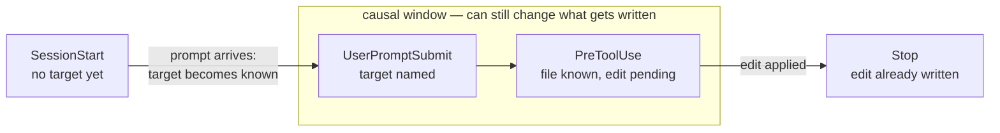
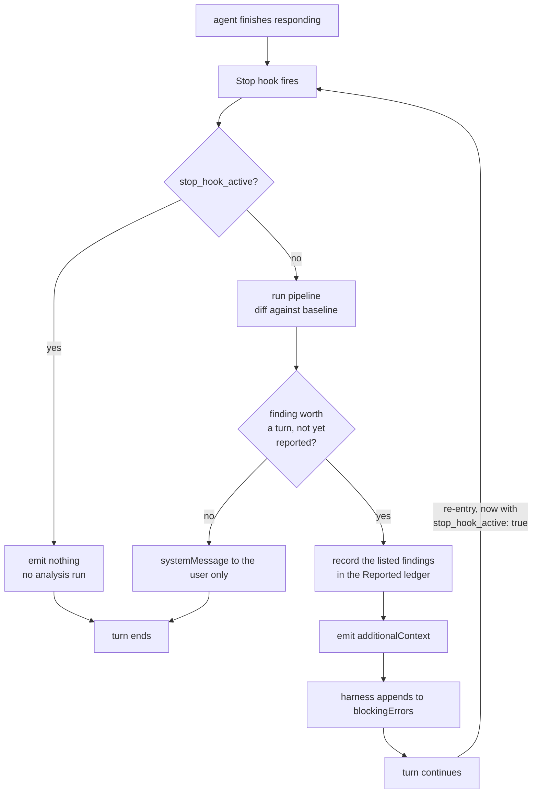
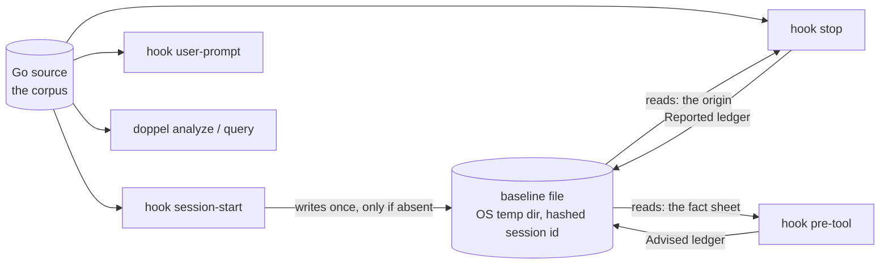

# Hooks and the Causal Window

Doppel knows things about a codebase that are worth knowing before you write into it. Whether any of that changes an outcome is entirely a question of *when* it gets said. This page is about the timing argument the four hooks are built on; [plugin/README.md](../../plugin/README.md) is the operational manual for what each one prints and how to configure it.

## The problem

An analysis tool has two easy failure modes, and both produce output nobody acts on.

Report too late and you have written a code review. The duplication already exists, the function is already committed to, and the finding competes with the sunk cost of the code it criticises. Report too early and you have written a survey: a few hundred functions do direct database access, and there is a merge-worthy pair in a package nobody in this session will open. Both are *true*. Neither is actionable, because neither arrived at a moment when the answer could still be different.

The interesting question is not what doppel can compute. It is which instants in a session are load-bearing.

## The causal window

A hook can change a proposal only if it fires **after the target is known** and **before the edit is written**. Two conditions, and they bracket a window with exactly two events in it.

SessionStart is upstream of the first condition. It cannot know that this session is about to be about one package, so anything specific it says is a guess, and it hedges by dumping aggregates. Stop is downstream of the second: whatever it reports is a fact about a diff that already exists.

That is not an argument for deleting either. It is an argument for giving each one the job it can actually do — and for putting the per-target findings in the two hooks that can act on a target.

## The four hooks

| Event | Fires | Subcommand | The question it answers | Cost |
| --- | --- | --- | --- | --- |
| SessionStart | once, at session start (also on resume and after compaction) | `doppel hook session-start` | what kind of codebase is this? | one analysis |
| UserPromptSubmit | on every user message | `doppel hook user-prompt` | what does doppel know about *this* package? | one analysis |
| PreToolUse | before every `Edit` or `Write` | `doppel hook pre-tool` | does this file's code already have twins? | a file read |
| Stop | when the agent finishes a turn | `doppel hook stop` | what did this session do to the duplication surface? | one analysis |

**SessionStart — deliberately vague.** It carries only what stays true for the whole session: which concepts doppel learned from the corpus and how many functions carry each, which kinds of work it found *no* practice for, the role distribution, one pair count. That last-but-one line is the most useful thing on it, because "this codebase has no retry practice" is a complete answer where a list of present concepts only narrows a search. It names *seeds* rather than learned concepts, necessarily: a learned concept exists because functions carry it, so it can never be absent. It used to also list merge-worthy pairs and a concepts-by-package survey; both were removed. The survey was alphabetical and capped, so on a large repo it reliably ran out somewhere in the a's, and the pair list named packages the session would never touch. Per-target findings moved to the hooks that have a target.

**UserPromptSubmit — scope to the request.** The prompt is the first moment a target exists, and it is right there in the payload. The hook extracts package mentions — `@internal/billing` style paths, bare package names, file paths — confirms each against the corpus rather than the filesystem, and emits only those packages' facts: function count, merge-worthy pairs living entirely inside the package, and a count of pairs connecting it elsewhere. At most three packages, in first-mention order, because a prompt naming ten packages is a survey and this hook exists to stop producing surveys. A prompt mentioning nothing doppel recognises — most prompts — produces silence.

**PreToolUse — the last responsible moment.** Immediately before a file is rewritten, the hook names the merge-worthy twins of the functions in it. This is the version with the most leverage, because the alternative to acting on it is a diff you will have to unpick. Its facts come from the session-start baseline and are labelled *as of session start*, which makes it a file read rather than an analysis — the difference between milliseconds and seconds on every edit. Each file's advisory fires once per session; without that it would repeat on every edit of the same file.

It is **advisory-only, permanently**. `PreToolUse` can deny a tool call with a reason, which would turn "don't edit one half of a merge-worthy pair" into something the agent must answer. Doppel never sets that field. A blocking dedupe hook misfires on genuine near-duplicates — and near-duplicates are precisely and exclusively what it fires on — so the failure mode is blocking legitimate work, repeatedly, with no recourse.

**Stop — measurement, not prevention.** It re-runs the analysis and diffs against the baseline taken at session start, so it is cumulative: every turn answers "what has this session done so far", not "what happened in the last thirty seconds". It prints nothing when nothing changed, because a "no changes" line after every turn trains you to stop reading the place real findings appear.

**Both its digests lead with the identity delta**, and the reason is attribution. The impact half can say a pair appeared and that one of its sides is new; only the identity pass — matching the two snapshots' functions to each other by their Weisfeiler-Lehman label bags, exactly as [`doppel diff`](how-it-works.md#identity-and-the-delta-view) does — can say the side is new *because a function was renamed into it*. That is the difference between a reader checking a finding and a reader dismissing one. So the note opens with what happened to each function, then the pairs those changes created or dissolved, each line carrying the `explain:` sentence stored with it about what the canonicalizer did for that pair. Nothing is re-rendered here: the class lines and the pair lines are the same ones `doppel diff` prints, because a digest that spelled them differently would be a second rendering to keep in step with the first.

The classification changes *what the note says* and never *whether it is sent*. `Notable` alone decides that, and its bar is untouched: a rename with no pair consequence is a fact about code the model just wrote, and paying a model turn to restate it would make the feature hostile. Delta findings go through the same `Reported` ledger as everything else, under their own key prefixes, so one rename is stated once per session rather than in every later turn — and a rename re-keys every pair its function held, so without that the tail of one rename would be re-read for the rest of the session.

A digest that lists six of a hundred pair changes is its ranking key, so the key is `shape x overlap` — how alike the two bodies are, weighted by how much shared architectural context corroborates it. Ranking on overlap alone looks reasonable and is not: two functions in the same package share callers and callees by construction, so context is the half that comes cheap, and sorting on it promotes intentional sibling variants over exactly the cross-package copy-paste worth catching. Measured on a real monorepo, a third byte-identical copy of a helper (shape 1.00) sat at rank three behind four variants nobody should merge. The merge-worthy flag is not the key either — it is a boolean over a continuum — but it still labels the line.

## Three constraints from the harness

These were established by reading the shipped Claude Code binary, not the published documentation, which truncates before the tables that would answer them. They are the reason several design decisions look strange from outside.

**A Stop hook cannot speak to the model without the turn continuing.** Its `additionalContext` message is appended to the same list the harness returns as `blockingErrors`, and a non-empty list re-enters the query loop. There is no third option — no way to leave a note for later. So the price of telling the agent what it just did is one extra model turn, every time, which is why the bar for saying anything is set as high as it is.

Two guards close that loop. `stop_hook_active` arrives in the payload on the re-entry and makes the hook return before running anything — it is both the loop guard and the reason a reported turn does not pay for two analyses. The `Reported` ledger is the other: a delta is cumulative, so a finding that is not remembered is re-reported on every later turn, and under this carrier that means re-continuing every later turn.

**`systemMessage` reaches the user only, never the model.** The two audiences want different things — you want the reconciliation arithmetic, the agent wants the one line that names a decision — so they get two different renderers rather than one compromise.

**`PreToolUse` honours `additionalContext` without requiring a decision.** This is what makes an advisory-only hook possible at all; a hook that could only speak by permitting or denying would have to take a position on every edit.

## What each hook may claim

The output is worth trusting only to the extent it refuses to overstate, so the rules are visible in what it prints.

**Attribution.** Retrieval keeps a bounded number of neighbours per function, so a pair can enter or leave the candidate set without either side being touched. Stop separates changes it can trace to a function you actually edited from the rest, which are marked `no classified change on either side (retrieval re-ranking)`, sorted last, and never counted as something the session did. The classification **is** the edit signal here — a pair is attributable when either side was classified as something other than `unchanged`, which is strictly wider than "one of these bodies has a different hash" and is why no per-file edit tracking is invented alongside it. Merge-worthiness is corpus-weighted too: adding any function anywhere shifts every concept's information content and can nudge untouched pairs across the threshold. Those are excluded from the agent-facing note entirely — reporting them would blame a session for arithmetic it did not cause.

**Staleness, labelled.** The PreToolUse advisory says *as of session start* because that is what it is. The trade is deliberate: facts that predate the session's own edits, which is exactly right for "before you rewrite this, know it has a twin", in exchange for an advisory fast enough to run on every edit.

**Absence.** Role changes, caller and callee counts, and overlap movement are all corpus-relative — they move when code nobody touched moves — so they are absent from a delta rather than reported with a caveat.

## Where state lives

One file per session, and only one.

The baseline is a measurement origin, not a cache: nothing recomputes faster because it exists, and no pipeline stage is ever skipped because it exists. `analyze` never reads it — visible above as an edge that is not drawn. The PreToolUse advisory widened its role to *also* be the session's fact sheet, which is a deliberate change and the one place the boundary was moved; the boundary itself held.

SessionStart writes the baseline only if one is not already there. That hook also fires on resume and after compaction, and re-recording then would silently move the origin to the middle of the session, so every impact report afterwards would describe the last few minutes while claiming to describe the session. Files older than seven days are swept.

## Failure is silence

All four hooks share one contract: read the payload on stdin, write the response on stdout, **never exit non-zero, never write to stderr**. Every failure path ends at the same place, emitting nothing.

This is not defensive habit. A SessionStart hook's stderr surfaces to the user as a broken-tool notice, and a measurement that can interrupt a session over its own failure to measure is indefensible. Silence is also the normal, common case rather than an error state — most prompts mention no package doppel knows, most turns change no duplication, most files have no twins.

## Cost

Three of the four run a full analysis; PreToolUse reads a file. On a few hundred functions an analysis is well under a second, and on a few thousand it is a couple of seconds. The lever that bounds it is `channel-k`, not `threshold` — see [plugin/README.md](../../plugin/README.md) for why, and for `hook-notify`, which turns the agent-facing Stop note (and its extra turn) down to user-only or off.

Hook runs honour the `.doppel.json` keys that define the *corpus* — `threshold`, `min-nodes`, `channel-k`, `tests`, `calibrate` — and deliberately ignore the ones that decide what gets *shown*: `top`, `max-per-func`, `struct-min`. A pair that fell past rank 20 in a report has not changed, and reporting it as a session's impact would be false.

The similarity floors are derived from the corpus, and derived **once per session**: SessionStart records the operating point in the baseline and every later hook supplies it back. Deriving it again each turn would let your own edits shift the threshold enough to make the baseline incomparable, silencing the Stop hook for a turn that nothing was wrong with.

For the analysis these hooks run, see [How Doppel Works](how-it-works.md).
