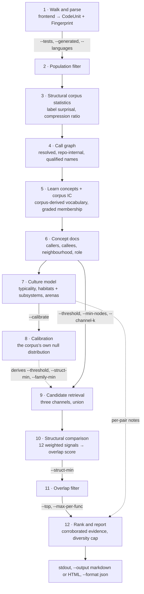
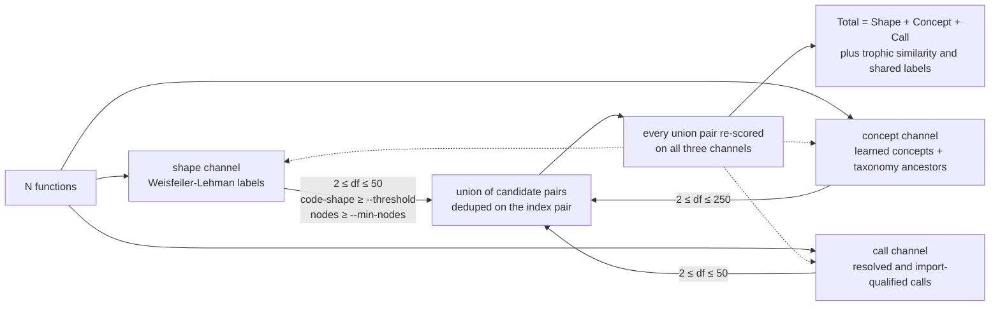
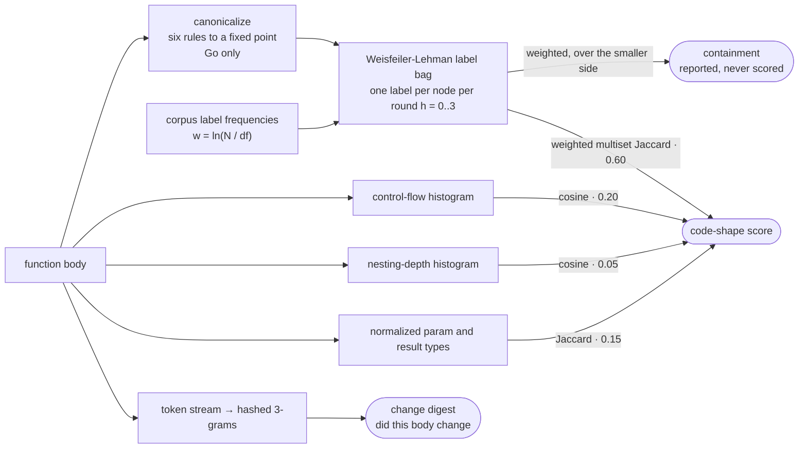
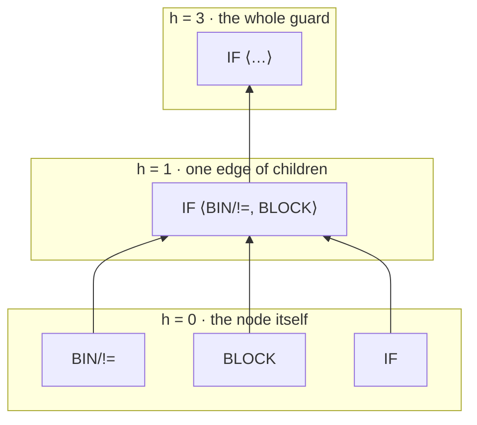
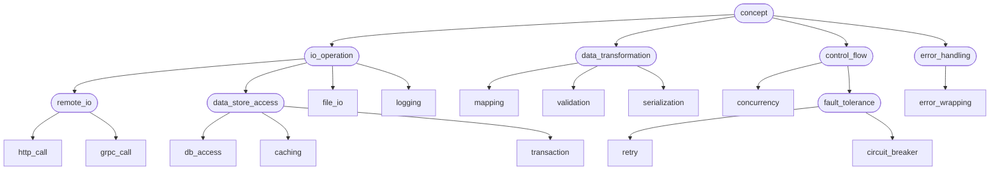
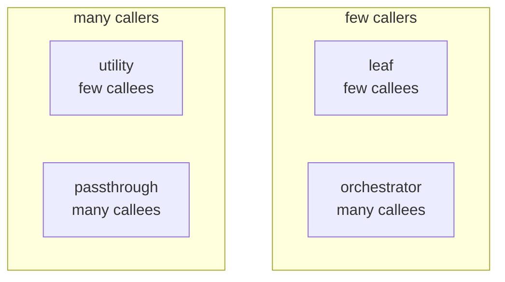
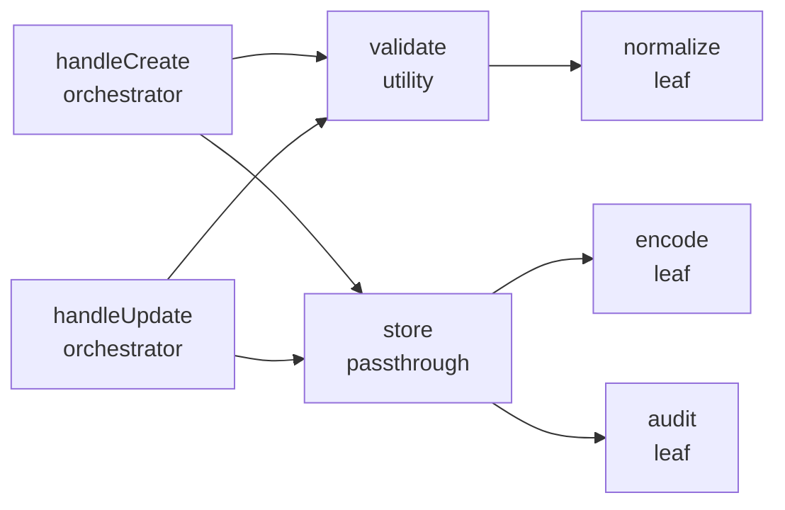
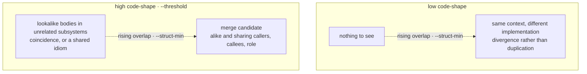
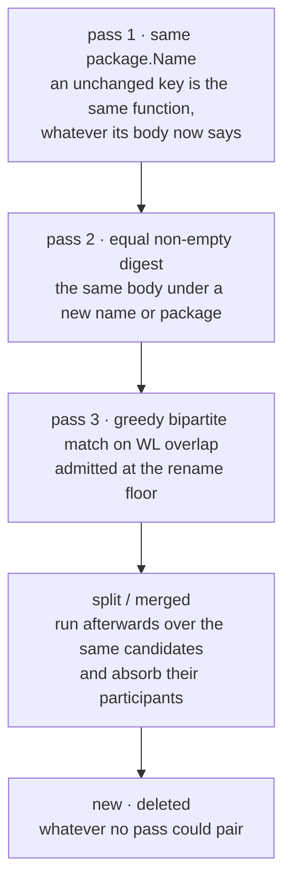

# How Doppel Works

Doppel measures **architectural erosion** — the gap between the structure a project intends and the one it actually has, opened one locally reasonable edit at a time. Every stage below exists to make that gap visible in aggregate, because no single diff contains it: a second retry loop is a defensible change on its own, and only the whole corpus shows that it is the second. That is also why the pipeline is corpus-wide and corpus-relative throughout — the repo's own practice is the only norm doppel has, since it reads no declared architecture, no git history and no deploy state.

Doppel is fully self-contained: it parses source into one language-neutral tree — Go through `go/ast`, thirteen other languages through a tokenizer and a block rule — scores function pairs from static data, and prints a report. There is no model, no network call, and no cache anywhere in the pipeline, so a given tree always yields the same output.

## Pipeline

Everything below happens in one pass, in this order — the shape of it matters, because each flag bites at a different stage:



1. **Parse** — walks the target directory and extracts every function/method body, name, signature, doc comment, visibility, receiver type and derived callee into one language-neutral tree. Go goes through `go/ast`; thirteen other languages go through a tokenizer and a block rule. Files no frontend claims are skipped, and `--languages` narrows which frontends run
2. **Fingerprint** — summarises each body into a `Fingerprint`: a control-flow histogram, a nesting-depth histogram, the normalized parameter/result types, a node count, hashed 3-grams over a canonicalized token stream (which now feeds only the change digest), and the Weisfeiler-Lehman label bag that both scores code shape and drives the shape retrieval channel. Go bodies are canonicalized first — renamed, guards normalized, commutative operands ordered — so two spellings of one shape produce one bag
3. **Choose the population** — `--tests` and `--generated` (`include`, `exclude`, `only` each; both default `exclude`) decide which functions exist for the rest of the run: tests are conventionally similar by design, and files carrying Go's "Code generated ... DO NOT EDIT." marker are near-identical by construction (left in, protobuf `Unmarshal` methods owned moby's entire top ten). This runs *before* any corpus statistic is computed, so concept frequencies, document frequencies and every culture model describe exactly the population the report describes. Cross test/production pairs are never reported in any mode — different build units are not merge candidates
4. **Count the corpus's structure** — with the population settled and before any concept exists, every label in every function's bag is counted, giving the `ln(N / df)` surprisal that makes code shape corpus-weighted. The canonical bodies are hash-consed in the same pass for the report's compression ratio. Both read each function's own tree and nothing else, which is why they can come this early
5. **Learn concepts** — grows the corpus's *own* concept vocabulary rather than asserting a fixed one, and gives each function a graded membership in the concepts it belongs to. Fourteen hand-written rules (`retry`, `http_call`, `db_access`, `validation`, `mapping`, `transaction`, `caching`, `concurrency`, `error_wrapping`, `grpc_call`, `circuit_breaker`, `serialization`, `file_io`, `logging`) survive only as *seeds* — the founding members a concept search starts from — and the rest emerge from the corpus, so a router with no database earns a vocabulary about routing. The evidence is structural: call selectors, imports, string-literal contents, identifier names and node kinds; comments are not evidence, so SQL in a comment names nothing. Learned concepts become the taxonomy's leaves for the run, which is what lets two different concepts still score against each other, and their frequencies weight concept matching in step 7 — sharing a near-universal concept is weak evidence, sharing a rare one is strong
6. **Map** — builds a resolved, repo-internal call graph (qualified names; import-aware; method calls resolved when unambiguous; no stdlib noise) and enriches each concept doc with callers, resolved callees, the depth-2 call-graph neighbourhood, aggregated caller/callee patterns and packages, and a structural role (`leaf`, `utility`, `orchestrator`, or `passthrough`). Role thresholds adapt to the repo: high fan-in/fan-out means above this corpus's median resolved degree, floored at 2. The role is really two independent booleans, which is why two different roles can still partly agree
7. **Calibrate** — draws a sample of random, unrelated pairs from this corpus, scores them with the very functions the run will use, and takes the quantile at which only `--calibrate` of them would be admitted. That is where `--threshold`, `--struct-min` and `--family-min` come from unless you pin one; a corpus too small to sample from declines and keeps the fixed fallbacks, and says so on stderr
8. **Retrieve candidates** — three independent channels propose the pairs worth the expense of a full comparison; see below. This is a *recall* stage, not a ranking one
9. **Structural comparison** — scores each candidate pair across 12 weighted signals (shared callees 21%, concepts 18%, role 13.5%, callers 12%, package 9%, caller concepts 5%, callee concepts 5%, visibility 4.5%, receiver type 4.5%, neighbourhood overlap 3%, caller packages 2.25%, callee packages 2.25%) producing a 0.0–1.0 overlap score and a merge-worthiness flag; pairs below `--struct-min` are dropped. Concepts, roles and receiver types are matched through the ontology rather than by string equality, so related-but-not-identical work earns partial credit, and two functions sitting in overlapping call-graph neighbourhoods share context even when their direct edges differ
10. **Rank and report** — orders the survivors by corroborated evidence, caps how many pairs any one function may fill, truncates to `--top`, prints to stdout and optionally writes Markdown, the HTML dashboard, or a JSON snapshot

## Candidate retrieval

Comparing every pair of functions is quadratic, and most pairs share nothing. Instead, three inverted indexes each nominate a bounded number of neighbours per function, and their union goes to the comparator:



Two things about that picture are load-bearing:

- **The unit is evidence mass in nats.** Each channel accumulates `Σ ln(N / df)` over the rare features a pair shares, so a feature carried by *every* function scores `ln(N/N) = 0` and nominates nobody. That is how a 130-clone `Error()` bucket suppresses itself — no name-based heuristic is involved, the arithmetic simply refuses to call an idiom evidence. Because all three channels measure log-evidence over the same corpus, their masses are summed directly rather than normalized first.
- **Admission and evidence are separate.** A pair admitted by the call channel alone still gets definitive shape *and* concept evidence — those are the dotted edges. Which channel found a pair says nothing about what the pair is worth.

Each channel keeps only its top `--channel-k` (default 5) neighbours per function, which bounds the work and also bounds recall: a pair sharing no rare structural label, no learned concept and no resolved call is never compared, however alike it looks. That is the deliberate trade retrieval makes.

## The fingerprint

The fingerprint is what replaces text matching, and it is built by throwing away three different
kinds of accident in turn. **Canonicalization** removes the spellings a body could equally have
been written in. The **label bag** turns what is left into a multiset of subtree summaries.
**Corpus surprisal** decides what each of those summaries is worth *here*. Only then are two bodies
compared, and the comparison produces two numbers rather than one.



The token stream at the bottom is the one survivor of the older design. It no longer scores
anything: it answers "is this the same body as last time", which is a question about the code *as
written*, where every other arrow above is about the code's shape.

### Canonicalization: removing the spellings

`internal/canon` rewrites a Go function into a canonical tree before anything measures it. Six
rules, applied in this order to a fixed point:

| Rule | What it collapses |
| --- | --- |
| `alpha-rename` | identifiers bound inside the function become `x0`, `x1`, … in first-binding order, parameters first |
| `unwrap-block` | a bare `{ … }` sitting inside another block is spliced into it |
| `negated-if` | `if !c { A } else { B }` becomes `if c { B } else { A }` |
| `guard-return` | an if/else with exactly one leaving branch becomes an early return followed by the other |
| `incdec` | `x = x + 1`, `x = 1 + x` and `x += 1` all become `x++` (and the `--` forms likewise) |
| `commutative-sort` | operands of `+`, `*`, `==`, `!=`, `&`, `\|`, `^`, `&&` and `\|\|` are put in a fixed order |

The order is not incidental. Renaming leads because the commutative sort orders operands by their
rendered form, so sorting first would freeze an order that reflects the original names.
`negated-if` precedes `guard-return` so a negated guard reaches the early-return form in one round.
And the two branch rules interact deliberately: `negated-if` *declines* to swap a guard whose
then-branch already leaves the block, because doing so would move it where `guard-return` can no
longer lift anything out.

Here is the loop's own output on a function written four different ways at once — a negated guard
with an `else`, an incremented counter spelled long-hand, a stray scoping block, and locals named
by hand:

```go
func lookup(cache map[string]int, key string) (int, error) {
	if !ok(key) {
		return 0, fmt.Errorf("bad key %q", key)
	} else {
		hits = hits + 1
	}
	{
		n := cache[key]
		return n, nil
	}
}
```

```
fired: [alpha-rename unwrap-block guard-return incdec] rounds=2 capped=false

func lookup(x0 map[string]int, x1 string) (int, error) {
	if !ok(x1) {
		return 0, fmt.Errorf("bad key %q", x1)
	}
	hits++
	x2 := x0[x1]
	return x2, nil
}
```

`negated-if` is absent from that list, and its absence is the interaction working: the then-branch
already returns, so the rule stands down and `guard-return` lifts the `else` out instead. Whichever
of the two spellings you wrote, you land here.

Two things this is not. It is **not semantics-preserving** — sorting the operands of `&&` discards
short-circuit order, sorting `+` reverses string concatenation — because the canonical tree is a
comparison key that is never compiled, never printed back, and never offered as a rewrite. Two
functions that canonicalize alike are alike in *shape*, and nothing downstream is allowed to claim
more. And it is **Go-only, by nature rather than by omission**: every rule above is a claim about
what Go code means, and one rule table shared across fourteen languages would be asserting Go's
semantics about all of them. Languages read by the lexical frontend still get everything below this
point; what they lose is recall on pairs that differ only in spelling, never correctness. Every
reported pair carries an `explain:` line naming which of these rules fired for it.

### The label bag: what is left

The canonical tree is then reduced to a **Weisfeiler-Lehman label bag** — one label per node per
refinement round, `h = 0` through `h = 3`, all four rounds merged into one multiset.

- **h = 0** is the node's kind plus the one token that is part of that kind. A call keeps its callee
  name (`CALL/Errorf`) with the receiver expression dropped, because the name a function calls is
  intent and the variable it calls it on is arbitrary. Identifiers collapse to `ID` with no name at
  all — after alpha-renaming they are positional, and labelling them would put binding *order* into
  every label above them.
- **h = n** is a hash of the node's own `h−1` label together with its children's `h−1` labels, sorted
  so that sibling order never reaches a label. Each round therefore folds in one more edge of
  context: an `IF` at h = 1 knows its condition and its block exist, at h = 3 it summarises the whole
  guard.



A four-statement body produces a few dozen labels. Here is the whole bag of

```go
func load(path string) ([]byte, error) {
	b, err := os.ReadFile(path)
	if err != nil {
		return nil, err
	}
	return b, nil
}
```

with each label named the way `DescribeLabel` names it in the report's `shared structure:` block.
A bag is a slice sorted ascending by hash — scoring a pair is one merge of two sorted runs — so
these are simply its first eight rows:

```
load: 35 distinct labels
  depth-1 ID             0032ab8d30e7137e x11
  depth-1 SEL            023a790663a8ff9d x1
  depth-0 BIN            06e00f35e47826a6 x1
  depth-0 RETURN         0a0528081166aea7 x2
  depth-2 ID             1015f4371c6fdea7 x11
  depth-1 IF             240c10a7ece2e7e5 x1
  depth-3 IF             3169a030f8c7755c x1
  depth-1 BLOCK          3c952c5d6c110a01 x1
```

Eleven identifiers collapse onto one label because an identifier has no children and no name to
carry, so every round leaves them indistinguishable — while the single `IF` shows up four times
over, once per round, each a strictly more specific claim about the same guard.

Renaming every local and parameter — `path` to `name`, `b` to `out`, `err` to `e` — produces
**the same 35 labels with the same 35 hashes**, which is what the two stages above buy when they
are put together.

A label is an opaque hash, so nothing downstream can say what a shared label *was* beyond its round
and its node kind. That is a weaker explanation than the hand-built pattern renders it replaced
(`if(bin:!=(id,nil))` said *which* guard), and it is deliberate: naming the subtree would mean a
second serialization of the thing the hash already is, and the two would drift.

### Corpus surprisal: what a shared label is worth

Every label gets a weight from how many of the corpus's functions carry it at all:

    w(label) = ln(N / df)

A shape every function in the repository has weighs exactly `ln(N/N) = 0` and is not a finding. A
rare one weighs a lot. Deep labels are where this bites hardest, because an `h = 3` label is close
to a fingerprint of the subtree under it and usually has df 1 or 2 — so agreeing deeply is rewarded
far more than agreeing shallowly, and agreeing at h = 3 on a node implies agreeing at h = 0, 1 and 2
on it as well.

The consequence is worth stating outright: **code shape is corpus-dependent**. The same two bodies
score differently in different repositories, on purpose. It is also why `--min-nodes` (16) exists —
a trivial body that happens to be corpus-unique earns maximal-weight evidence at every round, so
one-line accessors are kept out of the shape channel entirely.

### The two numbers that come out

One merge of the two sorted bags produces both:

    jaccard     = Σ w·min(a,b) / Σ w·max(a,b)
    containment = Σ w·min(a,b) / min(Σ w·a, Σ w·b)

The Jaccard is the 0.60 component of the blend. Containment divides by the *smaller* side instead
of the union, so it asks how much of the smaller body's shape the larger one also has — and it is
**reported and never scored**, in every output format, because a helper inlined into a long
function reads low on the Jaccard and near 1.0 on containment, and one blended number cannot state
that finding. Relative body size is reported and unscored for a different reason: the Jaccard
already penalizes size mismatch through its union, and damping again would count it twice.

| Component | Metric | Weight |
| --- | --- | --- |
| WL labels | corpus-weighted multiset Jaccard over Weisfeiler-Lehman label bags | 0.60 |
| Control flow | cosine over the node-kind histogram | 0.20 |
| Nesting depth | cosine over the entry-depth histogram | 0.05 |
| Signature | Jaccard over normalized param/result types | 0.15 |

The three smaller components read the body as written rather than the canonical tree, and the
nesting histogram exists because a flattened view carries no depth at all: sequential `if`s and
nested `if`s once produced identical token bags, identical flow histograms, and a score of 1.0.

## The ontology

Structural comparison used to compare strings. Two functions tagged `http_call` and `db_access` scored
**zero** on intent — exactly the same as two functions with nothing in common — even though both are
I/O. Roles were just as binary: `utility` and `passthrough` scored zero against each other despite
both being called from many places.

Concepts are leaves of a small taxonomy. Everything above them is abstract: those interior nodes
(rounded, below) never describe a real function, they exist only to relate the leaves.

The **interior is authored and the leaves are learned**. The fourteen names below are the *seed*
vocabulary — they say which functions a concept search starts from. Every run replaces them with
concepts derived from that corpus, named after the evidence that identified them
(`store.Get+store.Decode`), each hanging from the same interior: a concept grown from the
`db_access` seed is a kind of `data_store_access`, whatever that codebase turned out to mean by it.
A concept nothing seeded hangs beside whichever seeded concept it most resembles.



Two concepts are scored by how deep their nearest shared ancestor sits — read the table as distances
on the graph above:

| Pair | Nearest shared ancestor | Score |
| --- | --- | --- |
| `db_access` / `db_access` | itself | 1.00 |
| `db_access` / `caching` | `data_store_access` | 0.67 |
| `http_call` / `grpc_call` | `remote_io` | 0.67 |
| `file_io` / `logging` | `io_operation` | 0.50 |
| `http_call` / `db_access` | `io_operation` | 0.33 |
| `http_call` / `retry` | the root | 0.00 |

Roles work the same way, on two independent axes rather than a tree. Fan-in counts resolved callers
and fan-out counts **resolved internal** callees, so stdlib calls never inflate a role:



On a call graph, that reads off the edges directly:



`utility` and `passthrough` are both high fan-in, so they score 0.5; `orchestrator` and `passthrough`
are both high fan-out, likewise 0.5. `leaf` and `orchestrator` share only the *absence* of an axis,
which scores nothing. And a pair of methods on different receiver types now scores 0.5 rather than 0,
while a value receiver and a pointer receiver on the same type finally score 1.0.

None of this can raise a pair above what an exact match would give, and every graded match that
contributes to a score also produces an evidence line, so an elevated score always has a stated
reason:

```
    • related patterns: ast.ArrayType+ast.BadExpr ≈ ast.DeferStmt+ast.ExprStmt (both data_transformation, 0.33)
    • related roles: passthrough ≈ orchestrator (both high fan-out, 0.50)
    • callees do related work (0.14): [p.IsValid+token.NoPos ≈ ast.ArrayType+ast.BadExpr]
```

(Those three lines are from `doppel analyze .` on doppel's own source. The concept names are
learned — `ast.ArrayType+ast.BadExpr` is a concept this corpus grew, named after the evidence that
identified it — and the ancestor relating them, `data_transformation`, is authored.)

A near match nudges the score but only counts as a *merge signal* once it reaches 0.5, so a pair of
distant cousins cannot be flagged merge-worthy on that evidence alone.

Run `doppel ontology --defs` to print the seed vocabulary with definitions and check it against its
own consistency rules. Those rules are also enforced by the test suite, which is what stops the seed
rules and the taxonomy from drifting apart. The concept leaves it prints are seeds, not what any run
reasons over — for a corpus's own vocabulary, read the `### Concepts` section of a Markdown report.

## Two scores, kept separate

A pair carries a **code-shape** score (the fingerprint blend, gated by `--threshold`) and a
**structural overlap** score (the 12 signals, gated by `--struct-min`). They are deliberately never
blended, because each combination is a different finding:



Collapsing the two into one number would average those cells into an unreadable middle. Tighten
`--struct-min` when you only want the bottom-right one. Containment is a third reported number and
sits outside the grid entirely: it is gated by no flag, blended into neither axis, and never enters
ranking or the merge verdict — an inlined helper reads low on code shape and near 1.0 on
containment, which is a cell this picture has no room for and a finding all the same.

The **merge-worthy** label names that bottom-right cell, and it asserts both axes: overlap at least
0.4 with at least two counting signals, *and* code-shape at least 0.4. The shape half is not
redundant. Two functions in the same package share callers and callees by construction, so overlap
reaches 0.4 on siblings whose bodies have almost nothing in common — the label was observed on a
pair at code-shape 0.31, which is the top-left cell wearing the bottom-right cell's name.

## What the report tells you before the findings

Everything above is computed on every run, and until recently almost none of it reached the
document — the concept vocabulary, the package habitats, the convention strengths and the retrieval
mix were summarised to stderr and lost. The Markdown report (`--output`) now opens with them, three
of them as diagrams: which concepts this codebase uses and which kinds of work it has **none** of,
which packages keep solving the same problem separately, how uniform each package's practice is,
which retrieval channel actually found the candidates you are about to read, and two corpus metrics
— how much of the tree is distinct subtree shapes once every canonical body is hash-consed, and the
distribution of each function's nearest neighbour by code shape.

That last one matters more than it sounds. Recall is bounded by the three channels: a pair sharing
no rare structure, no concept and no resolved call is never compared, however alike it is. A reader
weighing the list is entitled to know which channel did the work.

Then a second section describes local practice — not what the codebase contains, but how it writes
things. Three findings, all learned from the corpus rather than imposed on it:

**What a concept looks like here.** For every concept with enough members to model, the fraction of
them doing each thing: which calls, which control flow, which package. "A `transaction` in this
corpus calls `tx.Commit` in every case and defers a `Rollback` in five of six" is house style
stated as a measurement.

**What travels with what.** Which concepts, roles and calls co-occur far more — or far less — than
chance. The negative direction is often the sharper finding, because "these two never appear
together here" says something about how the system is layered that no positive association does.

**Who is drifting.** Functions that carry a concept and then realize it unlike every other member.
The ones that appear in no reported pair come first: a function that drifts *and* has a
near-duplicate is usually one half of a copy, while a function that drifts alone is a decision
somebody made on their own, and nothing else in the report will mention it.

The stdout report is unchanged — a terminal cannot draw a diagram — and so is `--format json`,
which is a snapshot with a documented shape. An `--output` path ending in `.html` writes the same
model as a self-contained interactive page instead, which opens from `file://` with no server and no
network.

## Families: pairs are not the only shape

A pair is the unit of evidence, not the unit of duplication. The same helper copied into five
packages is one fact, and reporting it as ten pairs describes it badly.

Grouping pairs is easy to get wrong in one specific way. If A resembles B and B resembles C, it
does not follow that A resembles C — similarity is not transitive — so clustering by following
links produces groups whose two ends have nothing in common. That is the classic failure of clone
detection, and its symptom is a "family" nobody can verify: you can check a pair by reading two
functions, but a chained group makes a claim about members that were never compared.

So a family here is a **clique**: every member is at least `--family-min` alike to *every* other
member, and the report prints the weakest of those numbers. That is the whole claim, and any two
members you open must satisfy it.

One wrinkle is worth knowing about, because the output mentions it. Retrieval keeps a bounded
number of neighbours per function, so inside a genuine family of six the two weakest members may
never have been compared — each filled the other's budget with someone else. Left alone that gap
splits one family into two overlapping ones. doppel closes it by scoring the missing pairs directly
before grouping, and reports how many it added (`3 edges scored here`), so a family is never
resting on evidence you cannot trace.

A function may belong to more than one family, and doppel reports both rather than choosing;
counts are of distinct functions. `doppel families` is the census view, with no truncation.

**Ranking uses neither score on its own.** The report is ordered by *corroborated* evidence — the
retrieval mass multiplied by the overlap score, the code-shape score, and the squared trophic
similarity (the fraction of informative structure the pair actually shares). Raw evidence mass alone
lets a verbose shared vocabulary outrank a genuine clone; the extra factors are what demote pairs
that merely share a skeleton. When both sides live in `_test.go` files, one further factor discounts
tests by what they exercise rather than by their driver code, so two table-driven harnesses over
unrelated functions do not read as duplicates. `--max-per-func` (default 2) then caps how many pairs
any single function may fill, so one heavily-cloned helper cannot own the whole report. All of that
decides *order*; the two displayed scores stay unblended.

## Pair kinds: saying what a finding is

Two classes of true-but-unactionable finding used to crowd wide corpora with nothing to explain
them. A `kind:` line now names them when a naming rule can: **interface implementations** — both
sides are methods with the same name and signature on different types (a `Validate` per provider,
moby's `ipvlan` and `macvlan` drivers each implementing `Join`) — and **diverged copy** — alike
bodies whose names agree once version markers are stripped (`evalCallOld` beside `evalCall`,
`scrapeLoopAppenderV2.append` beside `scrapeLoopAppender.append`), in the same or a sibling
package. Families get the same label when every member pair satisfies one rule. Kinds annotate
only: they never filter a pair, never enter the ranking, and never reach the hook digests.

## Identity, and the delta view

Everything above describes one run. Two runs raise a different question — *what happened to each
function* — and it is the question a plain diff answers worst, because a rename shows up in a diff
as one deletion and one unrelated arrival, and a function moved to another package shows up the same
way. `doppel diff old.json new.json`, over two files written by `doppel analyze --format json`,
matches functions to each other by **body** instead.

The bodies are already in the snapshot: schema 8 stores every function's Weisfeiler-Lehman label bag
and a digest of its own fingerprint. Those are two different kinds of evidence and the report keeps
them apart. The **digest** is exact — it hashes a function's own fingerprint and nothing about the
corpus, so equal non-empty digests mean the same body, full stop. The **bag** decides *similarity*,
which is what matching needs and a digest cannot give: the same weighted Jaccard and containment
described above, with label frequencies counted over the union of both snapshots so that neither
file's own norms decide the answer.

Three passes run, strongest evidence first, and every function ends in exactly one of eight classes:



| Class | What it asserts |
| --- | --- |
| `unchanged` | same package and name, identical fingerprint digest |
| `edited` | same package and name, the body moved |
| `renamed` | same package, a different name, the same or a similar body |
| `moved` | a different package |
| `split` | one old body covering two or more new ones |
| `merged` | two or more old bodies covered by one new one |
| `new` | nothing in the old snapshot matched it |
| `deleted` | nothing in the new snapshot matched it |

One label per function, by a fixed order: **moved** beats **renamed** beats **edited** beats
**unchanged**, because relocation is what makes a function unfindable where it was. The facts the
winning rule did not use are still printed on the same line, so a function that moved *and* was
renamed reads `moved` with the rename beside it.

Here is a real comparison — cobra at its pinned tag against a copy of it in which
`defaultUsageFunc` was cut in two, `stringInSlice` moved to its own package, `MinimumNArgs` was
renamed, `ExactValidArgs` deleted, and a fresh copy of `ExactArgs` added under another name:

```
Delta since the baseline
========================
269 functions before, 270 after
split 1, merged 0, moved 1, renamed 1, edited 0, new 1, deleted 1, unchanged 265
note: different analysis params ({Threshold:0.44 … StructMin:0.51 …}, {Threshold:0.44 … StructMin:0.5 …}); a population change shows up as new and deleted functions

split 1
  cobra.defaultUsageFunc (command.go:1974)  -> 2 bodies
      -> cobra.usageBody (command.go:1983)  containment 0.9921
      -> cobra.usageHeader (command.go:1974)  containment 0.9022

moved 1
  cobra.stringInSlice (cobra.go:225) -> sliceutil.stringInSlice (sliceutil/slice.go:3)
      jaccard 1.0000  containment 1.0000  digests equal

renamed 1
  cobra.MinimumNArgs (args.go:74) -> cobra.AtLeastNArgs (args.go:74)
      jaccard 1.0000  containment 1.0000  digests equal

new 1
  cobra.ExactlyNArgs (args.go:104)  (no counterpart above the match floor)

deleted 1
  cobra.ExactValidArgs (args.go:129)  (no counterpart above the match floor)

unchanged 265
```

(The params line is elided here for width; the rest is verbatim. It appears because the two runs
calibrated their overlap floor a hundredth apart — the corpus genuinely changed — and the comparison
notes that rather than refusing over it.)

Every line prints the evidence that produced it, which is the property that makes the report
checkable: `jaccard 1.0000 containment 1.0000 digests equal` is a claim you falsify by opening two
files. The split is the one place containment does work no other number could — the two halves each
contain almost all of the original, which is exactly what "this was divided" means, where the
Jaccard of a half against the whole is near 0.5 and says nothing.

**What it refuses.** A different snapshot schema, or a different canonicalization rule set, and the
comparison declines with exit code 2 — under a changed rule set the same two untouched bodies
produce different labels, so matching across it would report the whole corpus as edited. A different
threshold, ontology version or doppel build does **not** refuse: matching reads only each function's
own key, digest and bag, none of which is corpus-relative, so those are noted in the report and the
comparison runs. A population change (`--tests exclude` against `--tests include`) is not hidden
either — it surfaces as new and deleted functions, which is a true statement about the two files.

### The delta view: pairs those changes created or dissolved

Classification is half of it. The other half is the near-duplicate **pairs the changes created or
dissolved** — both snapshots already carry their pair lists, so this is a walk of two key sets and
no re-scoring — and it is what a plain diff cannot produce at all:

```
pairs created 3, dissolved 3

pairs created 3
  cobra.ExactArgs <-> cobra.ExactlyNArgs  shape 1.00  overlap 0.71  (merge-worthy)
      cobra.ExactlyNArgs new
      explain: identical after rename
  cobra.AtLeastNArgs <-> cobra.MaximumNArgs  shape 0.78  overlap 0.71  (merge-worthy)
      cobra.AtLeastNArgs renamed
      explain: differs by two extra binary
  cobra.*Command.SetUsageTemplate <-> cobra.*Command.SetVersionTemplate  shape 1.00  overlap 0.63  (merge-worthy)
      no classified change on either side (retrieval re-ranking)
      explain: identical after rename, commutative-reorder
```

Three things are going on in those nine lines.

**Attribution is why the classification has to come first.** The middle line does not merely say a
pair appeared; it says it appeared *because a function was renamed into it*. The third says the
opposite honestly — neither side was classified as anything, so this pair moved because retrieval
re-ranked around a change elsewhere, not because of it. Those sort last, always, and are never
presented as something a session did.

**Every line carries its `explain:` sentence**, read back from the snapshot rather than recomputed:
this package holds no bodies, and the sentence is a claim about two specific ones. `identical after
rename` means the two canonical trees agree and alpha-renaming is what got them there; `differs by
two extra binary` is the residual when they do not.

**A rename re-keys every pair its function held**, so one rename produces N created and N dissolved
changes that are one fact restated. That is why the pair lists are bounded more tightly than the
class list wherever they are summarised: the head is where the new duplication is, the tail is the
restatement.

The same report has three homes. `doppel diff` prints it under one title; `doppel diff --output
<file.md>` writes it as markdown, which is the command's only file form — a two-run HTML dashboard
would be a different artifact, not a format of the one-run page. And both Stop-hook digests **lead**
with it, for the attribution reason above: see [Hooks and the Causal Window](hooks.md).

## Iterative Refactoring Loop

A single `doppel` run gives you a snapshot. Running it repeatedly after each refactoring session creates a compounding effect: merging two functions often unmasks a third pair that was previously hidden behind the noise. Over successive passes you can widen the aperture and reach a leaner, more consistent codebase.

**The reduction cycle:**

1. Run `doppel analyze .` and save the report. The similarity floors come from your own corpus by default: `--calibrate` is a rate, and at its default `0.01` the floors are set where only 1% of random unrelated pairs from this repository would be admitted
2. Work through the top pairs — extract shared logic or consolidate the duplicates
3. Re-run; analysis is pure local computation, so a pass costs seconds. `doppel diff` against the previous snapshot tells you what the pass actually did, including which pairs it dissolved
4. Widen once the high-confidence pairs are gone (`--calibrate 0.01 → 0.02 → 0.05`) to surface the next layer. Raising the rate keeps the question the same on a corpus that just got smaller, which a raw threshold does not
5. Repeat until the report comes back empty at your chosen rate

**Scheduling it:**

The loop works best when it runs automatically. Commit a `.doppel.json` to the repo with a standing configuration so every run uses consistent settings:

```json
{
  "calibrate": 0.01,
  "top": 10,
  "output": "doppel-report.md"
}
```

Pinning `threshold`, `struct-min` or `family-min` there instead turns calibration off for every run in the repo — the two are the same decision made two ways, and doppel will not do half of each.

Then set up a recurring task (daily, post-merge, or pre-PR) that runs `doppel analyze .` and writes a fresh `doppel-report.md`. Because the scoring is deterministic, an unchanged tree produces a byte-identical report — so any diff in the committed report is a real change in the shape of the codebase, which makes it reviewable in a PR.

## Skipped Directories

Directories are skipped by the go tool's own rule — any name starting with `.` or `_` (which
keeps `_examples/` demo trees out of a library's population) — plus `vendor`, `testdata` and
`build`. The path you point doppel at is always walked, whatever its name.

Within a walked directory, scope is an **extension allowlist and never a content heuristic**: a
file is in the corpus because a frontend claims its extension and `--languages` admits that
language. Prose, config and data are out by construction, and nothing ever inspects a file to
decide whether it looks like code. `--languages` defaults to every registered frontend, so a Go
repository with a vendored `.js` asset analyses that asset too — which moves the calibrated floors,
because the corpus genuinely changed. `--languages go` restores the narrower population exactly.

`_test.go` files are always parsed; `--tests` decides what to do with them. Tests are repetitive by
design, so they form their own population rather than diluting production's:

| `--tests` | Population | Use |
| --- | --- | --- |
| `exclude` (default) | production functions only | models production practice |
| `only` | test functions only | test-suite hygiene |
| `include` | both | cross test/production pairs are still never reported |

`--generated` works the same way over files carrying Go's
"Code generated ... DO NOT EDIT." marker (the convention at
https://go.dev/s/generatedcode, detected at parse time): `exclude` (default)
models the code people maintain by hand, `only` audits what a generator
emits, `include` restores the unfiltered view.

Because the filter runs before any corpus statistic exists, each mode's document frequencies,
information content and culture models describe exactly the population its report describes —
filtering at report time instead would be the worst of both.
