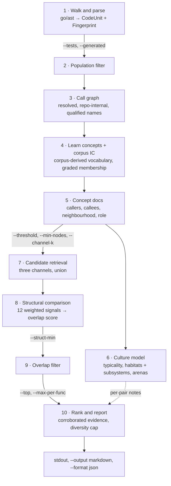
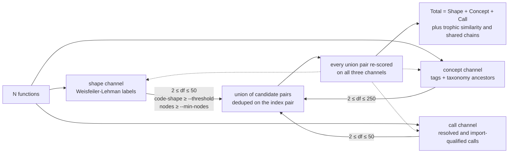
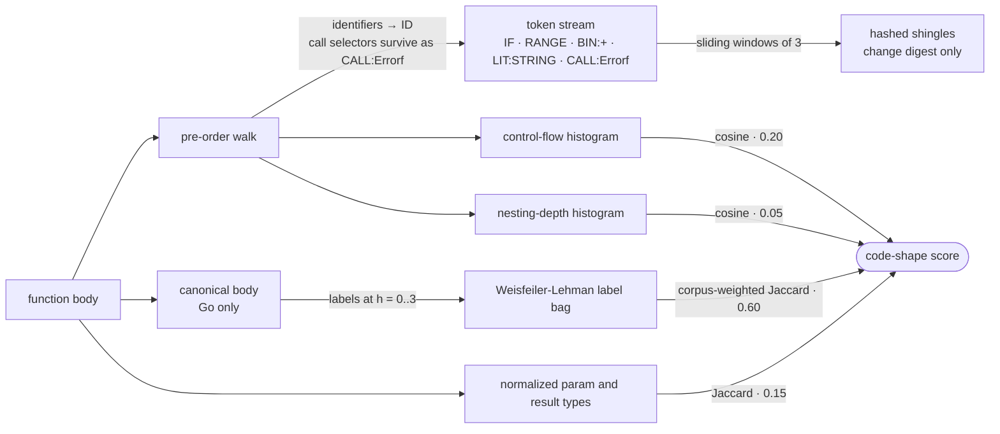
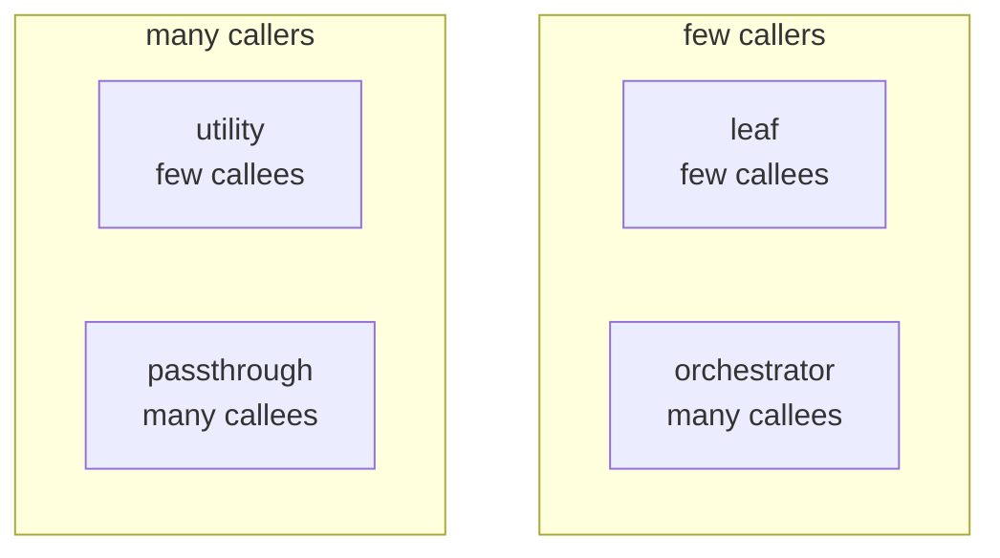
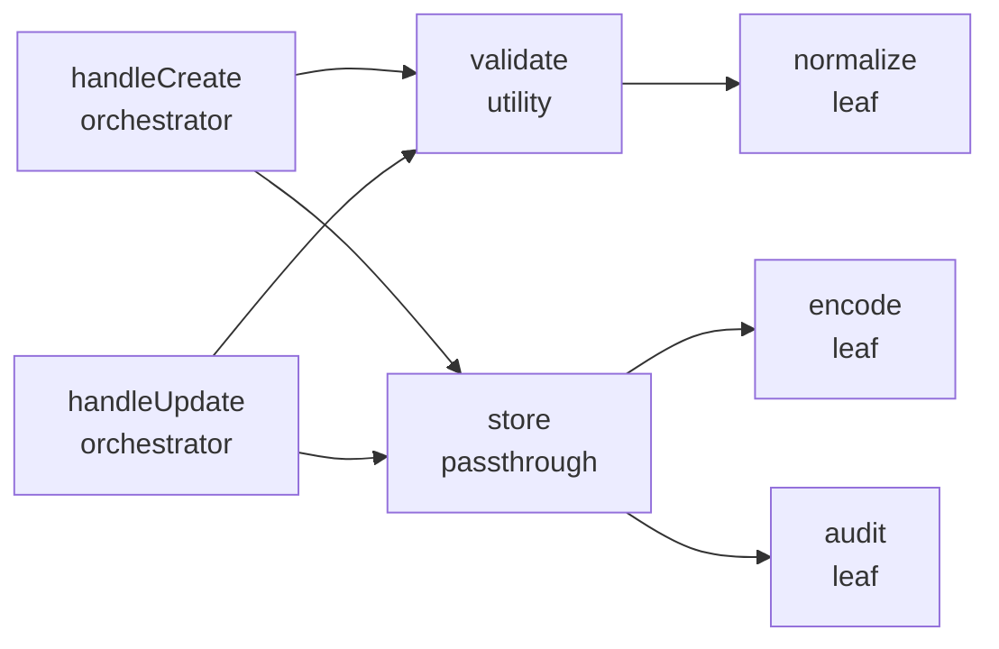
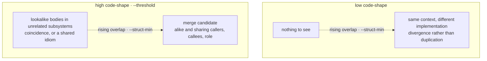

# How Doppel Works

Doppel measures **architectural erosion** — the gap between the structure a project intends and the one it actually has, opened one locally reasonable edit at a time. Every stage below exists to make that gap visible in aggregate, because no single diff contains it: a second retry loop is a defensible change on its own, and only the whole corpus shows that it is the second. That is also why the pipeline is corpus-wide and corpus-relative throughout — the repo's own practice is the only norm doppel has, since it reads no declared architecture, no git history and no deploy state.

Doppel is fully self-contained: it parses Go with `go/ast`, scores function pairs from static data, and prints a report. There is no model, no network call, and no cache anywhere in the pipeline, so a given tree always yields the same output.

## Pipeline

Everything below happens in one pass, in this order — the shape of it matters, because each flag bites at a different stage:



1. **Parse** — walks the target directory and extracts every function/method body, name, signature, doc comment, visibility, receiver type and derived callee into one language-neutral tree. Go goes through `go/ast`; thirteen other languages go through a tokenizer and a block rule. Files no frontend claims are skipped, and `--languages` narrows which frontends run
2. **Fingerprint** — summarises each body into a `Fingerprint`: a control-flow histogram, a nesting-depth histogram, the normalized parameter/result types, a node count, hashed 3-grams over a canonicalized token stream (which now feeds only the change digest), and the Weisfeiler-Lehman label bag that both scores code shape and drives the shape retrieval channel. Go bodies are canonicalized first — renamed, guards normalized, commutative operands ordered — so two spellings of one shape produce one bag
3. **Choose the population** — `--tests` and `--generated` (`include`, `exclude`, `only` each; both default `exclude`) decide which functions exist for the rest of the run: tests are conventionally similar by design, and files carrying Go's "Code generated ... DO NOT EDIT." marker are near-identical by construction (left in, protobuf `Unmarshal` methods owned moby's entire top ten). This runs *before* any corpus statistic is computed, so tag frequencies, document frequencies and every culture model describe exactly the population the report describes. Cross test/production pairs are never reported in any mode — different build units are not merge candidates
4. **Learn concepts** — grows the corpus's *own* concept vocabulary rather than asserting a fixed one, and gives each function a graded membership in the concepts it belongs to. Fourteen hand-written rules (`retry`, `http_call`, `db_access`, `validation`, `mapping`, `transaction`, `caching`, `concurrency`, `error_wrapping`, `grpc_call`, `circuit_breaker`, `serialization`, `file_io`, `logging`) survive only as *seeds* — the founding members a concept search starts from — and the rest emerge from the corpus, so a router with no database earns a vocabulary about routing. The evidence is structural: call selectors, imports, string-literal contents, identifier names and node kinds; comments are not evidence, so SQL in a comment names nothing. Learned concepts become the taxonomy's leaves for the run, which is what lets two different concepts still score against each other, and their frequencies weight concept matching in step 7 — sharing a near-universal concept is weak evidence, sharing a rare one is strong
5. **Map** — builds a resolved, repo-internal call graph (qualified names; import-aware; method calls resolved when unambiguous; no stdlib noise) and enriches each concept doc with callers, resolved callees, the depth-2 call-graph neighbourhood, aggregated caller/callee patterns and packages, and a structural role (`leaf`, `utility`, `orchestrator`, or `passthrough`). Role thresholds adapt to the repo: high fan-in/fan-out means above this corpus's median resolved degree, floored at 2. The role is really two independent booleans, which is why two different roles can still partly agree
6. **Retrieve candidates** — three independent channels propose the pairs worth the expense of a full comparison; see below. This is a *recall* stage, not a ranking one
7. **Structural comparison** — scores each candidate pair across 12 weighted signals (shared callees 21%, concepts 18%, role 13.5%, callers 12%, package 9%, caller concepts 5%, callee concepts 5%, visibility 4.5%, receiver type 4.5%, neighbourhood overlap 3%, caller packages 2.25%, callee packages 2.25%) producing a 0.0–1.0 overlap score and a merge-worthiness flag; pairs below `--struct-min` are dropped. Concepts, roles and receiver types are matched through the ontology rather than by string equality, so related-but-not-identical work earns partial credit, and two functions sitting in overlapping call-graph neighbourhoods share context even when their direct edges differ
8. **Rank and report** — orders the survivors by corroborated evidence, caps how many pairs any one function may fill, truncates to `--top`, prints to stdout and optionally writes Markdown or JSON

## Candidate retrieval

Comparing every pair of functions is quadratic, and most pairs share nothing. Instead, three inverted indexes each nominate a bounded number of neighbours per function, and their union goes to the comparator:



Two things about that picture are load-bearing:

- **The unit is evidence mass in nats.** Each channel accumulates `Σ ln(N / df)` over the rare features a pair shares, so a feature carried by *every* function scores `ln(N/N) = 0` and nominates nobody. That is how a 130-clone `Error()` bucket suppresses itself — no name-based heuristic is involved, the arithmetic simply refuses to call an idiom evidence. Because all three channels measure log-evidence over the same corpus, their masses are summed directly rather than normalized first.
- **Admission and evidence are separate.** A pair admitted by the call channel alone still gets definitive shape *and* concept evidence — those are the dotted edges. Which channel found a pair says nothing about what the pair is worth.

Each channel keeps only its top `--channel-k` (default 5) neighbours per function, which bounds the work and also bounds recall: a pair sharing no rare pattern, no tag and no resolved call is never compared, however alike it looks. That is the deliberate trade retrieval makes.

## The fingerprint

The fingerprint is what replaces text matching. Each body is walked in pre-order and reduced to a stream of short tokens; the tokens now feed the "did this body change" digest, while the score's 0.60 component reads a label bag over the body's canonical *tree*:



Two canonicalization rules do the heavy lifting:

- **Identifiers collapse to `ID`.** A copy of a function with every variable renamed produces exactly the same token stream, so renamed clones score as clones.
- **Call selector names survive.** `Errorf`, `Query` and `Lock` carry real intent, while the receiver variable they are called on (`e`, `s`, `cfg`) is arbitrary and is discarded.

| Component | Metric | Weight |
| --- | --- | --- |
| WL labels | corpus-weighted multiset Jaccard over Weisfeiler-Lehman label bags | 0.60 |
| Control flow | cosine over the node-kind histogram | 0.20 |
| Nesting depth | cosine over the entry-depth histogram | 0.05 |
| Signature | Jaccard over normalized param/result types | 0.15 |

The 0.60 component is a *subtree* summary, not a window over a flattened stream: a shingle cannot tell a condition from the statement it guards, where a Weisfeiler-Lehman label at round *h* summarises everything within *h* edges of a node. It is corpus-weighted, so sharing a shape every function in the repo has is worth nothing and sharing a rare one is worth a lot — which means the same two bodies score differently in different repositories, deliberately.

The relative body size is reported alongside these but is not scored — Jaccard already penalizes size mismatch through the union. Containment — how much of the *smaller* body's shape the larger one also has — is reported for the same reason and scored for none: a helper inlined into a long function reads low on the blend and high on containment, and collapsing the two would destroy the finding.

## The ontology

Structural comparison used to compare strings. Two functions tagged `http_call` and `db_access` scored
**zero** on intent — exactly the same as two functions with nothing in common — even though both are
I/O. Roles were just as binary: `utility` and `passthrough` scored zero against each other despite
both being called from many places.

Concepts are leaves of a small taxonomy. Everything above them is abstract: those interior nodes
(rounded, below) never describe a real function, they exist only to relate the leaves.

The **interior is authored and the leaves are learned**. The fourteen names below are the *seed*
vocabulary — they say which functions a concept search starts from. Every run replaces them with
concepts derived from that corpus, named after the evidence that identified them
(`store.Get+store.Decode`), each hanging from the same interior: a concept grown from the
`db_access` seed is a kind of `data_store_access`, whatever that codebase turned out to mean by it.
A concept nothing seeded hangs beside whichever seeded concept it most resembles.


Two concepts are scored by how deep their nearest shared ancestor sits — read the table as distances
on the graph above:

| Pair | Nearest shared ancestor | Score |
| --- | --- | --- |
| `db_access` / `db_access` | itself | 1.00 |
| `db_access` / `caching` | `data_store_access` | 0.67 |
| `http_call` / `grpc_call` | `remote_io` | 0.67 |
| `file_io` / `logging` | `io_operation` | 0.50 |
| `http_call` / `db_access` | `io_operation` | 0.33 |
| `http_call` / `retry` | the root | 0.00 |

Roles work the same way, on two independent axes rather than a tree. Fan-in counts resolved callers
and fan-out counts **resolved internal** callees, so stdlib calls never inflate a role:



On a call graph, that reads off the edges directly:



`utility` and `passthrough` are both high fan-in, so they score 0.5; `orchestrator` and `passthrough`
are both high fan-out, likewise 0.5. `leaf` and `orchestrator` share only the *absence* of an axis,
which scores nothing. And a pair of methods on different receiver types now scores 0.5 rather than 0,
while a value receiver and a pointer receiver on the same type finally score 1.0.

None of this can raise a pair above what an exact match would give, and every graded match that
contributes to a score also produces an evidence line, so an elevated score always has a stated
reason:

```
related patterns: db_access ≈ caching (both data_store_access, 0.67)
related roles: utility ≈ passthrough (both high fan-in, 0.50)
callees do related work (1.00): [error_wrapping, mapping]
```

A near match nudges the score but only counts as a *merge signal* once it reaches 0.5, so a pair of
distant cousins cannot be flagged merge-worthy on that evidence alone.

Run `doppel ontology --defs` to print the seed vocabulary with definitions and check it against its
own consistency rules. Those rules are also enforced by the test suite, which is what stops the seed
rules and the taxonomy from drifting apart. The concept leaves it prints are seeds, not what any run
reasons over — for a corpus's own vocabulary, read the `### Concepts` section of a Markdown report.

## Two scores, kept separate

A pair carries a **code-shape** score (the fingerprint blend, gated by `--threshold`) and a
**structural overlap** score (the 12 signals, gated by `--struct-min`). They are deliberately never
blended, because each combination is a different finding:



Collapsing the two into one number would average those cells into an unreadable middle. Tighten
`--struct-min` when you only want the bottom-right one.

The **merge-worthy** label names that bottom-right cell, and it asserts both axes: overlap at least
0.4 with at least two counting signals, *and* code-shape at least 0.4. The shape half is not
redundant. Two functions in the same package share callers and callees by construction, so overlap
reaches 0.4 on siblings whose bodies have almost nothing in common — the label was observed on a
pair at code-shape 0.31, which is the top-left cell wearing the bottom-right cell's name.

## What the report tells you before the findings

Everything above is computed on every run, and until recently almost none of it reached the
document — the concept vocabulary, the package habitats, the convention strengths and the retrieval
mix were summarised to stderr and lost. The Markdown report (`--output`) now opens with them, as
diagrams: which concepts this codebase uses and which it has **none** of, which packages keep
solving the same problem separately, how uniform each package's practice is, and which retrieval
channel actually found the candidates you are about to read.

That last one matters more than it sounds. Recall is bounded by the three channels: a pair sharing
no rare structure, no concept and no resolved call is never compared, however alike it is. A reader
weighing the list is entitled to know which channel did the work.

Then a second section describes local practice — not what the codebase contains, but how it writes
things. Three findings, all learned from the corpus rather than imposed on it:

**What a concept looks like here.** For every concept with enough members to model, the fraction of
them doing each thing: which calls, which control flow, which package. "A `transaction` in this
corpus calls `tx.Commit` in every case and defers a `Rollback` in five of six" is house style
stated as a measurement.

**What travels with what.** Which concepts, roles and calls co-occur far more — or far less — than
chance. The negative direction is often the sharper finding, because "these two never appear
together here" says something about how the system is layered that no positive association does.

**Who is drifting.** Functions that carry a concept and then realize it unlike every other member.
The ones that appear in no reported pair come first: a function that drifts *and* has a
near-duplicate is usually one half of a copy, while a function that drifts alone is a decision
somebody made on their own, and nothing else in the report will mention it.

The stdout report is unchanged — a terminal cannot draw a diagram — and so is `--format json`,
which is a snapshot with a documented shape.

## Families: pairs are not the only shape

A pair is the unit of evidence, not the unit of duplication. The same helper copied into five
packages is one fact, and reporting it as ten pairs describes it badly.

Grouping pairs is easy to get wrong in one specific way. If A resembles B and B resembles C, it
does not follow that A resembles C — similarity is not transitive — so clustering by following
links produces groups whose two ends have nothing in common. That is the classic failure of clone
detection, and its symptom is a "family" nobody can verify: you can check a pair by reading two
functions, but a chained group makes a claim about members that were never compared.

So a family here is a **clique**: every member is at least `--family-min` alike to *every* other
member, and the report prints the weakest of those numbers. That is the whole claim, and any two
members you open must satisfy it.

One wrinkle is worth knowing about, because the output mentions it. Retrieval keeps a bounded
number of neighbours per function, so inside a genuine family of six the two weakest members may
never have been compared — each filled the other's budget with someone else. Left alone that gap
splits one family into two overlapping ones. doppel closes it by scoring the missing pairs directly
before grouping, and reports how many it added (`3 edges scored here`), so a family is never
resting on evidence you cannot trace.

A function may belong to more than one family, and doppel reports both rather than choosing;
counts are of distinct functions. `doppel families` is the census view, with no truncation.

**Ranking uses neither score on its own.** The report is ordered by *corroborated* evidence — the
retrieval mass multiplied by the overlap score, the code-shape score, and the squared trophic
similarity (the fraction of informative structure the pair actually shares). Raw evidence mass alone
lets a verbose shared vocabulary outrank a genuine clone; the extra factors are what demote pairs
that merely share a skeleton. When both sides live in `_test.go` files, one further factor discounts
tests by what they exercise rather than by their driver code, so two table-driven harnesses over
unrelated functions do not read as duplicates. `--max-per-func` (default 2) then caps how many pairs
any single function may fill, so one heavily-cloned helper cannot own the whole report. All of that
decides *order*; the two displayed scores stay unblended.

## Pair kinds: saying what a finding is

Two classes of true-but-unactionable finding used to crowd wide corpora with nothing to explain
them. A `kind:` line now names them when a naming rule can: **interface implementations** — both
sides are methods with the same name and signature on different types (a `Validate` per provider,
moby's `ipvlan` and `macvlan` drivers each implementing `Join`) — and **diverged copy** — alike
bodies whose names agree once version markers are stripped (`evalCallOld` beside `evalCall`,
`scrapeLoopAppenderV2.append` beside `scrapeLoopAppender.append`), in the same or a sibling
package. Families get the same label when every member pair satisfies one rule. Kinds annotate
only: they never filter a pair, never enter the ranking, and never reach the hook digests.

## Iterative Refactoring Loop

A single `doppel` run gives you a snapshot. Running it repeatedly after each refactoring session creates a compounding effect: merging two functions often unmasks a third pair that was previously hidden behind the noise. Over successive passes you can progressively tighten the threshold and reach a leaner, more consistent codebase.

**The reduction cycle:**

1. Run `doppel analyze` with a conservative threshold (e.g. `--threshold 0.75`) and save the report
2. Work through the top pairs — extract shared logic or consolidate the duplicates
3. Re-run; analysis is pure local computation, so a pass costs seconds
4. Lower the threshold slightly once the high-confidence pairs are gone (`0.75 → 0.65 → 0.55`) to surface the next layer
5. Repeat until the report comes back empty at your chosen floor

**Scheduling it:**

The loop works best when it runs automatically. Commit a `.doppel.json` to the repo with a standing configuration so every run uses consistent settings:

```json
{
  "threshold": 0.65,
  "top": 10,
  "struct-min": 0.4,
  "output": "doppel-report.md"
}
```

Then set up a recurring task (daily, post-merge, or pre-PR) that runs `doppel analyze .` and writes a fresh `doppel-report.md`. Because the scoring is deterministic, an unchanged tree produces a byte-identical report — so any diff in the committed report is a real change in the shape of the codebase, which makes it reviewable in a PR.

## Skipped Directories

Directories are skipped by the go tool's own rule — any name starting with `.` or `_` (which
keeps `_examples/` demo trees out of a library's population) — plus `vendor`, `testdata` and
`build`. The path you point doppel at is always walked, whatever its name.

`_test.go` files are always parsed; `--tests` decides what to do with them. Tests are repetitive by
design, so they form their own population rather than diluting production's:

| `--tests` | Population | Use |
| --- | --- | --- |
| `exclude` (default) | production functions only | models production practice |
| `only` | test functions only | test-suite hygiene |
| `include` | both | cross test/production pairs are still never reported |

`--generated` works the same way over files carrying Go's
"Code generated ... DO NOT EDIT." marker (the convention at
https://go.dev/s/generatedcode, detected at parse time): `exclude` (default)
models the code people maintain by hand, `only` audits what a generator
emits, `include` restores the unfiltered view.

Because the filter runs before any corpus statistic exists, each mode's document frequencies,
information content and culture models describe exactly the population its report describes —
filtering at report time instead would be the worst of both.
