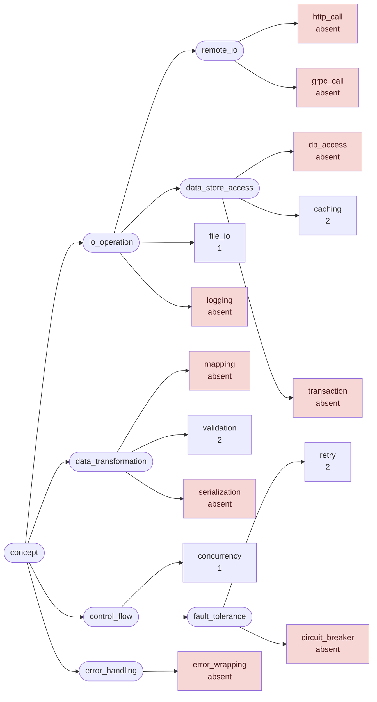
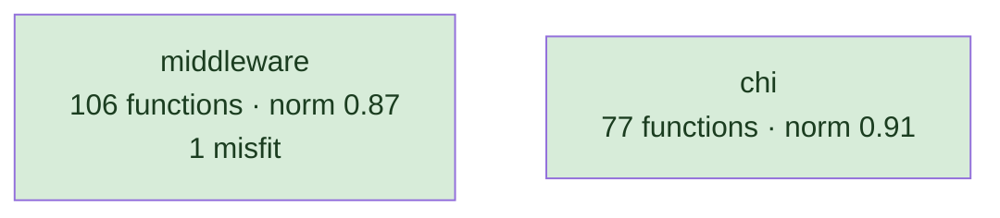
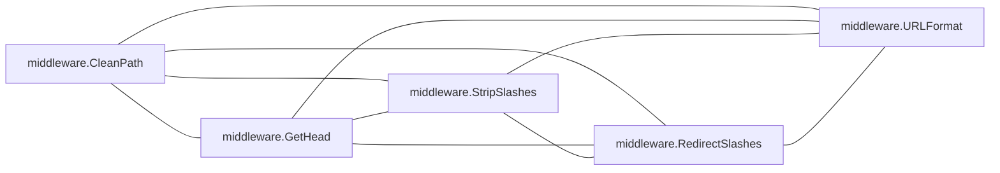
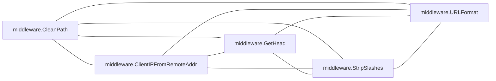
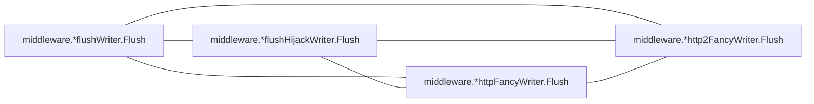
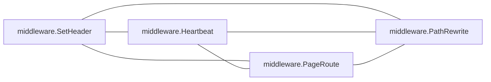
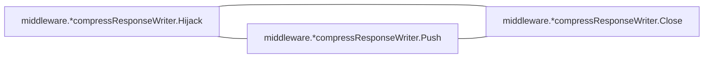

# chi

HTTP router; a narrow core with a middleware package beside it

**What this rung shows:** a corpus small enough to read end to end, where every reported pair can be checked

| | |
|---|---|
| Corpus | [chi](https://github.com/go-chi/chi) |
| Pinned at | `v5.3.2` (`38939062c5df4d3e8814aad1a488983112627ced`) |
| Project since | 2015 |
| doppel | `bb0f86a` |
| Command | `doppel analyze . --tests exclude --top 10` |

Run from the corpus root, so every path below is corpus-relative.
Regenerate with `task examples`.

## Run diagnostics

The corpus-level models doppel builds before ranking anything, as printed to stderr:

```
Scanning . ...
Generating concept documents...
Culture: 0 concepts modeled, 0 associations, 0 unusual realizations
Habitats: 2 modeled, 1 misfits; most uniform chi (norm 0.91), most diverse middleware (norm 0.87)
Ecosystems: 7 profiled (7 dominance, 0 coalition, 0 conflict, 0 weak)
Calibration: rate 0.01 over 10440 shape / 16653 overlap null pairs -> threshold 0.53, struct-min 0.40, family-min 0.53
Found 183 functions. Retrieving candidates...
Retrieval: shape 86, concept 5, call 357 -> 420 unique pairs
  concept-only 1.2%  call-only 78.3%  suppressed-shape functions: 0  large identity buckets: 0  surviving patterns: 2138
Running structural comparison on 420 pairs...
  92 pairs remain after struct-min=0.40 filter
Families: 7 over 18 components, 30 functions in a family, 26 edges completed
  1 pairs suppressed by max-per-func=2
```

# Code Similarity Report

**Functions analyzed:** 183 | **Threshold:** 0.60 | **Pairs found:** 10

---

## What doppel sees

**183 functions** across **2 packages** — test functions excluded. Structural roles: 126 leaf, 27 orchestrator, 3 passthrough, 27 utility.

### Concepts

doppel reads intent from the AST into a fixed vocabulary and reasons over the tree, so two functions that share a *branch* score partial credit rather than nothing. Leaf counts below are this corpus.



**Nothing here is tagged** `circuit_breaker`, `db_access`, `error_wrapping`, `grpc_call`, `http_call`, `logging`, `mapping`, `serialization`, `transaction`. That is a direct answer to "does this codebase already do X" — for those concepts, it does not.

| Concept | Functions | Convention |
|---|---:|---|
| `caching` | 2 | — |
| `retry` | 2 | — |
| `validation` | 2 | — |
| `concurrency` | 1 | — |
| `file_io` | 1 | — |

Convention is how uniformly this corpus realizes a concept: `1.00` means every function carrying the tag does it the same way, and a low number means the tag covers several unrelated habits. A concept with fewer than five members is not modeled.

### Where the duplication is

Merge-worthy pairs folded up to their packages. An edge means two packages keep solving the same problem separately; a count on a node means the repetition is inside one package.

### How settled each package is

A package with at least five functions gets a habitat model: doppel learns what is normal there and measures how surprising each member is against it. **Norm** is how uniform the package's practice is. A **misfit** is a function alien to its package *and* to the wider subsystem around it — one that fits its neighbours a directory up is normal for this codebase and is not reported.



Most uniform is `chi` (norm `0.91`); most varied is `middleware` (norm `0.87`). 1 functions are alien to their package and to the subsystem around it.

### How these candidates were found

Three channels propose candidates independently — shared rare *structure*, shared *concepts*, shared *calls* — and their union is what gets compared. This run: **420 candidate pairs** (shape 86, concept 5, call 357), of which 78% arrived on call evidence alone and 1% on concept evidence alone. A pair sharing none of the three is never compared, however alike it looks.

Each function is also an arena where its candidate concepts compete for its evidence. 7 functions reached an equilibrium: **7** settled on a single concept, **0** on a coalition, **0** hold concepts this corpus says do not go together.

_1 further pairs were held back so no single function fills the report._

---

## Local practice

The vocabulary above says what a concept *is*. This says what one looks like when **this** codebase writes it — learned from the corpus, so it describes the house style rather than a rule from anywhere else.

---

## Match #1 — Code-shape: `0.8396`

| | Location | Function | Signature | Patterns |
|---|---|---|---|---|
| **A** | `middleware/recoverer.go:132` | `middleware.prettyStack.decorateFuncCallLine` | `(string, bool, int) (string, error)` | — |
| **B** | `middleware/recoverer.go:172` | `middleware.prettyStack.decorateSourceLine` | `(string, bool, int) (string, error)` | — |

**Code similarity:** `ast 0.74  flow 1.00  nesting 0.90  sig 1.00  size 0.99`

**Evidence:** `803.08` (shape 787.95, concept 0.00, call 15.13)

**Trophic:** `0.71`

**Shared structure:**

- `14.36` — `flow:param→call:cW`
- `13.47` — `do(call:cW)`
- `7.76` — `flow:call:LastIndex→cond`

**Structural overlap:** `0.72` (merge-worthy)

- share 6 callees: [buf.String, cW, errors.New, string, strings.Index, strings.LastIndex]
- share 1 callers: [middleware.prettyStack.decorateLine]
- overlapping call-graph neighborhoods (1.00): 5 shared
- both are leaf functions
- same package
- same visibility
- same receiver type: prettyStack
- called from same packages: [middleware]
- call into same packages: [middleware]

---

## Match #2 — Code-shape: `0.8367`

| | Location | Function | Signature | Patterns |
|---|---|---|---|---|
| **A** | `tree.go:559` | `chi.*node.findEdge` | `(nodeTyp, byte) (*node)` | — |
| **B** | `tree.go:850` | `chi.nodes.findEdge` | `(byte) (*node)` | — |

**Code similarity:** `ast 0.85  flow 0.96  nesting 0.74  sig 0.67  size 0.80`

**Evidence:** `509.55` (shape 509.55, concept 0.00, call 0.00)

**Trophic:** `0.92`

**Shared structure:**

- `9.55` — `assign=(bin)`
- `4.28` — `seq[ assign:=(call:len) ; assign:=(lit:INT) ]`
- `4.28` — `seq[ assign=(bin) ; if(bin:>(id,sel)) ]`

**Structural overlap:** `0.50` (merge-worthy)

- share 1 callees: [len]
- both are leaf functions
- same package
- same visibility
- both are methods, on *node and nodes

---

## Match #3 — Code-shape: `0.9163`

| | Location | Function | Signature | Patterns |
|---|---|---|---|---|
| **A** | `mux.go:203` | `chi.*Mux.NotFound` | `(http.HandlerFunc)` | — |
| **B** | `mux.go:223` | `chi.*Mux.MethodNotAllowed` | `(http.HandlerFunc)` | — |

**Code similarity:** `ast 0.86  flow 1.00  nesting 1.00  sig 1.00  size 1.00`

**Evidence:** `334.43` (shape 321.28, concept 0.00, call 13.14)

**Trophic:** `0.89`

**Shared structure:**

- `4.98` — `assign:=(id)`
- `4.82` — `assign=(sel)`
- `4.28` — `seq[ assign:=(id) ; if(bin:&&(sel,bin)) ]`

**Structural overlap:** `0.67` (merge-worthy)

- share 3 callees: [Chain, HandlerFunc, m.updateSubRoutes]
- share 1 callers: [chi.*Mux.Mount]
- overlapping call-graph neighborhoods (1.00): 12 shared
- both are orchestrator functions
- same package
- same visibility
- same receiver type: Mux
- called from same packages: [chi]
- call into same packages: [chi]

---

## Match #4 — Code-shape: `0.7972`

| | Location | Function | Signature | Patterns |
|---|---|---|---|---|
| **A** | `middleware/route_headers.go:48` | `middleware.HeaderRouter.Route` | `(string, string, func(next http.Handler) http.Handler) (HeaderRouter)` | — |
| **B** | `middleware/route_headers.go:58` | `middleware.HeaderRouter.RouteAny` | `(string, []string, func(next http.Handler) http.Handler) (HeaderRouter)` | — |

**Code similarity:** `ast 0.79  flow 0.82  nesting 1.00  sig 0.75  size 0.74`

**Evidence:** `248.60` (shape 241.07, concept 0.00, call 7.53)

**Trophic:** `0.82`

**Shared structure:**

- `4.28` — `seq[ assign:=(index) ; if(bin:==(id,nil)) ]`
- `4.28` — `seq[ assign=(call:ToLower) ; assign:=(index) ]`
- `3.88` — `seq[ assign=(call:append) ; return(id) ]`

**Structural overlap:** `0.58` (merge-worthy)

- share 3 callees: [NewPattern, append, strings.ToLower]
- overlapping call-graph neighborhoods (1.00): 1 shared
- both are leaf functions
- same package
- same visibility
- same receiver type: HeaderRouter
- call into same packages: [middleware]

---

## Match #5 — Code-shape: `0.6704`

| | Location | Function | Signature | Patterns |
|---|---|---|---|---|
| **A** | `middleware/content_encoding.go:10` | `middleware.AllowContentEncoding` | `(...string) (func(next http.Handler) http.Handler)` | — |
| **B** | `middleware/content_type.go:20` | `middleware.AllowContentType` | `(...string) (func(http.Handler) http.Handler)` | — |

**Code similarity:** `ast 0.62  flow 0.98  nesting 0.98  sig 0.33  size 0.98`

**Evidence:** `395.75` (shape 387.49, concept 0.00, call 8.27)

**Trophic:** `0.71`

**Shared structure:**

- `4.28` — `range{ call:TrimSpace call:ToLower }`
- `4.28` — `if(bin:==(sel,lit:INT))`
- `3.86` — `return()`

**Structural overlap:** `0.48` (merge-worthy)

- share 7 callees: [http.HandlerFunc, len, make, next.ServeHTTP, strings.ToLower, strings.TrimSpace, w.WriteHeader]
- both are leaf functions
- same package
- same visibility
- same receiver type: plain functions

---

## Match #6 — Code-shape: `0.7282`

| | Location | Function | Signature | Patterns |
|---|---|---|---|---|
| **A** | `middleware/strip.go:14` | `middleware.StripSlashes` | `(http.Handler) (http.Handler)` | — |
| **B** | `middleware/strip.go:41` | `middleware.RedirectSlashes` | `(http.Handler) (http.Handler)` | — |

**Code similarity:** `ast 0.56  flow 0.97  nesting 0.96  sig 1.00  size 0.83`

**Evidence:** `380.92` (shape 379.26, concept 0.00, call 1.65)

**Trophic:** `0.70`

**Shared structure:**

- `6.73` — `flow:call:RouteContext→cond`
- `4.98` — `if(bin:&&(bin,bin))`
- `4.82` — `assign=(sel)`

**Structural overlap:** `0.43` (merge-worthy)

- share 5 callees: [chi.RouteContext, http.HandlerFunc, len, next.ServeHTTP, r.Context]
- both are leaf functions
- same package
- same visibility
- same receiver type: plain functions

---

## Match #7 — Code-shape: `0.7918`

| | Location | Function | Signature | Patterns |
|---|---|---|---|---|
| **A** | `middleware/clean_path.go:12` | `middleware.CleanPath` | `(http.Handler) (http.Handler)` | — |
| **B** | `middleware/get_head.go:10` | `middleware.GetHead` | `(http.Handler) (http.Handler)` | — |

**Code similarity:** `ast 0.68  flow 0.98  nesting 0.79  sig 1.00  size 0.70`

**Evidence:** `253.27` (shape 251.62, concept 0.00, call 1.65)

**Trophic:** `0.73`

**Shared structure:**

- `4.82` — `assign=(sel)`
- `4.28` — `seq[ assign:=(call:RouteContext) ; assign:=(sel) ]`
- `3.88` — `seq[ assign:=(sel) ; if(bin:==(id,lit:STRING)) ]`

**Structural overlap:** `0.45` (merge-worthy)

- share 4 callees: [chi.RouteContext, http.HandlerFunc, next.ServeHTTP, r.Context]
- both are leaf functions
- same package
- same visibility
- same receiver type: plain functions

---

## Match #8 — Code-shape: `1.0000`

| | Location | Function | Signature | Patterns |
|---|---|---|---|---|
| **A** | `middleware/wrap_writer.go:147` | `middleware.*flushWriter.Flush` | `()` | — |
| **B** | `middleware/wrap_writer.go:172` | `middleware.*flushHijackWriter.Flush` | `()` | — |

**Kind:** interface implementations — both implement `Flush()` on `*flushWriter` and `*flushHijackWriter`, in package `middleware`

**Code similarity:** `ast 1.00  flow 1.00  nesting 1.00  sig 1.00  size 1.00`

**Evidence:** `81.38` (shape 81.38, concept 0.00, call 0.00)

**Trophic:** `1.00`

**Shared structure:**

- `3.59` — `seq[ assign:=(assert) ; do(call:Flush) ]`
- `3.59` — `seq[ assign=(true) ; assign:=(assert) ]`
- `3.37` — `do(call:Flush)`

**Structural overlap:** `0.50` (merge-worthy)

- share 1 callees: [fl.Flush]
- both are leaf functions
- same package
- same visibility
- both are methods, on *flushWriter and *flushHijackWriter

---

## Match #9 — Code-shape: `1.0000`

| | Location | Function | Signature | Patterns |
|---|---|---|---|---|
| **A** | `middleware/wrap_writer.go:147` | `middleware.*flushWriter.Flush` | `()` | — |
| **B** | `middleware/wrap_writer.go:194` | `middleware.*httpFancyWriter.Flush` | `()` | — |

**Kind:** interface implementations — both implement `Flush()` on `*flushWriter` and `*httpFancyWriter`, in package `middleware`

**Code similarity:** `ast 1.00  flow 1.00  nesting 1.00  sig 1.00  size 1.00`

**Evidence:** `81.38` (shape 81.38, concept 0.00, call 0.00)

**Trophic:** `1.00`

**Shared structure:**

- `3.59` — `seq[ assign:=(assert) ; do(call:Flush) ]`
- `3.59` — `seq[ assign=(true) ; assign:=(assert) ]`
- `3.37` — `do(call:Flush)`

**Structural overlap:** `0.50` (merge-worthy)

- share 1 callees: [fl.Flush]
- both are leaf functions
- same package
- same visibility
- both are methods, on *flushWriter and *httpFancyWriter

---

## Match #10 — Code-shape: `1.0000`

| | Location | Function | Signature | Patterns |
|---|---|---|---|---|
| **A** | `middleware/wrap_writer.go:172` | `middleware.*flushHijackWriter.Flush` | `()` | — |
| **B** | `middleware/wrap_writer.go:194` | `middleware.*httpFancyWriter.Flush` | `()` | — |

**Kind:** interface implementations — both implement `Flush()` on `*flushHijackWriter` and `*httpFancyWriter`, in package `middleware`

**Code similarity:** `ast 1.00  flow 1.00  nesting 1.00  sig 1.00  size 1.00`

**Evidence:** `81.38` (shape 81.38, concept 0.00, call 0.00)

**Trophic:** `1.00`

**Shared structure:**

- `3.59` — `seq[ assign:=(assert) ; do(call:Flush) ]`
- `3.59` — `seq[ assign=(true) ; assign:=(assert) ]`
- `3.37` — `do(call:Flush)`

**Structural overlap:** `0.50` (merge-worthy)

- share 1 callees: [fl.Flush]
- both are leaf functions
- same package
- same visibility
- both are methods, on *flushHijackWriter and *httpFancyWriter

---

## Families

7 families, 30 functions in a family, largest 10 members; 26 edges scored here that retrieval never proposed

### Family 1 — 5 members, every pair `>= 0.60` code-shape, evidence `2060`



| Location | Function | Signature | Patterns |
|---|---|---|---|
| `middleware/clean_path.go:12` | `middleware.CleanPath` | `(http.Handler) (http.Handler)` | — |
| `middleware/get_head.go:10` | `middleware.GetHead` | `(http.Handler) (http.Handler)` | — |
| `middleware/strip.go:14` | `middleware.StripSlashes` | `(http.Handler) (http.Handler)` | — |
| `middleware/strip.go:41` | `middleware.RedirectSlashes` | `(http.Handler) (http.Handler)` | — |
| `middleware/url_format.go:46` | `middleware.URLFormat` | `(http.Handler) (http.Handler)` | — |

### Family 2 — 5 members, every pair `>= 0.55` code-shape, evidence `1253`  (3 edges scored here)



| Location | Function | Signature | Patterns |
|---|---|---|---|
| `middleware/clean_path.go:12` | `middleware.CleanPath` | `(http.Handler) (http.Handler)` | — |
| `middleware/client_ip.go:187` | `middleware.ClientIPFromRemoteAddr` | `(http.Handler) (http.Handler)` | — |
| `middleware/get_head.go:10` | `middleware.GetHead` | `(http.Handler) (http.Handler)` | — |
| `middleware/strip.go:14` | `middleware.StripSlashes` | `(http.Handler) (http.Handler)` | — |
| `middleware/url_format.go:46` | `middleware.URLFormat` | `(http.Handler) (http.Handler)` | — |

### Family 3 — 4 members, every pair `>= 1.00` code-shape, evidence `488`, interface implementations of `Flush()`, in package `middleware`



| Location | Function | Signature | Patterns |
|---|---|---|---|
| `middleware/wrap_writer.go:147` | `middleware.*flushWriter.Flush` | `()` | — |
| `middleware/wrap_writer.go:172` | `middleware.*flushHijackWriter.Flush` | `()` | — |
| `middleware/wrap_writer.go:194` | `middleware.*httpFancyWriter.Flush` | `()` | — |
| `middleware/wrap_writer.go:239` | `middleware.*http2FancyWriter.Flush` | `()` | — |

### Family 4 — 4 members, every pair `>= 0.56` code-shape, evidence `309`  (2 edges scored here)



| Location | Function | Signature | Patterns |
|---|---|---|---|
| `middleware/content_type.go:9` | `middleware.SetHeader` | `(string, string) (func(http.Handler) http.Handler)` | — |
| `middleware/heartbeat.go:12` | `middleware.Heartbeat` | `(string) (func(http.Handler) http.Handler)` | — |
| `middleware/page_route.go:10` | `middleware.PageRoute` | `(string, http.Handler) (func(http.Handler) http.Handler)` | — |
| `middleware/path_rewrite.go:9` | `middleware.PathRewrite` | `(string, string) (func(http.Handler) http.Handler)` | — |

### Family 5 — 3 members, every pair `>= 0.64` code-shape, evidence `267`



| Location | Function | Signature | Patterns |
|---|---|---|---|
| `middleware/compress.go:365` | `middleware.*compressResponseWriter.Hijack` | `() (net.Conn, *bufio.ReadWriter, error)` | — |
| `middleware/compress.go:372` | `middleware.*compressResponseWriter.Push` | `(string, *http.PushOptions) (error)` | — |
| `middleware/compress.go:379` | `middleware.*compressResponseWriter.Close` | `() (error)` | — |

_2 more families not listed._

