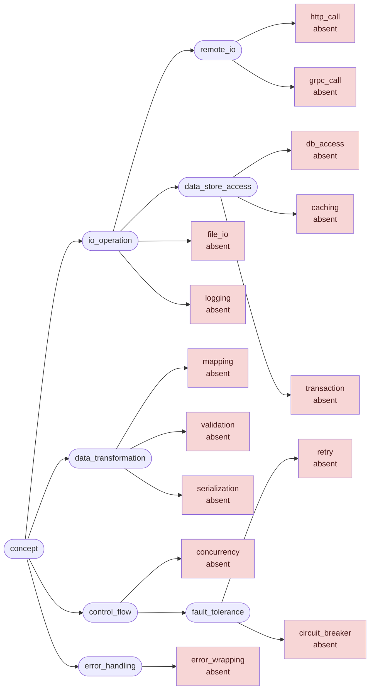
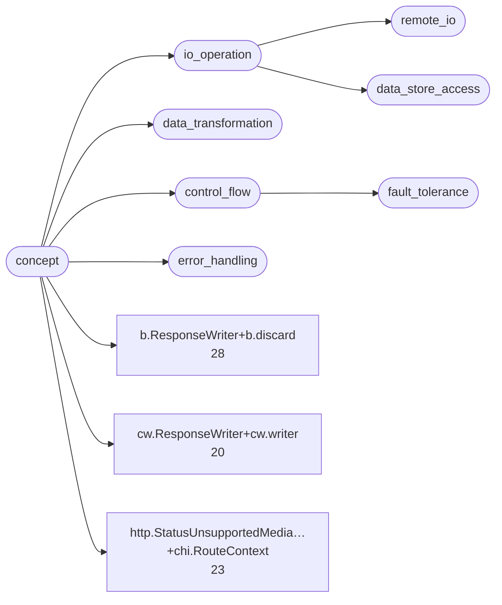
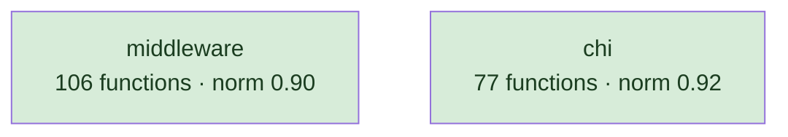
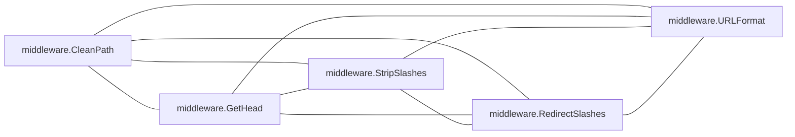
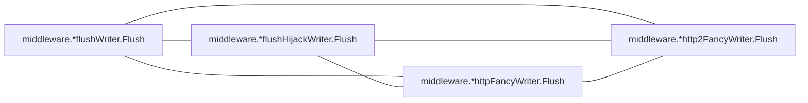
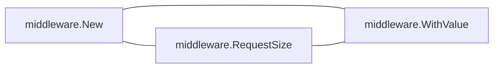
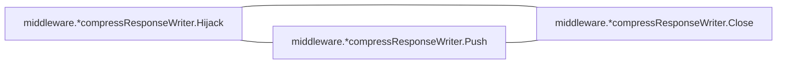
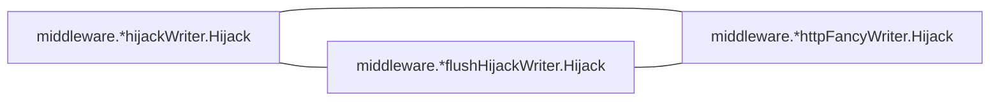

# chi

HTTP router; a narrow core with a middleware package beside it

**What this rung shows:** a corpus small enough to read end to end, where every reported pair can be checked

| | |
|---|---|
| Corpus | [chi](https://github.com/go-chi/chi) |
| Pinned at | `v5.3.2` (`38939062c5df4d3e8814aad1a488983112627ced`) |
| Project since | 2015 |
| doppel | `4214f9d` |
| Command | `doppel analyze . --tests exclude --top 10` |

Run from the corpus root, so every path below is corpus-relative.
Regenerate with `task examples`; CI regenerates on every push to master.

## Run diagnostics

The corpus-level models doppel builds before ranking anything, as printed to stderr:

```
Scanning . ...
Learning concept vocabulary...
Lexicon: 21 concepts (0 seeded, 21 emergent), 717/1935 features above 67 df, 34 functions unlabeled
Generating concept documents...
Culture: 20 concepts modeled, 71 associations, 6 unusual realizations
Habitats: 2 modeled, 0 misfits; most uniform chi (norm 0.92), most diverse middleware (norm 0.90)
Conventions: strongest mx.handle+chi.*Mux.handle (0.89), loosest mx.inline+mx.handler (0.23)
Ecosystems: 162 profiled (121 dominance, 41 coalition, 0 conflict, 0 weak)
Calibration: rate 0.01 over 9045 shape / 16653 overlap null pairs -> threshold 0.45, struct-min 0.51, family-min 0.45
Found 183 functions. Retrieving candidates...
Retrieval: shape 86, concept 532, call 357 -> 814 unique pairs
  concept-only 48.4%  call-only 29.5%  suppressed-shape functions: 0  large identity buckets: 0  surviving labels: 1340
Running structural comparison on 814 pairs...
  Concept views: 0 of 814 compared pairs disagree with the taxonomy (0 vocabulary the tree misses, 0 kinship the vocabularies lack)
  124 pairs remain after struct-min=0.51 filter
Families: 6 over 16 components, 28 functions in a family, 9 edges completed
  1 pairs suppressed by max-per-func=2
```

# Code Similarity Report

**Functions analyzed:** 183 | **Threshold:** 0.38 | **Pairs found:** 10

---

## What doppel sees

**183 functions** across **2 packages** — test functions excluded. Structural roles: 126 leaf, 27 orchestrator, 3 passthrough, 27 utility.

### Concepts

Two pictures of the same vocabulary. The first is what doppel **searched with**: an authored tree of fourteen seed practices, each leaf showing how many functions here ended up in a concept that seed grew. It is the same shape on every corpus, which is what makes it the one concept picture two runs can be compared on. The second is what this corpus **turned out to have**: concepts learned from the code itself, named after the evidence that identified them, hung from that same interior — so two functions under one *branch* score partial credit rather than nothing. Counts are members; membership is graded, and a function can carry several.

**What doppel looked for, and how much of it grew here.**



**What it learned instead.**



The diagram draws the 3 largest concepts on each branch; **18 further concepts** are left out of the picture and listed in the table below.

**No practice here for** `caching`, `circuit_breaker`, `concurrency`, `db_access`, `error_wrapping`, `file_io`, `grpc_call`, `http_call`, `logging`, `mapping`, `retry`, `serialization`, `transaction`, `validation`. Concepts are learned from this corpus, so one can never be absent — it exists because functions carry it. These are the *seeds* the search started from that grew nothing: a direct answer to "does this codebase already do X".

| Concept | Functions | Convention |
|---|---:|---|
| `b.ResponseWriter+b.discard` | 28 | `0.43` (loose) |
| `http.StatusUnsupportedMedia…+chi.RouteContext` | 23 | `0.59` (settled) |
| `cw.ResponseWriter+cw.writer` | 20 | `0.44` (loose) |
| `h.handler+n.endpoints` | 20 | `0.50` (settled) |
| `http.StatusUnsupportedMedia…+Header.Get+context.WithValue` | 16 | `0.43` (loose) |
| `context.WithValue+r.WithContext` | 13 | `0.32` (loose) |
| `mx.tree+rctx.RoutePath` | 13 | `0.39` (loose) |
| `URL.RawPath+chi.RouteContext` | 11 | `0.59` (settled) |
| `buf.String+bytes.Buffer` | 11 | `0.31` (loose) |
| `fmt.Sprintf+r.Context` | 11 | `0.35` (loose) |
| `http.StatusUnsupportedMedia…+Header.Get` | 11 | `0.31` (loose) |
| `mx.handle+chi.*Mux.handle` | 10 | `0.89` (unanimous) |
| `http.StatusUnsupportedMedia…+strings.ToLower` | 9 | `0.38` (loose) |
| `http.StatusUnsupportedMedia…+w.WriteHeader` | 8 | `0.26` (loose) |
| `rctx.URLParams+URLParams.Keys` | 8 | `0.38` (loose) |
| `mx.inline+mx.handler` | 7 | `0.23` (loose) |
| `netip.Addr+context.WithValue` | 7 | `0.32` (loose) |
| `r.Context+http.Handler` | 7 | `0.40` (loose) |
| `w.Header+http.Handler` | 6 | `0.37` (loose) |
| `strings.Cut+chi.*Mux.Get` | 5 | `0.44` (loose) |
| `strings.TrimSpace+space` | 3 | — |

Convention is how uniformly this corpus realizes a concept: `1.00` means every function carrying the tag does it the same way, and a low number means the tag covers several unrelated habits. A concept with fewer than five members is not modeled.

### Where the duplication is

Merge-worthy pairs are folded up to their packages: only pairs doppel judges worth consolidating are counted. An edge means two packages keep solving the same problem separately; a count on a node means the repetition is inside one package. Weights are **merge-worthy pairs**.

### How settled each package is

A package with at least five functions gets a habitat model: doppel learns what is normal there and measures how surprising each member is against it. **Norm** is how uniform the package's practice is. A **misfit** is a function alien to its package *and* to the wider subsystem around it — one that fits its neighbours a directory up is normal for this codebase and is not reported.



Most uniform is `chi` (norm `0.92`); most varied is `middleware` (norm `0.90`).

### How these candidates were found

Three channels propose candidates independently — shared rare *structure*, shared *concepts*, shared *calls* — and their union is what gets compared. This run: **814 candidate pairs** (shape 86, concept 532, call 357), of which 29% arrived on call evidence alone and 48% on concept evidence alone. A pair sharing none of the three is never compared, however alike it looks.

The concept signal on each compared pair is read three ways — what the taxonomy asserts, what this corpus's frequencies say, and what the two sides' learned vocabularies share with no tree in between. On **0 of 814** pairs the taxonomy and the vocabularies differ by at least 0.50: 0 where the vocabularies agree and the tree cannot see it, 0 where the tree asserts a kinship the vocabularies lack. Each such pair carries a `concept views` line saying which.

Each function is also an arena where its candidate concepts compete for its evidence. 162 functions reached an equilibrium: **121** settled on a single concept, **41** on a coalition, **0** hold concepts this corpus says do not go together.

_1 further pairs were held back so no single function fills the report._

### Corpus metrics

**Compression ratio:** `5.32`x — this corpus's canonical function bodies contain **11155 AST nodes** in total, which hash-cons (two nodes count as the same subtree exactly when their kind and every child match, all the way down) to **2097 distinct subtree shapes**; the ratio is nodes divided by shapes, always >= 1.0, and it never feeds any score.

**Nearest-neighbour code-shape:** of **183 functions**, **173** had a code-shape neighbour among the pairs retrieval actually scored — their best score's p50/p90/p99 are `0.42` / `0.90` / `1.00`, and 42% of them (73 of 173) already clear this run's threshold of `0.45`. This is **not an exhaustive nearest-neighbour search** (that would be a full pairwise comparison); it is bounded by the same three retrieval channels the pair list itself is bounded by, so the other 10 functions are excluded here as having no *scored* neighbour, not asserted to have none at all.

---

## Local practice

The vocabulary above says what a concept *is*. This says what one looks like when **this** codebase writes it — learned from the corpus, so it describes the house style rather than a rule from anywhere else.

### How this codebase writes each concept

Only what is **distinctive**. A feature earns a row by being carried by this concept's members at least twice as often as by the corpus at large — nearly every Go function has a `return` and an `if`, so prevalence alone would describe the language rather than this codebase. Weights are how much a channel counts toward whether a member looks normal — calls 40, control flow 20, co-occurring tags 15, role 15, package 10.

**`b.ResponseWriter+b.discard`** — 28 functions

| Channel | Feature | | Members | vs corpus |
|---|---|---|---|---|
| cotags ×15 | `cw.ResponseWriter+cw.writer` | `████······` | 10 of 28 | 3.3× |

**`http.StatusUnsupportedMedia…+chi.RouteContext`** — 23 functions

| Channel | Feature | | Members | vs corpus |
|---|---|---|---|---|
| calls ×40 | `net/http.HandlerFunc` | `█████████·` | 21 of 23 | 4.8× |
| flow ×20 | `funclit` | `██████████` | 23 of 23 | 4.4× |
| cotags ×15 | `URL.RawPath+chi.RouteContext` | `████······` | 10 of 23 | 7.2× |
|  | `http.StatusUnsupportedMedia…+Header.Get+context.WithValue` | `███·······` | 7 of 23 | 3.5× |

**`cw.ResponseWriter+cw.writer`** — 20 functions

| Channel | Feature | | Members | vs corpus |
|---|---|---|---|---|
| calls ×40 | `errors.New` | `███·······` | 5 of 20 | 9.2× |
|  | `middleware.*compressResponseWriter.writer` | `███·······` | 5 of 20 | 9.2× |
| cotags ×15 | `buf.String+bytes.Buffer` | `███·······` | 6 of 20 | 5.0× |
|  | `b.ResponseWriter+b.discard` | `█████·····` | 10 of 20 | 3.3× |

**`h.handler+n.endpoints`** — 20 functions

| Channel | Feature | | Members | vs corpus |
|---|---|---|---|---|
| flow ×20 | `for` | `████······` | 7 of 20 | 4.6× |
| package ×10 | `chi` | `██████████` | 20 of 20 | 2.4× |

**`http.StatusUnsupportedMedia…+Header.Get+context.WithValue`** — 16 functions

| Channel | Feature | | Members | vs corpus |
|---|---|---|---|---|
| calls ×40 | `context.WithValue` | `████······` | 7 of 16 | 8.9× |
|  | `strings.ToLower` | `███·······` | 4 of 16 | 5.1× |
|  | `net/http.HandlerFunc` | `█████████·` | 15 of 16 | 4.9× |
|  | `chi.*Mux.Get` | `███·······` | 5 of 16 | 4.8× |
| flow ×20 | `funclit` | `█████████·` | 15 of 16 | 4.1× |
|  | `range` | `████······` | 6 of 16 | 2.6× |
| cotags ×15 | `context.WithValue+r.WithContext` | `██████····` | 10 of 16 | 8.8× |
|  | `netip.Addr+context.WithValue` | `███·······` | 4 of 16 | 6.5× |
|  | `http.StatusUnsupportedMedia…+Header.Get` | `███·······` | 5 of 16 | 5.2× |
|  | `http.StatusUnsupportedMedia…+chi.RouteContext` | `████······` | 7 of 16 | 3.5× |
| role ×15 | `orchestrator` | `███·······` | 5 of 16 | 2.1× |

**`context.WithValue+r.WithContext`** — 13 functions

| Channel | Feature | | Members | vs corpus |
|---|---|---|---|---|
| calls ×40 | `context.WithValue` | `██████····` | 8 of 13 | 13× |
|  | `net/http.HandlerFunc` | `███████···` | 9 of 13 | 3.6× |
| flow ×20 | `funclit` | `███████···` | 9 of 13 | 3.0× |
| cotags ×15 | `netip.Addr+context.WithValue` | `█████·····` | 6 of 13 | 12× |
|  | `http.StatusUnsupportedMedia…+Header.Get+context.WithValue` | `████████··` | 10 of 13 | 8.8× |
|  | `http.StatusUnsupportedMedia…+chi.RouteContext` | `████······` | 5 of 13 | 3.1× |
| role ×15 | `orchestrator` | `███·······` | 4 of 13 | 2.1× |

_14 further concepts are modeled and not described._

### Which concepts share a function

`++` at least four times chance, `+` at least twice, `−` at most half, `never` not once. A blank cell is ordinary company — near chance, which is not culture.

| | `URL.RawPath+chi.RouteContext` | `b.ResponseWriter+b.discard` | `buf.String+bytes.Buffer` | `context.WithValue+r.WithContext` | `cw.ResponseWriter+cw.writer` | `fmt.Sprintf+r.Context` | `h.handler+n.endpoints` | `http.StatusUnsupportedMedia…+Header.Get` | `http.StatusUnsupportedMedia…+Header.Get+context.WithValue` | `http.StatusUnsupportedMedia…+chi.RouteContext` | `http.StatusUnsupportedMedia…+strings.ToLower` | `http.StatusUnsupportedMedia…+w.WriteHeader` | `mx.handle+chi.*Mux.handle` | `mx.inline+mx.handler` | `mx.tree+rctx.RoutePath` | `netip.Addr+context.WithValue` | `r.Context+http.Handler` | `rctx.URLParams+URLParams.Keys` | `strings.Cut+chi.*Mux.Get` | `strings.TrimSpace+space` |
|---|---|---|---|---|---|---|---|---|---|---|---|---|---|---|---|---|---|---|---|---|
| **`b.ResponseWriter+b.discard`** |  | | | | | | | | | | | | | | | | | | | |
| **`buf.String+bytes.Buffer`** |  |  | | | | | | | | | | | | | | | | | | |
| **`context.WithValue+r.WithContext`** |  |  |  | | | | | | | | | | | | | | | | | |
| **`cw.ResponseWriter+cw.writer`** |  | + | ++ |  | | | | | | | | | | | | | | | | |
| **`fmt.Sprintf+r.Context`** |  |  |  |  |  | | | | | | | | | | | | | | | |
| **`h.handler+n.endpoints`** |  | never |  |  |  | + | | | | | | | | | | | | | | |
| **`http.StatusUnsupportedMedia…+Header.Get`** |  |  |  |  |  |  |  | | | | | | | | | | | | | |
| **`http.StatusUnsupportedMedia…+Header.Get+context.WithValue`** |  |  |  | ++ |  |  |  | ++ | | | | | | | | | | | | |
| **`http.StatusUnsupportedMedia…+chi.RouteContext`** | ++ | never |  | + |  |  |  |  | + | | | | | | | | | | | |
| **`http.StatusUnsupportedMedia…+strings.ToLower`** | ++ |  |  |  |  |  |  | ++ |  | + | | | | | | | | | | |
| **`http.StatusUnsupportedMedia…+w.WriteHeader`** |  |  |  |  |  |  |  | ++ | ++ | + |  | | | | | | | | | |
| **`mx.handle+chi.*Mux.handle`** |  |  |  |  |  |  |  |  |  |  |  |  | | | | | | | | |
| **`mx.inline+mx.handler`** |  |  |  |  |  |  |  |  |  |  |  |  |  | | | | | | | |
| **`mx.tree+rctx.RoutePath`** |  |  |  |  |  |  |  |  |  |  |  |  |  | ++ | | | | | | |
| **`netip.Addr+context.WithValue`** |  |  |  | ++ |  |  |  |  | ++ |  |  |  |  |  |  | | | | | |
| **`r.Context+http.Handler`** |  |  | ++ |  |  |  |  |  |  |  |  |  |  |  |  |  | | | | |
| **`rctx.URLParams+URLParams.Keys`** |  |  |  |  |  |  |  |  |  |  |  |  |  |  |  |  |  | | | |
| **`strings.Cut+chi.*Mux.Get`** |  |  |  |  |  |  |  |  |  |  |  |  |  |  |  |  |  |  | | |
| **`strings.TrimSpace+space`** |  |  |  |  |  |  |  |  |  |  |  |  |  |  |  |  |  |  |  | |
| **`w.Header+http.Handler`** |  |  |  |  |  |  |  |  |  | ++ |  |  |  |  |  |  |  |  |  |  |

### What travels with what

Co-occurrence measured against chance across every function. Only relationships at least twice — or at most half — as common as chance are reported; near-chance company is not culture. Each kind is listed separately, because there are far more call tokens than concepts and one shared list is all calls. Within a kind, strongest first means lift weighted by how many functions carry it — a 100× relationship holding for three functions is a weaker finding than a 30× one holding for thirty.

**Together more than chance — tag~tag**

- 10 of 13 `context.WithValue+r.WithContext` functions also `http.StatusUnsupportedMedia…+Header.Get+context.WithValue` — 8.8× chance
- 6 of 7 `netip.Addr+context.WithValue` functions also `context.WithValue+r.WithContext` — 12× chance
- 10 of 11 `URL.RawPath+chi.RouteContext` functions also `http.StatusUnsupportedMedia…+chi.RouteContext` — 7.2× chance
- 5 of 7 `r.Context+http.Handler` functions also `buf.String+bytes.Buffer` — 12× chance
- 5 of 9 `http.StatusUnsupportedMedia…+strings.ToLower` functions also `http.StatusUnsupportedMedia…+Header.Get` — 9.2× chance
- 6 of 11 `buf.String+bytes.Buffer` functions also `cw.ResponseWriter+cw.writer` — 5.0× chance
- _13 more not listed_

**Together more than chance — tag~role**

- 5 of 8 `rctx.URLParams+URLParams.Keys` functions also `utility` — 4.2× chance
- 3 of 7 `mx.inline+mx.handler` functions also `utility` — 2.9× chance
- 5 of 16 `http.StatusUnsupportedMedia…+Header.Get+context.WithValue` functions also `orchestrator` — 2.1× chance
- 4 of 13 `context.WithValue+r.WithContext` functions also `orchestrator` — 2.1× chance
- 4 of 13 `mx.tree+rctx.RoutePath` functions also `orchestrator` — 2.1× chance

**Together more than chance — tag~call**

- 10 of 10 `mx.handle+chi.*Mux.handle` functions also `chi.*Mux.handle` — 14× chance
- 5 of 5 `strings.Cut+chi.*Mux.Get` functions also `strings.Cut` — 30× chance
- 10 of 11 `fmt.Sprintf+r.Context` functions also `fmt.Sprintf` — 13× chance
- 8 of 13 `context.WithValue+r.WithContext` functions also `context.WithValue` — 13× chance
- 7 of 11 `http.StatusUnsupportedMedia…+Header.Get` functions also `strings.ToLower` — 13× chance
- 5 of 11 `buf.String+bytes.Buffer` functions also `middleware.cW` — 17× chance
- _31 more not listed_

**Apart more than chance — tag~tag**

- **no** `b.ResponseWriter+b.discard` function has `http.StatusUnsupportedMedia…+chi.RouteContext` — chance alone would give about 4 of 28
- **no** `b.ResponseWriter+b.discard` function has `h.handler+n.endpoints` — chance alone would give about 3 of 28

**Apart more than chance — tag~role**

- **no** `b.ResponseWriter+b.discard` function has `orchestrator` — chance alone would give about 4 of 28
- **no** `http.StatusUnsupportedMedia…+chi.RouteContext` function has `utility` — chance alone would give about 3 of 23
- 2 of 8 `rctx.URLParams+URLParams.Keys` functions also `leaf` — 0.4× chance
- 1 of 7 `mx.inline+mx.handler` functions also `leaf` — 0.2× chance
- 2 of 28 `b.ResponseWriter+b.discard` functions also `utility` — 0.5× chance

**Apart more than chance — tag~call**

- **no** `b.ResponseWriter+b.discard` function has `net/http.HandlerFunc` — chance alone would give about 5 of 28
- **no** `h.handler+n.endpoints` function has `net/http.HandlerFunc` — chance alone would give about 4 of 20
- 1 of 20 `cw.ResponseWriter+cw.writer` functions also `net/http.HandlerFunc` — 0.3× chance

### Functions drifting from their own concept

These carry a tag but look nothing like the other functions carrying it. Typicality is measured against the concept's own median, so a genuinely varied concept lowers its own bar and a tight one can flag nobody.

| Function | Concept | Typicality | Concept median | |
|---|---|---:|---:|---|
| `middleware.RequestLogger` <br/>`middleware/logger.go:44` | `http.StatusUnsupportedMedia…+chi.RouteContext` | `0.29` | `0.62` | no near-duplicate |
| `chi.patNextSegment` <br/>`tree.go:735` | `h.handler+n.endpoints` | `0.23` | `0.55` | no near-duplicate |
| `chi.*Mux.ServeHTTP` <br/>`mux.go:63` | `context.WithValue+r.WithContext` | `0.25` | `0.55` | no near-duplicate |
| `middleware.*Compressor.Handler` <br/>`middleware/compress.go:199` | `cw.ResponseWriter+cw.writer` | `0.19` | `0.45` | no near-duplicate |
| `middleware.RequestLogger` <br/>`middleware/logger.go:44` | `r.Context+http.Handler` | `0.13` | `0.34` | no near-duplicate |
| `chi.*node.addChild` <br/>`tree.go:244` | `h.handler+n.endpoints` | `0.26` | `0.55` |  |

A row marked _no near-duplicate_ appears in no reported pair: nothing else in this report explains it, which makes it drift rather than duplication.

---

## Match #1 — Code-shape: `0.7890`

| | Location | Function | Signature | Concepts |
|---|---|---|---|---|
| **A** | `tree.go:559` | `chi.*node.findEdge` | `(nodeTyp, byte) (*node)` | h.handler+n.endpoints 0.51 |
| **B** | `tree.go:850` | `chi.nodes.findEdge` | `(byte) (*node)` | h.handler+n.endpoints 0.46 |

**Explain:** differs by two extra case, one extra assign, one extra return, and 5 more kinds

**Profile A:** `h.handler+n.endpoints` 1.00 (dominance)

**Profile B:** `h.handler+n.endpoints` 1.00 (dominance)

**Code similarity:** `wl 0.77  flow 0.96  nesting 0.74  sig 0.67  size 0.80`

**Containment:** `0.97`

**Evidence:** `422.29` (shape 421.12, concept 1.17, call 0.00)

**Trophic:** `0.94`

**Shared structure:**

- `9.89` — `depth-3 SEL` ×3
- `9.89` — `depth-2 SEL` ×3
- `8.42` — `depth-3 BIN` ×2

**Concept views:** shape `1.00`, corpus `0.89`, feature `0.89`, a-in-b `0.89`, b-in-a `1.00`

**Shared vocabulary:** `call:chi.patNextSegment`, `id:catch`, `id:child`

**Structural overlap:** `0.66` (merge-worthy)

- share 1 callees: [len]
- share patterns: [h.handler+n.endpoints]
- both are leaf functions
- same package
- same visibility
- both are methods, on *node and nodes

---

## Match #2 — Code-shape: `0.6878`

| | Location | Function | Signature | Concepts |
|---|---|---|---|---|
| **A** | `middleware/recoverer.go:132` | `middleware.prettyStack.decorateFuncCallLine` | `(string, bool, int) (string, error)` | buf.String+bytes.Buffer 0.47, cw.ResponseWriter+cw.writer 0.44 |
| **B** | `middleware/recoverer.go:172` | `middleware.prettyStack.decorateSourceLine` | `(string, bool, int) (string, error)` | buf.String+bytes.Buffer 0.49, cw.ResponseWriter+cw.writer 0.45 |

**Explain:** differs by four extra assign, one extra if, five extra binary, and 7 more kinds

**Profile A:** `cw.ResponseWriter+cw.writer` 0.73, `buf.String+bytes.Buffer` 0.27 (dominance)

**Profile B:** `cw.ResponseWriter+cw.writer` 0.73, `buf.String+bytes.Buffer` 0.27 (dominance)

**Code similarity:** `wl 0.49  flow 1.00  nesting 0.90  sig 1.00  size 0.99`

**Containment:** `0.67`

**Evidence:** `516.80` (shape 499.09, concept 2.58, call 15.13)

**Trophic:** `0.76`

**Shared structure:**

- `13.18` — `depth-1 EXPRSTMT` ×4
- `13.18` — `depth-0 CALL` ×4
- `11.84` — `depth-3 LIT` ×11

**Concept views:** shape `1.00`, corpus `0.96`, feature `0.96`, a-in-b `1.00`, b-in-a `0.96`

**Shared vocabulary:** `id:debug`, `id:green`, `id:magenta`

**Structural overlap:** `0.94` (merge-worthy)

- share 6 callees: [buf.String, cW, errors.New, string, strings.Index, strings.LastIndex]
- share 1 callers: [middleware.prettyStack.decorateLine]
- overlapping call-graph neighborhoods (1.00): 5 shared
- share patterns: [buf.String+bytes.Buffer, cw.ResponseWriter+cw.writer]
- both are leaf functions
- same package
- callers do related work (1.00): [strings.TrimSpace+space, fmt.Sprintf+r.Context]
- same visibility
- same receiver type: prettyStack
- called from same packages: [middleware]
- call into same packages: [middleware]

---

## Match #3 — Code-shape: `0.8418`

| | Location | Function | Signature | Concepts |
|---|---|---|---|---|
| **A** | `mux.go:203` | `chi.*Mux.NotFound` | `(http.HandlerFunc)` | mx.tree+rctx.RoutePath 0.51, mx.inline+mx.handler 0.50 |
| **B** | `mux.go:223` | `chi.*Mux.MethodNotAllowed` | `(http.HandlerFunc)` | mx.tree+rctx.RoutePath 0.51, mx.inline+mx.handler 0.50 |

**Explain:** differs by two extra call

**Profile A:** `mx.inline+mx.handler` 0.55, `mx.tree+rctx.RoutePath` 0.45 (coalition)

**Profile B:** `mx.inline+mx.handler` 0.54, `mx.tree+rctx.RoutePath` 0.46 (coalition)

**Code similarity:** `wl 0.74  flow 1.00  nesting 1.00  sig 1.00  size 1.00`

**Containment:** `0.85`

**Evidence:** `261.69` (shape 245.37, concept 3.18, call 13.14)

**Trophic:** `0.95`

**Shared structure:**

- `4.83` — `depth-1 ASSIGN` ×3
- `4.68` — `depth-3 ASSIGN` ×2
- `4.68` — `depth-2 ASSIGN` ×2

**Concept views:** shape `1.00`, corpus `0.99`, feature `0.99`, a-in-b `1.00`, b-in-a `0.99`

**Shared vocabulary:** `call:chi.Chain`, `id:inline`, `sel:mx.inline`

**Structural overlap:** `0.95` (merge-worthy)

- share 3 callees: [Chain, HandlerFunc, m.updateSubRoutes]
- share 1 callers: [chi.*Mux.Mount]
- overlapping call-graph neighborhoods (1.00): 12 shared
- share patterns: [mx.inline+mx.handler, mx.tree+rctx.RoutePath]
- both are orchestrator functions
- same package
- callers do related work (1.00): [mx.tree+rctx.RoutePath]
- callees do related work (1.00): [mx.inline+mx.handler, mx.tree+rctx.RoutePath]
- same visibility
- same receiver type: Mux
- called from same packages: [chi]
- call into same packages: [chi]

---

## Match #4 — Code-shape: `0.6090`

| | Location | Function | Signature | Concepts |
|---|---|---|---|---|
| **A** | `middleware/content_encoding.go:10` | `middleware.AllowContentEncoding` | `(...string) (func(next http.Handler) http.Handler)` | http.StatusUnsupportedMedia…+Header.Get 0.53, http.StatusUnsupportedMedia…+w.WriteHeader 0.51, http.StatusUnsupportedMedia…+Header.Get+context.WithValue 0.50 |
| **B** | `middleware/content_type.go:20` | `middleware.AllowContentType` | `(...string) (func(http.Handler) http.Handler)` | http.StatusUnsupportedMedia…+Header.Get 0.51, http.StatusUnsupportedMedia…+Header.Get+context.WithValue 0.49, http.StatusUnsupportedMedia…+w.WriteHeader 0.49 |

**Explain:** differs by two extra assign, one extra range, two extra call, and 6 more kinds

**Profile A:** `http.StatusUnsupportedMedia…+Header.Get` 0.51, `http.StatusUnsupportedMedia…+w.WriteHeader` 0.46 (coalition)

**Profile B:** `http.StatusUnsupportedMedia…+Header.Get` 0.86, `http.StatusUnsupportedMedia…+Header.Get+context.WithValue` 0.14 (dominance)

**Code similarity:** `wl 0.52  flow 0.98  nesting 0.98  sig 0.33  size 0.98`

**Containment:** `0.70`

**Evidence:** `370.75` (shape 357.89, concept 4.60, call 8.27)

**Trophic:** `0.79`

**Shared structure:**

- `7.61` — `depth-3 STRUCTTYPE` ×2
- `7.61` — `depth-2 STRUCTTYPE` ×2
- `7.61` — `depth-1 STRUCTTYPE` ×2

**Concept views:** shape `1.00`, corpus `0.96`, feature `0.96`, a-in-b `0.96`, b-in-a `1.00`

**Shared vocabulary:** `id:media`, `id:unsupported`, `sel:http.StatusUnsupportedMediaType`

**Structural overlap:** `0.65` (merge-worthy)

- share 7 callees: [http.HandlerFunc, len, make, next.ServeHTTP, strings.ToLower, strings.TrimSpace, w.WriteHeader]
- share patterns: [http.StatusUnsupportedMedia…+Header.Get, http.StatusUnsupportedMedia…+Header.Get+context.WithValue, http.StatusUnsupportedMedia…+w.WriteHeader]
- both are leaf functions
- same package
- same visibility
- same receiver type: plain functions

---

## Match #5 — Code-shape: `0.6883`

| | Location | Function | Signature | Concepts |
|---|---|---|---|---|
| **A** | `middleware/strip.go:14` | `middleware.StripSlashes` | `(http.Handler) (http.Handler)` | URL.RawPath+chi.RouteContext 0.55, http.StatusUnsupportedMedia…+chi.RouteContext 0.55 |
| **B** | `middleware/strip.go:41` | `middleware.RedirectSlashes` | `(http.Handler) (http.Handler)` | URL.RawPath+chi.RouteContext 0.48, http.StatusUnsupportedMedia…+chi.RouteContext 0.47 |

**Explain:** differs by one extra return, six extra literal, five extra call, and 6 more kinds

**Profile A:** `URL.RawPath+chi.RouteContext` 0.58, `http.StatusUnsupportedMedia…+chi.RouteContext` 0.42 (coalition)

**Profile B:** `URL.RawPath+chi.RouteContext` 0.57, `http.StatusUnsupportedMedia…+chi.RouteContext` 0.43 (coalition)

**Code similarity:** `wl 0.49  flow 0.97  nesting 0.96  sig 1.00  size 0.83`

**Containment:** `0.74`

**Evidence:** `316.31` (shape 312.02, concept 2.64, call 1.65)

**Trophic:** `0.83`

**Shared structure:**

- `4.53` — `depth-2 BLOCK` ×2
- `4.21` — `depth-3 BIN`
- `4.21` — `depth-3 IF`

**Concept views:** shape `1.00`, corpus `0.86`, feature `0.86`, a-in-b `0.86`, b-in-a `1.00`

**Shared vocabulary:** `lit:GET`, `sel:URL.RawPath`, `id:raw`

**Structural overlap:** `0.59` (merge-worthy)

- share 5 callees: [chi.RouteContext, http.HandlerFunc, len, next.ServeHTTP, r.Context]
- share patterns: [URL.RawPath+chi.RouteContext, http.StatusUnsupportedMedia…+chi.RouteContext]
- both are leaf functions
- same package
- same visibility
- same receiver type: plain functions

---

## Match #6 — Code-shape: `0.6414`

| | Location | Function | Signature | Concepts |
|---|---|---|---|---|
| **A** | `middleware/route_headers.go:48` | `middleware.HeaderRouter.Route` | `(string, string, func(next http.Handler) http.Handler) (HeaderRouter)` | http.StatusUnsupportedMedia…+Header.Get 0.52, http.StatusUnsupportedMedia…+strings.ToLower 0.50 |
| **B** | `middleware/route_headers.go:58` | `middleware.HeaderRouter.RouteAny` | `(string, []string, func(next http.Handler) http.Handler) (HeaderRouter)` | http.StatusUnsupportedMedia…+Header.Get 0.51, http.StatusUnsupportedMedia…+strings.ToLower 0.50 |

**Explain:** differs by two extra assign, one extra range, one extra call, and 4 more kinds

**Profile A:** `http.StatusUnsupportedMedia…+Header.Get` 0.57, `http.StatusUnsupportedMedia…+strings.ToLower` 0.43 (coalition)

**Profile B:** `http.StatusUnsupportedMedia…+Header.Get` 0.57, `http.StatusUnsupportedMedia…+strings.ToLower` 0.43 (coalition)

**Code similarity:** `wl 0.53  flow 0.82  nesting 1.00  sig 0.75  size 0.74`

**Containment:** `0.81` — most of the smaller body's shape is inside the larger

**Evidence:** `186.54` (shape 175.74, concept 3.27, call 7.53)

**Trophic:** `0.86`

**Shared structure:**

- `7.26` — `depth-3 INDEX` ×4
- `7.26` — `depth-2 INDEX` ×4
- `7.26` — `depth-1 INDEX` ×4

**Concept views:** shape `1.00`, corpus `0.99`, feature `0.99`, a-in-b `0.99`, b-in-a `1.00`

**Shared vocabulary:** `id:media`, `id:unsupported`, `sel:http.StatusUnsupportedMediaType`

**Structural overlap:** `0.81` (merge-worthy)

- share 3 callees: [NewPattern, append, strings.ToLower]
- overlapping call-graph neighborhoods (1.00): 1 shared
- share patterns: [http.StatusUnsupportedMedia…+Header.Get, http.StatusUnsupportedMedia…+strings.ToLower]
- both are leaf functions
- same package
- callees do related work (1.00): [strings.Cut+chi.*Mux.Get]
- same visibility
- same receiver type: HeaderRouter
- call into same packages: [middleware]

---

## Match #7 — Code-shape: `0.5097`

| | Location | Function | Signature | Concepts |
|---|---|---|---|---|
| **A** | `middleware/client_ip.go:92` | `middleware.ClientIPFromXFF` | `(...string) (func(http.Handler) http.Handler)` | netip.Addr+context.WithValue 0.53, context.WithValue+r.WithContext 0.50, http.StatusUnsupportedMedia…+Header.Get+context.WithValue 0.48 |
| **B** | `middleware/client_ip.go:149` | `middleware.ClientIPFromXFFTrustedProxies` | `(int) (func(http.Handler) http.Handler)` | context.WithValue+r.WithContext 0.54, netip.Addr+context.WithValue 0.54, http.StatusUnsupportedMedia…+Header.Get+context.WithValue 0.51 |

**Explain:** differs by one extra assign, one extra if, one extra increment, and 11 more kinds

**Profile A:** `context.WithValue+r.WithContext` 0.43, `netip.Addr+context.WithValue` 0.43, `http.StatusUnsupportedMedia…+Header.Get+context.WithValue` 0.14 (coalition)

**Profile B:** `context.WithValue+r.WithContext` 0.45, `netip.Addr+context.WithValue` 0.41, `http.StatusUnsupportedMedia…+Header.Get+context.WithValue` 0.15 (coalition)

**Code similarity:** `wl 0.36  flow 0.97  nesting 0.98  sig 0.33  size 0.87`

**Containment:** `0.56`

**Evidence:** `309.67` (shape 291.69, concept 4.68, call 13.29)

**Trophic:** `0.72`

**Shared structure:**

- `7.15` — `depth-0 FIELD` ×6
- `6.59` — `depth-1 FIELDLIST` ×4
- `5.72` — `depth-0 FIELDLIST` ×5

**Concept views:** shape `1.00`, corpus `0.95`, feature `0.95`, a-in-b `1.00`, b-in-a `0.95`

**Shared vocabulary:** `call:middleware.parseHeaderAddr`, `id:trusted`, `sel:netip.Addr`

**Structural overlap:** `0.70` (merge-worthy)

- share 7 callees: [context.WithValue, h.ServeHTTP, http.HandlerFunc, parseHeaderAddr, r.Context, r.WithContext, walkXFF]
- overlapping call-graph neighborhoods (0.75): 3 shared
- share patterns: [context.WithValue+r.WithContext, http.StatusUnsupportedMedia…+Header.Get+context.WithValue, netip.Addr+context.WithValue]
- both are orchestrator functions
- same package
- callees do related work (1.00): [strings.TrimSpace+space, netip.Addr+context.WithValue]
- same visibility
- same receiver type: plain functions
- call into same packages: [middleware]

---

## Match #8 — Code-shape: `1.0000`

| | Location | Function | Signature | Concepts |
|---|---|---|---|---|
| **A** | `middleware/wrap_writer.go:147` | `middleware.*flushWriter.Flush` | `()` | b.ResponseWriter+b.discard 0.62 |
| **B** | `middleware/wrap_writer.go:172` | `middleware.*flushHijackWriter.Flush` | `()` | b.ResponseWriter+b.discard 0.62 |

**Kind:** interface implementations — both implement `Flush()` on `*flushWriter` and `*flushHijackWriter`, in package `middleware`

**Explain:** identical after rename

**Profile A:** `b.ResponseWriter+b.discard` 1.00 (dominance)

**Profile B:** `b.ResponseWriter+b.discard` 1.00 (dominance)

**Code similarity:** `wl 1.00  flow 1.00  nesting 1.00  sig 1.00  size 1.00`

**Containment:** `1.00`

**Evidence:** `61.31` (shape 59.92, concept 1.38, call 0.00)

**Trophic:** `1.00`

**Shared structure:**

- `3.52` — `depth-3 BLOCK`
- `3.52` — `depth-2 BLOCK`
- `3.52` — `depth-1 BLOCK`

**Concept views:** shape `1.00`, corpus `1.00`, feature `1.00`, a-in-b `1.00`, b-in-a `1.00`

**Shared vocabulary:** `id:compress`, `id:encoders`, `id:pooled`

**Structural overlap:** `0.68` (merge-worthy)

- share 1 callees: [fl.Flush]
- share patterns: [b.ResponseWriter+b.discard]
- both are leaf functions
- same package
- same visibility
- both are methods, on *flushWriter and *flushHijackWriter

---

## Match #9 — Code-shape: `1.0000`

| | Location | Function | Signature | Concepts |
|---|---|---|---|---|
| **A** | `middleware/wrap_writer.go:147` | `middleware.*flushWriter.Flush` | `()` | b.ResponseWriter+b.discard 0.62 |
| **B** | `middleware/wrap_writer.go:194` | `middleware.*httpFancyWriter.Flush` | `()` | b.ResponseWriter+b.discard 0.62 |

**Kind:** interface implementations — both implement `Flush()` on `*flushWriter` and `*httpFancyWriter`, in package `middleware`

**Explain:** identical after rename

**Profile A:** `b.ResponseWriter+b.discard` 1.00 (dominance)

**Profile B:** `b.ResponseWriter+b.discard` 1.00 (dominance)

**Code similarity:** `wl 1.00  flow 1.00  nesting 1.00  sig 1.00  size 1.00`

**Containment:** `1.00`

**Evidence:** `61.31` (shape 59.92, concept 1.38, call 0.00)

**Trophic:** `1.00`

**Shared structure:**

- `3.52` — `depth-3 BLOCK`
- `3.52` — `depth-2 BLOCK`
- `3.52` — `depth-1 BLOCK`

**Concept views:** shape `1.00`, corpus `1.00`, feature `1.00`, a-in-b `1.00`, b-in-a `1.00`

**Shared vocabulary:** `id:compress`, `id:encoders`, `id:pooled`

**Structural overlap:** `0.68` (merge-worthy)

- share 1 callees: [fl.Flush]
- share patterns: [b.ResponseWriter+b.discard]
- both are leaf functions
- same package
- same visibility
- both are methods, on *flushWriter and *httpFancyWriter

---

## Match #10 — Code-shape: `1.0000`

| | Location | Function | Signature | Concepts |
|---|---|---|---|---|
| **A** | `middleware/wrap_writer.go:172` | `middleware.*flushHijackWriter.Flush` | `()` | b.ResponseWriter+b.discard 0.62 |
| **B** | `middleware/wrap_writer.go:194` | `middleware.*httpFancyWriter.Flush` | `()` | b.ResponseWriter+b.discard 0.62 |

**Kind:** interface implementations — both implement `Flush()` on `*flushHijackWriter` and `*httpFancyWriter`, in package `middleware`

**Explain:** identical after rename

**Profile A:** `b.ResponseWriter+b.discard` 1.00 (dominance)

**Profile B:** `b.ResponseWriter+b.discard` 1.00 (dominance)

**Code similarity:** `wl 1.00  flow 1.00  nesting 1.00  sig 1.00  size 1.00`

**Containment:** `1.00`

**Evidence:** `61.31` (shape 59.92, concept 1.38, call 0.00)

**Trophic:** `1.00`

**Shared structure:**

- `3.52` — `depth-3 BLOCK`
- `3.52` — `depth-2 BLOCK`
- `3.52` — `depth-1 BLOCK`

**Concept views:** shape `1.00`, corpus `1.00`, feature `1.00`, a-in-b `1.00`, b-in-a `1.00`

**Shared vocabulary:** `id:compress`, `id:encoders`, `id:pooled`

**Structural overlap:** `0.68` (merge-worthy)

- share 1 callees: [fl.Flush]
- share patterns: [b.ResponseWriter+b.discard]
- both are leaf functions
- same package
- same visibility
- both are methods, on *flushHijackWriter and *httpFancyWriter

---

## Families

6 families, 28 functions in a family, largest 10 members; 9 edges scored here that retrieval never proposed

### Family 1 — 5 members, every pair `>= 0.47` code-shape, evidence `1507`



| Location | Function | Signature | Concepts |
|---|---|---|---|
| `middleware/clean_path.go:12` | `middleware.CleanPath` | `(http.Handler) (http.Handler)` | URL.RawPath+chi.RouteContext 0.64, http.StatusUnsupportedMedia…+chi.RouteContext 0.60 |
| `middleware/get_head.go:10` | `middleware.GetHead` | `(http.Handler) (http.Handler)` | URL.RawPath+chi.RouteContext 0.56, http.StatusUnsupportedMedia…+chi.RouteContext 0.52 |
| `middleware/strip.go:14` | `middleware.StripSlashes` | `(http.Handler) (http.Handler)` | URL.RawPath+chi.RouteContext 0.55, http.StatusUnsupportedMedia…+chi.RouteContext 0.55 |
| `middleware/strip.go:41` | `middleware.RedirectSlashes` | `(http.Handler) (http.Handler)` | URL.RawPath+chi.RouteContext 0.48, http.StatusUnsupportedMedia…+chi.RouteContext 0.47 |
| `middleware/url_format.go:46` | `middleware.URLFormat` | `(http.Handler) (http.Handler)` | http.StatusUnsupportedMedia…+chi.RouteContext 0.49, URL.RawPath+chi.RouteContext 0.42 |

### Family 2 — 4 members, every pair `>= 1.00` code-shape, evidence `368`, interface implementations of `Flush()`, in package `middleware`



| Location | Function | Signature | Concepts |
|---|---|---|---|
| `middleware/wrap_writer.go:147` | `middleware.*flushWriter.Flush` | `()` | b.ResponseWriter+b.discard 0.62 |
| `middleware/wrap_writer.go:172` | `middleware.*flushHijackWriter.Flush` | `()` | b.ResponseWriter+b.discard 0.62 |
| `middleware/wrap_writer.go:194` | `middleware.*httpFancyWriter.Flush` | `()` | b.ResponseWriter+b.discard 0.62 |
| `middleware/wrap_writer.go:239` | `middleware.*http2FancyWriter.Flush` | `()` | b.ResponseWriter+b.discard 0.62 |

### Family 3 — 3 members, every pair `>= 0.46` code-shape, evidence `290`



| Location | Function | Signature | Concepts |
|---|---|---|---|
| `middleware/middleware.go:6` | `middleware.New` | `(http.Handler) (func(next http.Handler) http.Handler)` | http.StatusUnsupportedMedia…+chi.RouteContext 0.63, http.StatusUnsupportedMedia…+Header.Get+context.WithValue 0.59, context.WithValue+r.WithContext 0.55 |
| `middleware/request_size.go:9` | `middleware.RequestSize` | `(int64) (func(http.Handler) http.Handler)` | http.StatusUnsupportedMedia…+chi.RouteContext 0.56, http.StatusUnsupportedMedia…+Header.Get+context.WithValue 0.54, context.WithValue+r.WithContext 0.50 |
| `middleware/value.go:9` | `middleware.WithValue` | `(interface{}, interface{}) (func(next http.Handler) http.Handler)` | context.WithValue+r.WithContext 0.63, http.StatusUnsupportedMedia…+Header.Get+context.WithValue 0.62, http.StatusUnsupportedMedia…+chi.RouteContext 0.60 |

### Family 4 — 3 members, every pair `>= 0.48` code-shape, evidence `220`



| Location | Function | Signature | Concepts |
|---|---|---|---|
| `middleware/compress.go:365` | `middleware.*compressResponseWriter.Hijack` | `() (net.Conn, *bufio.ReadWriter, error)` | b.ResponseWriter+b.discard 0.64, cw.ResponseWriter+cw.writer 0.60 |
| `middleware/compress.go:372` | `middleware.*compressResponseWriter.Push` | `(string, *http.PushOptions) (error)` | cw.ResponseWriter+cw.writer 0.59, b.ResponseWriter+b.discard 0.56 |
| `middleware/compress.go:379` | `middleware.*compressResponseWriter.Close` | `() (error)` | cw.ResponseWriter+cw.writer 0.63, b.ResponseWriter+b.discard 0.57 |

### Family 5 — 3 members, every pair `>= 1.00` code-shape, evidence `170`, interface implementations of `Hijack() (net.Conn, *bufio.ReadWriter, error)`, in package `middleware`



| Location | Function | Signature | Concepts |
|---|---|---|---|
| `middleware/wrap_writer.go:160` | `middleware.*hijackWriter.Hijack` | `() (net.Conn, *bufio.ReadWriter, error)` | b.ResponseWriter+b.discard 0.64 |
| `middleware/wrap_writer.go:178` | `middleware.*flushHijackWriter.Hijack` | `() (net.Conn, *bufio.ReadWriter, error)` | b.ResponseWriter+b.discard 0.64 |
| `middleware/wrap_writer.go:200` | `middleware.*httpFancyWriter.Hijack` | `() (net.Conn, *bufio.ReadWriter, error)` | b.ResponseWriter+b.discard 0.64 |

_1 more families not listed._

