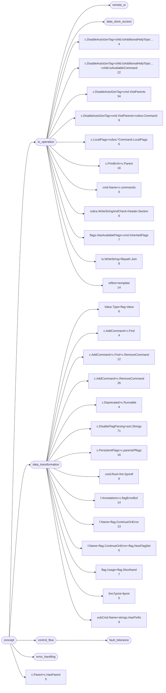
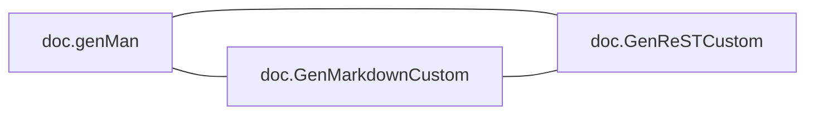
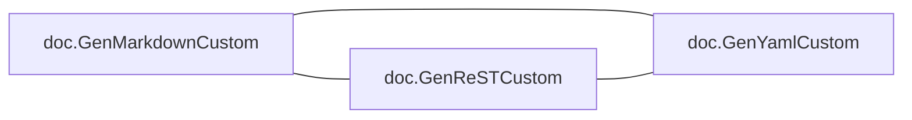
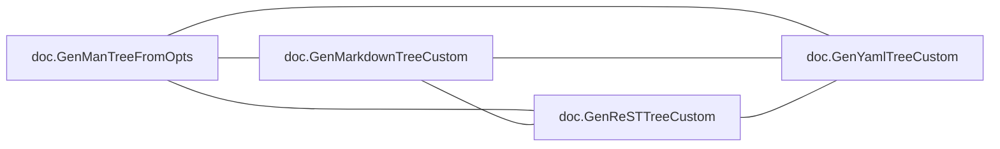
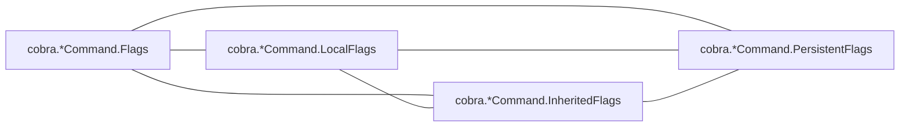

# cobra

CLI framework; one dominant type with a long method set, plus shell-completion generators

**What this rung shows:** the receiver and role signals, and per-shell generator siblings

| | |
|---|---|
| Corpus | [cobra](https://github.com/spf13/cobra) |
| Pinned at | `v1.10.2` (`88b30ab89da2d0d0abb153818746c5a2d30eccec`) |
| Project since | 2015 |
| doppel | `7c27a17` |
| Command | `doppel analyze . --tests exclude --top 10` |

Run from the corpus root, so every path below is corpus-relative.
Regenerate with `task examples`.

## Run diagnostics

The corpus-level models doppel builds before ranking anything, as printed to stderr:

```
Scanning . ...
Learning concept vocabulary...
Lexicon: 26 concepts (2 seeded, 24 emergent), 1103/2781 features above 98 df, 117 functions unlabeled
Generating concept documents...
Culture: 23 concepts modeled, 347 associations, 6 unusual realizations
Habitats: 2 modeled, 0 misfits; most uniform doc (norm 0.94), most diverse cobra (norm 0.91)
Conventions: strongest f.Name+flag.ContinueOnError+flag.NewFlagSet (0.61), loosest c.PersistentFlags+c.parentsPflags (0.22)
Ecosystems: 211 profiled (168 dominance, 41 coalition, 0 conflict, 2 weak)
Calibration: rate 0.01 over 17578 shape / 20000 overlap null pairs -> threshold 0.53, struct-min 0.51, family-min 0.53
Found 269 functions. Retrieving candidates...
Retrieval: shape 149, concept 630, call 712 -> 1168 unique pairs
  concept-only 32.8%  call-only 40.1%  suppressed-shape functions: 0  large identity buckets: 0  surviving patterns: 2819
Running structural comparison on 1168 pairs...
  208 pairs remain after struct-min=0.51 filter
Families: 16 over 38 components, 59 functions in a family, 16 edges completed
```

# Code Similarity Report

**Functions analyzed:** 269 | **Threshold:** 0.60 | **Pairs found:** 10

---

## What doppel sees

**269 functions** across **2 packages** — test functions excluded. Structural roles: 120 leaf, 63 orchestrator, 36 passthrough, 50 utility.

### Concepts

These concepts were **learned from this corpus**, not read off a fixed list: each one is a group of functions that share a way of being written, named after the evidence that identified it. They hang from an authored interior, so two functions under the same *branch* score partial credit rather than nothing. Counts below are members; membership is graded, and a function can carry several.



**No practice here for** `caching`, `circuit_breaker`, `concurrency`, `db_access`, `error_wrapping`, `grpc_call`, `http_call`, `logging`, `mapping`, `retry`, `serialization`, `transaction`. Concepts are learned from this corpus, so one can never be absent — it exists because functions carry it. These are the *seeds* the search started from that grew nothing: a direct answer to "does this codebase already do X".

| Concept | Functions | Convention |
|---|---:|---|
| `c.DisableFlagParsing+sort.Strings` | 71 | `0.43` (loose) |
| `c.DisableAutoGenTag+cmd.VisitParents` | 34 | `0.30` (loose) |
| `c.AddCommand+c.RemoveCommand` | 26 | `0.43` (loose) |
| `c.DisableAutoGenTag+child.IsAdditionalHelpTopic…+child.IsAvailableCommand` | 22 | `0.33` (loose) |
| `c.PersistentFlags+c.parentsPflags` | 16 | `0.22` (loose) |
| `c.PrintErrln+c.Parent` | 16 | `0.60` (settled) |
| `f.Annotations+c.flagErrorBuf` | 14 | `0.26` (loose) |
| `reflect+template` | 14 | `0.49` (loose) |
| `f.Name+flag.ContinueOnError` | 13 | `0.31` (loose) |
| `c.AddCommand+c.Find+c.RemoveCommand` | 12 | `0.31` (loose) |
| `c.DisableAutoGenTag+cmd.VisitParents+cobra.Command` | 9 | `0.24` (loose) |
| `cobra.WriteStringAndCheck+header.Section` | 9 | `0.29` (loose) |
| `subCmd.Name+strings.HasPrefix` | 9 | `0.37` (loose) |
| `io.WriteString+filepath.Join` | 8 | `0.30` (loose) |
| `flag.Usage+flag.Shorthand` | 7 | `0.25` (loose) |
| `flags.HasAvailableFlags+cmd.InheritedFlags` | 7 | `0.38` (loose) |
| `Value.Type+flag.Value` | 6 | `0.33` (loose) |
| `c.LocalFlags+cobra.*Command.LocalFlags` | 6 | `0.42` (loose) |
| `cmd.Name+c.commands` | 6 | `0.40` (loose) |
| `cmd.Root+fmt.Sprintf` | 6 | `0.41` (loose) |
| `f.Name+flag.ContinueOnError+flag.NewFlagSet` | 6 | `0.61` (settled) |
| `c.Parent+c.HasParent` | 5 | `0.59` (settled) |
| `fmt.Fprint+fprint` | 5 | `0.29` (loose) |
| `c.AddCommand+c.Find` | 4 | — |
| `c.Deprecated+c.Runnable` | 4 | — |
| `c.DisableAutoGenTag+child.IsAdditionalHelpTopic…` | 4 | — |

Convention is how uniformly this corpus realizes a concept: `1.00` means every function carrying the tag does it the same way, and a low number means the tag covers several unrelated habits. A concept with fewer than five members is not modeled.

### Where the duplication is

Merge-worthy pairs folded up to their packages. An edge means two packages keep solving the same problem separately; a count on a node means the repetition is inside one package.

### How settled each package is

A package with at least five functions gets a habitat model: doppel learns what is normal there and measures how surprising each member is against it. **Norm** is how uniform the package's practice is. A **misfit** is a function alien to its package *and* to the wider subsystem around it — one that fits its neighbours a directory up is normal for this codebase and is not reported.


Most uniform is `doc` (norm `0.94`); most varied is `cobra` (norm `0.91`).

### How these candidates were found

Three channels propose candidates independently — shared rare *structure*, shared *concepts*, shared *calls* — and their union is what gets compared. This run: **1168 candidate pairs** (shape 149, concept 630, call 712), of which 40% arrived on call evidence alone and 33% on concept evidence alone. A pair sharing none of the three is never compared, however alike it looks.

Each function is also an arena where its candidate concepts compete for its evidence. 211 functions reached an equilibrium: **168** settled on a single concept, **41** on a coalition, **0** hold concepts this corpus says do not go together.

---

## Local practice

The vocabulary above says what a concept *is*. This says what one looks like when **this** codebase writes it — learned from the corpus, so it describes the house style rather than a rule from anywhere else.

### How this codebase writes each concept

Only what is **distinctive**. A feature earns a row by being carried by this concept's members at least twice as often as by the corpus at large — nearly every Go function has a `return` and an `if`, so prevalence alone would describe the language rather than this codebase. Weights are how much a channel counts toward whether a member looks normal — calls 40, control flow 20, co-occurring tags 15, role 15, package 10.

**`c.DisableFlagParsing+sort.Strings`** — 71 functions

| Channel | Feature | | Members | vs corpus |
|---|---|---|---|---|
| calls ×40 | `fmt.Sprintf` | `███·······` | 21 of 71 | 2.2× |
|  | `cobra.*Command.Name` | `███·······` | 19 of 71 | 2.1× |
| flow ×20 | `range` | `█████·····` | 36 of 71 | 2.4× |
|  | `funclit` | `███·······` | 21 of 71 | 2.2× |
| cotags ×15 | `c.DisableAutoGenTag+cmd.VisitParents` | `███·······` | 18 of 71 | 2.0× |

**`c.DisableAutoGenTag+cmd.VisitParents`** — 34 functions

| Channel | Feature | | Members | vs corpus |
|---|---|---|---|---|
| calls ×40 | `cobra.*Command.Commands` | `████······` | 14 of 34 | 7.9× |
|  | `cobra.*Command.IsAdditionalHelpTopicCommand` | `███·······` | 10 of 34 | 7.2× |
|  | `cobra.*Command.IsAvailableCommand` | `████······` | 14 of 34 | 6.5× |
|  | `cobra.*Command.DisplayName` | `███·······` | 9 of 34 | 5.5× |
|  | `cobra.*Command.CommandPath` | `████······` | 13 of 34 | 5.4× |
| flow ×20 | `range` | `█████·····` | 18 of 34 | 2.5× |
|  | `funclit` | `███·······` | 10 of 34 | 2.2× |
| cotags ×15 | `c.DisableAutoGenTag+cmd.VisitParents+cobra.Command` | `███·······` | 9 of 34 | 7.9× |
|  | `c.DisableAutoGenTag+child.IsAdditionalHelpTopic…+child.IsAvailableCommand` | `██████····` | 21 of 34 | 7.6× |
|  | `c.DisableFlagParsing+sort.Strings` | `█████·····` | 18 of 34 | 2.0× |
| role ×15 | `passthrough` | `█████·····` | 16 of 34 | 3.5× |
|  | `orchestrator` | `█████·····` | 16 of 34 | 2.0× |
| package ×10 | `doc` | `███·······` | 10 of 34 | 2.6× |

**`c.AddCommand+c.RemoveCommand`** — 26 functions

| Channel | Feature | | Members | vs corpus |
|---|---|---|---|---|
| calls ×40 | `strings.HasPrefix` | `████······` | 10 of 26 | 10× |
|  | `cobra.*Command.Flags` | `███·······` | 9 of 26 | 3.3× |
|  | `cobra.*Command.Name` | `████······` | 11 of 26 | 3.3× |
| flow ×20 | `funclit` | `███·······` | 7 of 26 | 2.0× |
| cotags ×15 | `subCmd.Name+strings.HasPrefix` | `███·······` | 9 of 26 | 10× |
|  | `c.AddCommand+c.Find+c.RemoveCommand` | `███·······` | 8 of 26 | 6.9× |
|  | `c.DisableFlagParsing+sort.Strings` | `███████···` | 17 of 26 | 2.5× |
| role ×15 | `orchestrator` | `█████·····` | 13 of 26 | 2.1× |

**`c.DisableAutoGenTag+child.IsAdditionalHelpTopic…+child.IsAvailableCommand`** — 22 functions

| Channel | Feature | | Members | vs corpus |
|---|---|---|---|---|
| calls ×40 | `cobra.*Command.InitDefaultHelpFlag` | `███·······` | 7 of 22 | 12× |
|  | `cobra.*Command.Commands` | `██████····` | 13 of 22 | 11× |
|  | `cobra.*Command.IsAdditionalHelpTopicCommand` | `█████·····` | 10 of 22 | 11× |
|  | `fmt.Fprintf` | `███·······` | 6 of 22 | 10× |
|  | `cobra.*Command.IsAvailableCommand` | `██████····` | 13 of 22 | 9.4× |
| flow ×20 | `range` | `████████··` | 17 of 22 | 3.7× |
|  | `funclit` | `███·······` | 7 of 22 | 2.4× |
| cotags ×15 | `cobra.WriteStringAndCheck+header.Section` | `███·······` | 6 of 22 | 8.2× |
|  | `c.DisableAutoGenTag+cmd.VisitParents` | `██████████` | 21 of 22 | 7.6× |
|  | `c.AddCommand+c.Find+c.RemoveCommand` | `███·······` | 7 of 22 | 7.1× |
|  | `c.AddCommand+c.RemoveCommand` | `███·······` | 6 of 22 | 2.8× |
|  | `c.DisableFlagParsing+sort.Strings` | `███████···` | 16 of 22 | 2.8× |
| role ×15 | `orchestrator` | `██████····` | 14 of 22 | 2.7× |
|  | `passthrough` | `███·······` | 7 of 22 | 2.4× |
| package ×10 | `doc` | `█████·····` | 11 of 22 | 4.5× |

**`c.PersistentFlags+c.parentsPflags`** — 16 functions

| Channel | Feature | | Members | vs corpus |
|---|---|---|---|---|
| calls ×40 | `github.com/spf13/pflag.NewFlagSet` | `████······` | 7 of 16 | 17× |
|  | `cobra.*Command.PersistentFlags` | `██████····` | 9 of 16 | 14× |
|  | `cobra.*Command.SetOutput` | `████······` | 6 of 16 | 13× |
|  | `cobra.*Command.DisplayName` | `██████····` | 9 of 16 | 12× |
|  | `cobra.*Command.mergePersistentFlags` | `███·······` | 4 of 16 | 5.6× |
| cotags ×15 | `f.Name+flag.ContinueOnError+flag.NewFlagSet` | `████······` | 6 of 16 | 17× |
|  | `f.Name+flag.ContinueOnError` | `██████····` | 10 of 16 | 13× |
|  | `f.Annotations+c.flagErrorBuf` | `██████····` | 9 of 16 | 11× |
|  | `c.DisableAutoGenTag+cmd.VisitParents` | `███·······` | 5 of 16 | 2.5× |
| role ×15 | `passthrough` | `███████···` | 11 of 16 | 5.1× |

**`c.PrintErrln+c.Parent`** — 16 functions

| Channel | Feature | | Members | vs corpus |
|---|---|---|---|---|
| calls ×40 | `cobra.*Command.HasParent` | `██████████` | 16 of 16 | 11× |
|  | `cobra.*Command.Parent` | `███·······` | 5 of 16 | 7.6× |
| cotags ×15 | `c.Parent+c.HasParent` | `███·······` | 5 of 16 | 17× |
| role ×15 | `passthrough` | `███·······` | 5 of 16 | 2.3× |

_17 further concepts are modeled and not described._

### Which concepts share a function

`++` at least four times chance, `+` at least twice, `−` at most half, `never` not once. A blank cell is ordinary company — near chance, which is not culture.

| | `Value.Type+flag.Value` | `c.AddCommand+c.Find` | `c.AddCommand+c.Find+c.RemoveCommand` | `c.AddCommand+c.RemoveCommand` | `c.Deprecated+c.Runnable` | `c.DisableAutoGenTag+child.IsAdditionalHelpTopic…` | `c.DisableAutoGenTag+child.IsAdditionalHelpTopic…+child.IsAvailableCommand` | `c.DisableAutoGenTag+cmd.VisitParents` | `c.DisableAutoGenTag+cmd.VisitParents+cobra.Command` | `c.DisableFlagParsing+sort.Strings` | `c.LocalFlags+cobra.*Command.LocalFlags` | `c.Parent+c.HasParent` | `c.PersistentFlags+c.parentsPflags` | `c.PrintErrln+c.Parent` | `cmd.Name+c.commands` | `cmd.Root+fmt.Sprintf` | `cobra.WriteStringAndCheck+header.Section` | `f.Annotations+c.flagErrorBuf` | `f.Name+flag.ContinueOnError` | `f.Name+flag.ContinueOnError+flag.NewFlagSet` | `flag.Usage+flag.Shorthand` | `flags.HasAvailableFlags+cmd.InheritedFlags` | `fmt.Fprint+fprint` | `io.WriteString+filepath.Join` | `reflect+template` |
|---|---|---|---|---|---|---|---|---|---|---|---|---|---|---|---|---|---|---|---|---|---|---|---|---|---|
| **`c.AddCommand+c.Find`** |  | | | | | | | | | | | | | | | | | | | | | | | | |
| **`c.AddCommand+c.Find+c.RemoveCommand`** |  | ++ | | | | | | | | | | | | | | | | | | | | | | | |
| **`c.AddCommand+c.RemoveCommand`** |  | ++ | ++ | | | | | | | | | | | | | | | | | | | | | | |
| **`c.Deprecated+c.Runnable`** |  |  |  |  | | | | | | | | | | | | | | | | | | | | | |
| **`c.DisableAutoGenTag+child.IsAdditionalHelpTopic…`** |  |  |  |  |  | | | | | | | | | | | | | | | | | | | | |
| **`c.DisableAutoGenTag+child.IsAdditionalHelpTopic…+child.IsAvailableCommand`** |  | ++ | ++ | + |  | ++ | | | | | | | | | | | | | | | | | | | |
| **`c.DisableAutoGenTag+cmd.VisitParents`** |  | ++ | ++ |  |  | ++ | ++ | | | | | | | | | | | | | | | | | | |
| **`c.DisableAutoGenTag+cmd.VisitParents+cobra.Command`** |  |  |  |  |  | ++ | ++ | ++ | | | | | | | | | | | | | | | | | |
| **`c.DisableFlagParsing+sort.Strings`** | + | + | + | + |  | + | + | + |  | | | | | | | | | | | | | | | | |
| **`c.LocalFlags+cobra.*Command.LocalFlags`** |  |  |  |  |  |  |  |  |  |  | | | | | | | | | | | | | | | |
| **`c.Parent+c.HasParent`** |  |  |  |  |  |  |  |  |  |  |  | | | | | | | | | | | | | | |
| **`c.PersistentFlags+c.parentsPflags`** |  |  |  |  |  |  |  | + |  |  |  |  | | | | | | | | | | | | | |
| **`c.PrintErrln+c.Parent`** |  |  |  |  |  |  |  |  |  | − |  | ++ |  | | | | | | | | | | | | |
| **`cmd.Name+c.commands`** |  |  |  | ++ |  |  |  |  |  | + |  |  |  |  | | | | | | | | | | | |
| **`cmd.Root+fmt.Sprintf`** |  |  | ++ |  |  |  |  |  |  | + |  |  |  |  |  | | | | | | | | | | |
| **`cobra.WriteStringAndCheck+header.Section`** |  |  |  |  |  | ++ | ++ | ++ | ++ | + |  |  |  |  |  |  | | | | | | | | | |
| **`f.Annotations+c.flagErrorBuf`** |  |  |  |  |  |  |  | + |  |  |  |  | ++ |  |  |  |  | | | | | | | | |
| **`f.Name+flag.ContinueOnError`** |  |  |  |  |  |  |  | + |  |  |  |  | ++ |  |  |  |  | ++ | | | | | | | |
| **`f.Name+flag.ContinueOnError+flag.NewFlagSet`** |  |  |  |  |  |  |  | ++ |  |  |  |  | ++ |  |  |  |  | ++ | ++ | | | | | | |
| **`flag.Usage+flag.Shorthand`** | ++ |  |  |  |  |  |  |  |  | + |  |  |  |  |  |  |  |  |  |  | | | | | |
| **`flags.HasAvailableFlags+cmd.InheritedFlags`** | ++ |  |  |  |  |  |  |  |  | + |  |  |  |  |  |  |  |  |  |  |  | | | | |
| **`fmt.Fprint+fprint`** |  |  |  |  |  |  |  |  |  |  |  |  |  |  |  |  |  |  |  |  |  |  | | | |
| **`io.WriteString+filepath.Join`** |  |  |  |  |  |  | ++ | + |  |  |  |  |  |  |  |  |  |  |  |  |  |  |  | | |
| **`reflect+template`** |  |  |  |  |  |  |  |  |  | − |  |  |  |  |  |  |  |  |  |  |  |  |  |  | |
| **`subCmd.Name+strings.HasPrefix`** |  | ++ | ++ | ++ |  |  | ++ | + |  | + |  |  |  |  |  |  |  |  |  |  |  |  |  |  |  |

### What travels with what

Co-occurrence measured against chance across every function. Only relationships at least twice — or at most half — as common as chance are reported; near-chance company is not culture. Each kind is listed separately, because there are far more call tokens than concepts and one shared list is all calls. Within a kind, strongest first means lift weighted by how many functions carry it — a 100× relationship holding for three functions is a weaker finding than a 30× one holding for thirty.

**Together more than chance — tag~tag**

- 10 of 13 `f.Name+flag.ContinueOnError` functions also `f.Annotations+c.flagErrorBuf` — 15× chance
- 21 of 22 `c.DisableAutoGenTag+child.IsAdditionalHelpTopic…+child.IsAvailableCommand` functions also `c.DisableAutoGenTag+cmd.VisitParents` — 7.6× chance
- 10 of 13 `f.Name+flag.ContinueOnError` functions also `c.PersistentFlags+c.parentsPflags` — 13× chance
- 6 of 6 `f.Name+flag.ContinueOnError+flag.NewFlagSet` functions also `f.Name+flag.ContinueOnError` — 21× chance
- 6 of 6 `f.Name+flag.ContinueOnError+flag.NewFlagSet` functions also `f.Annotations+c.flagErrorBuf` — 19× chance
- 6 of 6 `f.Name+flag.ContinueOnError+flag.NewFlagSet` functions also `c.PersistentFlags+c.parentsPflags` — 17× chance
- _47 more not listed_

**Together more than chance — tag~role**

- 10 of 13 `f.Name+flag.ContinueOnError` functions also `passthrough` — 5.7× chance
- 11 of 16 `c.PersistentFlags+c.parentsPflags` functions also `passthrough` — 5.1× chance
- 9 of 14 `f.Annotations+c.flagErrorBuf` functions also `passthrough` — 4.8× chance
- 16 of 34 `c.DisableAutoGenTag+cmd.VisitParents` functions also `passthrough` — 3.5× chance
- 5 of 6 `f.Name+flag.ContinueOnError+flag.NewFlagSet` functions also `passthrough` — 6.2× chance
- 6 of 9 `c.DisableAutoGenTag+cmd.VisitParents+cobra.Command` functions also `passthrough` — 5.0× chance
- _21 more not listed_

**Together more than chance — tag~call**

- 8 of 8 `io.WriteString+filepath.Join` functions also `os.Create` — 30× chance
- 6 of 6 `c.LocalFlags+cobra.*Command.LocalFlags` functions also `cobra.*Command.LocalFlags` — 45× chance
- 7 of 7 `flags.HasAvailableFlags+cmd.InheritedFlags` functions also `cobra.*Command.NonInheritedFlags` — 34× chance
- 5 of 5 `fmt.Fprint+fprint` functions also `fmt.Fprint` — 54× chance
- 6 of 6 `f.Name+flag.ContinueOnError+flag.NewFlagSet` functions also `github.com/spf13/pflag.NewFlagSet` — 38× chance
- 8 of 9 `subCmd.Name+strings.HasPrefix` functions also `strings.HasPrefix` — 24× chance
- _245 more not listed_

**Apart more than chance — tag~tag**

- 1 of 16 `c.PrintErrln+c.Parent` functions also `c.DisableFlagParsing+sort.Strings` — 0.2× chance
- 1 of 14 `reflect+template` functions also `c.DisableFlagParsing+sort.Strings` — 0.3× chance

**Apart more than chance — tag~role**

- **no** `c.DisableAutoGenTag+child.IsAdditionalHelpTopic…+child.IsAvailableCommand` function has `leaf` — chance alone would give about 10 of 22
- **no** `c.PersistentFlags+c.parentsPflags` function has `leaf` — chance alone would give about 7 of 16
- **no** `f.Annotations+c.flagErrorBuf` function has `leaf` — chance alone would give about 6 of 14
- **no** `f.Name+flag.ContinueOnError` function has `leaf` — chance alone would give about 6 of 13
- **no** `c.AddCommand+c.Find+c.RemoveCommand` function has `leaf` — chance alone would give about 5 of 12
- **no** `c.DisableAutoGenTag+cmd.VisitParents+cobra.Command` function has `leaf` — chance alone would give about 4 of 9
- _8 more not listed_

### Functions drifting from their own concept

These carry a tag but look nothing like the other functions carrying it. Typicality is measured against the concept's own median, so a genuinely varied concept lowers its own bar and a tight one can flag nobody.

| Function | Concept | Typicality | Concept median | |
|---|---|---:|---:|---|
| `cobra.*Command.ExecuteC` <br/>`command.go:1084` | `c.PrintErrln+c.Parent` | `0.36` | `0.84` | no near-duplicate |
| `cobra.*Command.DebugFlags` <br/>`command.go:1501` | `f.Name+flag.ContinueOnError` | `0.24` | `0.57` | no near-duplicate |
| `cobra.tmpl` <br/>`cobra.go:179` | `reflect+template` | `0.19` | `0.43` | no near-duplicate |
| `cobra.*Command.UsageFunc` <br/>`command.go:444` | `c.PrintErrln+c.Parent` | `0.36` | `0.84` |  |
| `cobra.*Command.HelpFunc` <br/>`command.go:484` | `c.PrintErrln+c.Parent` | `0.42` | `0.84` |  |
| `doc.GenYamlCustom` <br/>`doc/yaml_docs.go:93` | `flags.HasAvailableFlags+cmd.InheritedFlags` | `0.26` | `0.57` |  |

A row marked _no near-duplicate_ appears in no reported pair: nothing else in this report explains it, which makes it drift rather than duplication.

---

## Match #1 — Code-shape: `0.8207`

| | Location | Function | Signature | Patterns |
|---|---|---|---|---|
| **A** | `doc/md_docs.go:57` | `doc.GenMarkdownCustom` | `(*cobra.Command, io.Writer, func(string) string) (error)` | c.DisableAutoGenTag+cmd.VisitParents 0.90, c.DisableAutoGenTag+cmd.VisitParents+cobra.Command 0.85, c.DisableAutoGenTag+child.IsAdditionalHelpTopic…+child.IsAvailableCommand 0.69, c.DisableAutoGenTag+child.IsAdditionalHelpTopic… 0.57, +3 more |
| **B** | `doc/rest_docs.go:62` | `doc.GenReSTCustom` | `(*cobra.Command, io.Writer, func(string, string) string) (error)` | c.DisableAutoGenTag+cmd.VisitParents 0.90, c.DisableAutoGenTag+cmd.VisitParents+cobra.Command 0.85, c.DisableAutoGenTag+child.IsAdditionalHelpTopic…+child.IsAvailableCommand 0.69, c.DisableAutoGenTag+child.IsAdditionalHelpTopic… 0.57, +3 more |

**Profile A:** `c.DisableAutoGenTag+child.IsAdditionalHelpTopic…` 1.00 (dominance)

**Profile B:** `c.DisableAutoGenTag+child.IsAdditionalHelpTopic…` 1.00 (dominance)

**Code similarity:** `ast 0.80  flow 1.00  nesting 1.00  sig 0.60  size 0.86`

**Evidence:** `1891.32` (shape 1820.49, concept 12.86, call 57.97)

**Trophic:** `0.83`

**Shared structure:**

- `30.80` — `flow:call:new→call:WriteString`
- `26.32` — `do(call:WriteString)`
- `16.55` — `flow:call:new→call:Fprintf`

**Structural overlap:** `0.86` (merge-worthy)

- share 25 callees: [Format, buf.WriteString, buf.WriteTo, byName, child.IsAdditionalHelpTopicCommand, child.IsAvailableCommand, child.Name, cmd.CommandPath, cmd.Commands, cmd.HasParent, cmd.InitDefaultHelpCmd, cmd.InitDefaultHelpFlag, cmd.Parent, cmd.Runnable, cmd.UseLine, cmd.VisitParents, fmt.Fprintf, hasSeeAlso, len, linkHandler, new, parent.CommandPath, sort.Sort, strings.ReplaceAll, time.Now]
- overlapping call-graph neighborhoods (0.95): 87 shared
- share patterns: [c.AddCommand+c.Find+c.RemoveCommand, c.DisableAutoGenTag+child.IsAdditionalHelpTopic…, c.DisableAutoGenTag+child.IsAdditionalHelpTopic…+child.IsAvailableCommand, c.DisableAutoGenTag+cmd.VisitParents, c.DisableAutoGenTag+cmd.VisitParents+cobra.Command, c.DisableFlagParsing+sort.Strings, cobra.WriteStringAndCheck+header.Section]
- both are passthrough functions
- same package
- callers do related work (1.00): [io.WriteString+filepath.Join, c.DisableAutoGenTag+child.IsAdditionalHelpTopic…+child.IsAvailableCommand, c.DisableAutoGenTag+cmd.VisitParents, c.DisableFlagParsing+sort.Strings]
- callees do related work (1.00): [c.AddCommand+c.Find, c.Deprecated+c.Runnable, c.Parent+c.HasParent, flags.HasAvailableFlags+cmd.InheritedFlags, subCmd.Name+strings.HasPrefix, c.AddCommand+c.Find+c.RemoveCommand, c.AddCommand+c.RemoveCommand, c.DisableAutoGenTag+cmd.VisitParents]
- same visibility
- same receiver type: plain functions
- called from same packages: [doc]
- call into same packages: [cobra, doc]

---

## Match #2 — Code-shape: `0.9806`

| | Location | Function | Signature | Patterns |
|---|---|---|---|---|
| **A** | `doc/md_docs.go:32` | `doc.printOptions` | `(*bytes.Buffer, *cobra.Command, string) (error)` | flags.HasAvailableFlags+cmd.InheritedFlags 0.54 |
| **B** | `doc/rest_docs.go:30` | `doc.printOptionsReST` | `(*bytes.Buffer, *cobra.Command, string) (error)` | flags.HasAvailableFlags+cmd.InheritedFlags 0.54 |

**Profile A:** `flags.HasAvailableFlags+cmd.InheritedFlags` 1.00 (dominance)

**Profile B:** `flags.HasAvailableFlags+cmd.InheritedFlags` 1.00 (dominance)

**Code similarity:** `ast 0.97  flow 1.00  nesting 1.00  sig 1.00  size 0.86`

**Evidence:** `609.02` (shape 593.16, concept 1.99, call 13.88)

**Trophic:** `0.93`

**Shared structure:**

- `16.55` — `flow:param→call:WriteString`
- `13.16` — `do(call:WriteString)`
- `9.09` — `seq[ do(call:PrintDefaults) ; do(call:WriteString) ]`

**Structural overlap:** `0.88` (merge-worthy)

- share 9 callees: [buf.WriteString, cmd.InheritedFlags, cmd.NonInheritedFlags, flags.HasAvailableFlags, flags.PrintDefaults, flags.SetOutput, parentFlags.HasAvailableFlags, parentFlags.PrintDefaults, parentFlags.SetOutput]
- overlapping call-graph neighborhoods (0.90): 36 shared
- share patterns: [flags.HasAvailableFlags+cmd.InheritedFlags]
- both are orchestrator functions
- same package
- callers do related work (1.00): [c.DisableAutoGenTag+child.IsAdditionalHelpTopic…, cobra.WriteStringAndCheck+header.Section, c.DisableAutoGenTag+cmd.VisitParents+cobra.Command, c.DisableAutoGenTag+child.IsAdditionalHelpTopic…+child.IsAvailableCommand, c.AddCommand+c.Find+c.RemoveCommand, c.DisableAutoGenTag+cmd.VisitParents, c.DisableFlagParsing+sort.Strings]
- callees do related work (1.00): [c.LocalFlags+cobra.*Command.LocalFlags, f.Name+flag.ContinueOnError+flag.NewFlagSet, f.Name+flag.ContinueOnError, f.Annotations+c.flagErrorBuf, c.PersistentFlags+c.parentsPflags, c.DisableAutoGenTag+cmd.VisitParents]
- same visibility
- same receiver type: plain functions
- called from same packages: [doc]
- call into same packages: [cobra]

---

## Match #3 — Code-shape: `0.8777`

| | Location | Function | Signature | Patterns |
|---|---|---|---|---|
| **A** | `doc/rest_docs.go:145` | `doc.GenReSTTreeCustom` | `(*cobra.Command, string, func(string) string, func(string, string) string) (error)` | io.WriteString+filepath.Join 0.75, c.DisableAutoGenTag+cmd.VisitParents 0.49, c.DisableAutoGenTag+child.IsAdditionalHelpTopic…+child.IsAvailableCommand 0.21, c.DisableFlagParsing+sort.Strings 0.15 |
| **B** | `doc/yaml_docs.go:60` | `doc.GenYamlTreeCustom` | `(*cobra.Command, string, func(string) string, func(string) string) (error)` | io.WriteString+filepath.Join 0.75, c.DisableAutoGenTag+cmd.VisitParents 0.49, c.DisableAutoGenTag+child.IsAdditionalHelpTopic…+child.IsAvailableCommand 0.21, c.DisableFlagParsing+sort.Strings 0.15 |

**Profile A:** `io.WriteString+filepath.Join` 1.00 (dominance)

**Profile B:** `io.WriteString+filepath.Join` 1.00 (dominance)

**Code similarity:** `ast 0.85  flow 1.00  nesting 1.00  sig 0.80  size 1.00`

**Evidence:** `658.07` (shape 626.62, concept 4.68, call 26.78)

**Trophic:** `0.93`

**Shared structure:**

- `7.34` — `if(bin:!=(id,nil))`
- `4.14` — `seq[ assign:=(bin) ; assign:=(call:Join) ]`
- `4.14` — `seq[ defer(call:Close) ; if(bin:!=(id,nil)) ]`

**Structural overlap:** `0.78` (merge-worthy)

- share 10 callees: [c.IsAdditionalHelpTopicCommand, c.IsAvailableCommand, cmd.CommandPath, cmd.Commands, f.Close, filePrepender, filepath.Join, io.WriteString, os.Create, strings.ReplaceAll]
- overlapping call-graph neighborhoods (0.83): 35 shared
- share patterns: [c.DisableAutoGenTag+child.IsAdditionalHelpTopic…+child.IsAvailableCommand, c.DisableAutoGenTag+cmd.VisitParents, c.DisableFlagParsing+sort.Strings, io.WriteString+filepath.Join]
- both are orchestrator functions
- same package
- callees do related work (0.77): [c.Deprecated+c.Runnable, c.DisableAutoGenTag+child.IsAdditionalHelpTopic…, c.Parent+c.HasParent, c.DisableAutoGenTag+cmd.VisitParents+cobra.Command, c.DisableAutoGenTag+child.IsAdditionalHelpTopic…+child.IsAvailableCommand, c.DisableAutoGenTag+cmd.VisitParents, cobra.WriteStringAndCheck+header.Section ≈ c.PrintErrln+c.Parent]
- same visibility
- same receiver type: plain functions
- called from same packages: [doc]
- call into same packages: [cobra, doc]

---

## Match #4 — Code-shape: `1.0000`

| | Location | Function | Signature | Patterns |
|---|---|---|---|---|
| **A** | `flag_groups.go:33` | `cobra.*Command.MarkFlagsRequiredTogether` | `(...string)` | f.Annotations+c.flagErrorBuf 0.61, c.DisableFlagParsing+sort.Strings 0.46 |
| **B** | `flag_groups.go:65` | `cobra.*Command.MarkFlagsMutuallyExclusive` | `(...string)` | f.Annotations+c.flagErrorBuf 0.61, c.DisableFlagParsing+sort.Strings 0.44 |

**Profile A:** `f.Annotations+c.flagErrorBuf` 1.00 (dominance)

**Profile B:** `f.Annotations+c.flagErrorBuf` 1.00 (dominance)

**Code similarity:** `ast 1.00  flow 1.00  nesting 1.00  sig 1.00  size 1.00`

**Evidence:** `411.77` (shape 398.02, concept 2.87, call 10.87)

**Trophic:** `1.00`

**Shared structure:**

- `6.89` — `do(call:panic)`
- `4.14` — `range{ call:Lookup call:Flags call:panic call:Sprintf call:SetAnnotation call:append call:Join }`
- `4.14` — `seq[ do(call:mergePersistentFlags) ; range ]`

**Structural overlap:** `0.80` (merge-worthy)

- share 8 callees: [Lookup, SetAnnotation, append, c.Flags, c.mergePersistentFlags, fmt.Sprintf, panic, strings.Join]
- overlapping call-graph neighborhoods (1.00): 34 shared
- share patterns: [c.DisableFlagParsing+sort.Strings, f.Annotations+c.flagErrorBuf]
- both are orchestrator functions
- same package
- callees do related work (1.00): [f.Name+flag.ContinueOnError+flag.NewFlagSet, f.Name+flag.ContinueOnError, f.Annotations+c.flagErrorBuf, c.PersistentFlags+c.parentsPflags]
- same visibility
- same receiver type: Command
- call into same packages: [cobra]

---

## Match #5 — Code-shape: `1.0000`

| | Location | Function | Signature | Patterns |
|---|---|---|---|---|
| **A** | `flag_groups.go:33` | `cobra.*Command.MarkFlagsRequiredTogether` | `(...string)` | f.Annotations+c.flagErrorBuf 0.61, c.DisableFlagParsing+sort.Strings 0.46 |
| **B** | `flag_groups.go:49` | `cobra.*Command.MarkFlagsOneRequired` | `(...string)` | f.Annotations+c.flagErrorBuf 0.61, c.DisableFlagParsing+sort.Strings 0.49 |

**Profile A:** `f.Annotations+c.flagErrorBuf` 1.00 (dominance)

**Profile B:** `f.Annotations+c.flagErrorBuf` 1.00 (dominance)

**Code similarity:** `ast 1.00  flow 1.00  nesting 1.00  sig 1.00  size 1.00`

**Evidence:** `411.82` (shape 398.02, concept 2.92, call 10.87)

**Trophic:** `1.00`

**Shared structure:**

- `6.89` — `do(call:panic)`
- `4.14` — `range{ call:Lookup call:Flags call:panic call:Sprintf call:SetAnnotation call:append call:Join }`
- `4.14` — `seq[ do(call:mergePersistentFlags) ; range ]`

**Structural overlap:** `0.80` (merge-worthy)

- share 8 callees: [Lookup, SetAnnotation, append, c.Flags, c.mergePersistentFlags, fmt.Sprintf, panic, strings.Join]
- overlapping call-graph neighborhoods (1.00): 34 shared
- share patterns: [c.DisableFlagParsing+sort.Strings, f.Annotations+c.flagErrorBuf]
- both are orchestrator functions
- same package
- callees do related work (1.00): [f.Name+flag.ContinueOnError+flag.NewFlagSet, f.Name+flag.ContinueOnError, f.Annotations+c.flagErrorBuf, c.PersistentFlags+c.parentsPflags]
- same visibility
- same receiver type: Command
- call into same packages: [cobra]

---

## Match #6 — Code-shape: `1.0000`

| | Location | Function | Signature | Patterns |
|---|---|---|---|---|
| **A** | `flag_groups.go:49` | `cobra.*Command.MarkFlagsOneRequired` | `(...string)` | f.Annotations+c.flagErrorBuf 0.61, c.DisableFlagParsing+sort.Strings 0.49 |
| **B** | `flag_groups.go:65` | `cobra.*Command.MarkFlagsMutuallyExclusive` | `(...string)` | f.Annotations+c.flagErrorBuf 0.61, c.DisableFlagParsing+sort.Strings 0.44 |

**Profile A:** `f.Annotations+c.flagErrorBuf` 1.00 (dominance)

**Profile B:** `f.Annotations+c.flagErrorBuf` 1.00 (dominance)

**Code similarity:** `ast 1.00  flow 1.00  nesting 1.00  sig 1.00  size 1.00`

**Evidence:** `411.77` (shape 398.02, concept 2.87, call 10.87)

**Trophic:** `1.00`

**Shared structure:**

- `6.89` — `do(call:panic)`
- `4.14` — `range{ call:Lookup call:Flags call:panic call:Sprintf call:SetAnnotation call:append call:Join }`
- `4.14` — `seq[ do(call:mergePersistentFlags) ; range ]`

**Structural overlap:** `0.80` (merge-worthy)

- share 8 callees: [Lookup, SetAnnotation, append, c.Flags, c.mergePersistentFlags, fmt.Sprintf, panic, strings.Join]
- overlapping call-graph neighborhoods (1.00): 34 shared
- share patterns: [c.DisableFlagParsing+sort.Strings, f.Annotations+c.flagErrorBuf]
- both are orchestrator functions
- same package
- callees do related work (1.00): [f.Name+flag.ContinueOnError+flag.NewFlagSet, f.Name+flag.ContinueOnError, f.Annotations+c.flagErrorBuf, c.PersistentFlags+c.parentsPflags]
- same visibility
- same receiver type: Command
- call into same packages: [cobra]

---

## Match #7 — Code-shape: `0.8425`

| | Location | Function | Signature | Patterns |
|---|---|---|---|---|
| **A** | `doc/md_docs.go:133` | `doc.GenMarkdownTreeCustom` | `(*cobra.Command, string, func(string) string, func(string) string) (error)` | io.WriteString+filepath.Join 0.75, c.DisableAutoGenTag+cmd.VisitParents 0.49, c.DisableAutoGenTag+child.IsAdditionalHelpTopic…+child.IsAvailableCommand 0.21, c.DisableFlagParsing+sort.Strings 0.15 |
| **B** | `doc/rest_docs.go:145` | `doc.GenReSTTreeCustom` | `(*cobra.Command, string, func(string) string, func(string, string) string) (error)` | io.WriteString+filepath.Join 0.75, c.DisableAutoGenTag+cmd.VisitParents 0.49, c.DisableAutoGenTag+child.IsAdditionalHelpTopic…+child.IsAvailableCommand 0.21, c.DisableFlagParsing+sort.Strings 0.15 |

**Profile A:** `io.WriteString+filepath.Join` 1.00 (dominance)

**Profile B:** `io.WriteString+filepath.Join` 1.00 (dominance)

**Code similarity:** `ast 0.79  flow 1.00  nesting 1.00  sig 0.80  size 1.00`

**Evidence:** `621.39` (shape 589.93, concept 4.68, call 26.78)

**Trophic:** `0.88`

**Shared structure:**

- `7.34` — `if(bin:!=(id,nil))`
- `4.14` — `seq[ assign:=(bin) ; assign:=(call:Join) ]`
- `4.14` — `seq[ defer(call:Close) ; if(bin:!=(id,nil)) ]`

**Structural overlap:** `0.79` (merge-worthy)

- share 10 callees: [c.IsAdditionalHelpTopicCommand, c.IsAvailableCommand, cmd.CommandPath, cmd.Commands, f.Close, filePrepender, filepath.Join, io.WriteString, os.Create, strings.ReplaceAll]
- overlapping call-graph neighborhoods (0.90): 36 shared
- share patterns: [c.DisableAutoGenTag+child.IsAdditionalHelpTopic…+child.IsAvailableCommand, c.DisableAutoGenTag+cmd.VisitParents, c.DisableFlagParsing+sort.Strings, io.WriteString+filepath.Join]
- both are orchestrator functions
- same package
- callees do related work (1.00): [c.Deprecated+c.Runnable, c.DisableAutoGenTag+child.IsAdditionalHelpTopic…, c.Parent+c.HasParent, cobra.WriteStringAndCheck+header.Section, c.DisableAutoGenTag+cmd.VisitParents+cobra.Command, c.DisableAutoGenTag+child.IsAdditionalHelpTopic…+child.IsAvailableCommand, c.AddCommand+c.Find+c.RemoveCommand, c.DisableAutoGenTag+cmd.VisitParents]
- same visibility
- same receiver type: plain functions
- called from same packages: [doc]
- call into same packages: [cobra, doc]

---

## Match #8 — Code-shape: `0.8725`

| | Location | Function | Signature | Patterns |
|---|---|---|---|---|
| **A** | `doc/md_docs.go:133` | `doc.GenMarkdownTreeCustom` | `(*cobra.Command, string, func(string) string, func(string) string) (error)` | io.WriteString+filepath.Join 0.75, c.DisableAutoGenTag+cmd.VisitParents 0.49, c.DisableAutoGenTag+child.IsAdditionalHelpTopic…+child.IsAvailableCommand 0.21, c.DisableFlagParsing+sort.Strings 0.15 |
| **B** | `doc/yaml_docs.go:60` | `doc.GenYamlTreeCustom` | `(*cobra.Command, string, func(string) string, func(string) string) (error)` | io.WriteString+filepath.Join 0.75, c.DisableAutoGenTag+cmd.VisitParents 0.49, c.DisableAutoGenTag+child.IsAdditionalHelpTopic…+child.IsAvailableCommand 0.21, c.DisableFlagParsing+sort.Strings 0.15 |

**Profile A:** `io.WriteString+filepath.Join` 1.00 (dominance)

**Profile B:** `io.WriteString+filepath.Join` 1.00 (dominance)

**Code similarity:** `ast 0.79  flow 1.00  nesting 1.00  sig 1.00  size 1.00`

**Evidence:** `621.38` (shape 589.93, concept 4.68, call 26.78)

**Trophic:** `0.86`

**Shared structure:**

- `7.34` — `if(bin:!=(id,nil))`
- `4.14` — `seq[ assign:=(bin) ; assign:=(call:Join) ]`
- `4.14` — `seq[ defer(call:Close) ; if(bin:!=(id,nil)) ]`

**Structural overlap:** `0.78` (merge-worthy)

- share 10 callees: [c.IsAdditionalHelpTopicCommand, c.IsAvailableCommand, cmd.CommandPath, cmd.Commands, f.Close, filePrepender, filepath.Join, io.WriteString, os.Create, strings.ReplaceAll]
- overlapping call-graph neighborhoods (0.83): 35 shared
- share patterns: [c.DisableAutoGenTag+child.IsAdditionalHelpTopic…+child.IsAvailableCommand, c.DisableAutoGenTag+cmd.VisitParents, c.DisableFlagParsing+sort.Strings, io.WriteString+filepath.Join]
- both are orchestrator functions
- same package
- callees do related work (0.77): [c.Deprecated+c.Runnable, c.DisableAutoGenTag+child.IsAdditionalHelpTopic…, c.Parent+c.HasParent, c.DisableAutoGenTag+cmd.VisitParents+cobra.Command, c.DisableAutoGenTag+child.IsAdditionalHelpTopic…+child.IsAvailableCommand, c.DisableAutoGenTag+cmd.VisitParents, cobra.WriteStringAndCheck+header.Section ≈ c.PrintErrln+c.Parent]
- same visibility
- same receiver type: plain functions
- called from same packages: [doc]
- call into same packages: [cobra, doc]

---

## Match #9 — Code-shape: `1.0000`

| | Location | Function | Signature | Patterns |
|---|---|---|---|---|
| **A** | `command.go:1688` | `cobra.*Command.Flags` | `() (*flag.FlagSet)` | f.Name+flag.ContinueOnError 0.54, f.Annotations+c.flagErrorBuf 0.52, f.Name+flag.ContinueOnError+flag.NewFlagSet 0.49, c.PersistentFlags+c.parentsPflags 0.45 |
| **B** | `command.go:1775` | `cobra.*Command.PersistentFlags` | `() (*flag.FlagSet)` | f.Name+flag.ContinueOnError 0.56, f.Annotations+c.flagErrorBuf 0.54, c.PersistentFlags+c.parentsPflags 0.50, f.Name+flag.ContinueOnError+flag.NewFlagSet 0.50 |

**Profile A:** `f.Name+flag.ContinueOnError+flag.NewFlagSet` 0.82, `f.Name+flag.ContinueOnError` 0.18 (dominance)

**Profile B:** `f.Name+flag.ContinueOnError+flag.NewFlagSet` 0.82, `f.Name+flag.ContinueOnError` 0.18 (dominance)

**Code similarity:** `ast 1.00  flow 1.00  nesting 1.00  sig 1.00  size 1.00`

**Evidence:** `253.95` (shape 237.16, concept 6.60, call 10.19)

**Trophic:** `1.00`

**Shared structure:**

- `5.50` — `if(bin:==(sel,nil))`
- `4.54` — `seq[ if(bin:==(sel,nil)) ; return(sel) ]`
- `3.85` — `seq[ assign=(call:NewFlagSet) ; if(bin:==(sel,nil)) ]`

**Structural overlap:** `0.84` (merge-worthy)

- share 4 callees: [SetOutput, c.DisplayName, flag.NewFlagSet, new]
- share 3 callers: [cobra.*Command.LocalFlags, cobra.*Command.SetGlobalNormalizationFunc, cobra.*Command.mergePersistentFlags]
- overlapping call-graph neighborhoods (0.42): 43 shared
- share patterns: [c.PersistentFlags+c.parentsPflags, f.Annotations+c.flagErrorBuf, f.Name+flag.ContinueOnError, f.Name+flag.ContinueOnError+flag.NewFlagSet]
- both are passthrough functions
- same package
- callers do related work (0.54): [f.Name+flag.ContinueOnError+flag.NewFlagSet, f.Name+flag.ContinueOnError, f.Annotations+c.flagErrorBuf, c.PersistentFlags+c.parentsPflags, c.DisableFlagParsing+sort.Strings]
- callees do related work (1.00): [c.DisableFlagParsing+sort.Strings]
- same visibility
- same receiver type: Command
- called from same packages: [cobra]
- call into same packages: [cobra]

---

## Match #10 — Code-shape: `0.6265`

| | Location | Function | Signature | Patterns |
|---|---|---|---|---|
| **A** | `command.go:674` | `cobra.stripFlags` | `([]string, *Command) ([]string)` | c.AddCommand+c.RemoveCommand 0.73, subCmd.Name+strings.HasPrefix 0.50, c.DisableFlagParsing+sort.Strings 0.27 |
| **B** | `command.go:715` | `cobra.*Command.argsMinusFirstX` | `([]string, string) ([]string)` | c.AddCommand+c.RemoveCommand 0.69, subCmd.Name+strings.HasPrefix 0.47, c.DisableFlagParsing+sort.Strings 0.20 |

**Profile A:** `subCmd.Name+strings.HasPrefix` 1.00 (dominance)

**Profile B:** `subCmd.Name+strings.HasPrefix` 1.00 (dominance)

**Code similarity:** `ast 0.51  flow 0.98  nesting 0.97  sig 0.50  size 0.94`

**Evidence:** `679.02` (shape 654.01, concept 3.70, call 21.31)

**Trophic:** `0.74`

**Shared structure:**

- `8.25` — `flow:param→call:len`
- `4.54` — `seq[ if(bin:==(call:len,lit:INT)) ; do(call:mergePersistentFlags) ]`
- `4.54` — `flow:call:Flags→call:hasNoOptDefVal`

**Structural overlap:** `0.87` (merge-worthy)

- share 8 callees: [append, c.Flags, c.mergePersistentFlags, hasNoOptDefVal, len, shortHasNoOptDefVal, strings.Contains, strings.HasPrefix]
- share 1 callers: [cobra.*Command.Find]
- overlapping call-graph neighborhoods (1.00): 42 shared
- share patterns: [c.AddCommand+c.RemoveCommand, c.DisableFlagParsing+sort.Strings, subCmd.Name+strings.HasPrefix]
- both are orchestrator functions
- same package
- callees do related work (1.00): [f.Name+flag.ContinueOnError+flag.NewFlagSet, f.Name+flag.ContinueOnError, f.Annotations+c.flagErrorBuf, c.PersistentFlags+c.parentsPflags]
- same visibility
- called from same packages: [cobra]
- call into same packages: [cobra]

---

## Families

16 families, 59 functions in a family, largest 10 members; 16 edges scored here that retrieval never proposed

### Family 1 — 3 members, every pair `>= 0.58` code-shape, evidence `3883`



| Location | Function | Signature | Patterns |
|---|---|---|---|
| `doc/man_docs.go:202` | `doc.genMan` | `(*cobra.Command, *GenManHeader) ([]byte)` | c.DisableAutoGenTag+cmd.VisitParents 0.90, c.DisableAutoGenTag+cmd.VisitParents+cobra.Command 0.84, c.DisableAutoGenTag+child.IsAdditionalHelpTopic…+child.IsAvailableCommand 0.63, cobra.WriteStringAndCheck+header.Section 0.62, +2 more |
| `doc/md_docs.go:57` | `doc.GenMarkdownCustom` | `(*cobra.Command, io.Writer, func(string) string) (error)` | c.DisableAutoGenTag+cmd.VisitParents 0.90, c.DisableAutoGenTag+cmd.VisitParents+cobra.Command 0.85, c.DisableAutoGenTag+child.IsAdditionalHelpTopic…+child.IsAvailableCommand 0.69, c.DisableAutoGenTag+child.IsAdditionalHelpTopic… 0.57, +3 more |
| `doc/rest_docs.go:62` | `doc.GenReSTCustom` | `(*cobra.Command, io.Writer, func(string, string) string) (error)` | c.DisableAutoGenTag+cmd.VisitParents 0.90, c.DisableAutoGenTag+cmd.VisitParents+cobra.Command 0.85, c.DisableAutoGenTag+child.IsAdditionalHelpTopic…+child.IsAvailableCommand 0.69, c.DisableAutoGenTag+child.IsAdditionalHelpTopic… 0.57, +3 more |

### Family 2 — 3 members, every pair `>= 0.56` code-shape, evidence `3134`



| Location | Function | Signature | Patterns |
|---|---|---|---|
| `doc/md_docs.go:57` | `doc.GenMarkdownCustom` | `(*cobra.Command, io.Writer, func(string) string) (error)` | c.DisableAutoGenTag+cmd.VisitParents 0.90, c.DisableAutoGenTag+cmd.VisitParents+cobra.Command 0.85, c.DisableAutoGenTag+child.IsAdditionalHelpTopic…+child.IsAvailableCommand 0.69, c.DisableAutoGenTag+child.IsAdditionalHelpTopic… 0.57, +3 more |
| `doc/rest_docs.go:62` | `doc.GenReSTCustom` | `(*cobra.Command, io.Writer, func(string, string) string) (error)` | c.DisableAutoGenTag+cmd.VisitParents 0.90, c.DisableAutoGenTag+cmd.VisitParents+cobra.Command 0.85, c.DisableAutoGenTag+child.IsAdditionalHelpTopic…+child.IsAvailableCommand 0.69, c.DisableAutoGenTag+child.IsAdditionalHelpTopic… 0.57, +3 more |
| `doc/yaml_docs.go:93` | `doc.GenYamlCustom` | `(*cobra.Command, io.Writer, func(string) string) (error)` | c.DisableAutoGenTag+cmd.VisitParents 0.84, c.DisableAutoGenTag+cmd.VisitParents+cobra.Command 0.74, c.DisableAutoGenTag+child.IsAdditionalHelpTopic…+child.IsAvailableCommand 0.60, flags.HasAvailableFlags+cmd.InheritedFlags 0.50, +2 more |

### Family 3 — 4 members, every pair `>= 0.55` code-shape, evidence `3010`



| Location | Function | Signature | Patterns |
|---|---|---|---|
| `doc/man_docs.go:48` | `doc.GenManTreeFromOpts` | `(*cobra.Command, GenManTreeOptions) (error)` | io.WriteString+filepath.Join 0.66, cobra.WriteStringAndCheck+header.Section 0.54, c.DisableAutoGenTag+cmd.VisitParents 0.49, c.DisableAutoGenTag+child.IsAdditionalHelpTopic…+child.IsAvailableCommand 0.20, +1 more |
| `doc/md_docs.go:133` | `doc.GenMarkdownTreeCustom` | `(*cobra.Command, string, func(string) string, func(string) string) (error)` | io.WriteString+filepath.Join 0.75, c.DisableAutoGenTag+cmd.VisitParents 0.49, c.DisableAutoGenTag+child.IsAdditionalHelpTopic…+child.IsAvailableCommand 0.21, c.DisableFlagParsing+sort.Strings 0.15 |
| `doc/rest_docs.go:145` | `doc.GenReSTTreeCustom` | `(*cobra.Command, string, func(string) string, func(string, string) string) (error)` | io.WriteString+filepath.Join 0.75, c.DisableAutoGenTag+cmd.VisitParents 0.49, c.DisableAutoGenTag+child.IsAdditionalHelpTopic…+child.IsAvailableCommand 0.21, c.DisableFlagParsing+sort.Strings 0.15 |
| `doc/yaml_docs.go:60` | `doc.GenYamlTreeCustom` | `(*cobra.Command, string, func(string) string, func(string) string) (error)` | io.WriteString+filepath.Join 0.75, c.DisableAutoGenTag+cmd.VisitParents 0.49, c.DisableAutoGenTag+child.IsAdditionalHelpTopic…+child.IsAvailableCommand 0.21, c.DisableFlagParsing+sort.Strings 0.15 |

### Family 4 — 10 members, every pair `>= 0.55` code-shape, evidence `2718`  (8 edges scored here)

_Not drawn: 10 members is 45 connections. Every one of them holds — that is what makes this a family._

| Location | Function | Signature | Patterns |
|---|---|---|---|
| `command.go:412` | `cobra.*Command.getOut` | `(io.Writer) (io.Writer)` | c.PrintErrln+c.Parent 0.50 |
| `command.go:422` | `cobra.*Command.getErr` | `(io.Writer) (io.Writer)` | c.PrintErrln+c.Parent 0.49 |
| `command.go:432` | `cobra.*Command.getIn` | `(io.Reader) (io.Reader)` | c.PrintErrln+c.Parent 0.49 |
| `command.go:464` | `cobra.*Command.getUsageTemplateFunc` | `() (func(w io.Writer, data interface{}) error)` | c.PrintErrln+c.Parent 0.52 |
| `command.go:505` | `cobra.*Command.getHelpTemplateFunc` | `() (func(w io.Writer, data interface{}) error)` | c.PrintErrln+c.Parent 0.51 |
| `command.go:547` | `cobra.*Command.FlagErrorFunc` | `() (func(*Command, error) error)` | c.PrintErrln+c.Parent 0.49 |
| `command.go:592` | `cobra.*Command.UsageTemplate` | `() (string)` | c.PrintErrln+c.Parent 0.51 |
| `command.go:605` | `cobra.*Command.HelpTemplate` | `() (string)` | c.PrintErrln+c.Parent 0.50 |
| `command.go:618` | `cobra.*Command.VersionTemplate` | `() (string)` | c.PrintErrln+c.Parent 0.50 |
| `command.go:631` | `cobra.*Command.getVersionTemplateFunc` | `() (func(w io.Writer, data interface{}) error)` | c.PrintErrln+c.Parent 0.51 |

### Family 5 — 4 members, every pair `>= 0.64` code-shape, evidence `1745`



| Location | Function | Signature | Patterns |
|---|---|---|---|
| `command.go:1688` | `cobra.*Command.Flags` | `() (*flag.FlagSet)` | f.Name+flag.ContinueOnError 0.54, f.Annotations+c.flagErrorBuf 0.52, f.Name+flag.ContinueOnError+flag.NewFlagSet 0.49, c.PersistentFlags+c.parentsPflags 0.45 |
| `command.go:1716` | `cobra.*Command.LocalFlags` | `() (*flag.FlagSet)` | c.PersistentFlags+c.parentsPflags 0.72, f.Name+flag.ContinueOnError 0.69, f.Name+flag.ContinueOnError+flag.NewFlagSet 0.63, f.Annotations+c.flagErrorBuf 0.62, +2 more |
| `command.go:1744` | `cobra.*Command.InheritedFlags` | `() (*flag.FlagSet)` | c.PersistentFlags+c.parentsPflags 0.69, f.Name+flag.ContinueOnError 0.69, f.Name+flag.ContinueOnError+flag.NewFlagSet 0.62, f.Annotations+c.flagErrorBuf 0.61, +2 more |
| `command.go:1775` | `cobra.*Command.PersistentFlags` | `() (*flag.FlagSet)` | f.Name+flag.ContinueOnError 0.56, f.Annotations+c.flagErrorBuf 0.54, c.PersistentFlags+c.parentsPflags 0.50, f.Name+flag.ContinueOnError+flag.NewFlagSet 0.50 |

_11 more families not listed._

