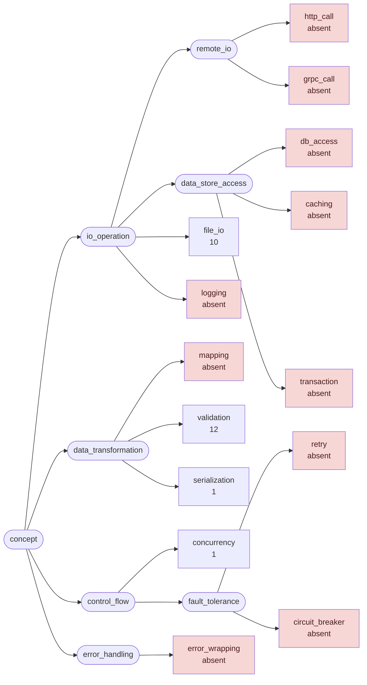
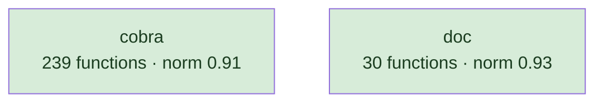
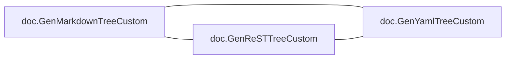
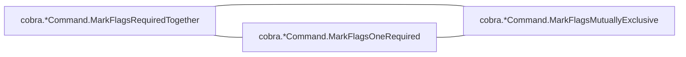
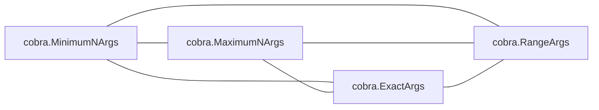
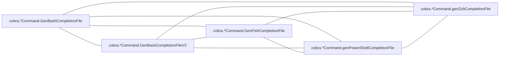
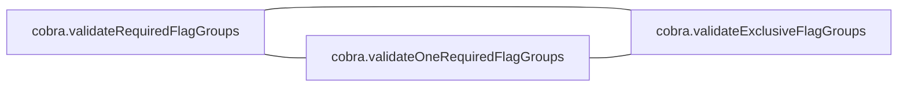

# cobra

CLI framework; one dominant type with a long method set, plus shell-completion generators

**What this rung shows:** the receiver and role signals, and per-shell generator siblings

| | |
|---|---|
| Corpus | [cobra](https://github.com/spf13/cobra) |
| Pinned at | `v1.10.2` (`88b30ab89da2d0d0abb153818746c5a2d30eccec`) |
| Project since | 2015 |
| doppel | `8a7ede0` |
| Command | `doppel analyze . --tests exclude --top 10` |

Run from the corpus root, so every path below is corpus-relative.
Regenerate with `task examples`.

## Run diagnostics

The corpus-level models doppel builds before ranking anything, as printed to stderr:

```
Scanning . ...
Generating concept documents...
Culture: 2 concepts modeled, 15 associations, 0 unusual realizations
Habitats: 2 modeled, 0 misfits; most uniform doc (norm 0.93), most diverse cobra (norm 0.91)
Conventions: strongest validation (0.44), loosest file_io (0.42)
Ecosystems: 125 profiled (125 dominance, 0 coalition, 0 conflict, 0 weak)
Found 269 functions. Retrieving candidates...
Retrieval: shape 193, concept 85, call 712 -> 871 unique pairs
  concept-only 6.4%  call-only 69.8%  suppressed-shape functions: 0  large identity buckets: 0  surviving labels: 1705
Running structural comparison on 871 pairs...
Families: 11 over 26 components, 37 functions in a family
```

# Code Similarity Report

**Functions analyzed:** 269 | **Threshold:** 0.38 | **Pairs found:** 10

---

## What doppel sees

**269 functions** across **2 packages** — test functions excluded. Structural roles: 120 leaf, 63 orchestrator, 36 passthrough, 50 utility.

### Concepts

doppel reads intent from the AST into a fixed vocabulary and reasons over the tree, so two functions that share a *branch* score partial credit rather than nothing. Leaf counts below are this corpus.



**Nothing here is tagged** `caching`, `circuit_breaker`, `db_access`, `error_wrapping`, `grpc_call`, `http_call`, `logging`, `mapping`, `retry`, `transaction`. That is a direct answer to "does this codebase already do X" — for those concepts, it does not.

| Concept | Functions | Convention |
|---|---:|---|
| `validation` | 12 | `0.44` (loose) |
| `file_io` | 10 | `0.42` (loose) |
| `concurrency` | 1 | — |
| `serialization` | 1 | — |

Convention is how uniformly this corpus realizes a concept: `1.00` means every function carrying the tag does it the same way, and a low number means the tag covers several unrelated habits. A concept with fewer than five members is not modeled.

### Where the duplication is

Merge-worthy pairs folded up to their packages. An edge means two packages keep solving the same problem separately; a count on a node means the repetition is inside one package.

### How settled each package is

A package with at least five functions gets a habitat model: doppel learns what is normal there and measures how surprising each member is against it. **Norm** is how uniform the package's practice is. A **misfit** is a function alien to its package *and* to the wider subsystem around it — one that fits its neighbours a directory up is normal for this codebase and is not reported.



Most uniform is `doc` (norm `0.93`); most varied is `cobra` (norm `0.91`).

### How these candidates were found

Three channels propose candidates independently — shared rare *structure*, shared *concepts*, shared *calls* — and their union is what gets compared. This run: **871 candidate pairs** (shape 193, concept 85, call 712), of which 70% arrived on call evidence alone and 6% on concept evidence alone. A pair sharing none of the three is never compared, however alike it looks.

Each function is also an arena where its candidate concepts compete for its evidence. 125 functions reached an equilibrium: **125** settled on a single concept, **0** on a coalition, **0** hold concepts this corpus says do not go together.

### Corpus metrics

**Compression ratio:** `5.51`x — this corpus's canonical function bodies contain **14587 AST nodes** in total, which hash-cons (two nodes count as the same subtree exactly when their kind and every child match, all the way down) to **2649 distinct subtree shapes**; the ratio is nodes divided by shapes, always >= 1.0, and it never feeds any score.

**Nearest-neighbour code-shape:** of **269 functions**, **217** had a code-shape neighbour among the pairs retrieval actually scored — their best score's p50/p90/p99 are `0.49` / `1.00` / `1.00`, and 76% of them (165 of 217) already clear this run's threshold of `0.38`. This is **not an exhaustive nearest-neighbour search** (that would be a full pairwise comparison); it is bounded by the same three retrieval channels the pair list itself is bounded by, so the other 52 functions are excluded here as having no *scored* neighbour, not asserted to have none at all.

---

## Local practice

The vocabulary above says what a concept *is*. This says what one looks like when **this** codebase writes it — learned from the corpus, so it describes the house style rather than a rule from anywhere else.

### How this codebase writes each concept

Only what is **distinctive**. A feature earns a row by being carried by this concept's members at least twice as often as by the corpus at large — nearly every Go function has a `return` and an `if`, so prevalence alone would describe the language rather than this codebase. Weights are how much a channel counts toward whether a member looks normal — calls 40, control flow 20, co-occurring tags 15, role 15, package 10.

**`validation`** — 12 functions

| Channel | Feature | | Members | vs corpus |
|---|---|---|---|---|
| calls ×40 | `cobra.sortedKeys` | `███·······` | 3 of 12 | 22× |
|  | `sort.Strings` | `███·······` | 3 of 12 | 9.6× |
|  | `strings.Join` | `███·······` | 3 of 12 | 8.4× |
|  | `fmt.Errorf` | `████······` | 5 of 12 | 7.5× |
|  | `cobra.*Command.Flags` | `████······` | 5 of 12 | 4.0× |
| flow ×20 | `range` | `█████·····` | 6 of 12 | 2.4× |
| role ×15 | `orchestrator` | `█████·····` | 6 of 12 | 2.1× |

**`file_io`** — 10 functions

| Channel | Feature | | Members | vs corpus |
|---|---|---|---|---|
| calls ×40 | `os.Create` | `█████████·` | 9 of 10 | 27× |
|  | `path/filepath.Join` | `████······` | 4 of 10 | 27× |
|  | `io.WriteString` | `███·······` | 3 of 10 | 27× |
|  | `cobra.*Command.IsAdditionalHelpTopicCommand` | `████······` | 4 of 10 | 9.8× |
|  | `strings.ReplaceAll` | `████······` | 4 of 10 | 9.0× |
| flow ×20 | `defer` | `██████████` | 10 of 10 | 19× |
| package ×10 | `doc` | `████······` | 4 of 10 | 3.6× |

### What travels with what

Co-occurrence measured against chance across every function. Only relationships at least twice — or at most half — as common as chance are reported; near-chance company is not culture. Each kind is listed separately, because there are far more call tokens than concepts and one shared list is all calls. Within a kind, strongest first means lift weighted by how many functions carry it — a 100× relationship holding for three functions is a weaker finding than a 30× one holding for thirty.

**Together more than chance — tag~role**

- 6 of 12 `validation` functions also `orchestrator` — 2.1× chance

**Together more than chance — tag~call**

- 9 of 10 `file_io` functions also `os.Create` — 27× chance
- 4 of 10 `file_io` functions also `path/filepath.Join` — 27× chance
- 3 of 10 `file_io` functions also `io.WriteString` — 27× chance
- 3 of 12 `validation` functions also `cobra.sortedKeys` — 22× chance
- 4 of 10 `file_io` functions also `cobra.*Command.IsAdditionalHelpTopicCommand` — 9.8× chance
- 5 of 12 `validation` functions also `fmt.Errorf` — 7.5× chance
- _8 more not listed_

---

## Match #1 — Code-shape: `0.6492`

| | Location | Function | Signature | Patterns |
|---|---|---|---|---|
| **A** | `doc/md_docs.go:57` | `doc.GenMarkdownCustom` | `(*cobra.Command, io.Writer, func(string) string) (error)` | — |
| **B** | `doc/rest_docs.go:62` | `doc.GenReSTCustom` | `(*cobra.Command, io.Writer, func(string, string) string) (error)` | — |

**Explain:** differs by two extra assign, 11 extra call, 10 extra literal, and 4 more kinds

**Code similarity:** `wl 0.52  flow 1.00  nesting 1.00  sig 0.60  size 0.86`

**Containment:** `0.74`

**Evidence:** `996.71` (shape 938.74, concept 0.00, call 57.97)

**Trophic:** `0.82`

**Shared structure:**

- `25.57` — `depth-1 EXPRSTMT` ×8
- `22.71` — `depth-0 CALL` ×8
- `18.84` — `depth-0 BIN` ×10

**Structural overlap:** `0.63` (merge-worthy)

- share 25 callees: [Format, buf.WriteString, buf.WriteTo, byName, child.IsAdditionalHelpTopicCommand, child.IsAvailableCommand, child.Name, cmd.CommandPath, cmd.Commands, cmd.HasParent, cmd.InitDefaultHelpCmd, cmd.InitDefaultHelpFlag, cmd.Parent, cmd.Runnable, cmd.UseLine, cmd.VisitParents, fmt.Fprintf, hasSeeAlso, len, linkHandler, new, parent.CommandPath, sort.Sort, strings.ReplaceAll, time.Now]
- overlapping call-graph neighborhoods (0.95): 87 shared
- both are passthrough functions
- same package
- callers do related work (1.00): [file_io]
- same visibility
- same receiver type: plain functions
- called from same packages: [doc]
- call into same packages: [cobra, doc]

---

## Match #2 — Code-shape: `1.0000`

| | Location | Function | Signature | Patterns |
|---|---|---|---|---|
| **A** | `flag_groups.go:33` | `cobra.*Command.MarkFlagsRequiredTogether` | `(...string)` | validation |
| **B** | `flag_groups.go:49` | `cobra.*Command.MarkFlagsOneRequired` | `(...string)` | validation |

**Explain:** identical after rename, commutative-reorder

**Profile A:** `validation` 1.00 (dominance)

**Profile B:** `validation` 1.00 (dominance)

**Code similarity:** `wl 1.00  flow 1.00  nesting 1.00  sig 1.00  size 1.00`

**Containment:** `1.00`

**Evidence:** `290.10` (shape 278.15, concept 1.07, call 10.87)

**Trophic:** `1.00`

**Shared structure:**

- `7.06` — `depth-2 BLOCK` ×2
- `6.70` — `depth-1 EXPRSTMT` ×2
- `6.70` — `depth-0 CALL` ×2

**Structural overlap:** `0.76` (merge-worthy)

- share 8 callees: [Lookup, SetAnnotation, append, c.Flags, c.mergePersistentFlags, fmt.Sprintf, panic, strings.Join]
- overlapping call-graph neighborhoods (1.00): 34 shared
- share patterns: [validation]
- both are orchestrator functions
- same package
- same visibility
- same receiver type: Command
- call into same packages: [cobra]

---

## Match #3 — Code-shape: `0.7643`

| | Location | Function | Signature | Patterns |
|---|---|---|---|---|
| **A** | `doc/rest_docs.go:145` | `doc.GenReSTTreeCustom` | `(*cobra.Command, string, func(string) string, func(string, string) string) (error)` | file_io |
| **B** | `doc/yaml_docs.go:60` | `doc.GenYamlTreeCustom` | `(*cobra.Command, string, func(string) string, func(string) string) (error)` | file_io |

**Explain:** differs by four extra call

**Profile A:** `file_io` 1.00 (dominance)

**Profile B:** `file_io` 1.00 (dominance)

**Code similarity:** `wl 0.66  flow 1.00  nesting 1.00  sig 0.80  size 1.00`

**Containment:** `0.79`

**Evidence:** `339.75` (shape 311.73, concept 1.24, call 26.78)

**Trophic:** `0.94`

**Shared structure:**

- `6.93` — `depth-1 IF` ×3
- `6.46` — `depth-3 BIN` ×4
- `6.46` — `depth-2 BIN` ×4

**Structural overlap:** `0.74` (merge-worthy)

- share 10 callees: [c.IsAdditionalHelpTopicCommand, c.IsAvailableCommand, cmd.CommandPath, cmd.Commands, f.Close, filePrepender, filepath.Join, io.WriteString, os.Create, strings.ReplaceAll]
- overlapping call-graph neighborhoods (0.83): 35 shared
- share patterns: [file_io]
- both are orchestrator functions
- same package
- same visibility
- same receiver type: plain functions
- called from same packages: [doc]
- call into same packages: [cobra, doc]

---

## Match #4 — Code-shape: `1.0000`

| | Location | Function | Signature | Patterns |
|---|---|---|---|---|
| **A** | `flag_groups.go:33` | `cobra.*Command.MarkFlagsRequiredTogether` | `(...string)` | validation |
| **B** | `flag_groups.go:65` | `cobra.*Command.MarkFlagsMutuallyExclusive` | `(...string)` | — |

**Explain:** identical after rename, commutative-reorder

**Profile A:** `validation` 1.00 (dominance)

**Code similarity:** `wl 1.00  flow 1.00  nesting 1.00  sig 1.00  size 1.00`

**Containment:** `1.00`

**Evidence:** `289.03` (shape 278.15, concept 0.00, call 10.87)

**Trophic:** `1.00`

**Shared structure:**

- `7.06` — `depth-2 BLOCK` ×2
- `6.70` — `depth-1 EXPRSTMT` ×2
- `6.70` — `depth-0 CALL` ×2

**Structural overlap:** `0.58` (merge-worthy)

- share 8 callees: [Lookup, SetAnnotation, append, c.Flags, c.mergePersistentFlags, fmt.Sprintf, panic, strings.Join]
- overlapping call-graph neighborhoods (1.00): 34 shared
- both are orchestrator functions
- same package
- same visibility
- same receiver type: Command
- call into same packages: [cobra]

---

## Match #5 — Code-shape: `1.0000`

| | Location | Function | Signature | Patterns |
|---|---|---|---|---|
| **A** | `flag_groups.go:49` | `cobra.*Command.MarkFlagsOneRequired` | `(...string)` | validation |
| **B** | `flag_groups.go:65` | `cobra.*Command.MarkFlagsMutuallyExclusive` | `(...string)` | — |

**Explain:** identical after rename, commutative-reorder

**Profile A:** `validation` 1.00 (dominance)

**Code similarity:** `wl 1.00  flow 1.00  nesting 1.00  sig 1.00  size 1.00`

**Containment:** `1.00`

**Evidence:** `289.03` (shape 278.15, concept 0.00, call 10.87)

**Trophic:** `1.00`

**Shared structure:**

- `7.06` — `depth-2 BLOCK` ×2
- `6.70` — `depth-1 EXPRSTMT` ×2
- `6.70` — `depth-0 CALL` ×2

**Structural overlap:** `0.58` (merge-worthy)

- share 8 callees: [Lookup, SetAnnotation, append, c.Flags, c.mergePersistentFlags, fmt.Sprintf, panic, strings.Join]
- overlapping call-graph neighborhoods (1.00): 34 shared
- both are orchestrator functions
- same package
- same visibility
- same receiver type: Command
- call into same packages: [cobra]

---

## Match #6 — Code-shape: `0.7505`

| | Location | Function | Signature | Patterns |
|---|---|---|---|---|
| **A** | `doc/md_docs.go:133` | `doc.GenMarkdownTreeCustom` | `(*cobra.Command, string, func(string) string, func(string) string) (error)` | file_io |
| **B** | `doc/yaml_docs.go:60` | `doc.GenYamlTreeCustom` | `(*cobra.Command, string, func(string) string, func(string) string) (error)` | file_io |

**Explain:** differs by four extra call, one extra literal, one extra ident

**Profile A:** `file_io` 1.00 (dominance)

**Profile B:** `file_io` 1.00 (dominance)

**Code similarity:** `wl 0.58  flow 1.00  nesting 1.00  sig 1.00  size 1.00`

**Containment:** `0.74`

**Evidence:** `317.51` (shape 289.49, concept 1.24, call 26.78)

**Trophic:** `0.90`

**Shared structure:**

- `6.93` — `depth-1 IF` ×3
- `6.46` — `depth-3 BIN` ×4
- `6.46` — `depth-2 BIN` ×4

**Structural overlap:** `0.74` (merge-worthy)

- share 10 callees: [c.IsAdditionalHelpTopicCommand, c.IsAvailableCommand, cmd.CommandPath, cmd.Commands, f.Close, filePrepender, filepath.Join, io.WriteString, os.Create, strings.ReplaceAll]
- overlapping call-graph neighborhoods (0.83): 35 shared
- share patterns: [file_io]
- both are orchestrator functions
- same package
- same visibility
- same receiver type: plain functions
- called from same packages: [doc]
- call into same packages: [cobra, doc]

---

## Match #7 — Code-shape: `0.7216`

| | Location | Function | Signature | Patterns |
|---|---|---|---|---|
| **A** | `doc/md_docs.go:133` | `doc.GenMarkdownTreeCustom` | `(*cobra.Command, string, func(string) string, func(string) string) (error)` | file_io |
| **B** | `doc/rest_docs.go:145` | `doc.GenReSTTreeCustom` | `(*cobra.Command, string, func(string) string, func(string, string) string) (error)` | file_io |

**Explain:** differs by four extra call, one extra literal, one extra ident

**Profile A:** `file_io` 1.00 (dominance)

**Profile B:** `file_io` 1.00 (dominance)

**Code similarity:** `wl 0.59  flow 1.00  nesting 1.00  sig 0.80  size 1.00`

**Containment:** `0.74`

**Evidence:** `317.51` (shape 289.49, concept 1.24, call 26.78)

**Trophic:** `0.90`

**Shared structure:**

- `6.93` — `depth-1 IF` ×3
- `6.46` — `depth-3 BIN` ×4
- `6.46` — `depth-2 BIN` ×4

**Structural overlap:** `0.74` (merge-worthy)

- share 10 callees: [c.IsAdditionalHelpTopicCommand, c.IsAvailableCommand, cmd.CommandPath, cmd.Commands, f.Close, filePrepender, filepath.Join, io.WriteString, os.Create, strings.ReplaceAll]
- overlapping call-graph neighborhoods (0.90): 36 shared
- share patterns: [file_io]
- both are orchestrator functions
- same package
- same visibility
- same receiver type: plain functions
- called from same packages: [doc]
- call into same packages: [cobra, doc]

---

## Match #8 — Code-shape: `0.8043`

| | Location | Function | Signature | Patterns |
|---|---|---|---|---|
| **A** | `doc/md_docs.go:32` | `doc.printOptions` | `(*bytes.Buffer, *cobra.Command, string) (error)` | — |
| **B** | `doc/rest_docs.go:30` | `doc.printOptionsReST` | `(*bytes.Buffer, *cobra.Command, string) (error)` | — |

**Explain:** differs by two extra call, two extra literal, two extra selector, and 2 more kinds

**Code similarity:** `wl 0.67  flow 1.00  nesting 1.00  sig 1.00  size 0.86`

**Containment:** `0.87`

**Evidence:** `317.81` (shape 303.93, concept 0.00, call 13.88)

**Trophic:** `0.91`

**Shared structure:**

- `13.40` — `depth-3 CALL` ×4
- `13.40` — `depth-3 EXPRSTMT` ×4
- `13.40` — `depth-2 EXPRSTMT` ×4

**Structural overlap:** `0.60` (merge-worthy)

- share 9 callees: [buf.WriteString, cmd.InheritedFlags, cmd.NonInheritedFlags, flags.HasAvailableFlags, flags.PrintDefaults, flags.SetOutput, parentFlags.HasAvailableFlags, parentFlags.PrintDefaults, parentFlags.SetOutput]
- overlapping call-graph neighborhoods (0.90): 36 shared
- both are orchestrator functions
- same package
- same visibility
- same receiver type: plain functions
- called from same packages: [doc]
- call into same packages: [cobra]

---

## Match #9 — Code-shape: `0.6023`

| | Location | Function | Signature | Patterns |
|---|---|---|---|---|
| **A** | `command.go:674` | `cobra.stripFlags` | `([]string, *Command) ([]string)` | — |
| **B** | `command.go:715` | `cobra.*Command.argsMinusFirstX` | `([]string, string) ([]string)` | — |

**Explain:** differs by two extra assign, two extra increment, one extra branch, and 6 more kinds

**Code similarity:** `wl 0.47  flow 0.98  nesting 0.97  sig 0.50  size 0.94`

**Containment:** `0.66`

**Evidence:** `510.05` (shape 488.74, concept 0.00, call 21.31)

**Trophic:** `0.76`

**Shared structure:**

- `13.40` — `depth-0 CASE` ×4
- `11.78` — `depth-0 SLICE` ×4
- `11.27` — `depth-3 CALL` ×3

**Structural overlap:** `0.65` (merge-worthy)

- share 8 callees: [append, c.Flags, c.mergePersistentFlags, hasNoOptDefVal, len, shortHasNoOptDefVal, strings.Contains, strings.HasPrefix]
- share 1 callers: [cobra.*Command.Find]
- overlapping call-graph neighborhoods (1.00): 42 shared
- both are orchestrator functions
- same package
- same visibility
- called from same packages: [cobra]
- call into same packages: [cobra]

---

## Match #10 — Code-shape: `0.7603`

| | Location | Function | Signature | Patterns |
|---|---|---|---|---|
| **A** | `flag_groups.go:167` | `cobra.validateOneRequiredFlagGroups` | `(map[string]map[string]bool) (error)` | validation |
| **B** | `flag_groups.go:188` | `cobra.validateExclusiveFlagGroups` | `(map[string]map[string]bool) (error)` | validation |

**Explain:** differs by four extra binary, one extra call, one extra literal, and 1 more kind

**Profile A:** `validation` 1.00 (dominance)

**Profile B:** `validation` 1.00 (dominance)

**Code similarity:** `wl 0.60  flow 1.00  nesting 1.00  sig 1.00  size 0.89`

**Containment:** `0.79`

**Evidence:** `225.56` (shape 213.46, concept 1.07, call 11.03)

**Trophic:** `0.82`

**Shared structure:**

- `4.45` — `depth-3 IF`
- `4.45` — `depth-3 BLOCK`
- `4.45` — `depth-3 BLOCK`

**Structural overlap:** `0.95` (merge-worthy)

- share 5 callees: [append, fmt.Errorf, len, sort.Strings, sortedKeys]
- share 1 callers: [cobra.*Command.ValidateFlagGroups]
- overlapping call-graph neighborhoods (1.00): 6 shared
- share patterns: [validation]
- both are leaf functions
- same package
- callers do related work (1.00): [validation]
- same visibility
- same receiver type: plain functions
- called from same packages: [cobra]
- call into same packages: [cobra]

---

## Families

11 families, 37 functions in a family, largest 5 members

### Family 1 — 3 members, every pair `>= 0.72` code-shape, evidence `975`



| Location | Function | Signature | Patterns |
|---|---|---|---|
| `doc/md_docs.go:133` | `doc.GenMarkdownTreeCustom` | `(*cobra.Command, string, func(string) string, func(string) string) (error)` | file_io |
| `doc/rest_docs.go:145` | `doc.GenReSTTreeCustom` | `(*cobra.Command, string, func(string) string, func(string, string) string) (error)` | file_io |
| `doc/yaml_docs.go:60` | `doc.GenYamlTreeCustom` | `(*cobra.Command, string, func(string) string, func(string) string) (error)` | file_io |

### Family 2 — 3 members, every pair `>= 1.00` code-shape, evidence `868`



| Location | Function | Signature | Patterns |
|---|---|---|---|
| `flag_groups.go:33` | `cobra.*Command.MarkFlagsRequiredTogether` | `(...string)` | validation |
| `flag_groups.go:49` | `cobra.*Command.MarkFlagsOneRequired` | `(...string)` | validation |
| `flag_groups.go:65` | `cobra.*Command.MarkFlagsMutuallyExclusive` | `(...string)` | — |

### Family 3 — 4 members, every pair `>= 0.65` code-shape, evidence `792`



| Location | Function | Signature | Patterns |
|---|---|---|---|
| `args.go:74` | `cobra.MinimumNArgs` | `(int) (PositionalArgs)` | — |
| `args.go:84` | `cobra.MaximumNArgs` | `(int) (PositionalArgs)` | — |
| `args.go:94` | `cobra.ExactArgs` | `(int) (PositionalArgs)` | — |
| `args.go:104` | `cobra.RangeArgs` | `(int, int) (PositionalArgs)` | — |

### Family 4 — 5 members, every pair `>= 0.62` code-shape, evidence `655`



| Location | Function | Signature | Patterns |
|---|---|---|---|
| `bash_completions.go:701` | `cobra.*Command.GenBashCompletionFile` | `(string) (error)` | file_io |
| `bash_completionsV2.go:470` | `cobra.*Command.GenBashCompletionFileV2` | `(string, bool) (error)` | file_io |
| `fish_completions.go:284` | `cobra.*Command.GenFishCompletionFile` | `(string, bool) (error)` | file_io |
| `powershell_completions.go:320` | `cobra.*Command.genPowerShellCompletionFile` | `(string, bool) (error)` | file_io |
| `zsh_completions.go:70` | `cobra.*Command.genZshCompletionFile` | `(string, bool) (error)` | file_io |

### Family 5 — 3 members, every pair `>= 0.61` code-shape, evidence `587`



| Location | Function | Signature | Patterns |
|---|---|---|---|
| `flag_groups.go:144` | `cobra.validateRequiredFlagGroups` | `(map[string]map[string]bool) (error)` | validation |
| `flag_groups.go:167` | `cobra.validateOneRequiredFlagGroups` | `(map[string]map[string]bool) (error)` | validation |
| `flag_groups.go:188` | `cobra.validateExclusiveFlagGroups` | `(map[string]map[string]bool) (error)` | validation |

_6 more families not listed._

