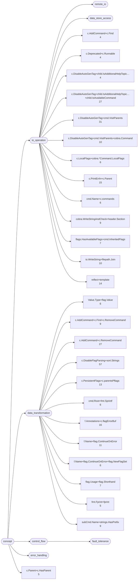
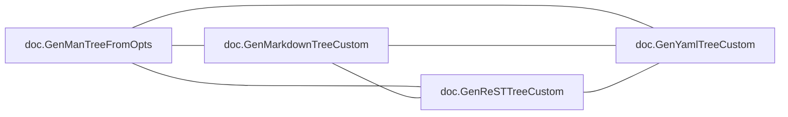
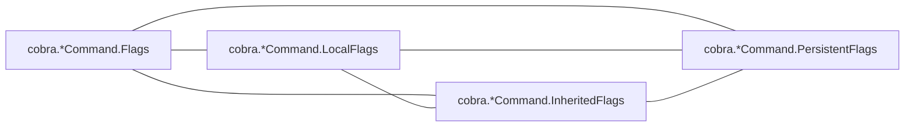
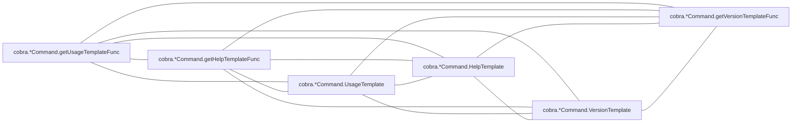
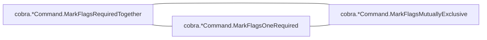
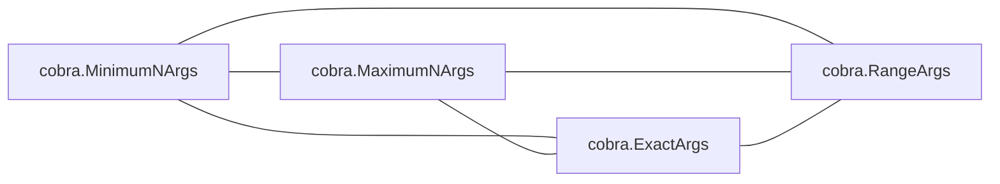

# cobra

CLI framework; one dominant type with a long method set, plus shell-completion generators

**What this rung shows:** the receiver and role signals, and per-shell generator siblings

| | |
|---|---|
| Corpus | [cobra](https://github.com/spf13/cobra) |
| Pinned at | `v1.10.2` (`88b30ab89da2d0d0abb153818746c5a2d30eccec`) |
| Project since | 2015 |
| doppel | `95071c4` |
| Command | `doppel analyze . --tests exclude --top 10` |

Run from the corpus root, so every path below is corpus-relative.
Regenerate with `task examples`.

## Run diagnostics

The corpus-level models doppel builds before ranking anything, as printed to stderr:

```
Scanning . ...
Learning concept vocabulary...
Lexicon: 26 concepts (2 seeded, 24 emergent), 992/2492 features above 98 df, 121 functions unlabeled
Generating concept documents...
Culture: 23 concepts modeled, 334 associations, 6 unusual realizations
Habitats: 2 modeled, 0 misfits; most uniform doc (norm 0.94), most diverse cobra (norm 0.91)
Conventions: strongest c.PrintErrln+c.Parent (0.64), loosest c.PersistentFlags+c.parentsPflags (0.21)
Ecosystems: 210 profiled (161 dominance, 49 coalition, 0 conflict, 0 weak)
Calibration: rate 0.01 over 13695 shape / 20000 overlap null pairs -> threshold 0.44, struct-min 0.51, family-min 0.44
Found 269 functions. Retrieving candidates...
Retrieval: shape 132, concept 608, call 712 -> 1152 unique pairs
  concept-only 32.1%  call-only 41.7%  suppressed-shape functions: 0  large identity buckets: 0  surviving labels: 1696
Running structural comparison on 1152 pairs...
  206 pairs remain after struct-min=0.51 filter
Families: 14 over 42 components, 49 functions in a family, 6 edges completed
```

# Code Similarity Report

**Functions analyzed:** 269 | **Threshold:** 0.60 | **Pairs found:** 10

---

## What doppel sees

**269 functions** across **2 packages** — test functions excluded. Structural roles: 120 leaf, 63 orchestrator, 36 passthrough, 50 utility.

### Concepts

These concepts were **learned from this corpus**, not read off a fixed list: each one is a group of functions that share a way of being written, named after the evidence that identified it. They hang from an authored interior, so two functions under the same *branch* score partial credit rather than nothing. Counts below are members; membership is graded, and a function can carry several.



**No practice here for** `caching`, `circuit_breaker`, `concurrency`, `db_access`, `error_wrapping`, `grpc_call`, `http_call`, `logging`, `mapping`, `retry`, `serialization`, `transaction`. Concepts are learned from this corpus, so one can never be absent — it exists because functions carry it. These are the *seeds* the search started from that grew nothing: a direct answer to "does this codebase already do X".

| Concept | Functions | Convention |
|---|---:|---|
| `c.DisableFlagParsing+sort.Strings` | 57 | `0.44` (loose) |
| `c.DisableAutoGenTag+cmd.VisitParents` | 31 | `0.29` (loose) |
| `c.AddCommand+c.RemoveCommand` | 27 | `0.42` (loose) |
| `c.DisableAutoGenTag+child.IsAdditionalHelpTopic…+child.IsAvailableCommand` | 27 | `0.33` (loose) |
| `f.Annotations+c.flagErrorBuf` | 16 | `0.26` (loose) |
| `c.PrintErrln+c.Parent` | 15 | `0.64` (settled) |
| `reflect+template` | 14 | `0.49` (loose) |
| `c.PersistentFlags+c.parentsPflags` | 13 | `0.21` (loose) |
| `f.Name+flag.ContinueOnError` | 11 | `0.41` (loose) |
| `c.DisableAutoGenTag+cmd.VisitParents+cobra.Command` | 10 | `0.25` (loose) |
| `io.WriteString+filepath.Join` | 10 | `0.26` (loose) |
| `c.AddCommand+c.Find+c.RemoveCommand` | 9 | `0.37` (loose) |
| `cobra.WriteStringAndCheck+header.Section` | 9 | `0.30` (loose) |
| `subCmd.Name+strings.HasPrefix` | 9 | `0.37` (loose) |
| `flag.Usage+flag.Shorthand` | 7 | `0.25` (loose) |
| `flags.HasAvailableFlags+cmd.InheritedFlags` | 7 | `0.38` (loose) |
| `Value.Type+flag.Value` | 6 | `0.33` (loose) |
| `c.LocalFlags+cobra.*Command.LocalFlags` | 6 | `0.42` (loose) |
| `cmd.Name+c.commands` | 6 | `0.39` (loose) |
| `cmd.Root+fmt.Sprintf` | 6 | `0.41` (loose) |
| `f.Name+flag.ContinueOnError+flag.NewFlagSet` | 6 | `0.61` (settled) |
| `c.Parent+c.HasParent` | 5 | `0.58` (settled) |
| `fmt.Fprint+fprint` | 5 | `0.29` (loose) |
| `c.AddCommand+c.Find` | 4 | — |
| `c.Deprecated+c.Runnable` | 4 | — |
| `c.DisableAutoGenTag+child.IsAdditionalHelpTopic…` | 4 | — |

Convention is how uniformly this corpus realizes a concept: `1.00` means every function carrying the tag does it the same way, and a low number means the tag covers several unrelated habits. A concept with fewer than five members is not modeled.

### Where the duplication is

Merge-worthy pairs folded up to their packages. An edge means two packages keep solving the same problem separately; a count on a node means the repetition is inside one package.

### How settled each package is

A package with at least five functions gets a habitat model: doppel learns what is normal there and measures how surprising each member is against it. **Norm** is how uniform the package's practice is. A **misfit** is a function alien to its package *and* to the wider subsystem around it — one that fits its neighbours a directory up is normal for this codebase and is not reported.


Most uniform is `doc` (norm `0.94`); most varied is `cobra` (norm `0.91`).

### How these candidates were found

Three channels propose candidates independently — shared rare *structure*, shared *concepts*, shared *calls* — and their union is what gets compared. This run: **1152 candidate pairs** (shape 132, concept 608, call 712), of which 42% arrived on call evidence alone and 32% on concept evidence alone. A pair sharing none of the three is never compared, however alike it looks.

Each function is also an arena where its candidate concepts compete for its evidence. 210 functions reached an equilibrium: **161** settled on a single concept, **49** on a coalition, **0** hold concepts this corpus says do not go together.

### Corpus metrics

**Compression ratio:** `5.51`x — this corpus's canonical function bodies contain **14587 AST nodes** in total, which hash-cons (two nodes count as the same subtree exactly when their kind and every child match, all the way down) to **2649 distinct subtree shapes**; the ratio is nodes divided by shapes, always >= 1.0, and it never feeds any score.

**Nearest-neighbour code-shape:** of **269 functions**, **223** had a code-shape neighbour among the pairs retrieval actually scored — their best score's p50/p90/p99 are `0.49` / `1.00` / `1.00`, and 60% of them (134 of 223) already clear this run's threshold of `0.44`. This is **not an exhaustive nearest-neighbour search** (that would be a full pairwise comparison); it is bounded by the same three retrieval channels the pair list itself is bounded by, so the other 46 functions are excluded here as having no *scored* neighbour, not asserted to have none at all.

---

## Local practice

The vocabulary above says what a concept *is*. This says what one looks like when **this** codebase writes it — learned from the corpus, so it describes the house style rather than a rule from anywhere else.

### How this codebase writes each concept

Only what is **distinctive**. A feature earns a row by being carried by this concept's members at least twice as often as by the corpus at large — nearly every Go function has a `return` and an `if`, so prevalence alone would describe the language rather than this codebase. Weights are how much a channel counts toward whether a member looks normal — calls 40, control flow 20, co-occurring tags 15, role 15, package 10.

**`c.DisableFlagParsing+sort.Strings`** — 57 functions

| Channel | Feature | | Members | vs corpus |
|---|---|---|---|---|
| calls ×40 | `fmt.Errorf` | `███·······` | 15 of 57 | 4.7× |
|  | `cobra.*Command.Flags` | `███·······` | 18 of 57 | 3.0× |
|  | `fmt.Sprintf` | `███·······` | 17 of 57 | 2.2× |
|  | `cobra.*Command.Name` | `███·······` | 15 of 57 | 2.0× |
| flow ×20 | `funclit` | `███·······` | 18 of 57 | 2.4× |
|  | `range` | `█████·····` | 27 of 57 | 2.3× |

**`c.DisableAutoGenTag+cmd.VisitParents`** — 31 functions

| Channel | Feature | | Members | vs corpus |
|---|---|---|---|---|
| calls ×40 | `cobra.*Command.Commands` | `█████·····` | 14 of 31 | 8.7× |
|  | `cobra.*Command.IsAdditionalHelpTopicCommand` | `███·······` | 10 of 31 | 7.9× |
|  | `cobra.*Command.IsAvailableCommand` | `█████·····` | 14 of 31 | 7.1× |
|  | `cobra.*Command.CommandPath` | `████······` | 13 of 31 | 5.9× |
|  | `strings.ReplaceAll` | `███·······` | 8 of 31 | 5.8× |
| flow ×20 | `range` | `█████·····` | 17 of 31 | 2.6× |
|  | `funclit` | `███·······` | 10 of 31 | 2.4× |
| cotags ×15 | `c.DisableAutoGenTag+cmd.VisitParents+cobra.Command` | `███·······` | 10 of 31 | 8.7× |
|  | `c.DisableAutoGenTag+child.IsAdditionalHelpTopic…+child.IsAvailableCommand` | `███████···` | 22 of 31 | 7.1× |
| role ×15 | `passthrough` | `█████·····` | 15 of 31 | 3.6× |
|  | `orchestrator` | `█████·····` | 16 of 31 | 2.2× |
| package ×10 | `doc` | `███·······` | 10 of 31 | 2.9× |

**`c.AddCommand+c.RemoveCommand`** — 27 functions

| Channel | Feature | | Members | vs corpus |
|---|---|---|---|---|
| calls ×40 | `strings.HasPrefix` | `███·······` | 9 of 27 | 9.0× |
|  | `cobra.*Command.Name` | `████······` | 10 of 27 | 2.8× |
|  | `fmt.Sprintf` | `████······` | 10 of 27 | 2.7× |
|  | `cobra.*Command.Flags` | `███·······` | 7 of 27 | 2.5× |
| cotags ×15 | `subCmd.Name+strings.HasPrefix` | `███·······` | 9 of 27 | 10.0× |
|  | `c.AddCommand+c.Find+c.RemoveCommand` | `███·······` | 7 of 27 | 7.7× |
|  | `c.DisableFlagParsing+sort.Strings` | `█████·····` | 13 of 27 | 2.3× |
| role ×15 | `orchestrator` | `█████·····` | 13 of 27 | 2.1× |

**`c.DisableAutoGenTag+child.IsAdditionalHelpTopic…+child.IsAvailableCommand`** — 27 functions

| Channel | Feature | | Members | vs corpus |
|---|---|---|---|---|
| calls ×40 | `cobra.*Command.Commands` | `█████·····` | 14 of 27 | 10.0× |
|  | `cobra.*Command.InitDefaultHelpFlag` | `███·······` | 7 of 27 | 10.0× |
|  | `cobra.*Command.IsAdditionalHelpTopicCommand` | `████······` | 10 of 27 | 9.1× |
|  | `cobra.*Command.Runnable` | `███·······` | 7 of 27 | 8.7× |
|  | `cobra.*Command.IsAvailableCommand` | `█████·····` | 14 of 27 | 8.2× |
| flow ×20 | `range` | `███████···` | 19 of 27 | 3.4× |
|  | `funclit` | `███·······` | 8 of 27 | 2.2× |
| cotags ×15 | `cobra.WriteStringAndCheck+header.Section` | `███·······` | 7 of 27 | 7.7× |
|  | `c.DisableAutoGenTag+cmd.VisitParents` | `████████··` | 22 of 27 | 7.1× |
| role ×15 | `passthrough` | `███·······` | 9 of 27 | 2.5× |
|  | `orchestrator` | `██████····` | 15 of 27 | 2.4× |
| package ×10 | `doc` | `████······` | 12 of 27 | 4.0× |

**`f.Annotations+c.flagErrorBuf`** — 16 functions

| Channel | Feature | | Members | vs corpus |
|---|---|---|---|---|
| calls ×40 | `github.com/spf13/pflag.NewFlagSet` | `████······` | 7 of 16 | 17× |
|  | `cobra.*Command.SetOutput` | `████······` | 6 of 16 | 13× |
|  | `cobra.*Command.mergePersistentFlags` | `██████····` | 9 of 16 | 13× |
|  | `cobra.*Command.DisplayName` | `██████····` | 9 of 16 | 12× |
|  | `strings.Join` | `███·······` | 5 of 16 | 11× |
| flow ×20 | `funclit` | `████······` | 7 of 16 | 3.3× |
| cotags ×15 | `f.Name+flag.ContinueOnError+flag.NewFlagSet` | `████······` | 6 of 16 | 17× |
|  | `f.Name+flag.ContinueOnError` | `██████····` | 10 of 16 | 15× |
|  | `c.PersistentFlags+c.parentsPflags` | `████······` | 7 of 16 | 9.1× |
|  | `c.DisableAutoGenTag+cmd.VisitParents` | `████······` | 6 of 16 | 3.3× |
|  | `c.DisableFlagParsing+sort.Strings` | `██████····` | 9 of 16 | 2.7× |
| role ×15 | `passthrough` | `██████····` | 9 of 16 | 4.2× |

**`c.PrintErrln+c.Parent`** — 15 functions

| Channel | Feature | | Members | vs corpus |
|---|---|---|---|---|
| calls ×40 | `cobra.*Command.HasParent` | `██████████` | 15 of 15 | 11× |
|  | `cobra.*Command.Parent` | `███·······` | 4 of 15 | 6.5× |
| cotags ×15 | `c.Parent+c.HasParent` | `███·······` | 4 of 15 | 14× |

_17 further concepts are modeled and not described._

### Which concepts share a function

`++` at least four times chance, `+` at least twice, `−` at most half, `never` not once. A blank cell is ordinary company — near chance, which is not culture.

| | `Value.Type+flag.Value` | `c.AddCommand+c.Find` | `c.AddCommand+c.Find+c.RemoveCommand` | `c.AddCommand+c.RemoveCommand` | `c.Deprecated+c.Runnable` | `c.DisableAutoGenTag+child.IsAdditionalHelpTopic…` | `c.DisableAutoGenTag+child.IsAdditionalHelpTopic…+child.IsAvailableCommand` | `c.DisableAutoGenTag+cmd.VisitParents` | `c.DisableAutoGenTag+cmd.VisitParents+cobra.Command` | `c.DisableFlagParsing+sort.Strings` | `c.LocalFlags+cobra.*Command.LocalFlags` | `c.Parent+c.HasParent` | `c.PersistentFlags+c.parentsPflags` | `c.PrintErrln+c.Parent` | `cmd.Name+c.commands` | `cmd.Root+fmt.Sprintf` | `cobra.WriteStringAndCheck+header.Section` | `f.Annotations+c.flagErrorBuf` | `f.Name+flag.ContinueOnError` | `f.Name+flag.ContinueOnError+flag.NewFlagSet` | `flag.Usage+flag.Shorthand` | `flags.HasAvailableFlags+cmd.InheritedFlags` | `fmt.Fprint+fprint` | `io.WriteString+filepath.Join` | `reflect+template` |
|---|---|---|---|---|---|---|---|---|---|---|---|---|---|---|---|---|---|---|---|---|---|---|---|---|---|
| **`c.AddCommand+c.Find`** |  | | | | | | | | | | | | | | | | | | | | | | | | |
| **`c.AddCommand+c.Find+c.RemoveCommand`** |  | ++ | | | | | | | | | | | | | | | | | | | | | | | |
| **`c.AddCommand+c.RemoveCommand`** |  | ++ | ++ | | | | | | | | | | | | | | | | | | | | | | |
| **`c.Deprecated+c.Runnable`** |  |  |  |  | | | | | | | | | | | | | | | | | | | | | |
| **`c.DisableAutoGenTag+child.IsAdditionalHelpTopic…`** |  |  |  |  |  | | | | | | | | | | | | | | | | | | | | |
| **`c.DisableAutoGenTag+child.IsAdditionalHelpTopic…+child.IsAvailableCommand`** |  | ++ | ++ | + | ++ | ++ | | | | | | | | | | | | | | | | | | | |
| **`c.DisableAutoGenTag+cmd.VisitParents`** |  | ++ | ++ |  |  | ++ | ++ | | | | | | | | | | | | | | | | | | |
| **`c.DisableAutoGenTag+cmd.VisitParents+cobra.Command`** |  |  |  |  |  | ++ | ++ | ++ | | | | | | | | | | | | | | | | | |
| **`c.DisableFlagParsing+sort.Strings`** | + | + | + | + |  | + |  |  |  | | | | | | | | | | | | | | | | |
| **`c.LocalFlags+cobra.*Command.LocalFlags`** |  |  |  |  |  |  |  |  |  |  | | | | | | | | | | | | | | | |
| **`c.Parent+c.HasParent`** |  |  |  |  |  |  |  |  |  |  |  | | | | | | | | | | | | | | |
| **`c.PersistentFlags+c.parentsPflags`** |  |  |  |  |  |  |  | + |  |  |  |  | | | | | | | | | | | | | |
| **`c.PrintErrln+c.Parent`** |  |  |  |  |  |  |  |  |  | never |  | ++ |  | | | | | | | | | | | | |
| **`cmd.Name+c.commands`** |  |  |  |  |  |  |  |  |  | + |  |  |  |  | | | | | | | | | | | |
| **`cmd.Root+fmt.Sprintf`** |  |  | ++ |  |  |  |  |  |  | + |  |  |  |  |  | | | | | | | | | | |
| **`cobra.WriteStringAndCheck+header.Section`** |  |  |  |  |  | ++ | ++ | ++ | ++ | + |  |  |  |  |  |  | | | | | | | | | |
| **`f.Annotations+c.flagErrorBuf`** |  |  |  |  |  |  |  | + |  | + |  |  | ++ |  |  |  |  | | | | | | | | |
| **`f.Name+flag.ContinueOnError`** |  |  |  |  |  |  |  | ++ |  |  |  |  | ++ |  |  |  |  | ++ | | | | | | | |
| **`f.Name+flag.ContinueOnError+flag.NewFlagSet`** |  |  |  |  |  |  |  | ++ |  |  |  |  | ++ |  |  |  |  | ++ | ++ | | | | | | |
| **`flag.Usage+flag.Shorthand`** | ++ |  |  |  |  |  |  |  |  | + |  |  |  |  |  |  |  |  |  |  | | | | | |
| **`flags.HasAvailableFlags+cmd.InheritedFlags`** | ++ |  |  |  |  |  |  |  |  | + |  |  |  |  |  |  |  |  |  |  |  | | | | |
| **`fmt.Fprint+fprint`** |  |  |  |  |  |  |  |  |  |  |  |  |  |  |  |  |  |  |  |  |  |  | | | |
| **`io.WriteString+filepath.Join`** |  |  |  |  |  |  | ++ | ++ |  |  |  |  |  |  |  |  | ++ |  |  |  |  |  |  | | |
| **`reflect+template`** |  |  |  |  |  |  |  |  |  |  |  |  |  |  |  |  |  |  |  |  |  |  |  |  | |
| **`subCmd.Name+strings.HasPrefix`** |  | ++ | ++ | ++ |  |  | ++ | + |  | + |  |  |  |  |  |  |  |  |  |  |  |  |  |  |  |

### What travels with what

Co-occurrence measured against chance across every function. Only relationships at least twice — or at most half — as common as chance are reported; near-chance company is not culture. Each kind is listed separately, because there are far more call tokens than concepts and one shared list is all calls. Within a kind, strongest first means lift weighted by how many functions carry it — a 100× relationship holding for three functions is a weaker finding than a 30× one holding for thirty.

**Together more than chance — tag~tag**

- 10 of 11 `f.Name+flag.ContinueOnError` functions also `f.Annotations+c.flagErrorBuf` — 15× chance
- 6 of 6 `f.Name+flag.ContinueOnError+flag.NewFlagSet` functions also `f.Name+flag.ContinueOnError` — 24× chance
- 22 of 27 `c.DisableAutoGenTag+child.IsAdditionalHelpTopic…+child.IsAvailableCommand` functions also `c.DisableAutoGenTag+cmd.VisitParents` — 7.1× chance
- 6 of 6 `f.Name+flag.ContinueOnError+flag.NewFlagSet` functions also `c.PersistentFlags+c.parentsPflags` — 21× chance
- 6 of 6 `f.Name+flag.ContinueOnError+flag.NewFlagSet` functions also `f.Annotations+c.flagErrorBuf` — 17× chance
- 4 of 4 `c.AddCommand+c.Find` functions also `c.AddCommand+c.Find+c.RemoveCommand` — 30× chance
- _47 more not listed_

**Together more than chance — tag~role**

- 10 of 11 `f.Name+flag.ContinueOnError` functions also `passthrough` — 6.8× chance
- 15 of 31 `c.DisableAutoGenTag+cmd.VisitParents` functions also `passthrough` — 3.6× chance
- 8 of 13 `c.PersistentFlags+c.parentsPflags` functions also `passthrough` — 4.6× chance
- 9 of 16 `f.Annotations+c.flagErrorBuf` functions also `passthrough` — 4.2× chance
- 5 of 6 `f.Name+flag.ContinueOnError+flag.NewFlagSet` functions also `passthrough` — 6.2× chance
- 6 of 10 `c.DisableAutoGenTag+cmd.VisitParents+cobra.Command` functions also `passthrough` — 4.5× chance
- _20 more not listed_

**Together more than chance — tag~call**

- 6 of 6 `c.LocalFlags+cobra.*Command.LocalFlags` functions also `cobra.*Command.LocalFlags` — 45× chance
- 7 of 7 `flags.HasAvailableFlags+cmd.InheritedFlags` functions also `cobra.*Command.NonInheritedFlags` — 34× chance
- 5 of 5 `fmt.Fprint+fprint` functions also `fmt.Fprint` — 54× chance
- 6 of 6 `f.Name+flag.ContinueOnError+flag.NewFlagSet` functions also `github.com/spf13/pflag.NewFlagSet` — 38× chance
- 10 of 11 `f.Name+flag.ContinueOnError` functions also `cobra.*Command.DisplayName` — 19× chance
- 8 of 10 `io.WriteString+filepath.Join` functions also `os.Create` — 24× chance
- _232 more not listed_

**Apart more than chance — tag~tag**

- **no** `c.DisableFlagParsing+sort.Strings` function has `c.PrintErrln+c.Parent` — chance alone would give about 3 of 57

**Apart more than chance — tag~role**

- **no** `c.DisableAutoGenTag+cmd.VisitParents` function has `leaf` — chance alone would give about 14 of 31
- **no** `c.PersistentFlags+c.parentsPflags` function has `leaf` — chance alone would give about 6 of 13
- **no** `c.DisableAutoGenTag+cmd.VisitParents` function has `utility` — chance alone would give about 6 of 31
- **no** `f.Name+flag.ContinueOnError` function has `leaf` — chance alone would give about 5 of 11
- **no** `c.DisableAutoGenTag+cmd.VisitParents+cobra.Command` function has `leaf` — chance alone would give about 4 of 10
- **no** `c.AddCommand+c.Find+c.RemoveCommand` function has `leaf` — chance alone would give about 4 of 9
- _10 more not listed_

### Functions drifting from their own concept

These carry a tag but look nothing like the other functions carrying it. Typicality is measured against the concept's own median, so a genuinely varied concept lowers its own bar and a tight one can flag nobody.

| Function | Concept | Typicality | Concept median | |
|---|---|---:|---:|---|
| `cobra.*Command.ExecuteC` <br/>`command.go:1084` | `c.PrintErrln+c.Parent` | `0.36` | `0.88` | no near-duplicate |
| `cobra.*Command.UsageFunc` <br/>`command.go:444` | `c.PrintErrln+c.Parent` | `0.35` | `0.88` |  |
| `cobra.*Command.HelpFunc` <br/>`command.go:484` | `c.PrintErrln+c.Parent` | `0.40` | `0.88` |  |
| `doc.GenYamlCustom` <br/>`doc/yaml_docs.go:93` | `flags.HasAvailableFlags+cmd.InheritedFlags` | `0.25` | `0.57` |  |
| `doc.genMan` <br/>`doc/man_docs.go:202` | `f.Annotations+c.flagErrorBuf` | `0.19` | `0.48` |  |
| `doc.genFlagResult` <br/>`doc/yaml_docs.go:149` | `flag.Usage+flag.Shorthand` | `0.26` | `0.54` |  |

A row marked _no near-duplicate_ appears in no reported pair: nothing else in this report explains it, which makes it drift rather than duplication.

---

## Match #1 — Code-shape: `0.6492`

| | Location | Function | Signature | Concepts |
|---|---|---|---|---|
| **A** | `doc/md_docs.go:57` | `doc.GenMarkdownCustom` | `(*cobra.Command, io.Writer, func(string) string) (error)` | c.DisableAutoGenTag+cmd.VisitParents 0.86, c.DisableAutoGenTag+cmd.VisitParents+cobra.Command 0.85, c.DisableAutoGenTag+child.IsAdditionalHelpTopic…+child.IsAvailableCommand 0.68, c.DisableAutoGenTag+child.IsAdditionalHelpTopic… 0.56, +3 more |
| **B** | `doc/rest_docs.go:62` | `doc.GenReSTCustom` | `(*cobra.Command, io.Writer, func(string, string) string) (error)` | c.DisableAutoGenTag+cmd.VisitParents 0.86, c.DisableAutoGenTag+cmd.VisitParents+cobra.Command 0.85, c.DisableAutoGenTag+child.IsAdditionalHelpTopic…+child.IsAvailableCommand 0.67, c.DisableAutoGenTag+child.IsAdditionalHelpTopic… 0.56, +2 more |

**Explain:** differs by two extra assign, 11 extra call, 10 extra literal, and 4 more kinds

**Profile A:** `c.DisableAutoGenTag+child.IsAdditionalHelpTopic…` 1.00 (dominance)

**Profile B:** `c.DisableAutoGenTag+child.IsAdditionalHelpTopic…` 1.00 (dominance)

**Code similarity:** `wl 0.52  flow 1.00  nesting 1.00  sig 0.60  size 0.86`

**Containment:** `0.74`

**Evidence:** `1000.71` (shape 931.50, concept 11.24, call 57.97)

**Trophic:** `0.82`

**Shared structure:**

- `25.33` — `depth-1 EXPRSTMT` ×8
- `22.48` — `depth-0 CALL` ×8
- `18.93` — `depth-0 BIN` ×10

**Structural overlap:** `0.83` (merge-worthy)

- share 25 callees: [Format, buf.WriteString, buf.WriteTo, byName, child.IsAdditionalHelpTopicCommand, child.IsAvailableCommand, child.Name, cmd.CommandPath, cmd.Commands, cmd.HasParent, cmd.InitDefaultHelpCmd, cmd.InitDefaultHelpFlag, cmd.Parent, cmd.Runnable, cmd.UseLine, cmd.VisitParents, fmt.Fprintf, hasSeeAlso, len, linkHandler, new, parent.CommandPath, sort.Sort, strings.ReplaceAll, time.Now]
- overlapping call-graph neighborhoods (0.95): 87 shared
- share patterns: [c.DisableAutoGenTag+child.IsAdditionalHelpTopic…, c.DisableAutoGenTag+child.IsAdditionalHelpTopic…+child.IsAvailableCommand, c.DisableAutoGenTag+cmd.VisitParents, c.DisableAutoGenTag+cmd.VisitParents+cobra.Command, c.DisableFlagParsing+sort.Strings, cobra.WriteStringAndCheck+header.Section]
- both are passthrough functions
- same package
- callers do related work (1.00): [io.WriteString+filepath.Join, c.DisableAutoGenTag+child.IsAdditionalHelpTopic…+child.IsAvailableCommand, c.DisableAutoGenTag+cmd.VisitParents]
- callees do related work (1.00): [c.Deprecated+c.Runnable, c.AddCommand+c.Find, c.Parent+c.HasParent, flags.HasAvailableFlags+cmd.InheritedFlags, subCmd.Name+strings.HasPrefix, c.AddCommand+c.Find+c.RemoveCommand, c.DisableAutoGenTag+cmd.VisitParents, c.AddCommand+c.RemoveCommand]
- same visibility
- same receiver type: plain functions
- called from same packages: [doc]
- call into same packages: [cobra, doc]

---

## Match #2 — Code-shape: `1.0000`

| | Location | Function | Signature | Concepts |
|---|---|---|---|---|
| **A** | `flag_groups.go:33` | `cobra.*Command.MarkFlagsRequiredTogether` | `(...string)` | f.Annotations+c.flagErrorBuf 0.59, c.DisableFlagParsing+sort.Strings 0.49 |
| **B** | `flag_groups.go:65` | `cobra.*Command.MarkFlagsMutuallyExclusive` | `(...string)` | f.Annotations+c.flagErrorBuf 0.59, c.DisableFlagParsing+sort.Strings 0.47 |

**Explain:** identical after rename, commutative-reorder

**Profile A:** `f.Annotations+c.flagErrorBuf` 1.00 (dominance)

**Profile B:** `f.Annotations+c.flagErrorBuf` 1.00 (dominance)

**Code similarity:** `wl 1.00  flow 1.00  nesting 1.00  sig 1.00  size 1.00`

**Containment:** `1.00`

**Evidence:** `289.45` (shape 275.68, concept 2.90, call 10.87)

**Trophic:** `1.00`

**Shared structure:**

- `7.01` — `depth-2 BLOCK` ×2
- `6.64` — `depth-1 EXPRSTMT` ×2
- `6.64` — `depth-0 CALL` ×2

**Structural overlap:** `0.80` (merge-worthy)

- share 8 callees: [Lookup, SetAnnotation, append, c.Flags, c.mergePersistentFlags, fmt.Sprintf, panic, strings.Join]
- overlapping call-graph neighborhoods (1.00): 34 shared
- share patterns: [c.DisableFlagParsing+sort.Strings, f.Annotations+c.flagErrorBuf]
- both are orchestrator functions
- same package
- callees do related work (1.00): [f.Name+flag.ContinueOnError+flag.NewFlagSet, f.Name+flag.ContinueOnError, c.PersistentFlags+c.parentsPflags, f.Annotations+c.flagErrorBuf]
- same visibility
- same receiver type: Command
- call into same packages: [cobra]

---

## Match #3 — Code-shape: `1.0000`

| | Location | Function | Signature | Concepts |
|---|---|---|---|---|
| **A** | `flag_groups.go:33` | `cobra.*Command.MarkFlagsRequiredTogether` | `(...string)` | f.Annotations+c.flagErrorBuf 0.59, c.DisableFlagParsing+sort.Strings 0.49 |
| **B** | `flag_groups.go:49` | `cobra.*Command.MarkFlagsOneRequired` | `(...string)` | f.Annotations+c.flagErrorBuf 0.59, c.DisableFlagParsing+sort.Strings 0.51 |

**Explain:** identical after rename, commutative-reorder

**Profile A:** `f.Annotations+c.flagErrorBuf` 1.00 (dominance)

**Profile B:** `f.Annotations+c.flagErrorBuf` 1.00 (dominance)

**Code similarity:** `wl 1.00  flow 1.00  nesting 1.00  sig 1.00  size 1.00`

**Containment:** `1.00`

**Evidence:** `289.50` (shape 275.68, concept 2.94, call 10.87)

**Trophic:** `1.00`

**Shared structure:**

- `7.01` — `depth-2 BLOCK` ×2
- `6.64` — `depth-1 EXPRSTMT` ×2
- `6.64` — `depth-0 CALL` ×2

**Structural overlap:** `0.80` (merge-worthy)

- share 8 callees: [Lookup, SetAnnotation, append, c.Flags, c.mergePersistentFlags, fmt.Sprintf, panic, strings.Join]
- overlapping call-graph neighborhoods (1.00): 34 shared
- share patterns: [c.DisableFlagParsing+sort.Strings, f.Annotations+c.flagErrorBuf]
- both are orchestrator functions
- same package
- callees do related work (1.00): [f.Name+flag.ContinueOnError+flag.NewFlagSet, f.Name+flag.ContinueOnError, c.PersistentFlags+c.parentsPflags, f.Annotations+c.flagErrorBuf]
- same visibility
- same receiver type: Command
- call into same packages: [cobra]

---

## Match #4 — Code-shape: `1.0000`

| | Location | Function | Signature | Concepts |
|---|---|---|---|---|
| **A** | `flag_groups.go:49` | `cobra.*Command.MarkFlagsOneRequired` | `(...string)` | f.Annotations+c.flagErrorBuf 0.59, c.DisableFlagParsing+sort.Strings 0.51 |
| **B** | `flag_groups.go:65` | `cobra.*Command.MarkFlagsMutuallyExclusive` | `(...string)` | f.Annotations+c.flagErrorBuf 0.59, c.DisableFlagParsing+sort.Strings 0.47 |

**Explain:** identical after rename, commutative-reorder

**Profile A:** `f.Annotations+c.flagErrorBuf` 1.00 (dominance)

**Profile B:** `f.Annotations+c.flagErrorBuf` 1.00 (dominance)

**Code similarity:** `wl 1.00  flow 1.00  nesting 1.00  sig 1.00  size 1.00`

**Containment:** `1.00`

**Evidence:** `289.45` (shape 275.68, concept 2.90, call 10.87)

**Trophic:** `1.00`

**Shared structure:**

- `7.01` — `depth-2 BLOCK` ×2
- `6.64` — `depth-1 EXPRSTMT` ×2
- `6.64` — `depth-0 CALL` ×2

**Structural overlap:** `0.80` (merge-worthy)

- share 8 callees: [Lookup, SetAnnotation, append, c.Flags, c.mergePersistentFlags, fmt.Sprintf, panic, strings.Join]
- overlapping call-graph neighborhoods (1.00): 34 shared
- share patterns: [c.DisableFlagParsing+sort.Strings, f.Annotations+c.flagErrorBuf]
- both are orchestrator functions
- same package
- callees do related work (1.00): [f.Name+flag.ContinueOnError+flag.NewFlagSet, f.Name+flag.ContinueOnError, c.PersistentFlags+c.parentsPflags, f.Annotations+c.flagErrorBuf]
- same visibility
- same receiver type: Command
- call into same packages: [cobra]

---

## Match #5 — Code-shape: `0.8043`

| | Location | Function | Signature | Concepts |
|---|---|---|---|---|
| **A** | `doc/md_docs.go:32` | `doc.printOptions` | `(*bytes.Buffer, *cobra.Command, string) (error)` | flags.HasAvailableFlags+cmd.InheritedFlags 0.51 |
| **B** | `doc/rest_docs.go:30` | `doc.printOptionsReST` | `(*bytes.Buffer, *cobra.Command, string) (error)` | flags.HasAvailableFlags+cmd.InheritedFlags 0.51 |

**Explain:** differs by two extra call, two extra literal, two extra selector, and 2 more kinds

**Profile A:** `flags.HasAvailableFlags+cmd.InheritedFlags` 1.00 (dominance)

**Profile B:** `flags.HasAvailableFlags+cmd.InheritedFlags` 1.00 (dominance)

**Code similarity:** `wl 0.67  flow 1.00  nesting 1.00  sig 1.00  size 0.86`

**Containment:** `0.87`

**Evidence:** `317.25` (shape 301.50, concept 1.88, call 13.88)

**Trophic:** `0.91`

**Shared structure:**

- `13.28` — `depth-3 CALL` ×4
- `13.28` — `depth-3 EXPRSTMT` ×4
- `13.28` — `depth-2 EXPRSTMT` ×4

**Structural overlap:** `0.87` (merge-worthy)

- share 9 callees: [buf.WriteString, cmd.InheritedFlags, cmd.NonInheritedFlags, flags.HasAvailableFlags, flags.PrintDefaults, flags.SetOutput, parentFlags.HasAvailableFlags, parentFlags.PrintDefaults, parentFlags.SetOutput]
- overlapping call-graph neighborhoods (0.90): 36 shared
- share patterns: [flags.HasAvailableFlags+cmd.InheritedFlags]
- both are orchestrator functions
- same package
- callers do related work (0.87): [c.DisableAutoGenTag+child.IsAdditionalHelpTopic…, cobra.WriteStringAndCheck+header.Section, c.DisableAutoGenTag+cmd.VisitParents+cobra.Command, c.DisableAutoGenTag+child.IsAdditionalHelpTopic…+child.IsAvailableCommand, c.DisableAutoGenTag+cmd.VisitParents, c.DisableFlagParsing+sort.Strings]
- callees do related work (1.00): [c.LocalFlags+cobra.*Command.LocalFlags, f.Name+flag.ContinueOnError+flag.NewFlagSet, f.Name+flag.ContinueOnError, c.PersistentFlags+c.parentsPflags, f.Annotations+c.flagErrorBuf, c.DisableAutoGenTag+cmd.VisitParents]
- same visibility
- same receiver type: plain functions
- called from same packages: [doc]
- call into same packages: [cobra]

---

## Match #6 — Code-shape: `0.7643`

| | Location | Function | Signature | Concepts |
|---|---|---|---|---|
| **A** | `doc/rest_docs.go:145` | `doc.GenReSTTreeCustom` | `(*cobra.Command, string, func(string) string, func(string, string) string) (error)` | io.WriteString+filepath.Join 0.78, c.DisableAutoGenTag+cmd.VisitParents 0.45, c.DisableAutoGenTag+child.IsAdditionalHelpTopic…+child.IsAvailableCommand 0.23 |
| **B** | `doc/yaml_docs.go:60` | `doc.GenYamlTreeCustom` | `(*cobra.Command, string, func(string) string, func(string) string) (error)` | io.WriteString+filepath.Join 0.77, c.DisableAutoGenTag+cmd.VisitParents 0.45, c.DisableAutoGenTag+child.IsAdditionalHelpTopic…+child.IsAvailableCommand 0.23 |

**Explain:** differs by four extra call

**Profile A:** `io.WriteString+filepath.Join` 1.00 (dominance)

**Profile B:** `io.WriteString+filepath.Join` 1.00 (dominance)

**Code similarity:** `wl 0.66  flow 1.00  nesting 1.00  sig 0.80  size 1.00`

**Containment:** `0.79`

**Evidence:** `339.66` (shape 308.60, concept 4.29, call 26.78)

**Trophic:** `0.94`

**Shared structure:**

- `6.84` — `depth-1 IF` ×3
- `6.34` — `depth-3 BIN` ×4
- `6.34` — `depth-2 BIN` ×4

**Structural overlap:** `0.78` (merge-worthy)

- share 10 callees: [c.IsAdditionalHelpTopicCommand, c.IsAvailableCommand, cmd.CommandPath, cmd.Commands, f.Close, filePrepender, filepath.Join, io.WriteString, os.Create, strings.ReplaceAll]
- overlapping call-graph neighborhoods (0.83): 35 shared
- share patterns: [c.DisableAutoGenTag+child.IsAdditionalHelpTopic…+child.IsAvailableCommand, c.DisableAutoGenTag+cmd.VisitParents, io.WriteString+filepath.Join]
- both are orchestrator functions
- same package
- callees do related work (0.84): [c.Deprecated+c.Runnable, c.DisableAutoGenTag+child.IsAdditionalHelpTopic…, c.Parent+c.HasParent, c.DisableAutoGenTag+cmd.VisitParents+cobra.Command, c.DisableAutoGenTag+child.IsAdditionalHelpTopic…+child.IsAvailableCommand, c.PrintErrln+c.Parent, c.DisableAutoGenTag+cmd.VisitParents, cobra.WriteStringAndCheck+header.Section ≈ flags.HasAvailableFlags+cmd.InheritedFlags]
- same visibility
- same receiver type: plain functions
- called from same packages: [doc]
- call into same packages: [cobra, doc]

---

## Match #7 — Code-shape: `0.6023`

| | Location | Function | Signature | Concepts |
|---|---|---|---|---|
| **A** | `command.go:674` | `cobra.stripFlags` | `([]string, *Command) ([]string)` | c.AddCommand+c.RemoveCommand 0.72, subCmd.Name+strings.HasPrefix 0.52, c.DisableFlagParsing+sort.Strings 0.27 |
| **B** | `command.go:715` | `cobra.*Command.argsMinusFirstX` | `([]string, string) ([]string)` | c.AddCommand+c.RemoveCommand 0.70, subCmd.Name+strings.HasPrefix 0.50, c.DisableFlagParsing+sort.Strings 0.27 |

**Explain:** differs by two extra assign, two extra increment, one extra branch, and 6 more kinds

**Profile A:** `subCmd.Name+strings.HasPrefix` 1.00 (dominance)

**Profile B:** `subCmd.Name+strings.HasPrefix` 1.00 (dominance)

**Code similarity:** `wl 0.47  flow 0.98  nesting 0.97  sig 0.50  size 0.94`

**Containment:** `0.66`

**Evidence:** `509.82` (shape 484.52, concept 3.99, call 21.31)

**Trophic:** `0.76`

**Shared structure:**

- `13.28` — `depth-0 CASE` ×4
- `11.66` — `depth-0 SLICE` ×4
- `11.18` — `depth-3 CALL` ×3

**Structural overlap:** `0.88` (merge-worthy)

- share 8 callees: [append, c.Flags, c.mergePersistentFlags, hasNoOptDefVal, len, shortHasNoOptDefVal, strings.Contains, strings.HasPrefix]
- share 1 callers: [cobra.*Command.Find]
- overlapping call-graph neighborhoods (1.00): 42 shared
- share patterns: [c.AddCommand+c.RemoveCommand, c.DisableFlagParsing+sort.Strings, subCmd.Name+strings.HasPrefix]
- both are orchestrator functions
- same package
- callees do related work (1.00): [f.Name+flag.ContinueOnError+flag.NewFlagSet, f.Name+flag.ContinueOnError, c.PersistentFlags+c.parentsPflags, f.Annotations+c.flagErrorBuf]
- same visibility
- called from same packages: [cobra]
- call into same packages: [cobra]

---

## Match #8 — Code-shape: `0.7505`

| | Location | Function | Signature | Concepts |
|---|---|---|---|---|
| **A** | `doc/md_docs.go:133` | `doc.GenMarkdownTreeCustom` | `(*cobra.Command, string, func(string) string, func(string) string) (error)` | io.WriteString+filepath.Join 0.78, c.DisableAutoGenTag+cmd.VisitParents 0.45, c.DisableAutoGenTag+child.IsAdditionalHelpTopic…+child.IsAvailableCommand 0.23 |
| **B** | `doc/yaml_docs.go:60` | `doc.GenYamlTreeCustom` | `(*cobra.Command, string, func(string) string, func(string) string) (error)` | io.WriteString+filepath.Join 0.77, c.DisableAutoGenTag+cmd.VisitParents 0.45, c.DisableAutoGenTag+child.IsAdditionalHelpTopic…+child.IsAvailableCommand 0.23 |

**Explain:** differs by four extra call, one extra literal, one extra ident

**Profile A:** `io.WriteString+filepath.Join` 1.00 (dominance)

**Profile B:** `io.WriteString+filepath.Join` 1.00 (dominance)

**Code similarity:** `wl 0.58  flow 1.00  nesting 1.00  sig 1.00  size 1.00`

**Containment:** `0.74`

**Evidence:** `317.57` (shape 286.50, concept 4.29, call 26.78)

**Trophic:** `0.90`

**Shared structure:**

- `6.84` — `depth-1 IF` ×3
- `6.34` — `depth-3 BIN` ×4
- `6.34` — `depth-2 BIN` ×4

**Structural overlap:** `0.78` (merge-worthy)

- share 10 callees: [c.IsAdditionalHelpTopicCommand, c.IsAvailableCommand, cmd.CommandPath, cmd.Commands, f.Close, filePrepender, filepath.Join, io.WriteString, os.Create, strings.ReplaceAll]
- overlapping call-graph neighborhoods (0.83): 35 shared
- share patterns: [c.DisableAutoGenTag+child.IsAdditionalHelpTopic…+child.IsAvailableCommand, c.DisableAutoGenTag+cmd.VisitParents, io.WriteString+filepath.Join]
- both are orchestrator functions
- same package
- callees do related work (0.76): [c.Deprecated+c.Runnable, c.DisableAutoGenTag+child.IsAdditionalHelpTopic…, c.Parent+c.HasParent, c.DisableAutoGenTag+cmd.VisitParents+cobra.Command, c.DisableAutoGenTag+child.IsAdditionalHelpTopic…+child.IsAvailableCommand, c.DisableAutoGenTag+cmd.VisitParents, cobra.WriteStringAndCheck+header.Section ≈ c.PrintErrln+c.Parent, io.WriteString+filepath.Join ≈ flags.HasAvailableFlags+cmd.InheritedFlags]
- same visibility
- same receiver type: plain functions
- called from same packages: [doc]
- call into same packages: [cobra, doc]

---

## Match #9 — Code-shape: `0.7216`

| | Location | Function | Signature | Concepts |
|---|---|---|---|---|
| **A** | `doc/md_docs.go:133` | `doc.GenMarkdownTreeCustom` | `(*cobra.Command, string, func(string) string, func(string) string) (error)` | io.WriteString+filepath.Join 0.78, c.DisableAutoGenTag+cmd.VisitParents 0.45, c.DisableAutoGenTag+child.IsAdditionalHelpTopic…+child.IsAvailableCommand 0.23 |
| **B** | `doc/rest_docs.go:145` | `doc.GenReSTTreeCustom` | `(*cobra.Command, string, func(string) string, func(string, string) string) (error)` | io.WriteString+filepath.Join 0.78, c.DisableAutoGenTag+cmd.VisitParents 0.45, c.DisableAutoGenTag+child.IsAdditionalHelpTopic…+child.IsAvailableCommand 0.23 |

**Explain:** differs by four extra call, one extra literal, one extra ident

**Profile A:** `io.WriteString+filepath.Join` 1.00 (dominance)

**Profile B:** `io.WriteString+filepath.Join` 1.00 (dominance)

**Code similarity:** `wl 0.59  flow 1.00  nesting 1.00  sig 0.80  size 1.00`

**Containment:** `0.74`

**Evidence:** `317.58` (shape 286.50, concept 4.30, call 26.78)

**Trophic:** `0.90`

**Shared structure:**

- `6.84` — `depth-1 IF` ×3
- `6.34` — `depth-3 BIN` ×4
- `6.34` — `depth-2 BIN` ×4

**Structural overlap:** `0.79` (merge-worthy)

- share 10 callees: [c.IsAdditionalHelpTopicCommand, c.IsAvailableCommand, cmd.CommandPath, cmd.Commands, f.Close, filePrepender, filepath.Join, io.WriteString, os.Create, strings.ReplaceAll]
- overlapping call-graph neighborhoods (0.90): 36 shared
- share patterns: [c.DisableAutoGenTag+child.IsAdditionalHelpTopic…+child.IsAvailableCommand, c.DisableAutoGenTag+cmd.VisitParents, io.WriteString+filepath.Join]
- both are orchestrator functions
- same package
- callees do related work (0.92): [c.Deprecated+c.Runnable, c.DisableAutoGenTag+child.IsAdditionalHelpTopic…, c.Parent+c.HasParent, cobra.WriteStringAndCheck+header.Section, c.DisableAutoGenTag+cmd.VisitParents+cobra.Command, c.DisableAutoGenTag+child.IsAdditionalHelpTopic…+child.IsAvailableCommand, c.DisableAutoGenTag+cmd.VisitParents, io.WriteString+filepath.Join ≈ c.PrintErrln+c.Parent]
- same visibility
- same receiver type: plain functions
- called from same packages: [doc]
- call into same packages: [cobra, doc]

---

## Match #10 — Code-shape: `0.7300`

| | Location | Function | Signature | Concepts |
|---|---|---|---|---|
| **A** | `command.go:1716` | `cobra.*Command.LocalFlags` | `() (*flag.FlagSet)` | c.PersistentFlags+c.parentsPflags 0.71, f.Name+flag.ContinueOnError 0.71, f.Name+flag.ContinueOnError+flag.NewFlagSet 0.62, f.Annotations+c.flagErrorBuf 0.59, +2 more |
| **B** | `command.go:1744` | `cobra.*Command.InheritedFlags` | `() (*flag.FlagSet)` | f.Name+flag.ContinueOnError 0.70, c.PersistentFlags+c.parentsPflags 0.66, f.Name+flag.ContinueOnError+flag.NewFlagSet 0.61, f.Annotations+c.flagErrorBuf 0.58, +2 more |

**Explain:** differs by one extra assign, six extra selector, five extra call, and 3 more kinds

**Profile A:** `f.Name+flag.ContinueOnError` 0.89, `f.Annotations+c.flagErrorBuf` 0.11 (dominance)

**Profile B:** `f.Name+flag.ContinueOnError` 0.68, `f.Name+flag.ContinueOnError+flag.NewFlagSet` 0.32 (dominance)

**Code similarity:** `wl 0.55  flow 1.00  nesting 1.00  sig 1.00  size 0.86`

**Containment:** `0.78`

**Evidence:** `368.84` (shape 346.30, concept 9.24, call 13.30)

**Trophic:** `0.82`

**Shared structure:**

- `7.93` — `depth-3 SEL` ×5
- `7.93` — `depth-2 SEL` ×5
- `7.93` — `depth-1 SEL` ×5

**Structural overlap:** `0.76` (merge-worthy)

- share 9 callees: [AddFlag, Lookup, SetNormalizeFunc, SetOutput, VisitAll, c.DisplayName, c.mergePersistentFlags, flag.NewFlagSet, new]
- share 1 callers: [cobra.defaultUsageFunc]
- overlapping call-graph neighborhoods (0.69): 57 shared
- share patterns: [c.DisableAutoGenTag+cmd.VisitParents, c.PersistentFlags+c.parentsPflags, f.Annotations+c.flagErrorBuf, f.Name+flag.ContinueOnError, f.Name+flag.ContinueOnError+flag.NewFlagSet]
- both are passthrough functions
- same package
- callers do related work (0.41): [c.LocalFlags+cobra.*Command.LocalFlags, c.DisableAutoGenTag+cmd.VisitParents+cobra.Command, c.DisableAutoGenTag+cmd.VisitParents, c.Deprecated+c.Runnable ≈ c.DisableAutoGenTag+child.IsAdditionalHelpTopic…+child.IsAvailableCommand, c.PersistentFlags+c.parentsPflags ≈ Value.Type+flag.Value, f.Annotations+c.flagErrorBuf ≈ c.AddCommand+c.Find+c.RemoveCommand, f.Name+flag.ContinueOnError ≈ c.AddCommand+c.RemoveCommand, f.Name+flag.ContinueOnError+flag.NewFlagSet ≈ subCmd.Name+strings.HasPrefix]
- callees do related work (0.71): [f.Name+flag.ContinueOnError+flag.NewFlagSet, f.Name+flag.ContinueOnError, c.PersistentFlags+c.parentsPflags, f.Annotations+c.flagErrorBuf]
- same visibility
- same receiver type: Command
- called from same packages: [cobra]
- call into same packages: [cobra]

---

## Families

14 families, 49 functions in a family, largest 6 members; 6 edges scored here that retrieval never proposed

### Family 1 — 4 members, every pair `>= 0.44` code-shape, evidence `1580`



| Location | Function | Signature | Concepts |
|---|---|---|---|
| `doc/man_docs.go:48` | `doc.GenManTreeFromOpts` | `(*cobra.Command, GenManTreeOptions) (error)` | io.WriteString+filepath.Join 0.70, cobra.WriteStringAndCheck+header.Section 0.53, c.DisableAutoGenTag+cmd.VisitParents 0.44, c.DisableAutoGenTag+child.IsAdditionalHelpTopic…+child.IsAvailableCommand 0.22 |
| `doc/md_docs.go:133` | `doc.GenMarkdownTreeCustom` | `(*cobra.Command, string, func(string) string, func(string) string) (error)` | io.WriteString+filepath.Join 0.78, c.DisableAutoGenTag+cmd.VisitParents 0.45, c.DisableAutoGenTag+child.IsAdditionalHelpTopic…+child.IsAvailableCommand 0.23 |
| `doc/rest_docs.go:145` | `doc.GenReSTTreeCustom` | `(*cobra.Command, string, func(string) string, func(string, string) string) (error)` | io.WriteString+filepath.Join 0.78, c.DisableAutoGenTag+cmd.VisitParents 0.45, c.DisableAutoGenTag+child.IsAdditionalHelpTopic…+child.IsAvailableCommand 0.23 |
| `doc/yaml_docs.go:60` | `doc.GenYamlTreeCustom` | `(*cobra.Command, string, func(string) string, func(string) string) (error)` | io.WriteString+filepath.Join 0.77, c.DisableAutoGenTag+cmd.VisitParents 0.45, c.DisableAutoGenTag+child.IsAdditionalHelpTopic…+child.IsAvailableCommand 0.23 |

### Family 2 — 4 members, every pair `>= 0.54` code-shape, evidence `1126`



| Location | Function | Signature | Concepts |
|---|---|---|---|
| `command.go:1688` | `cobra.*Command.Flags` | `() (*flag.FlagSet)` | f.Name+flag.ContinueOnError 0.57, f.Annotations+c.flagErrorBuf 0.51, f.Name+flag.ContinueOnError+flag.NewFlagSet 0.49, c.PersistentFlags+c.parentsPflags 0.47 |
| `command.go:1716` | `cobra.*Command.LocalFlags` | `() (*flag.FlagSet)` | c.PersistentFlags+c.parentsPflags 0.71, f.Name+flag.ContinueOnError 0.71, f.Name+flag.ContinueOnError+flag.NewFlagSet 0.62, f.Annotations+c.flagErrorBuf 0.59, +2 more |
| `command.go:1744` | `cobra.*Command.InheritedFlags` | `() (*flag.FlagSet)` | f.Name+flag.ContinueOnError 0.70, c.PersistentFlags+c.parentsPflags 0.66, f.Name+flag.ContinueOnError+flag.NewFlagSet 0.61, f.Annotations+c.flagErrorBuf 0.58, +2 more |
| `command.go:1775` | `cobra.*Command.PersistentFlags` | `() (*flag.FlagSet)` | f.Name+flag.ContinueOnError 0.59, f.Annotations+c.flagErrorBuf 0.52, c.PersistentFlags+c.parentsPflags 0.51, f.Name+flag.ContinueOnError+flag.NewFlagSet 0.50 |

### Family 3 — 6 members, every pair `>= 0.50` code-shape, evidence `901`



| Location | Function | Signature | Concepts |
|---|---|---|---|
| `command.go:464` | `cobra.*Command.getUsageTemplateFunc` | `() (func(w io.Writer, data interface{}) error)` | c.PrintErrln+c.Parent 0.54 |
| `command.go:505` | `cobra.*Command.getHelpTemplateFunc` | `() (func(w io.Writer, data interface{}) error)` | c.PrintErrln+c.Parent 0.53 |
| `command.go:592` | `cobra.*Command.UsageTemplate` | `() (string)` | c.PrintErrln+c.Parent 0.54 |
| `command.go:605` | `cobra.*Command.HelpTemplate` | `() (string)` | c.PrintErrln+c.Parent 0.53 |
| `command.go:618` | `cobra.*Command.VersionTemplate` | `() (string)` | c.PrintErrln+c.Parent 0.53 |
| `command.go:631` | `cobra.*Command.getVersionTemplateFunc` | `() (func(w io.Writer, data interface{}) error)` | c.PrintErrln+c.Parent 0.53 |

### Family 4 — 3 members, every pair `>= 1.00` code-shape, evidence `868`



| Location | Function | Signature | Concepts |
|---|---|---|---|
| `flag_groups.go:33` | `cobra.*Command.MarkFlagsRequiredTogether` | `(...string)` | f.Annotations+c.flagErrorBuf 0.59, c.DisableFlagParsing+sort.Strings 0.49 |
| `flag_groups.go:49` | `cobra.*Command.MarkFlagsOneRequired` | `(...string)` | f.Annotations+c.flagErrorBuf 0.59, c.DisableFlagParsing+sort.Strings 0.51 |
| `flag_groups.go:65` | `cobra.*Command.MarkFlagsMutuallyExclusive` | `(...string)` | f.Annotations+c.flagErrorBuf 0.59, c.DisableFlagParsing+sort.Strings 0.47 |

### Family 5 — 4 members, every pair `>= 0.65` code-shape, evidence `786`



| Location | Function | Signature | Concepts |
|---|---|---|---|
| `args.go:74` | `cobra.MinimumNArgs` | `(int) (PositionalArgs)` | c.DisableFlagParsing+sort.Strings 0.20 |
| `args.go:84` | `cobra.MaximumNArgs` | `(int) (PositionalArgs)` | c.DisableFlagParsing+sort.Strings 0.20 |
| `args.go:94` | `cobra.ExactArgs` | `(int) (PositionalArgs)` | c.DisableFlagParsing+sort.Strings 0.20 |
| `args.go:104` | `cobra.RangeArgs` | `(int, int) (PositionalArgs)` | c.DisableFlagParsing+sort.Strings 0.20 |

_9 more families not listed._

