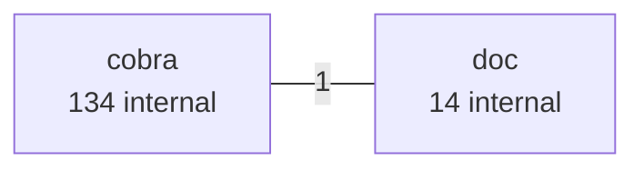
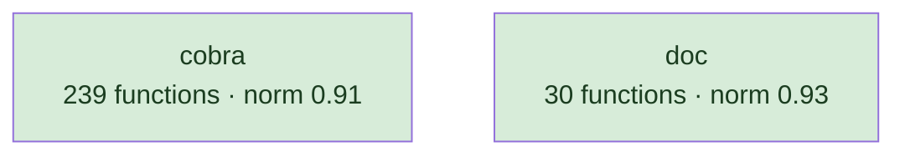
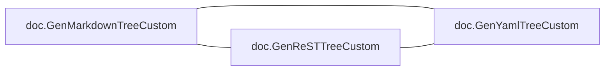
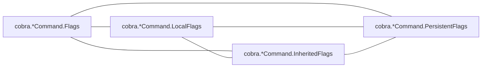
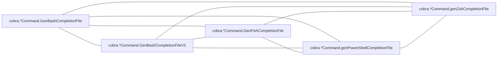
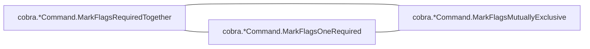

# cobra

CLI framework; one dominant type with a long method set, plus shell-completion generators

**What this rung shows:** the receiver and role signals, and per-shell generator siblings

| | |
|---|---|
| Corpus | [cobra](https://github.com/spf13/cobra) |
| Pinned at | `v1.10.2` (`88b30ab89da2d0d0abb153818746c5a2d30eccec`) |
| Project since | 2015 |
| doppel | `043c993` |
| Command | `doppel analyze . --tests exclude --top 10` |

Run from the corpus root, so every path below is corpus-relative.
Regenerate with `task examples`.

## Run diagnostics

The corpus-level models doppel builds before ranking anything, as printed to stderr:

```
Scanning . ...
Generating concept documents...
Culture: 2 concepts modeled, 15 associations, 0 unusual realizations
Habitats: 2 modeled, 0 misfits; most uniform doc (norm 0.93), most diverse cobra (norm 0.91)
Conventions: strongest validation (0.44), loosest file_io (0.42)
Ecosystems: 125 profiled (125 dominance, 0 coalition, 0 conflict, 0 weak)
Found 269 functions. Retrieving candidates...
Retrieval: shape 117, concept 85, call 712 -> 826 unique pairs
  concept-only 6.9%  call-only 76.6%  suppressed-shape functions: 0  large identity buckets: 0  surviving patterns: 2819
Running structural comparison on 826 pairs...
Families: 18 over 43 components, 63 functions in a family, 3 edges completed
```

# Code Similarity Report

**Functions analyzed:** 269 | **Threshold:** 0.60 | **Pairs found:** 10

---

## What doppel sees

**269 functions** across **2 packages** — test functions excluded. Structural roles: 120 leaf, 63 orchestrator, 36 passthrough, 50 utility.

### Concepts

doppel reads intent from the AST into a fixed vocabulary and reasons over the tree, so two functions that share a *branch* score partial credit rather than nothing. Leaf counts below are this corpus.


**Nothing here is tagged** `caching`, `circuit_breaker`, `db_access`, `error_wrapping`, `grpc_call`, `http_call`, `logging`, `mapping`, `retry`, `transaction`. That is a direct answer to "does this codebase already do X" — for those concepts, it does not.

| Concept | Functions | Convention |
|---|---:|---|
| `validation` | 12 | `0.44` (loose) |
| `file_io` | 10 | `0.42` (loose) |
| `concurrency` | 1 | — |
| `serialization` | 1 | — |

Convention is how uniformly this corpus realizes a concept: `1.00` means every function carrying the tag does it the same way, and a low number means the tag covers several unrelated habits. A concept with fewer than five members is not modeled.

### Where the duplication is

Merge-worthy pairs folded up to their packages. An edge means two packages keep solving the same problem separately; a count on a node means the repetition is inside one package.



### How settled each package is

A package with at least five functions gets a habitat model: doppel learns what is normal there and measures how surprising each member is against it. **Norm** is how uniform the package's practice is. A **misfit** is a function alien to its package *and* to the wider subsystem around it — one that fits its neighbours a directory up is normal for this codebase and is not reported.



Most uniform is `doc` (norm `0.93`); most varied is `cobra` (norm `0.91`).

### How these candidates were found

Three channels propose candidates independently — shared rare *structure*, shared *concepts*, shared *calls* — and their union is what gets compared. This run: **826 candidate pairs** (shape 117, concept 85, call 712), of which 77% arrived on call evidence alone and 7% on concept evidence alone. A pair sharing none of the three is never compared, however alike it looks.

Each function is also an arena where its candidate concepts compete for its evidence. 125 functions reached an equilibrium: **125** settled on a single concept, **0** on a coalition, **0** hold concepts this corpus says do not go together.

---

## Local practice

The vocabulary above says what a concept *is*. This says what one looks like when **this** codebase writes it — learned from the corpus, so it describes the house style rather than a rule from anywhere else.

### How this codebase writes each concept

Of the functions carrying each tag, how many do each thing. Weights are how much a channel counts toward whether a member looks normal — calls 40, control flow 20, co-occurring tags 15, role 15, package 10.

**`validation`** — 12 functions

| Channel | Feature | | Members |
|---|---|---|---|
| flow ×20 | `if` | `████████··` | 10 of 12 |
|  | `return` | `███████···` | 8 of 12 |
|  | `range` | `█████·····` | 6 of 12 |
| role ×15 | `orchestrator` | `█████·····` | 6 of 12 |
| package ×10 | `cobra` | `██████████` | 12 of 12 |

**`file_io`** — 10 functions

| Channel | Feature | | Members |
|---|---|---|---|
| calls ×40 | `os.Create` | `█████████·` | 9 of 10 |
| flow ×20 | `defer` | `██████████` | 10 of 10 |
|  | `if` | `██████████` | 10 of 10 |
|  | `return` | `█████████·` | 9 of 10 |
| package ×10 | `cobra` | `██████····` | 6 of 10 |

### What travels with what

Co-occurrence measured against chance across every function. Only relationships at least twice — or at most half — as common as chance are reported; near-chance company is not culture. Each kind is listed separately, because there are far more call tokens than concepts and one shared list is all calls. Within a kind, strongest first means lift weighted by how many functions carry it — a 100× relationship holding for three functions is a weaker finding than a 30× one holding for thirty.

**Together more than chance — tag~role**

- 6 of 12 `validation` functions also `orchestrator` — 2.1× chance

**Together more than chance — tag~call**

- 9 of 10 `file_io` functions also `os.Create` — 27× chance
- 4 of 10 `file_io` functions also `path/filepath.Join` — 27× chance
- 3 of 10 `file_io` functions also `io.WriteString` — 27× chance
- 3 of 12 `validation` functions also `cobra.sortedKeys` — 22× chance
- 4 of 10 `file_io` functions also `cobra.*Command.IsAdditionalHelpTopicCommand` — 9.8× chance
- 5 of 12 `validation` functions also `fmt.Errorf` — 7.5× chance
- _8 more not listed_

---

## Match #1 — Code-shape: `0.8207`

| | Location | Function | Signature | Patterns |
|---|---|---|---|---|
| **A** | `doc/md_docs.go:57` | `doc.GenMarkdownCustom` | `(*cobra.Command, io.Writer, func(string) string) (error)` | — |
| **B** | `doc/rest_docs.go:62` | `doc.GenReSTCustom` | `(*cobra.Command, io.Writer, func(string, string) string) (error)` | — |

**Code similarity:** `ast 0.80  flow 1.00  nesting 1.00  sig 0.60  size 0.86`

**Evidence:** `1878.46` (shape 1820.49, concept 0.00, call 57.97)

**Trophic:** `0.83`

**Shared structure:**

- `30.80` — `flow:call:new→call:WriteString`
- `26.32` — `do(call:WriteString)`
- `16.55` — `flow:call:new→call:Fprintf`

**Structural overlap:** `0.63` (merge-worthy)

- share 25 callees: [Format, buf.WriteString, buf.WriteTo, byName, child.IsAdditionalHelpTopicCommand, child.IsAvailableCommand, child.Name, cmd.CommandPath, cmd.Commands, cmd.HasParent, cmd.InitDefaultHelpCmd, cmd.InitDefaultHelpFlag, cmd.Parent, cmd.Runnable, cmd.UseLine, cmd.VisitParents, fmt.Fprintf, hasSeeAlso, len, linkHandler, new, parent.CommandPath, sort.Sort, strings.ReplaceAll, time.Now]
- overlapping call-graph neighborhoods (0.95): 87 shared
- both are passthrough functions
- same package
- callers do related work (1.00): [file_io]
- same visibility
- same receiver type: plain functions
- called from same packages: [doc]
- call into same packages: [cobra, doc]

---

## Match #2 — Code-shape: `0.8777`

| | Location | Function | Signature | Patterns |
|---|---|---|---|---|
| **A** | `doc/rest_docs.go:145` | `doc.GenReSTTreeCustom` | `(*cobra.Command, string, func(string) string, func(string, string) string) (error)` | file_io |
| **B** | `doc/yaml_docs.go:60` | `doc.GenYamlTreeCustom` | `(*cobra.Command, string, func(string) string, func(string) string) (error)` | file_io |

**Profile A:** `file_io` 1.00 (dominance)

**Profile B:** `file_io` 1.00 (dominance)

**Code similarity:** `ast 0.85  flow 1.00  nesting 1.00  sig 0.80  size 1.00`

**Evidence:** `654.63` (shape 626.62, concept 1.24, call 26.78)

**Trophic:** `0.93`

**Shared structure:**

- `7.34` — `if(bin:!=(id,nil))`
- `4.14` — `seq[ assign:=(bin) ; assign:=(call:Join) ]`
- `4.14` — `seq[ defer(call:Close) ; if(bin:!=(id,nil)) ]`

**Structural overlap:** `0.74` (merge-worthy)

- share 10 callees: [c.IsAdditionalHelpTopicCommand, c.IsAvailableCommand, cmd.CommandPath, cmd.Commands, f.Close, filePrepender, filepath.Join, io.WriteString, os.Create, strings.ReplaceAll]
- overlapping call-graph neighborhoods (0.83): 35 shared
- share patterns: [file_io]
- both are orchestrator functions
- same package
- same visibility
- same receiver type: plain functions
- called from same packages: [doc]
- call into same packages: [cobra, doc]

---

## Match #3 — Code-shape: `1.0000`

| | Location | Function | Signature | Patterns |
|---|---|---|---|---|
| **A** | `flag_groups.go:33` | `cobra.*Command.MarkFlagsRequiredTogether` | `(...string)` | validation |
| **B** | `flag_groups.go:49` | `cobra.*Command.MarkFlagsOneRequired` | `(...string)` | validation |

**Profile A:** `validation` 1.00 (dominance)

**Profile B:** `validation` 1.00 (dominance)

**Code similarity:** `ast 1.00  flow 1.00  nesting 1.00  sig 1.00  size 1.00`

**Evidence:** `409.97` (shape 398.02, concept 1.07, call 10.87)

**Trophic:** `1.00`

**Shared structure:**

- `6.89` — `do(call:panic)`
- `4.14` — `range{ call:Lookup call:Flags call:panic call:Sprintf call:SetAnnotation call:append call:Join }`
- `4.14` — `seq[ do(call:mergePersistentFlags) ; range ]`

**Structural overlap:** `0.76` (merge-worthy)

- share 8 callees: [Lookup, SetAnnotation, append, c.Flags, c.mergePersistentFlags, fmt.Sprintf, panic, strings.Join]
- overlapping call-graph neighborhoods (1.00): 34 shared
- share patterns: [validation]
- both are orchestrator functions
- same package
- same visibility
- same receiver type: Command
- call into same packages: [cobra]

---

## Match #4 — Code-shape: `0.9806`

| | Location | Function | Signature | Patterns |
|---|---|---|---|---|
| **A** | `doc/md_docs.go:32` | `doc.printOptions` | `(*bytes.Buffer, *cobra.Command, string) (error)` | — |
| **B** | `doc/rest_docs.go:30` | `doc.printOptionsReST` | `(*bytes.Buffer, *cobra.Command, string) (error)` | — |

**Code similarity:** `ast 0.97  flow 1.00  nesting 1.00  sig 1.00  size 0.86`

**Evidence:** `607.03` (shape 593.16, concept 0.00, call 13.88)

**Trophic:** `0.93`

**Shared structure:**

- `16.55` — `flow:param→call:WriteString`
- `13.16` — `do(call:WriteString)`
- `9.09` — `seq[ do(call:PrintDefaults) ; do(call:WriteString) ]`

**Structural overlap:** `0.60` (merge-worthy)

- share 9 callees: [buf.WriteString, cmd.InheritedFlags, cmd.NonInheritedFlags, flags.HasAvailableFlags, flags.PrintDefaults, flags.SetOutput, parentFlags.HasAvailableFlags, parentFlags.PrintDefaults, parentFlags.SetOutput]
- overlapping call-graph neighborhoods (0.90): 36 shared
- both are orchestrator functions
- same package
- same visibility
- same receiver type: plain functions
- called from same packages: [doc]
- call into same packages: [cobra]

---

## Match #5 — Code-shape: `0.8425`

| | Location | Function | Signature | Patterns |
|---|---|---|---|---|
| **A** | `doc/md_docs.go:133` | `doc.GenMarkdownTreeCustom` | `(*cobra.Command, string, func(string) string, func(string) string) (error)` | file_io |
| **B** | `doc/rest_docs.go:145` | `doc.GenReSTTreeCustom` | `(*cobra.Command, string, func(string) string, func(string, string) string) (error)` | file_io |

**Profile A:** `file_io` 1.00 (dominance)

**Profile B:** `file_io` 1.00 (dominance)

**Code similarity:** `ast 0.79  flow 1.00  nesting 1.00  sig 0.80  size 1.00`

**Evidence:** `617.95` (shape 589.93, concept 1.24, call 26.78)

**Trophic:** `0.88`

**Shared structure:**

- `7.34` — `if(bin:!=(id,nil))`
- `4.14` — `seq[ assign:=(bin) ; assign:=(call:Join) ]`
- `4.14` — `seq[ defer(call:Close) ; if(bin:!=(id,nil)) ]`

**Structural overlap:** `0.74` (merge-worthy)

- share 10 callees: [c.IsAdditionalHelpTopicCommand, c.IsAvailableCommand, cmd.CommandPath, cmd.Commands, f.Close, filePrepender, filepath.Join, io.WriteString, os.Create, strings.ReplaceAll]
- overlapping call-graph neighborhoods (0.90): 36 shared
- share patterns: [file_io]
- both are orchestrator functions
- same package
- same visibility
- same receiver type: plain functions
- called from same packages: [doc]
- call into same packages: [cobra, doc]

---

## Match #6 — Code-shape: `0.8725`

| | Location | Function | Signature | Patterns |
|---|---|---|---|---|
| **A** | `doc/md_docs.go:133` | `doc.GenMarkdownTreeCustom` | `(*cobra.Command, string, func(string) string, func(string) string) (error)` | file_io |
| **B** | `doc/yaml_docs.go:60` | `doc.GenYamlTreeCustom` | `(*cobra.Command, string, func(string) string, func(string) string) (error)` | file_io |

**Profile A:** `file_io` 1.00 (dominance)

**Profile B:** `file_io` 1.00 (dominance)

**Code similarity:** `ast 0.79  flow 1.00  nesting 1.00  sig 1.00  size 1.00`

**Evidence:** `617.95` (shape 589.93, concept 1.24, call 26.78)

**Trophic:** `0.86`

**Shared structure:**

- `7.34` — `if(bin:!=(id,nil))`
- `4.14` — `seq[ assign:=(bin) ; assign:=(call:Join) ]`
- `4.14` — `seq[ defer(call:Close) ; if(bin:!=(id,nil)) ]`

**Structural overlap:** `0.74` (merge-worthy)

- share 10 callees: [c.IsAdditionalHelpTopicCommand, c.IsAvailableCommand, cmd.CommandPath, cmd.Commands, f.Close, filePrepender, filepath.Join, io.WriteString, os.Create, strings.ReplaceAll]
- overlapping call-graph neighborhoods (0.83): 35 shared
- share patterns: [file_io]
- both are orchestrator functions
- same package
- same visibility
- same receiver type: plain functions
- called from same packages: [doc]
- call into same packages: [cobra, doc]

---

## Match #7 — Code-shape: `1.0000`

| | Location | Function | Signature | Patterns |
|---|---|---|---|---|
| **A** | `flag_groups.go:33` | `cobra.*Command.MarkFlagsRequiredTogether` | `(...string)` | validation |
| **B** | `flag_groups.go:65` | `cobra.*Command.MarkFlagsMutuallyExclusive` | `(...string)` | — |

**Profile A:** `validation` 1.00 (dominance)

**Code similarity:** `ast 1.00  flow 1.00  nesting 1.00  sig 1.00  size 1.00`

**Evidence:** `408.90` (shape 398.02, concept 0.00, call 10.87)

**Trophic:** `1.00`

**Shared structure:**

- `6.89` — `do(call:panic)`
- `4.14` — `range{ call:Lookup call:Flags call:panic call:Sprintf call:SetAnnotation call:append call:Join }`
- `4.14` — `seq[ do(call:mergePersistentFlags) ; range ]`

**Structural overlap:** `0.58` (merge-worthy)

- share 8 callees: [Lookup, SetAnnotation, append, c.Flags, c.mergePersistentFlags, fmt.Sprintf, panic, strings.Join]
- overlapping call-graph neighborhoods (1.00): 34 shared
- both are orchestrator functions
- same package
- same visibility
- same receiver type: Command
- call into same packages: [cobra]

---

## Match #8 — Code-shape: `1.0000`

| | Location | Function | Signature | Patterns |
|---|---|---|---|---|
| **A** | `flag_groups.go:49` | `cobra.*Command.MarkFlagsOneRequired` | `(...string)` | validation |
| **B** | `flag_groups.go:65` | `cobra.*Command.MarkFlagsMutuallyExclusive` | `(...string)` | — |

**Profile A:** `validation` 1.00 (dominance)

**Code similarity:** `ast 1.00  flow 1.00  nesting 1.00  sig 1.00  size 1.00`

**Evidence:** `408.90` (shape 398.02, concept 0.00, call 10.87)

**Trophic:** `1.00`

**Shared structure:**

- `6.89` — `do(call:panic)`
- `4.14` — `range{ call:Lookup call:Flags call:panic call:Sprintf call:SetAnnotation call:append call:Join }`
- `4.14` — `seq[ do(call:mergePersistentFlags) ; range ]`

**Structural overlap:** `0.58` (merge-worthy)

- share 8 callees: [Lookup, SetAnnotation, append, c.Flags, c.mergePersistentFlags, fmt.Sprintf, panic, strings.Join]
- overlapping call-graph neighborhoods (1.00): 34 shared
- both are orchestrator functions
- same package
- same visibility
- same receiver type: Command
- call into same packages: [cobra]

---

## Match #9 — Code-shape: `0.8473`

| | Location | Function | Signature | Patterns |
|---|---|---|---|---|
| **A** | `flag_groups.go:144` | `cobra.validateRequiredFlagGroups` | `(map[string]map[string]bool) (error)` | validation |
| **B** | `flag_groups.go:188` | `cobra.validateExclusiveFlagGroups` | `(map[string]map[string]bool) (error)` | validation |

**Profile A:** `validation` 1.00 (dominance)

**Profile B:** `validation` 1.00 (dominance)

**Code similarity:** `ast 0.75  flow 1.00  nesting 1.00  sig 1.00  size 0.97`

**Evidence:** `328.36` (shape 316.26, concept 1.07, call 11.03)

**Trophic:** `0.80`

**Shared structure:**

- `7.25` — `flow:call:append→call:len`
- `4.54` — `seq[ if(bin:\|\|(bin,bin)) ; do(call:Strings) ]`
- `4.54` — `seq[ range ; if(bin:\|\|(bin,bin)) ]`

**Structural overlap:** `0.95` (merge-worthy)

- share 5 callees: [append, fmt.Errorf, len, sort.Strings, sortedKeys]
- share 1 callers: [cobra.*Command.ValidateFlagGroups]
- overlapping call-graph neighborhoods (1.00): 6 shared
- share patterns: [validation]
- both are leaf functions
- same package
- callers do related work (1.00): [validation]
- same visibility
- same receiver type: plain functions
- called from same packages: [cobra]
- call into same packages: [cobra]

---

## Match #10 — Code-shape: `0.8653`

| | Location | Function | Signature | Patterns |
|---|---|---|---|---|
| **A** | `flag_groups.go:167` | `cobra.validateOneRequiredFlagGroups` | `(map[string]map[string]bool) (error)` | validation |
| **B** | `flag_groups.go:188` | `cobra.validateExclusiveFlagGroups` | `(map[string]map[string]bool) (error)` | validation |

**Profile A:** `validation` 1.00 (dominance)

**Profile B:** `validation` 1.00 (dominance)

**Code similarity:** `ast 0.78  flow 1.00  nesting 1.00  sig 1.00  size 0.89`

**Evidence:** `292.37` (shape 280.27, concept 1.07, call 11.03)

**Trophic:** `0.81`

**Shared structure:**

- `4.14` — `range{ call:append call:len call:Strings call:Errorf }`
- `4.14` — `seq[ assign:=(call:sortedKeys) ; range ]`
- `4.14` — `seq[ do(call:Strings) ; return(call:Errorf) ]`

**Structural overlap:** `0.95` (merge-worthy)

- share 5 callees: [append, fmt.Errorf, len, sort.Strings, sortedKeys]
- share 1 callers: [cobra.*Command.ValidateFlagGroups]
- overlapping call-graph neighborhoods (1.00): 6 shared
- share patterns: [validation]
- both are leaf functions
- same package
- callers do related work (1.00): [validation]
- same visibility
- same receiver type: plain functions
- called from same packages: [cobra]
- call into same packages: [cobra]

---

## Families

18 families, 63 functions in a family, largest 9 members; 3 edges scored here that retrieval never proposed

### Family 1 — 9 members, every pair `>= 0.63` code-shape, evidence `2579`

_Not drawn: 9 members is 36 connections. Every one of them holds — that is what makes this a family._

| Location | Function | Signature | Patterns |
|---|---|---|---|
| `command.go:412` | `cobra.*Command.getOut` | `(io.Writer) (io.Writer)` | — |
| `command.go:422` | `cobra.*Command.getErr` | `(io.Writer) (io.Writer)` | — |
| `command.go:432` | `cobra.*Command.getIn` | `(io.Reader) (io.Reader)` | — |
| `command.go:464` | `cobra.*Command.getUsageTemplateFunc` | `() (func(w io.Writer, data interface{}) error)` | — |
| `command.go:505` | `cobra.*Command.getHelpTemplateFunc` | `() (func(w io.Writer, data interface{}) error)` | — |
| `command.go:592` | `cobra.*Command.UsageTemplate` | `() (string)` | — |
| `command.go:605` | `cobra.*Command.HelpTemplate` | `() (string)` | — |
| `command.go:618` | `cobra.*Command.VersionTemplate` | `() (string)` | — |
| `command.go:631` | `cobra.*Command.getVersionTemplateFunc` | `() (func(w io.Writer, data interface{}) error)` | — |

### Family 2 — 3 members, every pair `>= 0.84` code-shape, evidence `1891`



| Location | Function | Signature | Patterns |
|---|---|---|---|
| `doc/md_docs.go:133` | `doc.GenMarkdownTreeCustom` | `(*cobra.Command, string, func(string) string, func(string) string) (error)` | file_io |
| `doc/rest_docs.go:145` | `doc.GenReSTTreeCustom` | `(*cobra.Command, string, func(string) string, func(string, string) string) (error)` | file_io |
| `doc/yaml_docs.go:60` | `doc.GenYamlTreeCustom` | `(*cobra.Command, string, func(string) string, func(string) string) (error)` | file_io |

### Family 3 — 4 members, every pair `>= 0.64` code-shape, evidence `1702`



| Location | Function | Signature | Patterns |
|---|---|---|---|
| `command.go:1688` | `cobra.*Command.Flags` | `() (*flag.FlagSet)` | — |
| `command.go:1716` | `cobra.*Command.LocalFlags` | `() (*flag.FlagSet)` | — |
| `command.go:1744` | `cobra.*Command.InheritedFlags` | `() (*flag.FlagSet)` | — |
| `command.go:1775` | `cobra.*Command.PersistentFlags` | `() (*flag.FlagSet)` | — |

### Family 4 — 5 members, every pair `>= 0.81` code-shape, evidence `1244`



| Location | Function | Signature | Patterns |
|---|---|---|---|
| `bash_completions.go:701` | `cobra.*Command.GenBashCompletionFile` | `(string) (error)` | file_io |
| `bash_completionsV2.go:470` | `cobra.*Command.GenBashCompletionFileV2` | `(string, bool) (error)` | file_io |
| `fish_completions.go:284` | `cobra.*Command.GenFishCompletionFile` | `(string, bool) (error)` | file_io |
| `powershell_completions.go:320` | `cobra.*Command.genPowerShellCompletionFile` | `(string, bool) (error)` | file_io |
| `zsh_completions.go:70` | `cobra.*Command.genZshCompletionFile` | `(string, bool) (error)` | file_io |

### Family 5 — 3 members, every pair `>= 1.00` code-shape, evidence `1228`



| Location | Function | Signature | Patterns |
|---|---|---|---|
| `flag_groups.go:33` | `cobra.*Command.MarkFlagsRequiredTogether` | `(...string)` | validation |
| `flag_groups.go:49` | `cobra.*Command.MarkFlagsOneRequired` | `(...string)` | validation |
| `flag_groups.go:65` | `cobra.*Command.MarkFlagsMutuallyExclusive` | `(...string)` | — |

_13 more families not listed._

