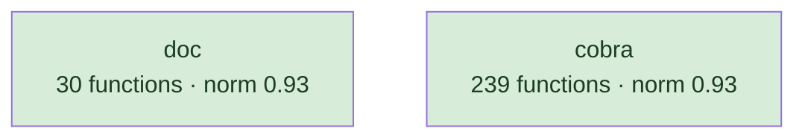
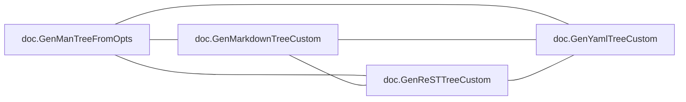
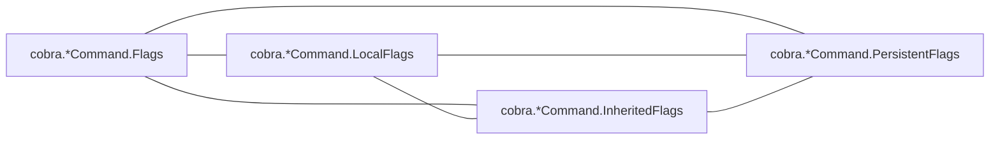
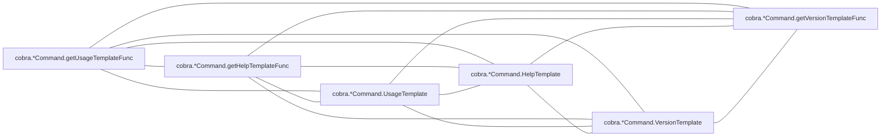
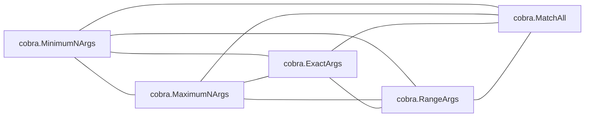
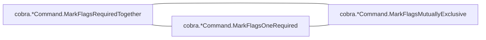

# cobra

CLI framework; one dominant type with a long method set, plus shell-completion generators

**What this rung shows:** the receiver and role signals, and per-shell generator siblings

| | |
|---|---|
| Corpus | [cobra](https://github.com/spf13/cobra) |
| Pinned at | `v1.10.2` (`88b30ab89da2d0d0abb153818746c5a2d30eccec`) |
| Project since | 2015 |
| doppel | `c4861da` |
| Command | `doppel analyze . --tests exclude --top 10` |

Run from the corpus root, so every path below is corpus-relative.
Regenerate with `task examples`; CI regenerates on every push to master.

## Run diagnostics

The corpus-level models doppel builds before ranking anything, as printed to stderr:

```
Scanning . ...
Learning concept vocabulary...
Lexicon: 26 concepts (2 seeded, 24 emergent), 992/2492 features above 98 df, 59 functions unlabeled
Generating concept documents...
Culture: 26 concepts modeled, 184 associations, 10 unusual realizations
Habitats: 2 modeled, 0 misfits; most uniform cobra (norm 0.93), most diverse doc (norm 0.93)
Conventions: strongest f.Name+flag.ContinueOnError+flag.NewFlagSet (0.59), loosest Value.Type+flag.Value (0.23)
Ecosystems: 235 profiled (171 dominance, 62 coalition, 0 conflict, 2 weak)
Calibration: rate 0.01 over 14535 shape / 20000 overlap null pairs -> threshold 0.44, struct-min 0.53, family-min 0.44
Found 269 functions. Retrieving candidates...
Retrieval: shape 135, concept 811, call 712 -> 1401 unique pairs
  concept-only 44.0%  call-only 37.8%  suppressed-shape functions: 0  large identity buckets: 0  surviving labels: 1705
Running structural comparison on 1401 pairs...
  Concept views: 42 of 1401 compared pairs disagree with the taxonomy (1 vocabulary the tree misses, 41 kinship the vocabularies lack)
  239 pairs remain after struct-min=0.53 filter
Families: 19 over 43 components, 57 functions in a family, 9 edges completed
```

# Code Similarity Report

**Functions analyzed:** 269 | **Threshold:** 0.38 | **Pairs found:** 10

---

## What doppel sees

**269 functions** across **2 packages** — test functions excluded. Structural roles: 120 leaf, 63 orchestrator, 36 passthrough, 50 utility.

### Concepts

These concepts were **learned from this corpus**, not read off a fixed list: each one is a group of functions that share a way of being written, named after the evidence that identified it. They hang from an authored interior, so two functions under the same *branch* score partial credit rather than nothing. Counts below are members; membership is graded, and a function can carry several.


**No practice here for** `caching`, `circuit_breaker`, `concurrency`, `db_access`, `error_wrapping`, `grpc_call`, `http_call`, `logging`, `mapping`, `retry`, `serialization`, `transaction`. Concepts are learned from this corpus, so one can never be absent — it exists because functions carry it. These are the *seeds* the search started from that grew nothing: a direct answer to "does this codebase already do X".

| Concept | Functions | Convention |
|---|---:|---|
| `c.DisableFlagParsing+sort.Strings` | 52 | `0.42` (loose) |
| `cmd.Name+c.commands` | 36 | `0.44` (loose) |
| `f.Annotations+c.flagErrorBuf` | 32 | `0.34` (loose) |
| `c.AddCommand+c.RemoveCommand` | 25 | `0.41` (loose) |
| `c.DisableAutoGenTag+child.IsAdditionalHelpTopic…+child.IsAvailableCommand` | 23 | `0.26` (loose) |
| `c.AddCommand+c.Find+c.RemoveCommand` | 21 | `0.39` (loose) |
| `subCmd.Name+strings.HasPrefix` | 21 | `0.38` (loose) |
| `c.PrintErrln+c.Parent` | 19 | `0.43` (loose) |
| `c.Parent+c.HasParent` | 17 | `0.55` (settled) |
| `c.DisableAutoGenTag+cmd.VisitParents` | 16 | `0.32` (loose) |
| `c.Deprecated+c.Runnable` | 15 | `0.43` (loose) |
| `cmd.Root+fmt.Sprintf` | 15 | `0.30` (loose) |
| `f.Name+flag.ContinueOnError` | 15 | `0.25` (loose) |
| `flags.HasAvailableFlags+cmd.InheritedFlags` | 15 | `0.31` (loose) |
| `c.AddCommand+c.Find` | 14 | `0.40` (loose) |
| `cobra.WriteStringAndCheck+header.Section` | 11 | `0.27` (loose) |
| `reflect+template` | 11 | `0.41` (loose) |
| `c.PersistentFlags+c.parentsPflags` | 10 | `0.38` (loose) |
| `io.WriteString+filepath.Join` | 8 | `0.48` (loose) |
| `Value.Type+flag.Value` | 7 | `0.23` (loose) |
| `c.DisableAutoGenTag+cmd.VisitParents+cobra.Command` | 7 | `0.30` (loose) |
| `flag.Usage+flag.Shorthand` | 7 | `0.24` (loose) |
| `f.Name+flag.ContinueOnError+flag.NewFlagSet` | 6 | `0.59` (settled) |
| `c.DisableAutoGenTag+child.IsAdditionalHelpTopic…` | 5 | `0.55` (settled) |
| `c.LocalFlags+cobra.*Command.LocalFlags` | 5 | `0.40` (loose) |
| `fmt.Fprint+fprint` | 5 | `0.31` (loose) |

Convention is how uniformly this corpus realizes a concept: `1.00` means every function carrying the tag does it the same way, and a low number means the tag covers several unrelated habits. A concept with fewer than five members is not modeled.

### Where the duplication is

Merge-worthy pairs folded up to their packages. An edge means two packages keep solving the same problem separately; a count on a node means the repetition is inside one package.

### How settled each package is

A package with at least five functions gets a habitat model: doppel learns what is normal there and measures how surprising each member is against it. **Norm** is how uniform the package's practice is. A **misfit** is a function alien to its package *and* to the wider subsystem around it — one that fits its neighbours a directory up is normal for this codebase and is not reported.



Most uniform is `cobra` (norm `0.93`); most varied is `doc` (norm `0.93`).

### How these candidates were found

Three channels propose candidates independently — shared rare *structure*, shared *concepts*, shared *calls* — and their union is what gets compared. This run: **1401 candidate pairs** (shape 135, concept 811, call 712), of which 38% arrived on call evidence alone and 44% on concept evidence alone. A pair sharing none of the three is never compared, however alike it looks.

The concept signal on each compared pair is read three ways — what the taxonomy asserts, what this corpus's frequencies say, and what the two sides' learned vocabularies share with no tree in between. On **42 of 1401** pairs the taxonomy and the vocabularies differ by at least 0.50: 1 where the vocabularies agree and the tree cannot see it, 41 where the tree asserts a kinship the vocabularies lack. Each such pair carries a `concept views` line saying which.

Each function is also an arena where its candidate concepts compete for its evidence. 235 functions reached an equilibrium: **171** settled on a single concept, **62** on a coalition, **0** hold concepts this corpus says do not go together.

### Corpus metrics

**Compression ratio:** `5.51`x — this corpus's canonical function bodies contain **14587 AST nodes** in total, which hash-cons (two nodes count as the same subtree exactly when their kind and every child match, all the way down) to **2649 distinct subtree shapes**; the ratio is nodes divided by shapes, always >= 1.0, and it never feeds any score.

**Nearest-neighbour code-shape:** of **269 functions**, **251** had a code-shape neighbour among the pairs retrieval actually scored — their best score's p50/p90/p99 are `0.48` / `1.00` / `1.00`, and 57% of them (143 of 251) already clear this run's threshold of `0.44`. This is **not an exhaustive nearest-neighbour search** (that would be a full pairwise comparison); it is bounded by the same three retrieval channels the pair list itself is bounded by, so the other 18 functions are excluded here as having no *scored* neighbour, not asserted to have none at all.

---

## Local practice

The vocabulary above says what a concept *is*. This says what one looks like when **this** codebase writes it — learned from the corpus, so it describes the house style rather than a rule from anywhere else.

### How this codebase writes each concept

Only what is **distinctive**. A feature earns a row by being carried by this concept's members at least twice as often as by the corpus at large — nearly every Go function has a `return` and an `if`, so prevalence alone would describe the language rather than this codebase. Weights are how much a channel counts toward whether a member looks normal — calls 40, control flow 20, co-occurring tags 15, role 15, package 10.

**`c.DisableFlagParsing+sort.Strings`** — 52 functions

| Channel | Feature | | Members | vs corpus |
|---|---|---|---|---|
| calls ×40 | `cobra.*Command.Flags` | `███·······` | 16 of 52 | 3.0× |
| cotags ×15 | `f.Annotations+c.flagErrorBuf` | `███·······` | 14 of 52 | 2.3× |

**`cmd.Name+c.commands`** — 36 functions

| Channel | Feature | | Members | vs corpus |
|---|---|---|---|---|
| calls ×40 | `cobra.*Command.Name` | `███·······` | 11 of 36 | 2.3× |
| flow ×20 | `range` | `████······` | 16 of 36 | 2.1× |

**`f.Annotations+c.flagErrorBuf`** — 32 functions

| Channel | Feature | | Members | vs corpus |
|---|---|---|---|---|
| calls ×40 | `cobra.*Command.mergePersistentFlags` | `███·······` | 9 of 32 | 6.3× |
|  | `cobra.*Command.DisplayName` | `███·······` | 9 of 32 | 5.8× |
|  | `cobra.*Command.Flags` | `█████·····` | 17 of 32 | 5.1× |
| cotags ×15 | `f.Name+flag.ContinueOnError` | `███·······` | 11 of 32 | 6.2× |
|  | `c.DisableFlagParsing+sort.Strings` | `████······` | 14 of 32 | 2.3× |
| role ×15 | `passthrough` | `████······` | 12 of 32 | 2.8× |

**`c.AddCommand+c.RemoveCommand`** — 25 functions

| Channel | Feature | | Members | vs corpus |
|---|---|---|---|---|
| calls ×40 | `strings.HasPrefix` | `███·······` | 8 of 25 | 8.6× |
| cotags ×15 | `c.AddCommand+c.Find` | `███·······` | 8 of 25 | 6.1× |
|  | `c.AddCommand+c.Find+c.RemoveCommand` | `████······` | 11 of 25 | 5.6× |
|  | `subCmd.Name+strings.HasPrefix` | `████······` | 9 of 25 | 4.6× |

**`c.DisableAutoGenTag+child.IsAdditionalHelpTopic…+child.IsAvailableCommand`** — 23 functions

| Channel | Feature | | Members | vs corpus |
|---|---|---|---|---|
| calls ×40 | `fmt.Fprintf` | `███·······` | 6 of 23 | 10× |
|  | `cobra.*Command.Runnable` | `███·······` | 6 of 23 | 8.8× |
|  | `cobra.*Command.IsAdditionalHelpTopicCommand` | `███·······` | 7 of 23 | 7.4× |
|  | `cobra.*Command.Parent` | `███·······` | 7 of 23 | 7.4× |
|  | `cobra.*Command.Commands` | `███·······` | 8 of 23 | 6.7× |
| flow ×20 | `range` | `█████·····` | 11 of 23 | 2.3× |
| cotags ×15 | `c.DisableAutoGenTag+cmd.VisitParents+cobra.Command` | `███·······` | 6 of 23 | 10× |
|  | `c.DisableAutoGenTag+cmd.VisitParents` | `████······` | 10 of 23 | 7.3× |
| role ×15 | `passthrough` | `████······` | 10 of 23 | 3.2× |
| package ×10 | `doc` | `███·······` | 7 of 23 | 2.7× |

**`c.AddCommand+c.Find+c.RemoveCommand`** — 21 functions

| Channel | Feature | | Members | vs corpus |
|---|---|---|---|---|
| calls ×40 | `cobra.*Command.Root` | `████······` | 8 of 21 | 8.5× |
|  | `cobra.*Command.Name` | `████······` | 8 of 21 | 2.9× |
|  | `fmt.Sprintf` | `███·······` | 6 of 21 | 2.1× |
| cotags ×15 | `c.AddCommand+c.Find` | `██████····` | 12 of 21 | 11× |
|  | `c.AddCommand+c.RemoveCommand` | `█████·····` | 11 of 21 | 5.6× |
|  | `cmd.Root+fmt.Sprintf` | `███·······` | 6 of 21 | 5.1× |

_20 further concepts are modeled and not described._

### Which concepts share a function

`++` at least four times chance, `+` at least twice, `−` at most half, `never` not once. A blank cell is ordinary company — near chance, which is not culture.

| | `Value.Type+flag.Value` | `c.AddCommand+c.Find` | `c.AddCommand+c.Find+c.RemoveCommand` | `c.AddCommand+c.RemoveCommand` | `c.Deprecated+c.Runnable` | `c.DisableAutoGenTag+child.IsAdditionalHelpTopic…` | `c.DisableAutoGenTag+child.IsAdditionalHelpTopic…+child.IsAvailableCommand` | `c.DisableAutoGenTag+cmd.VisitParents` | `c.DisableAutoGenTag+cmd.VisitParents+cobra.Command` | `c.DisableFlagParsing+sort.Strings` | `c.LocalFlags+cobra.*Command.LocalFlags` | `c.Parent+c.HasParent` | `c.PersistentFlags+c.parentsPflags` | `c.PrintErrln+c.Parent` | `cmd.Name+c.commands` | `cmd.Root+fmt.Sprintf` | `cobra.WriteStringAndCheck+header.Section` | `f.Annotations+c.flagErrorBuf` | `f.Name+flag.ContinueOnError` | `f.Name+flag.ContinueOnError+flag.NewFlagSet` | `flag.Usage+flag.Shorthand` | `flags.HasAvailableFlags+cmd.InheritedFlags` | `fmt.Fprint+fprint` | `io.WriteString+filepath.Join` | `reflect+template` |
|---|---|---|---|---|---|---|---|---|---|---|---|---|---|---|---|---|---|---|---|---|---|---|---|---|---|
| **`c.AddCommand+c.Find`** |  | | | | | | | | | | | | | | | | | | | | | | | | |
| **`c.AddCommand+c.Find+c.RemoveCommand`** |  | ++ | | | | | | | | | | | | | | | | | | | | | | | |
| **`c.AddCommand+c.RemoveCommand`** |  | ++ | ++ | | | | | | | | | | | | | | | | | | | | | | |
| **`c.Deprecated+c.Runnable`** |  |  |  |  | | | | | | | | | | | | | | | | | | | | | |
| **`c.DisableAutoGenTag+child.IsAdditionalHelpTopic…`** |  |  |  |  |  | | | | | | | | | | | | | | | | | | | | |
| **`c.DisableAutoGenTag+child.IsAdditionalHelpTopic…+child.IsAvailableCommand`** |  |  |  |  | + | ++ | | | | | | | | | | | | | | | | | | | |
| **`c.DisableAutoGenTag+cmd.VisitParents`** |  |  |  |  |  | ++ | ++ | | | | | | | | | | | | | | | | | | |
| **`c.DisableAutoGenTag+cmd.VisitParents+cobra.Command`** |  |  |  |  |  |  | ++ | ++ | | | | | | | | | | | | | | | | | |
| **`c.DisableFlagParsing+sort.Strings`** |  |  | − | − |  |  | − | − |  | | | | | | | | | | | | | | | | |
| **`c.LocalFlags+cobra.*Command.LocalFlags`** |  |  |  |  |  |  |  |  |  |  | | | | | | | | | | | | | | | |
| **`c.Parent+c.HasParent`** |  |  |  |  |  |  | + |  |  | never |  | | | | | | | | | | | | | | |
| **`c.PersistentFlags+c.parentsPflags`** |  |  |  |  |  |  |  |  |  |  |  |  | | | | | | | | | | | | | |
| **`c.PrintErrln+c.Parent`** |  |  |  |  |  |  |  |  |  | never |  | ++ |  | | | | | | | | | | | | |
| **`cmd.Name+c.commands`** |  |  |  | − | + |  |  |  |  |  |  |  |  |  | | | | | | | | | | | |
| **`cmd.Root+fmt.Sprintf`** |  |  | ++ |  |  |  |  |  |  | + |  |  |  |  |  | | | | | | | | | | |
| **`cobra.WriteStringAndCheck+header.Section`** |  |  |  |  |  |  |  |  |  |  |  |  |  |  |  |  | | | | | | | | | |
| **`f.Annotations+c.flagErrorBuf`** |  |  |  |  |  |  |  |  |  | + |  |  |  |  |  |  |  | | | | | | | | |
| **`f.Name+flag.ContinueOnError`** |  |  |  |  |  |  |  |  |  |  |  |  | ++ |  |  |  |  | ++ | | | | | | | |
| **`f.Name+flag.ContinueOnError+flag.NewFlagSet`** |  |  |  |  |  |  |  |  |  |  |  |  |  |  |  |  |  | ++ | ++ | | | | | | |
| **`flag.Usage+flag.Shorthand`** | ++ |  |  |  |  |  |  |  |  |  |  |  |  |  |  |  |  |  |  |  | | | | | |
| **`flags.HasAvailableFlags+cmd.InheritedFlags`** | ++ |  |  |  |  |  |  |  |  |  | ++ |  |  |  |  |  |  |  |  |  |  | | | | |
| **`fmt.Fprint+fprint`** |  |  |  |  |  |  |  |  |  |  |  |  |  |  |  |  |  |  |  |  |  |  | | | |
| **`io.WriteString+filepath.Join`** |  |  |  |  |  |  |  |  |  |  |  |  |  |  |  |  |  |  |  |  |  |  |  | | |
| **`reflect+template`** |  |  |  |  |  |  |  |  |  | + |  |  |  |  |  |  |  |  |  |  |  |  |  |  | |
| **`subCmd.Name+strings.HasPrefix`** |  |  |  | ++ |  |  |  |  |  |  |  |  |  |  | + |  |  |  |  |  |  |  |  |  |  |

### What travels with what

Co-occurrence measured against chance across every function. Only relationships at least twice — or at most half — as common as chance are reported; near-chance company is not culture. Each kind is listed separately, because there are far more call tokens than concepts and one shared list is all calls. Within a kind, strongest first means lift weighted by how many functions carry it — a 100× relationship holding for three functions is a weaker finding than a 30× one holding for thirty.

**Together more than chance — tag~tag**

- 15 of 17 `c.Parent+c.HasParent` functions also `c.PrintErrln+c.Parent` — 12× chance
- 12 of 14 `c.AddCommand+c.Find` functions also `c.AddCommand+c.Find+c.RemoveCommand` — 11× chance
- 5 of 7 `Value.Type+flag.Value` functions also `flag.Usage+flag.Shorthand` — 27× chance
- 6 of 6 `f.Name+flag.ContinueOnError+flag.NewFlagSet` functions also `f.Name+flag.ContinueOnError` — 18× chance
- 10 of 16 `c.DisableAutoGenTag+cmd.VisitParents` functions also `c.DisableAutoGenTag+child.IsAdditionalHelpTopic…+child.IsAvailableCommand` — 7.3× chance
- 11 of 15 `f.Name+flag.ContinueOnError` functions also `f.Annotations+c.flagErrorBuf` — 6.2× chance
- _19 more not listed_

**Together more than chance — tag~role**

- 10 of 15 `f.Name+flag.ContinueOnError` functions also `passthrough` — 5.0× chance
- 5 of 6 `f.Name+flag.ContinueOnError+flag.NewFlagSet` functions also `passthrough` — 6.2× chance
- 8 of 16 `c.DisableAutoGenTag+cmd.VisitParents` functions also `passthrough` — 3.7× chance
- 4 of 5 `c.DisableAutoGenTag+child.IsAdditionalHelpTopic…` functions also `passthrough` — 6.0× chance
- 11 of 15 `flags.HasAvailableFlags+cmd.InheritedFlags` functions also `orchestrator` — 3.1× chance
- 10 of 23 `c.DisableAutoGenTag+child.IsAdditionalHelpTopic…+child.IsAvailableCommand` functions also `passthrough` — 3.2× chance
- _10 more not listed_

**Together more than chance — tag~call**

- 8 of 8 `io.WriteString+filepath.Join` functions also `os.Create` — 30× chance
- 9 of 10 `c.PersistentFlags+c.parentsPflags` functions also `cobra.*Command.PersistentFlags` — 22× chance
- 6 of 6 `f.Name+flag.ContinueOnError+flag.NewFlagSet` functions also `github.com/spf13/pflag.NewFlagSet` — 38× chance
- 6 of 6 `f.Name+flag.ContinueOnError+flag.NewFlagSet` functions also `cobra.*Command.SetOutput` — 34× chance
- 16 of 17 `c.Parent+c.HasParent` functions also `cobra.*Command.HasParent` — 10× chance
- 4 of 5 `c.DisableAutoGenTag+child.IsAdditionalHelpTopic…` functions also `doc.hasSeeAlso` — 54× chance
- _116 more not listed_

**Apart more than chance — tag~tag**

- **no** `c.DisableFlagParsing+sort.Strings` function has `c.PrintErrln+c.Parent` — chance alone would give about 4 of 52
- **no** `c.DisableFlagParsing+sort.Strings` function has `c.Parent+c.HasParent` — chance alone would give about 3 of 52
- 1 of 23 `c.DisableAutoGenTag+child.IsAdditionalHelpTopic…+child.IsAvailableCommand` functions also `c.DisableFlagParsing+sort.Strings` — 0.2× chance
- 1 of 21 `c.AddCommand+c.Find+c.RemoveCommand` functions also `c.DisableFlagParsing+sort.Strings` — 0.2× chance
- 2 of 25 `c.AddCommand+c.RemoveCommand` functions also `c.DisableFlagParsing+sort.Strings` — 0.4× chance
- 1 of 25 `c.AddCommand+c.RemoveCommand` functions also `cmd.Name+c.commands` — 0.3× chance
- _1 more not listed_

**Apart more than chance — tag~role**

- **no** `c.Parent+c.HasParent` function has `orchestrator` — chance alone would give about 4 of 17
- **no** `c.DisableAutoGenTag+cmd.VisitParents+cobra.Command` function has `leaf` — chance alone would give about 3 of 7
- 3 of 23 `c.DisableAutoGenTag+child.IsAdditionalHelpTopic…+child.IsAvailableCommand` functions also `leaf` — 0.3× chance
- 6 of 32 `f.Annotations+c.flagErrorBuf` functions also `leaf` — 0.4× chance
- 2 of 16 `c.DisableAutoGenTag+cmd.VisitParents` functions also `leaf` — 0.3× chance
- 2 of 15 `f.Name+flag.ContinueOnError` functions also `leaf` — 0.3× chance
- _4 more not listed_

**Apart more than chance — tag~call**

- **no** `c.DisableFlagParsing+sort.Strings` function has `cobra.*Command.HasParent` — chance alone would give about 5 of 52
- **no** `c.DisableFlagParsing+sort.Strings` function has `cobra.*Command.IsAvailableCommand` — chance alone would give about 3 of 52
- 2 of 36 `cmd.Name+c.commands` functions also `fmt.Sprintf` — 0.4× chance
- 1 of 36 `cmd.Name+c.commands` functions also `cobra.*Command.Flags` — 0.3× chance

### Functions drifting from their own concept

These carry a tag but look nothing like the other functions carrying it. Typicality is measured against the concept's own median, so a genuinely varied concept lowers its own bar and a tight one can flag nobody.

| Function | Concept | Typicality | Concept median | |
|---|---|---:|---:|---|
| `cobra.*Command.HasParent` <br/>`command.go:1677` | `c.Parent+c.HasParent` | `0.36` | `0.82` | no near-duplicate |
| `cobra.*Command.Usage` <br/>`command.go:478` | `c.PrintErrln+c.Parent` | `0.32` | `0.72` | no near-duplicate |
| `cobra.*Command.Parent` <br/>`command.go:1892` | `c.PrintErrln+c.Parent` | `0.35` | `0.72` | no near-duplicate |
| `doc.GenMarkdown` <br/>`doc/md_docs.go:52` | `flags.HasAvailableFlags+cmd.InheritedFlags` | `0.16` | `0.38` | no near-duplicate |
| `cobra.defaultHelpFunc` <br/>`command.go:2047` | `fmt.Fprint+fprint` | `0.20` | `0.41` | no near-duplicate |
| `cobra.WriteStringAndCheck` <br/>`cobra.go:243` | `cobra.WriteStringAndCheck+header.Section` | `0.09` | `0.25` | no near-duplicate |
| `cobra.*Command.UsageFunc` <br/>`command.go:444` | `c.PrintErrln+c.Parent` | `0.31` | `0.72` |  |
| `doc.genMan` <br/>`doc/man_docs.go:202` | `c.DisableAutoGenTag+cmd.VisitParents+cobra.Command` | `0.30` | `0.63` |  |
| `doc.GenReSTCustom` <br/>`doc/rest_docs.go:62` | `c.DisableAutoGenTag+cmd.VisitParents+cobra.Command` | `0.31` | `0.63` |  |
| `cobra.getFlagNameCompletions` <br/>`completions.go:596` | `flag.Usage+flag.Shorthand` | `0.24` | `0.51` |  |

A row marked _no near-duplicate_ appears in no reported pair: nothing else in this report explains it, which makes it drift rather than duplication.

---

## Match #1 — Code-shape: `0.6492`

| | Location | Function | Signature | Concepts |
|---|---|---|---|---|
| **A** | `doc/md_docs.go:57` | `doc.GenMarkdownCustom` | `(*cobra.Command, io.Writer, func(string) string) (error)` | c.DisableAutoGenTag+child.IsAdditionalHelpTopic…+child.IsAvailableCommand 0.60, c.DisableAutoGenTag+cmd.VisitParents 0.53, c.DisableAutoGenTag+child.IsAdditionalHelpTopic… 0.53 |
| **B** | `doc/rest_docs.go:62` | `doc.GenReSTCustom` | `(*cobra.Command, io.Writer, func(string, string) string) (error)` | c.DisableAutoGenTag+child.IsAdditionalHelpTopic…+child.IsAvailableCommand 0.59, c.DisableAutoGenTag+child.IsAdditionalHelpTopic… 0.53, c.DisableAutoGenTag+cmd.VisitParents+cobra.Command 0.44 |

**Explain:** differs by two extra assign, 11 extra call, 10 extra literal, and 4 more kinds

**Profile A:** `c.DisableAutoGenTag+child.IsAdditionalHelpTopic…` 1.00 (dominance)

**Profile B:** `c.DisableAutoGenTag+child.IsAdditionalHelpTopic…` 1.00 (dominance)

**Code similarity:** `wl 0.52  flow 1.00  nesting 1.00  sig 0.60  size 0.86`

**Containment:** `0.74`

**Evidence:** `1001.03` (shape 938.74, concept 4.32, call 57.97)

**Trophic:** `0.82`

**Shared structure:**

- `25.57` — `depth-1 EXPRSTMT` ×8
- `22.71` — `depth-0 CALL` ×8
- `18.84` — `depth-0 BIN` ×10

**Concept views:** shape `0.83`, corpus `0.76`, feature `0.97`, a-in-b `0.98`, b-in-a `0.99`

**Shared vocabulary:** `lit:2-Jan-2006`, `sel:c.DisableAutoGenTag`, `sel:child.IsAdditionalHelpTopicCommand`

**Structural overlap:** `0.80` (merge-worthy)

- share 25 callees: [Format, buf.WriteString, buf.WriteTo, byName, child.IsAdditionalHelpTopicCommand, child.IsAvailableCommand, child.Name, cmd.CommandPath, cmd.Commands, cmd.HasParent, cmd.InitDefaultHelpCmd, cmd.InitDefaultHelpFlag, cmd.Parent, cmd.Runnable, cmd.UseLine, cmd.VisitParents, fmt.Fprintf, hasSeeAlso, len, linkHandler, new, parent.CommandPath, sort.Sort, strings.ReplaceAll, time.Now]
- overlapping call-graph neighborhoods (0.95): 87 shared
- share patterns: [c.DisableAutoGenTag+child.IsAdditionalHelpTopic…, c.DisableAutoGenTag+child.IsAdditionalHelpTopic…+child.IsAvailableCommand]
- related patterns: c.DisableAutoGenTag+cmd.VisitParents ≈ c.DisableAutoGenTag+cmd.VisitParents+cobra.Command (both io_operation, 0.22)
- both are passthrough functions
- same package
- callers do related work (0.67): [io.WriteString+filepath.Join]
- callees do related work (0.99): [c.DisableAutoGenTag+child.IsAdditionalHelpTopic…, flags.HasAvailableFlags+cmd.InheritedFlags, c.Deprecated+c.Runnable, c.AddCommand+c.Find, c.Parent+c.HasParent, c.PrintErrln+c.Parent, c.DisableAutoGenTag+child.IsAdditionalHelpTopic…+child.IsAvailableCommand, c.AddCommand+c.Find+c.RemoveCommand]
- same visibility
- same receiver type: plain functions
- called from same packages: [doc]
- call into same packages: [cobra, doc]

---

## Match #2 — Code-shape: `1.0000`

| | Location | Function | Signature | Concepts |
|---|---|---|---|---|
| **A** | `flag_groups.go:33` | `cobra.*Command.MarkFlagsRequiredTogether` | `(...string)` | f.Annotations+c.flagErrorBuf 0.61, c.DisableFlagParsing+sort.Strings 0.48 |
| **B** | `flag_groups.go:49` | `cobra.*Command.MarkFlagsOneRequired` | `(...string)` | f.Annotations+c.flagErrorBuf 0.61, c.DisableFlagParsing+sort.Strings 0.50 |

**Explain:** identical after rename, commutative-reorder

**Profile A:** `f.Annotations+c.flagErrorBuf` 1.00 (dominance)

**Profile B:** `f.Annotations+c.flagErrorBuf` 1.00 (dominance)

**Code similarity:** `wl 1.00  flow 1.00  nesting 1.00  sig 1.00  size 1.00`

**Containment:** `1.00`

**Evidence:** `291.79` (shape 278.15, concept 2.76, call 10.87)

**Trophic:** `1.00`

**Shared structure:**

- `7.06` — `depth-2 BLOCK` ×2
- `6.70` — `depth-1 EXPRSTMT` ×2
- `6.70` — `depth-0 CALL` ×2

**Concept views:** shape `1.00`, corpus `0.98`, feature `0.99`, a-in-b `1.00`, b-in-a `0.99`

**Shared vocabulary:** `lit:Failed`, `sel:f.Annotations`, `id:names`

**Structural overlap:** `0.80` (merge-worthy)

- share 8 callees: [Lookup, SetAnnotation, append, c.Flags, c.mergePersistentFlags, fmt.Sprintf, panic, strings.Join]
- overlapping call-graph neighborhoods (1.00): 34 shared
- share patterns: [c.DisableFlagParsing+sort.Strings, f.Annotations+c.flagErrorBuf]
- both are orchestrator functions
- same package
- callees do related work (1.00): [f.Name+flag.ContinueOnError+flag.NewFlagSet, c.PersistentFlags+c.parentsPflags, f.Name+flag.ContinueOnError, f.Annotations+c.flagErrorBuf]
- same visibility
- same receiver type: Command
- call into same packages: [cobra]

---

## Match #3 — Code-shape: `1.0000`

| | Location | Function | Signature | Concepts |
|---|---|---|---|---|
| **A** | `flag_groups.go:33` | `cobra.*Command.MarkFlagsRequiredTogether` | `(...string)` | f.Annotations+c.flagErrorBuf 0.61, c.DisableFlagParsing+sort.Strings 0.48 |
| **B** | `flag_groups.go:65` | `cobra.*Command.MarkFlagsMutuallyExclusive` | `(...string)` | f.Annotations+c.flagErrorBuf 0.61, c.DisableFlagParsing+sort.Strings 0.45 |

**Explain:** identical after rename, commutative-reorder

**Profile A:** `f.Annotations+c.flagErrorBuf` 1.00 (dominance)

**Profile B:** `f.Annotations+c.flagErrorBuf` 1.00 (dominance)

**Code similarity:** `wl 1.00  flow 1.00  nesting 1.00  sig 1.00  size 1.00`

**Containment:** `1.00`

**Evidence:** `291.72` (shape 278.15, concept 2.69, call 10.87)

**Trophic:** `1.00`

**Shared structure:**

- `7.06` — `depth-2 BLOCK` ×2
- `6.70` — `depth-1 EXPRSTMT` ×2
- `6.70` — `depth-0 CALL` ×2

**Concept views:** shape `1.00`, corpus `0.97`, feature `0.98`, a-in-b `0.98`, b-in-a `1.00`

**Shared vocabulary:** `lit:Failed`, `sel:f.Annotations`, `id:names`

**Structural overlap:** `0.80` (merge-worthy)

- share 8 callees: [Lookup, SetAnnotation, append, c.Flags, c.mergePersistentFlags, fmt.Sprintf, panic, strings.Join]
- overlapping call-graph neighborhoods (1.00): 34 shared
- share patterns: [c.DisableFlagParsing+sort.Strings, f.Annotations+c.flagErrorBuf]
- both are orchestrator functions
- same package
- callees do related work (1.00): [f.Name+flag.ContinueOnError+flag.NewFlagSet, c.PersistentFlags+c.parentsPflags, f.Name+flag.ContinueOnError, f.Annotations+c.flagErrorBuf]
- same visibility
- same receiver type: Command
- call into same packages: [cobra]

---

## Match #4 — Code-shape: `1.0000`

| | Location | Function | Signature | Concepts |
|---|---|---|---|---|
| **A** | `flag_groups.go:49` | `cobra.*Command.MarkFlagsOneRequired` | `(...string)` | f.Annotations+c.flagErrorBuf 0.61, c.DisableFlagParsing+sort.Strings 0.50 |
| **B** | `flag_groups.go:65` | `cobra.*Command.MarkFlagsMutuallyExclusive` | `(...string)` | f.Annotations+c.flagErrorBuf 0.61, c.DisableFlagParsing+sort.Strings 0.45 |

**Explain:** identical after rename, commutative-reorder

**Profile A:** `f.Annotations+c.flagErrorBuf` 1.00 (dominance)

**Profile B:** `f.Annotations+c.flagErrorBuf` 1.00 (dominance)

**Code similarity:** `wl 1.00  flow 1.00  nesting 1.00  sig 1.00  size 1.00`

**Containment:** `1.00`

**Evidence:** `291.72` (shape 278.15, concept 2.69, call 10.87)

**Trophic:** `1.00`

**Shared structure:**

- `7.06` — `depth-2 BLOCK` ×2
- `6.70` — `depth-1 EXPRSTMT` ×2
- `6.70` — `depth-0 CALL` ×2

**Concept views:** shape `1.00`, corpus `0.96`, feature `0.97`, a-in-b `0.97`, b-in-a `1.00`

**Shared vocabulary:** `lit:Failed`, `sel:f.Annotations`, `id:names`

**Structural overlap:** `0.80` (merge-worthy)

- share 8 callees: [Lookup, SetAnnotation, append, c.Flags, c.mergePersistentFlags, fmt.Sprintf, panic, strings.Join]
- overlapping call-graph neighborhoods (1.00): 34 shared
- share patterns: [c.DisableFlagParsing+sort.Strings, f.Annotations+c.flagErrorBuf]
- both are orchestrator functions
- same package
- callees do related work (1.00): [f.Name+flag.ContinueOnError+flag.NewFlagSet, c.PersistentFlags+c.parentsPflags, f.Name+flag.ContinueOnError, f.Annotations+c.flagErrorBuf]
- same visibility
- same receiver type: Command
- call into same packages: [cobra]

---

## Match #5 — Code-shape: `0.8043`

| | Location | Function | Signature | Concepts |
|---|---|---|---|---|
| **A** | `doc/md_docs.go:32` | `doc.printOptions` | `(*bytes.Buffer, *cobra.Command, string) (error)` | flags.HasAvailableFlags+cmd.InheritedFlags 0.53 |
| **B** | `doc/rest_docs.go:30` | `doc.printOptionsReST` | `(*bytes.Buffer, *cobra.Command, string) (error)` | flags.HasAvailableFlags+cmd.InheritedFlags 0.56 |

**Explain:** differs by two extra call, two extra literal, two extra selector, and 2 more kinds

**Profile A:** `flags.HasAvailableFlags+cmd.InheritedFlags` 1.00 (dominance)

**Profile B:** `flags.HasAvailableFlags+cmd.InheritedFlags` 1.00 (dominance)

**Code similarity:** `wl 0.67  flow 1.00  nesting 1.00  sig 1.00  size 0.86`

**Containment:** `0.87`

**Evidence:** `319.60` (shape 303.93, concept 1.79, call 13.88)

**Trophic:** `0.91`

**Shared structure:**

- `13.40` — `depth-3 CALL` ×4
- `13.40` — `depth-3 EXPRSTMT` ×4
- `13.40` — `depth-2 EXPRSTMT` ×4

**Concept views:** shape `1.00`, corpus `0.95`, feature `0.95`, a-in-b `1.00`, b-in-a `0.95`

**Shared vocabulary:** `sel:flags.HasAvailableFlags`, `sel:cmd.InheritedFlags`, `sel:cmd.NonInheritedFlags`

**Structural overlap:** `0.86` (merge-worthy)

- share 9 callees: [buf.WriteString, cmd.InheritedFlags, cmd.NonInheritedFlags, flags.HasAvailableFlags, flags.PrintDefaults, flags.SetOutput, parentFlags.HasAvailableFlags, parentFlags.PrintDefaults, parentFlags.SetOutput]
- overlapping call-graph neighborhoods (0.90): 36 shared
- share patterns: [flags.HasAvailableFlags+cmd.InheritedFlags]
- both are orchestrator functions
- same package
- callers do related work (0.76): [c.DisableAutoGenTag+child.IsAdditionalHelpTopic…, c.DisableAutoGenTag+child.IsAdditionalHelpTopic…+child.IsAvailableCommand, c.DisableAutoGenTag+cmd.VisitParents ≈ c.DisableAutoGenTag+cmd.VisitParents+cobra.Command]
- callees do related work (1.00): [c.LocalFlags+cobra.*Command.LocalFlags, f.Name+flag.ContinueOnError+flag.NewFlagSet, flags.HasAvailableFlags+cmd.InheritedFlags, f.Name+flag.ContinueOnError, subCmd.Name+strings.HasPrefix, f.Annotations+c.flagErrorBuf, c.DisableFlagParsing+sort.Strings]
- same visibility
- same receiver type: plain functions
- called from same packages: [doc]
- call into same packages: [cobra]

---

## Match #6 — Code-shape: `0.7643`

| | Location | Function | Signature | Concepts |
|---|---|---|---|---|
| **A** | `doc/rest_docs.go:145` | `doc.GenReSTTreeCustom` | `(*cobra.Command, string, func(string) string, func(string, string) string) (error)` | io.WriteString+filepath.Join 0.50 |
| **B** | `doc/yaml_docs.go:60` | `doc.GenYamlTreeCustom` | `(*cobra.Command, string, func(string) string, func(string) string) (error)` | io.WriteString+filepath.Join 0.50 |

**Explain:** differs by four extra call

**Profile A:** `io.WriteString+filepath.Join` 1.00 (dominance)

**Profile B:** `io.WriteString+filepath.Join` 1.00 (dominance)

**Code similarity:** `wl 0.66  flow 1.00  nesting 1.00  sig 0.80  size 1.00`

**Containment:** `0.79`

**Evidence:** `340.41` (shape 311.73, concept 1.90, call 26.78)

**Trophic:** `0.94`

**Shared structure:**

- `6.93` — `depth-1 IF` ×3
- `6.46` — `depth-3 BIN` ×4
- `6.46` — `depth-2 BIN` ×4

**Concept views:** shape `1.00`, corpus `1.00`, feature `1.00`, a-in-b `1.00`, b-in-a `1.00`

**Shared vocabulary:** `call:io.WriteString`, `id:prepender`, `sel:io.WriteString`

**Structural overlap:** `0.78` (merge-worthy)

- share 10 callees: [c.IsAdditionalHelpTopicCommand, c.IsAvailableCommand, cmd.CommandPath, cmd.Commands, f.Close, filePrepender, filepath.Join, io.WriteString, os.Create, strings.ReplaceAll]
- overlapping call-graph neighborhoods (0.83): 35 shared
- share patterns: [io.WriteString+filepath.Join]
- both are orchestrator functions
- same package
- callees do related work (0.85): [c.DisableAutoGenTag+child.IsAdditionalHelpTopic…, c.Deprecated+c.Runnable, c.DisableAutoGenTag+cmd.VisitParents, c.Parent+c.HasParent, c.DisableAutoGenTag+child.IsAdditionalHelpTopic…+child.IsAvailableCommand, cmd.Name+c.commands, c.DisableFlagParsing+sort.Strings]
- same visibility
- same receiver type: plain functions
- called from same packages: [doc]
- call into same packages: [cobra, doc]

---

## Match #7 — Code-shape: `0.6023`

| | Location | Function | Signature | Concepts |
|---|---|---|---|---|
| **A** | `command.go:674` | `cobra.stripFlags` | `([]string, *Command) ([]string)` | subCmd.Name+strings.HasPrefix 0.57, c.AddCommand+c.RemoveCommand 0.53 |
| **B** | `command.go:715` | `cobra.*Command.argsMinusFirstX` | `([]string, string) ([]string)` | subCmd.Name+strings.HasPrefix 0.55, c.AddCommand+c.RemoveCommand 0.52 |

**Explain:** differs by two extra assign, two extra increment, one extra branch, and 6 more kinds

**Profile A:** `subCmd.Name+strings.HasPrefix` 1.00 (dominance)

**Profile B:** `subCmd.Name+strings.HasPrefix` 1.00 (dominance)

**Code similarity:** `wl 0.47  flow 0.98  nesting 0.97  sig 0.50  size 0.94`

**Containment:** `0.66`

**Evidence:** `513.15` (shape 488.74, concept 3.11, call 21.31)

**Trophic:** `0.76`

**Shared structure:**

- `13.40` — `depth-0 CASE` ×4
- `11.78` — `depth-0 SLICE` ×4
- `11.27` — `depth-3 CALL` ×3

**Concept views:** shape `1.00`, corpus `0.98`, feature `0.98`, a-in-b `0.98`, b-in-a `1.00`

**Shared vocabulary:** `call:cobra.CompletionWithDesc`, `call:cobra.hasNoOptDefVal`, `call:cobra.shortHasNoOptDefVal`

**Structural overlap:** `0.88` (merge-worthy)

- share 8 callees: [append, c.Flags, c.mergePersistentFlags, hasNoOptDefVal, len, shortHasNoOptDefVal, strings.Contains, strings.HasPrefix]
- share 1 callers: [cobra.*Command.Find]
- overlapping call-graph neighborhoods (1.00): 42 shared
- share patterns: [c.AddCommand+c.RemoveCommand, subCmd.Name+strings.HasPrefix]
- both are orchestrator functions
- same package
- callees do related work (1.00): [f.Name+flag.ContinueOnError+flag.NewFlagSet, c.PersistentFlags+c.parentsPflags, f.Name+flag.ContinueOnError, subCmd.Name+strings.HasPrefix, f.Annotations+c.flagErrorBuf]
- same visibility
- called from same packages: [cobra]
- call into same packages: [cobra]

---

## Match #8 — Code-shape: `0.7505`

| | Location | Function | Signature | Concepts |
|---|---|---|---|---|
| **A** | `doc/md_docs.go:133` | `doc.GenMarkdownTreeCustom` | `(*cobra.Command, string, func(string) string, func(string) string) (error)` | io.WriteString+filepath.Join 0.50 |
| **B** | `doc/yaml_docs.go:60` | `doc.GenYamlTreeCustom` | `(*cobra.Command, string, func(string) string, func(string) string) (error)` | io.WriteString+filepath.Join 0.50 |

**Explain:** differs by four extra call, one extra literal, one extra ident

**Profile A:** `io.WriteString+filepath.Join` 1.00 (dominance)

**Profile B:** `io.WriteString+filepath.Join` 1.00 (dominance)

**Code similarity:** `wl 0.58  flow 1.00  nesting 1.00  sig 1.00  size 1.00`

**Containment:** `0.74`

**Evidence:** `318.17` (shape 289.49, concept 1.90, call 26.78)

**Trophic:** `0.90`

**Shared structure:**

- `6.93` — `depth-1 IF` ×3
- `6.46` — `depth-3 BIN` ×4
- `6.46` — `depth-2 BIN` ×4

**Concept views:** shape `1.00`, corpus `0.99`, feature `0.99`, a-in-b `0.99`, b-in-a `1.00`

**Shared vocabulary:** `call:io.WriteString`, `id:prepender`, `sel:io.WriteString`

**Structural overlap:** `0.79` (merge-worthy)

- share 10 callees: [c.IsAdditionalHelpTopicCommand, c.IsAvailableCommand, cmd.CommandPath, cmd.Commands, f.Close, filePrepender, filepath.Join, io.WriteString, os.Create, strings.ReplaceAll]
- overlapping call-graph neighborhoods (0.83): 35 shared
- share patterns: [io.WriteString+filepath.Join]
- both are orchestrator functions
- same package
- callees do related work (0.97): [c.DisableAutoGenTag+child.IsAdditionalHelpTopic…, c.Deprecated+c.Runnable, c.DisableAutoGenTag+cmd.VisitParents, c.Parent+c.HasParent, c.DisableAutoGenTag+child.IsAdditionalHelpTopic…+child.IsAvailableCommand, f.Annotations+c.flagErrorBuf, cmd.Name+c.commands, c.DisableFlagParsing+sort.Strings]
- same visibility
- same receiver type: plain functions
- called from same packages: [doc]
- call into same packages: [cobra, doc]

---

## Match #9 — Code-shape: `0.7216`

| | Location | Function | Signature | Concepts |
|---|---|---|---|---|
| **A** | `doc/md_docs.go:133` | `doc.GenMarkdownTreeCustom` | `(*cobra.Command, string, func(string) string, func(string) string) (error)` | io.WriteString+filepath.Join 0.50 |
| **B** | `doc/rest_docs.go:145` | `doc.GenReSTTreeCustom` | `(*cobra.Command, string, func(string) string, func(string, string) string) (error)` | io.WriteString+filepath.Join 0.50 |

**Explain:** differs by four extra call, one extra literal, one extra ident

**Profile A:** `io.WriteString+filepath.Join` 1.00 (dominance)

**Profile B:** `io.WriteString+filepath.Join` 1.00 (dominance)

**Code similarity:** `wl 0.59  flow 1.00  nesting 1.00  sig 0.80  size 1.00`

**Containment:** `0.74`

**Evidence:** `318.17` (shape 289.49, concept 1.91, call 26.78)

**Trophic:** `0.90`

**Shared structure:**

- `6.93` — `depth-1 IF` ×3
- `6.46` — `depth-3 BIN` ×4
- `6.46` — `depth-2 BIN` ×4

**Concept views:** shape `1.00`, corpus `1.00`, feature `1.00`, a-in-b `1.00`, b-in-a `1.00`

**Shared vocabulary:** `call:io.WriteString`, `id:prepender`, `sel:io.WriteString`

**Structural overlap:** `0.79` (merge-worthy)

- share 10 callees: [c.IsAdditionalHelpTopicCommand, c.IsAvailableCommand, cmd.CommandPath, cmd.Commands, f.Close, filePrepender, filepath.Join, io.WriteString, os.Create, strings.ReplaceAll]
- overlapping call-graph neighborhoods (0.90): 36 shared
- share patterns: [io.WriteString+filepath.Join]
- both are orchestrator functions
- same package
- callees do related work (0.87): [c.DisableAutoGenTag+child.IsAdditionalHelpTopic…, c.Deprecated+c.Runnable, c.DisableAutoGenTag+cmd.VisitParents, c.Parent+c.HasParent, c.DisableAutoGenTag+child.IsAdditionalHelpTopic…+child.IsAvailableCommand, cmd.Name+c.commands, c.DisableFlagParsing+sort.Strings]
- same visibility
- same receiver type: plain functions
- called from same packages: [doc]
- call into same packages: [cobra, doc]

---

## Match #10 — Code-shape: `0.7300`

| | Location | Function | Signature | Concepts |
|---|---|---|---|---|
| **A** | `command.go:1716` | `cobra.*Command.LocalFlags` | `() (*flag.FlagSet)` | f.Name+flag.ContinueOnError 0.54, f.Annotations+c.flagErrorBuf 0.50, f.Name+flag.ContinueOnError+flag.NewFlagSet 0.50 |
| **B** | `command.go:1744` | `cobra.*Command.InheritedFlags` | `() (*flag.FlagSet)` | f.Name+flag.ContinueOnError 0.54, f.Annotations+c.flagErrorBuf 0.50, f.Name+flag.ContinueOnError+flag.NewFlagSet 0.50 |

**Explain:** differs by one extra assign, six extra selector, five extra call, and 3 more kinds

**Profile A:** `f.Name+flag.ContinueOnError` 0.98 (dominance)

**Profile B:** `f.Name+flag.ContinueOnError+flag.NewFlagSet` 0.61, `f.Name+flag.ContinueOnError` 0.39 (dominance)

**Code similarity:** `wl 0.55  flow 1.00  nesting 1.00  sig 1.00  size 0.86`

**Containment:** `0.78`

**Evidence:** `368.02` (shape 349.56, concept 5.15, call 13.30)

**Trophic:** `0.82`

**Shared structure:**

- `7.93` — `depth-3 SEL` ×5
- `7.93` — `depth-2 SEL` ×5
- `7.93` — `depth-1 SEL` ×5

**Concept views:** shape `1.00`, corpus `0.99`, feature `0.99`, a-in-b `0.99`, b-in-a `1.00`

**Shared vocabulary:** `id:normalize`, `sel:f.Name`, `call:github.com/spf13/pflag.NewFlagSet`

**Structural overlap:** `0.79` (merge-worthy)

- share 9 callees: [AddFlag, Lookup, SetNormalizeFunc, SetOutput, VisitAll, c.DisplayName, c.mergePersistentFlags, flag.NewFlagSet, new]
- share 1 callers: [cobra.defaultUsageFunc]
- overlapping call-graph neighborhoods (0.69): 57 shared
- share patterns: [f.Annotations+c.flagErrorBuf, f.Name+flag.ContinueOnError, f.Name+flag.ContinueOnError+flag.NewFlagSet]
- both are passthrough functions
- same package
- callers do related work (0.30): [flags.HasAvailableFlags+cmd.InheritedFlags, c.DisableAutoGenTag+child.IsAdditionalHelpTopic…+child.IsAvailableCommand, c.LocalFlags+cobra.*Command.LocalFlags ≈ c.DisableAutoGenTag+child.IsAdditionalHelpTopic…, c.PersistentFlags+c.parentsPflags ≈ Value.Type+flag.Value, f.Annotations+c.flagErrorBuf ≈ c.AddCommand+c.RemoveCommand, f.Name+flag.ContinueOnError ≈ cmd.Root+fmt.Sprintf]
- callees do related work (0.93): [f.Name+flag.ContinueOnError+flag.NewFlagSet, c.PersistentFlags+c.parentsPflags, f.Name+flag.ContinueOnError, c.DisableAutoGenTag+cmd.VisitParents, f.Annotations+c.flagErrorBuf, cmd.Name+c.commands]
- same visibility
- same receiver type: Command
- called from same packages: [cobra]
- call into same packages: [cobra]

---

## Families

19 families, 57 functions in a family, largest 6 members; 9 edges scored here that retrieval never proposed

### Family 1 — 4 members, every pair `>= 0.44` code-shape, evidence `1577`



| Location | Function | Signature | Concepts |
|---|---|---|---|
| `doc/man_docs.go:48` | `doc.GenManTreeFromOpts` | `(*cobra.Command, GenManTreeOptions) (error)` | cobra.WriteStringAndCheck+header.Section 0.45 |
| `doc/md_docs.go:133` | `doc.GenMarkdownTreeCustom` | `(*cobra.Command, string, func(string) string, func(string) string) (error)` | io.WriteString+filepath.Join 0.50 |
| `doc/rest_docs.go:145` | `doc.GenReSTTreeCustom` | `(*cobra.Command, string, func(string) string, func(string, string) string) (error)` | io.WriteString+filepath.Join 0.50 |
| `doc/yaml_docs.go:60` | `doc.GenYamlTreeCustom` | `(*cobra.Command, string, func(string) string, func(string) string) (error)` | io.WriteString+filepath.Join 0.50 |

### Family 2 — 4 members, every pair `>= 0.54` code-shape, evidence `1124`



| Location | Function | Signature | Concepts |
|---|---|---|---|
| `command.go:1688` | `cobra.*Command.Flags` | `() (*flag.FlagSet)` | f.Annotations+c.flagErrorBuf 0.61, f.Name+flag.ContinueOnError 0.59, f.Name+flag.ContinueOnError+flag.NewFlagSet 0.56 |
| `command.go:1716` | `cobra.*Command.LocalFlags` | `() (*flag.FlagSet)` | f.Name+flag.ContinueOnError 0.54, f.Annotations+c.flagErrorBuf 0.50, f.Name+flag.ContinueOnError+flag.NewFlagSet 0.50 |
| `command.go:1744` | `cobra.*Command.InheritedFlags` | `() (*flag.FlagSet)` | f.Name+flag.ContinueOnError 0.54, f.Annotations+c.flagErrorBuf 0.50, f.Name+flag.ContinueOnError+flag.NewFlagSet 0.50 |
| `command.go:1775` | `cobra.*Command.PersistentFlags` | `() (*flag.FlagSet)` | f.Annotations+c.flagErrorBuf 0.61, f.Name+flag.ContinueOnError 0.59, f.Name+flag.ContinueOnError+flag.NewFlagSet 0.56 |

### Family 3 — 6 members, every pair `>= 0.50` code-shape, evidence `921`



| Location | Function | Signature | Concepts |
|---|---|---|---|
| `command.go:464` | `cobra.*Command.getUsageTemplateFunc` | `() (func(w io.Writer, data interface{}) error)` | c.PrintErrln+c.Parent 0.54, c.Parent+c.HasParent 0.43 |
| `command.go:505` | `cobra.*Command.getHelpTemplateFunc` | `() (func(w io.Writer, data interface{}) error)` | c.PrintErrln+c.Parent 0.53, c.Parent+c.HasParent 0.44, c.Deprecated+c.Runnable 0.36 |
| `command.go:592` | `cobra.*Command.UsageTemplate` | `() (string)` | c.PrintErrln+c.Parent 0.54, c.Parent+c.HasParent 0.44, cmd.Name+c.commands 0.32 |
| `command.go:605` | `cobra.*Command.HelpTemplate` | `() (string)` | c.PrintErrln+c.Parent 0.53, c.Parent+c.HasParent 0.45 |
| `command.go:618` | `cobra.*Command.VersionTemplate` | `() (string)` | c.PrintErrln+c.Parent 0.52, c.Parent+c.HasParent 0.44 |
| `command.go:631` | `cobra.*Command.getVersionTemplateFunc` | `() (func(w io.Writer, data interface{}) error)` | c.PrintErrln+c.Parent 0.52, c.Parent+c.HasParent 0.43 |

### Family 4 — 5 members, every pair `>= 0.45` code-shape, evidence `884`  (3 edges scored here)



| Location | Function | Signature | Concepts |
|---|---|---|---|
| `args.go:74` | `cobra.MinimumNArgs` | `(int) (PositionalArgs)` | c.DisableFlagParsing+sort.Strings 0.43 |
| `args.go:84` | `cobra.MaximumNArgs` | `(int) (PositionalArgs)` | c.DisableFlagParsing+sort.Strings 0.43 |
| `args.go:94` | `cobra.ExactArgs` | `(int) (PositionalArgs)` | c.DisableFlagParsing+sort.Strings 0.40 |
| `args.go:104` | `cobra.RangeArgs` | `(int, int) (PositionalArgs)` | c.DisableFlagParsing+sort.Strings 0.44 |
| `args.go:114` | `cobra.MatchAll` | `(...PositionalArgs) (PositionalArgs)` | c.DisableFlagParsing+sort.Strings 0.37, cmd.Name+c.commands 0.33 |

### Family 5 — 3 members, every pair `>= 1.00` code-shape, evidence `875`



| Location | Function | Signature | Concepts |
|---|---|---|---|
| `flag_groups.go:33` | `cobra.*Command.MarkFlagsRequiredTogether` | `(...string)` | f.Annotations+c.flagErrorBuf 0.61, c.DisableFlagParsing+sort.Strings 0.48 |
| `flag_groups.go:49` | `cobra.*Command.MarkFlagsOneRequired` | `(...string)` | f.Annotations+c.flagErrorBuf 0.61, c.DisableFlagParsing+sort.Strings 0.50 |
| `flag_groups.go:65` | `cobra.*Command.MarkFlagsMutuallyExclusive` | `(...string)` | f.Annotations+c.flagErrorBuf 0.61, c.DisableFlagParsing+sort.Strings 0.45 |

_14 more families not listed._

