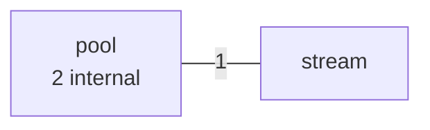
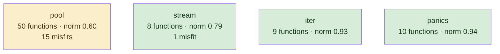

# conc

structured concurrency library; generics-heavy, one idea, written recently and at once

**What this rung shows:** the small-corpus floor: 85 functions, where IC and df caps have almost nothing to work with

| | |
|---|---|
| Corpus | [conc](https://github.com/sourcegraph/conc) |
| Pinned at | `v0.3.0` (`7b8c8f2875cb861bb61844c9bcaa1aed070adbd4`) |
| Project since | 2023 |
| doppel | `616ab78` |
| Command | `doppel analyze . --tests exclude --top 10` |

Run from the corpus root, so every path below is corpus-relative.
Regenerate with `task examples`.

## Run diagnostics

The corpus-level models doppel builds before ranking anything, as printed to stderr:

```
Scanning . ...
Generating concept documents...
Culture: 1 concepts modeled, 0 associations, 0 unusual realizations
Habitats: 4 modeled, 16 misfits; most uniform panics (norm 0.94), most diverse pool (norm 0.60)
Conventions: strongest concurrency (0.37), loosest concurrency (0.37)
Ecosystems: 8 profiled (8 dominance, 0 coalition, 0 conflict, 0 weak)
Found 81 functions. Retrieving candidates...
Retrieval: shape 3, concept 25, call 15 -> 40 unique pairs
  concept-only 60.0%  call-only 30.0%  suppressed-shape functions: 0  large identity buckets: 0  surviving labels: 313
Running structural comparison on 40 pairs...
Families: 0 over 3 components, 0 functions in a family
```

# Code Similarity Report

**Functions analyzed:** 81 | **Threshold:** 0.60 | **Pairs found:** 10

---

## What doppel sees

**81 functions** across **5 packages** — test functions excluded. Structural roles: 72 leaf, 2 orchestrator, 7 utility.

### Concepts

doppel reads intent from the AST into a fixed vocabulary and reasons over the tree, so two functions that share a *branch* score partial credit rather than nothing. Leaf counts below are this corpus.


**Nothing here is tagged** `caching`, `circuit_breaker`, `db_access`, `error_wrapping`, `file_io`, `grpc_call`, `http_call`, `logging`, `mapping`, `retry`, `serialization`, `transaction`, `validation`. That is a direct answer to "does this codebase already do X" — for those concepts, it does not.

| Concept | Functions | Convention |
|---|---:|---|
| `concurrency` | 8 | `0.37` (loose) |

Convention is how uniformly this corpus realizes a concept: `1.00` means every function carrying the tag does it the same way, and a low number means the tag covers several unrelated habits. A concept with fewer than five members is not modeled.

### Where the duplication is

Merge-worthy pairs folded up to their packages. An edge means two packages keep solving the same problem separately; a count on a node means the repetition is inside one package.



### How settled each package is

A package with at least five functions gets a habitat model: doppel learns what is normal there and measures how surprising each member is against it. **Norm** is how uniform the package's practice is. A **misfit** is a function alien to its package *and* to the wider subsystem around it — one that fits its neighbours a directory up is normal for this codebase and is not reported.



Most uniform is `panics` (norm `0.94`); most varied is `pool` (norm `0.60`). 16 functions are alien to their package and to the subsystem around it.

### How these candidates were found

Three channels propose candidates independently — shared rare *structure*, shared *concepts*, shared *calls* — and their union is what gets compared. This run: **40 candidate pairs** (shape 3, concept 25, call 15), of which 30% arrived on call evidence alone and 60% on concept evidence alone. A pair sharing none of the three is never compared, however alike it looks.

Each function is also an arena where its candidate concepts compete for its evidence. 8 functions reached an equilibrium: **8** settled on a single concept, **0** on a coalition, **0** hold concepts this corpus says do not go together.

### Corpus metrics

**Compression ratio:** `3.64`x — this corpus's canonical function bodies contain **1694 AST nodes** in total, which hash-cons (two nodes count as the same subtree exactly when their kind and every child match, all the way down) to **466 distinct subtree shapes**; the ratio is nodes divided by shapes, always >= 1.0, and it never feeds any score.

**Nearest-neighbour code-shape:** of **81 functions**, **25** had a code-shape neighbour among the pairs retrieval actually scored — their best score's p50/p90/p99 are `0.31` / `0.81` / `1.00`, and 24% of them (6 of 25) already clear this run's threshold of `0.60`. This is **not an exhaustive nearest-neighbour search** (that would be a full pairwise comparison); it is bounded by the same three retrieval channels the pair list itself is bounded by, so the other 56 functions are excluded here as having no *scored* neighbour, not asserted to have none at all.

---

## Local practice

The vocabulary above says what a concept *is*. This says what one looks like when **this** codebase writes it — learned from the corpus, so it describes the house style rather than a rule from anywhere else.

### How this codebase writes each concept

Only what is **distinctive**. A feature earns a row by being carried by this concept's members at least twice as often as by the corpus at large — nearly every Go function has a `return` and an `if`, so prevalence alone would describe the language rather than this codebase. Weights are how much a channel counts toward whether a member looks normal — calls 40, control flow 20, co-occurring tags 15, role 15, package 10.

**`concurrency`** — 8 functions

| Channel | Feature | | Members | vs corpus |
|---|---|---|---|---|
| calls ×40 | `github.com/sourcegraph/conc/internal/multierror.Join` | `███·······` | 2 of 8 | 10× |
| flow ×20 | `funclit` | `██████····` | 5 of 8 | 3.6× |
|  | `if` | `█████·····` | 4 of 8 | 2.7× |
| role ×15 | `utility` | `███·······` | 2 of 8 | 2.9× |
| package ×10 | `iter` | `███·······` | 2 of 8 | 2.2× |

---

## Match #1 — Code-shape: `1.0000`

| | Location | Function | Signature | Patterns |
|---|---|---|---|---|
| **A** | `pool/result_error_pool.go:55` | `pool.*ResultErrorPool[T].WithContext` | `(context.Context) (*ResultContextPool[T])` | — |
| **B** | `pool/result_pool.go:63` | `pool.*ResultPool[T].WithContext` | `(context.Context) (*ResultContextPool[T])` | — |

**Kind:** interface implementations — both implement `WithContext(context.Context) (*ResultContextPool[T])` on `*ResultErrorPool[T]` and `*ResultPool[T]`, in package `pool`

**Explain:** identical after rename

**Code similarity:** `wl 1.00  flow 1.00  nesting 1.00  sig 1.00  size 1.00`

**Containment:** `1.00`

**Evidence:** `75.33` (shape 75.33, concept 0.00, call 0.00)

**Trophic:** `1.00`

**Shared structure:**

- `2.60` — `depth-3 COMPOSITE`
- `2.60` — `depth-3 KV`
- `2.60` — `depth-3 CALL`

**Structural overlap:** `0.50` (merge-worthy)

- share 2 callees: [WithContext, p.panicIfInitialized]
- both are leaf functions
- same package
- same visibility
- both are methods, on *ResultErrorPool[T] and *ResultPool[T]

---

## Match #2 — Code-shape: `0.6118`

| | Location | Function | Signature | Patterns |
|---|---|---|---|---|
| **A** | `pool/result_context_pool.go:22` | `pool.*ResultContextPool[T].Go` | `(func(context.Context) (T, error))` | — |
| **B** | `pool/result_error_pool.go:25` | `pool.*ResultErrorPool[T].Go` | `(func() (T, error))` | — |

**Explain:** differs by one extra selector, four extra ident, one extra field

**Code similarity:** `wl 0.60  flow 1.00  nesting 1.00  sig 0.00  size 0.87`

**Containment:** `0.81`

**Evidence:** `111.68` (shape 108.39, concept 0.00, call 3.30)

**Trophic:** `0.93`

**Shared structure:**

- `2.60` — `depth-3 BIN`
- `2.60` — `depth-3 CALL`
- `2.60` — `depth-3 IF`

**Habitat:** A fits poorly in `pool` (fit 0.01, package norm 0.60)

**Habitat:** B fits poorly in `pool` (fit 0.01, package norm 0.60)

**Structural overlap:** `0.60` (merge-worthy)

- share 3 callees: [Go, add, f]
- overlapping call-graph neighborhoods (1.00): 2 shared
- both are leaf functions
- same package
- callees do related work (1.00): [concurrency]
- same visibility
- both are methods, on *ResultContextPool[T] and *ResultErrorPool[T]
- call into same packages: [pool]

---

## Match #3 — Code-shape: `0.8123`

| | Location | Function | Signature | Patterns |
|---|---|---|---|---|
| **A** | `pool/error_pool.go:45` | `pool.*ErrorPool.WithContext` | `(context.Context) (*ContextPool)` | — |
| **B** | `pool/pool.go:138` | `pool.*Pool.WithContext` | `(context.Context) (*ContextPool)` | — |

**Kind:** interface implementations — both implement `WithContext(context.Context) (*ContextPool)` on `*ErrorPool` and `*Pool`, in package `pool`

**Explain:** differs by one extra call, one extra selector, one extra ident

**Code similarity:** `wl 0.69  flow 1.00  nesting 1.00  sig 1.00  size 0.91`

**Containment:** `0.91`

**Evidence:** `92.93` (shape 89.23, concept 0.00, call 3.70)

**Trophic:** `0.97`

**Shared structure:**

- `4.51` — `depth-0 KV` ×3
- `4.39` — `depth-3 KV` ×2
- `4.39` — `depth-2 KV` ×2

**Habitat:** A fits poorly in `pool` (fit 0.01, package norm 0.60)

**Habitat:** B fits poorly in `pool` (fit 0.01, package norm 0.60)

**Structural overlap:** `0.40` (not merge-worthy)

- share 2 callees: [context.WithCancel, p.panicIfInitialized]
- both are leaf functions
- same package
- same visibility
- both are methods, on *ErrorPool and *Pool

---

## Match #4 — Code-shape: `0.4657`

| | Location | Function | Signature | Patterns |
|---|---|---|---|---|
| **A** | `iter/map.go:27` | `iter.Mapper[T, R].Map` | `([]T, func(*T) R) ([]R)` | — |
| **B** | `iter/map.go:48` | `iter.Mapper[T, R].MapErr` | `([]T, func(*T) (R, error)) ([]R, error)` | concurrency |

**Explain:** differs by two extra assign, two extra declaration, one extra if, and 8 more kinds

**Profile B:** `concurrency` 1.00 (dominance)

**Code similarity:** `wl 0.33  flow 0.82  nesting 0.89  sig 0.40  size 0.50`

**Containment:** `0.73` — most of the smaller body's shape is inside the larger

**Evidence:** `124.27` (shape 120.56, concept 0.00, call 3.70)

**Trophic:** `0.76`

**Shared structure:**

- `3.01` — `depth-3 INDEX` ×2
- `3.01` — `depth-2 INDEX` ×2
- `3.01` — `depth-1 INDEX` ×2

**Structural overlap:** `0.49` (merge-worthy)

- share 4 callees: [ForEachIdx, f, len, make]
- overlapping call-graph neighborhoods (1.00): 1 shared
- both are leaf functions
- same package
- same visibility
- same receiver type: Mapper[T, R]
- call into same packages: [iter]

---

## Match #5 — Code-shape: `0.5436`

| | Location | Function | Signature | Patterns |
|---|---|---|---|---|
| **A** | `pool/pool.go:100` | `pool.*Pool.init` | `()` | concurrency |
| **B** | `stream/stream.go:110` | `stream.*Stream.init` | `()` | concurrency |

**Kind:** interface implementations — both implement `init()` on `*Pool` and `*Stream`, sibling packages `pool` and `stream`

**Explain:** differs by five extra selector, two extra call, one extra binary, and 5 more kinds

**Profile A:** `concurrency` 1.00 (dominance)

**Profile B:** `concurrency` 1.00 (dominance)

**Code similarity:** `wl 0.24  flow 1.00  nesting 1.00  sig 1.00  size 0.55`

**Containment:** `0.46`

**Evidence:** `40.15` (shape 39.26, concept 0.89, call 0.00)

**Trophic:** `0.67`

**Shared structure:**

- `2.60` — `depth-3 BLOCK`
- `2.60` — `depth-3 EXPRSTMT`
- `2.60` — `depth-2 CALL`

**Habitat:** A fits poorly in `pool` (fit 0.08, package norm 0.60)

**Structural overlap:** `0.49` (merge-worthy)

- share 2 callees: [Do, make]
- share patterns: [concurrency]
- both are leaf functions
- same visibility
- both are methods, on *Pool and *Stream

---

## Match #6 — Code-shape: `0.2874`

| | Location | Function | Signature | Patterns |
|---|---|---|---|---|
| **A** | `pool/result_error_pool.go:25` | `pool.*ResultErrorPool[T].Go` | `(func() (T, error))` | — |
| **B** | `pool/result_pool.go:32` | `pool.*ResultPool[T].Go` | `(func() T)` | — |

**Explain:** differs by one extra assign, one extra if, one extra return, and 6 more kinds

**Code similarity:** `wl 0.25  flow 0.58  nesting 0.45  sig 0.00  size 0.54`

**Containment:** `0.58`

**Evidence:** `38.50` (shape 35.20, concept 0.00, call 3.30)

**Trophic:** `0.43`

**Shared structure:**

- `2.20` — `depth-2 BLOCK`
- `2.20` — `depth-1 EXPRSTMT`
- `2.20` — `depth-0 CALL`

**Habitat:** A fits poorly in `pool` (fit 0.01, package norm 0.60)

**Habitat:** B fits poorly in `pool` (fit 0.01, package norm 0.60)

**Structural overlap:** `0.60` (not merge-worthy)

- share 3 callees: [Go, add, f]
- overlapping call-graph neighborhoods (1.00): 2 shared
- both are leaf functions
- same package
- callees do related work (1.00): [concurrency]
- same visibility
- both are methods, on *ResultErrorPool[T] and *ResultPool[T]
- call into same packages: [pool]

---

## Match #7 — Code-shape: `0.1291`

| | Location | Function | Signature | Patterns |
|---|---|---|---|---|
| **A** | `pool/error_pool.go:85` | `pool.*ErrorPool.addErr` | `(error)` | concurrency |
| **B** | `pool/result_pool.go:89` | `pool.*resultAggregator[T].add` | `(T)` | concurrency |

**Explain:** differs by three extra if, one extra assign, four extra selector, and 4 more kinds

**Profile A:** `concurrency` 1.00 (dominance)

**Profile B:** `concurrency` 1.00 (dominance)

**Code similarity:** `wl 0.22  flow 0.00  nesting 0.00  sig 0.00  size 0.50`

**Containment:** `0.57`

**Evidence:** `38.27` (shape 37.37, concept 0.89, call 0.00)

**Trophic:** `0.59`

**Shared structure:**

- `2.60` — `depth-3 CALL`
- `2.60` — `depth-3 CALL`
- `2.60` — `depth-3 EXPRSTMT`

**Habitat:** A fits poorly in `pool` (fit 0.00, package norm 0.60)

**Habitat:** B fits poorly in `pool` (fit 0.02, package norm 0.60)

**Structural overlap:** `0.63` (not merge-worthy)

- share 2 callees: [Lock, Unlock]
- share patterns: [concurrency]
- both are utility functions
- same package
- same visibility
- both are methods, on *ErrorPool and *resultAggregator[T]
- called from same packages: [pool]

---

## Match #8 — Code-shape: `0.2363`

| | Location | Function | Signature | Patterns |
|---|---|---|---|---|
| **A** | `pool/result_context_pool.go:22` | `pool.*ResultContextPool[T].Go` | `(func(context.Context) (T, error))` | — |
| **B** | `pool/result_pool.go:32` | `pool.*ResultPool[T].Go` | `(func() T)` | — |

**Explain:** differs by one extra assign, one extra if, one extra return, and 6 more kinds

**Code similarity:** `wl 0.16  flow 0.58  nesting 0.45  sig 0.00  size 0.47`

**Containment:** `0.45`

**Evidence:** `30.07` (shape 26.78, concept 0.00, call 3.30)

**Trophic:** `0.35`

**Shared structure:**

- `2.20` — `depth-2 BLOCK`
- `2.20` — `depth-1 EXPRSTMT`
- `2.20` — `depth-0 CALL`

**Habitat:** A fits poorly in `pool` (fit 0.01, package norm 0.60)

**Habitat:** B fits poorly in `pool` (fit 0.01, package norm 0.60)

**Structural overlap:** `0.60` (not merge-worthy)

- share 3 callees: [Go, add, f]
- overlapping call-graph neighborhoods (1.00): 2 shared
- both are leaf functions
- same package
- callees do related work (1.00): [concurrency]
- same visibility
- both are methods, on *ResultContextPool[T] and *ResultPool[T]
- call into same packages: [pool]

---

## Match #9 — Code-shape: `0.2373`

| | Location | Function | Signature | Patterns |
|---|---|---|---|---|
| **A** | `iter/iter.go:59` | `iter.Iterator[T].ForEachIdx` | `([]T, func(int, *T))` | concurrency |
| **B** | `iter/map.go:48` | `iter.Mapper[T, R].MapErr` | `([]T, func(*T) (R, error)) ([]R, error)` | concurrency |

**Explain:** differs by five extra assign, two extra for, one extra if, and 14 more kinds

**Profile A:** `concurrency` 1.00 (dominance)

**Profile B:** `concurrency` 1.00 (dominance)

**Code similarity:** `wl 0.07  flow 0.58  nesting 0.98  sig 0.20  size 0.73`

**Containment:** `0.17`

**Evidence:** `50.66` (shape 49.76, concept 0.89, call 0.00)

**Trophic:** `0.27`

**Shared structure:**

- `3.82` — `depth-1 DECLSTMT` ×2
- `3.82` — `depth-0 DECLSTMT` ×2
- `3.82` — `depth-0 VALUESPEC` ×2

**Structural overlap:** `0.55` (not merge-worthy)

- share 2 callees: [f, len]
- share patterns: [concurrency]
- both are leaf functions
- same package
- same visibility
- both are methods, on Iterator[T] and Mapper[T, R]
- call into same packages: [iter]

---

## Match #10 — Code-shape: `0.1697`

| | Location | Function | Signature | Patterns |
|---|---|---|---|---|
| **A** | `pool/context_pool.go:24` | `pool.*ContextPool.Go` | `(func(ctx context.Context) error)` | — |
| **B** | `pool/error_pool.go:28` | `pool.*ErrorPool.Go` | `(func() error)` | — |

**Explain:** differs by three extra if, two extra assign, two extra return, and 11 more kinds

**Code similarity:** `wl 0.11  flow 0.47  nesting 0.22  sig 0.00  size 0.25`

**Containment:** `0.51`

**Evidence:** `32.59` (shape 28.89, concept 0.00, call 3.70)

**Trophic:** `0.30`

**Shared structure:**

- `2.60` — `depth-1 EXPRSTMT`
- `2.60` — `depth-0 CALL`
- `1.69` — `depth-3 BLOCK`

**Habitat:** A fits poorly in `pool` (fit 0.00, package norm 0.60)

**Habitat:** B fits poorly in `pool` (fit 0.00, package norm 0.60)

**Structural overlap:** `0.46` (not merge-worthy)

- share 2 callees: [Go, f]
- overlapping call-graph neighborhoods (1.00): 1 shared
- both are leaf functions
- same package
- callees do related work (1.00): [concurrency]
- same visibility
- both are methods, on *ContextPool and *ErrorPool
- call into same packages: [pool]

---

