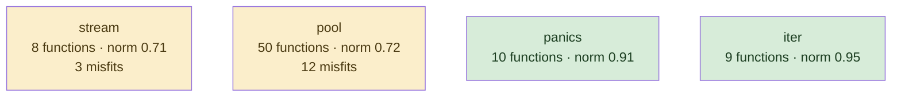

# conc

structured concurrency library; generics-heavy, one idea, written recently and at once

**What this rung shows:** the small-corpus floor: 85 functions, where IC and df caps have almost nothing to work with

| | |
|---|---|
| Corpus | [conc](https://github.com/sourcegraph/conc) |
| Pinned at | `v0.3.0` (`7b8c8f2875cb861bb61844c9bcaa1aed070adbd4`) |
| Project since | 2023 |
| doppel | `7c27a17` |
| Command | `doppel analyze . --tests exclude --top 10` |

Run from the corpus root, so every path below is corpus-relative.
Regenerate with `task examples`; CI regenerates on every push to master.

## Run diagnostics

The corpus-level models doppel builds before ranking anything, as printed to stderr:

```
Scanning . ...
Learning concept vocabulary...
Lexicon: 6 concepts (1 seeded, 5 emergent), 196/428 features above 29 df, 44 functions unlabeled
Generating concept documents...
Culture: 6 concepts modeled, 1 associations, 4 unusual realizations
Habitats: 4 modeled, 15 misfits; most uniform iter (norm 0.95), most diverse stream (norm 0.71)
Conventions: strongest p.pool+multierror (0.53), loosest lock+unlock (0.33)
Ecosystems: 38 profiled (36 dominance, 2 coalition, 0 conflict, 0 weak)
Calibration: rate 0.01 over 1830 shape / 3240 overlap null pairs -> threshold 0.85, struct-min 0.51, family-min 0.85
Found 81 functions. Retrieving candidates...
Retrieval: shape 22, concept 117, call 15 -> 151 unique pairs
  concept-only 76.2%  call-only 7.9%  suppressed-shape functions: 0  large identity buckets: 0  surviving patterns: 448
Running structural comparison on 151 pairs...
  10 pairs remain after struct-min=0.51 filter
  2 pairs suppressed by max-per-func=2
```

# Code Similarity Report

**Functions analyzed:** 81 | **Threshold:** 0.60 | **Pairs found:** 8

---

## What doppel sees

**81 functions** across **5 packages** — test functions excluded. Structural roles: 72 leaf, 2 orchestrator, 7 utility.

### Concepts

These concepts were **learned from this corpus**, not read off a fixed list: each one is a group of functions that share a way of being written, named after the evidence that identified it. They hang from an authored interior, so two functions under the same *branch* score partial credit rather than nothing. Counts below are members; membership is graded, and a function can carry several.


**No practice here for** `caching`, `circuit_breaker`, `db_access`, `error_wrapping`, `file_io`, `grpc_call`, `http_call`, `logging`, `mapping`, `retry`, `serialization`, `transaction`, `validation`. Concepts are learned from this corpus, so one can never be absent — it exists because functions carry it. These are the *seeds* the search started from that grew nothing: a direct answer to "does this codebase already do X".

| Concept | Functions | Convention |
|---|---:|---|
| `fmt+debug` | 11 | `0.36` (loose) |
| `lock+unlock` | 11 | `0.33` (loose) |
| `s.pool+s.queue` | 7 | `0.37` (loose) |
| `p.limiter+conc` | 5 | `0.42` (loose) |
| `p.pool+multierror` | 5 | `0.53` (settled) |
| `p.tasks+conc` | 5 | `0.41` (loose) |

Convention is how uniformly this corpus realizes a concept: `1.00` means every function carrying the tag does it the same way, and a low number means the tag covers several unrelated habits. A concept with fewer than five members is not modeled.

### Where the duplication is

Merge-worthy pairs folded up to their packages. An edge means two packages keep solving the same problem separately; a count on a node means the repetition is inside one package.

### How settled each package is

A package with at least five functions gets a habitat model: doppel learns what is normal there and measures how surprising each member is against it. **Norm** is how uniform the package's practice is. A **misfit** is a function alien to its package *and* to the wider subsystem around it — one that fits its neighbours a directory up is normal for this codebase and is not reported.



Most uniform is `iter` (norm `0.95`); most varied is `stream` (norm `0.71`). 15 functions are alien to their package and to the subsystem around it.

### How these candidates were found

Three channels propose candidates independently — shared rare *structure*, shared *concepts*, shared *calls* — and their union is what gets compared. This run: **151 candidate pairs** (shape 22, concept 117, call 15), of which 8% arrived on call evidence alone and 76% on concept evidence alone. A pair sharing none of the three is never compared, however alike it looks.

Each function is also an arena where its candidate concepts compete for its evidence. 38 functions reached an equilibrium: **36** settled on a single concept, **2** on a coalition, **0** hold concepts this corpus says do not go together.

_2 further pairs were held back so no single function fills the report._

---

## Local practice

The vocabulary above says what a concept *is*. This says what one looks like when **this** codebase writes it — learned from the corpus, so it describes the house style rather than a rule from anywhere else.

### How this codebase writes each concept

Only what is **distinctive**. A feature earns a row by being carried by this concept's members at least twice as often as by the corpus at large — nearly every Go function has a `return` and an `if`, so prevalence alone would describe the language rather than this codebase. Weights are how much a channel counts toward whether a member looks normal — calls 40, control flow 20, co-occurring tags 15, role 15, package 10.

**`fmt+debug`** — 11 functions

| Channel | Feature | | Members | vs corpus |
|---|---|---|---|---|
| flow ×20 | `if` | `█████·····` | 5 of 11 | 2.5× |
| role ×15 | `utility` | `████······` | 4 of 11 | 4.2× |
| package ×10 | `panics` | `███████···` | 8 of 11 | 5.9× |
|  | `iter` | `███·······` | 3 of 11 | 2.5× |

**`lock+unlock`** — 11 functions

| Channel | Feature | | Members | vs corpus |
|---|---|---|---|---|
| flow ×20 | `funclit` | `███████···` | 8 of 11 | 4.2× |
|  | `if` | `███████···` | 8 of 11 | 3.9× |

**`s.pool+s.queue`** — 7 functions

| Channel | Feature | | Members | vs corpus |
|---|---|---|---|---|
| flow ×20 | `defer` | `████······` | 3 of 7 | 4.3× |
|  | `funclit` | `████······` | 3 of 7 | 2.5× |
| cotags ×15 | `lock+unlock` | `███·······` | 2 of 7 | 2.1× |
| package ×10 | `stream` | `██████████` | 7 of 7 | 10× |

**`p.limiter+conc`** — 5 functions

| Channel | Feature | | Members | vs corpus |
|---|---|---|---|---|
| flow ×20 | `if` | `████······` | 2 of 5 | 2.2× |
| cotags ×15 | `p.tasks+conc` | `████······` | 2 of 5 | 6.5× |

**`p.pool+multierror`** — 5 functions

Nothing distinctive: its members do what the rest of the corpus does. The tag groups them; a shared way of writing them does not.

**`p.tasks+conc`** — 5 functions

| Channel | Feature | | Members | vs corpus |
|---|---|---|---|---|
| flow ×20 | `if` | `████······` | 2 of 5 | 2.2× |
| cotags ×15 | `p.limiter+conc` | `████······` | 2 of 5 | 6.5× |
|  | `lock+unlock` | `████······` | 2 of 5 | 2.9× |

### What travels with what

Co-occurrence measured against chance across every function. Only relationships at least twice — or at most half — as common as chance are reported; near-chance company is not culture. Each kind is listed separately, because there are far more call tokens than concepts and one shared list is all calls. Within a kind, strongest first means lift weighted by how many functions carry it — a 100× relationship holding for three functions is a weaker finding than a 30× one holding for thirty.

**Together more than chance — tag~role**

- 4 of 11 `fmt+debug` functions also `utility` — 4.2× chance

### Functions drifting from their own concept

These carry a tag but look nothing like the other functions carrying it. Typicality is measured against the concept's own median, so a genuinely varied concept lowers its own bar and a tight one can flag nobody.

| Function | Concept | Typicality | Concept median | |
|---|---|---:|---:|---|
| `stream.*Stream.callbacker` <br/>`stream/stream.go:121` | `s.pool+s.queue` | `0.23` | `0.59` | no near-duplicate |
| `pool.*Pool.worker` <br/>`pool/pool.go:148` | `p.tasks+conc` | `0.29` | `0.59` | no near-duplicate |
| `stream.*Stream.Go` <br/>`stream/stream.go:62` | `s.pool+s.queue` | `0.29` | `0.59` | no near-duplicate |
| `iter.Iterator[T].ForEachIdx` <br/>`iter/iter.go:59` | `fmt+debug` | `0.14` | `0.38` | no near-duplicate |

A row marked _no near-duplicate_ appears in no reported pair: nothing else in this report explains it, which makes it drift rather than duplication.

---

## Match #1 — Code-shape: `0.7259`

| | Location | Function | Signature | Patterns |
|---|---|---|---|---|
| **A** | `pool/result_context_pool.go:22` | `pool.*ResultContextPool[T].Go` | `(func(context.Context) (T, error))` | lock+unlock 0.47 |
| **B** | `pool/result_error_pool.go:25` | `pool.*ResultErrorPool[T].Go` | `(func() (T, error))` | lock+unlock 0.47 |

**Profile A:** `lock+unlock` 1.00 (dominance)

**Profile B:** `lock+unlock` 1.00 (dominance)

**Code similarity:** `ast 0.79  flow 1.00  nesting 1.00  sig 0.00  size 0.87`

**Evidence:** `147.15` (shape 143.19, concept 0.66, call 3.30)

**Trophic:** `0.94`

**Shared structure:**

- `3.42` — `seq[ assign:=(call:f) ; if(bin:\|\|(bin,sel)) ]`
- `3.42` — `seq[ if(bin:\|\|(bin,sel)) ; return(id) ]`
- `3.42` — `if(bin:\|\|(bin,sel))`

**Habitat:** A fits poorly in `pool` (fit 0.11, package norm 0.72)

**Habitat:** B fits poorly in `pool` (fit 0.11, package norm 0.72)

**Structural overlap:** `0.79` (merge-worthy)

- share 3 callees: [Go, add, f]
- overlapping call-graph neighborhoods (1.00): 2 shared
- share patterns: [lock+unlock]
- both are leaf functions
- same package
- callees do related work (1.00): [lock+unlock]
- same visibility
- both are methods, on *ResultContextPool[T] and *ResultErrorPool[T]
- call into same packages: [pool]

---

## Match #2 — Code-shape: `0.5864`

| | Location | Function | Signature | Patterns |
|---|---|---|---|---|
| **A** | `iter/map.go:27` | `iter.Mapper[T, R].Map` | `([]T, func(*T) R) ([]R)` | — |
| **B** | `iter/map.go:48` | `iter.Mapper[T, R].MapErr` | `([]T, func(*T) (R, error)) ([]R, error)` | lock+unlock 0.76 |

**Profile B:** `lock+unlock` 1.00 (dominance)

**Code similarity:** `ast 0.53  flow 0.82  nesting 0.89  sig 0.40  size 0.50`

**Evidence:** `168.23` (shape 164.53, concept 0.00, call 3.70)

**Trophic:** `0.72`

**Shared structure:**

- `3.42` — `assign=(call:f)`
- `3.42` — `flow:call:make→return`
- `3.01` — `do(call:ForEachIdx)`

**Structural overlap:** `0.54` (merge-worthy)

- share 4 callees: [ForEachIdx, f, len, make]
- overlapping call-graph neighborhoods (1.00): 1 shared
- both are leaf functions
- same package
- callees do related work (1.00): [fmt+debug]
- same visibility
- same receiver type: Mapper[T, R]
- call into same packages: [iter]

---

## Match #3 — Code-shape: `0.2690`

| | Location | Function | Signature | Patterns |
|---|---|---|---|---|
| **A** | `pool/error_pool.go:85` | `pool.*ErrorPool.addErr` | `(error)` | lock+unlock 0.74 |
| **B** | `pool/result_pool.go:89` | `pool.*resultAggregator[T].add` | `(T)` | lock+unlock 0.72 |

**Profile A:** `lock+unlock` 0.68, `fmt+debug` 0.32 (dominance)

**Profile B:** `lock+unlock` 0.54, `fmt+debug` 0.46 (coalition)

**Code similarity:** `ast 0.45  flow 0.00  nesting 0.00  sig 0.00  size 0.50`

**Evidence:** `79.26` (shape 78.24, concept 1.02, call 0.00)

**Trophic:** `0.54`

**Shared structure:**

- `3.01` — `do(call:Lock)`
- `3.01` — `do(call:Unlock)`

**Habitat:** A fits poorly in `pool` (fit 0.02, package norm 0.72)

**Habitat:** B fits poorly in `pool` (fit 0.27, package norm 0.72)

**Structural overlap:** `0.65` (not merge-worthy)

- share 2 callees: [Lock, Unlock]
- share patterns: [lock+unlock]
- both are utility functions
- same package
- callers do related work (0.39): [lock+unlock]
- same visibility
- both are methods, on *ErrorPool and *resultAggregator[T]
- called from same packages: [pool]

---

## Match #4 — Code-shape: `0.3823`

| | Location | Function | Signature | Patterns |
|---|---|---|---|---|
| **A** | `pool/result_error_pool.go:25` | `pool.*ResultErrorPool[T].Go` | `(func() (T, error))` | lock+unlock 0.47 |
| **B** | `pool/result_pool.go:32` | `pool.*ResultPool[T].Go` | `(func() T)` | — |

**Profile A:** `lock+unlock` 1.00 (dominance)

**Code similarity:** `ast 0.41  flow 0.58  nesting 0.45  sig 0.00  size 0.54`

**Evidence:** `46.90` (shape 43.60, concept 0.00, call 3.30)

**Trophic:** `0.44`

**Shared structure:**

- `3.01` — `do(call:add)`
- `1.91` — `do(call:Go)`

**Habitat:** A fits poorly in `pool` (fit 0.11, package norm 0.72)

**Habitat:** B fits poorly in `pool` (fit 0.13, package norm 0.72)

**Structural overlap:** `0.60` (not merge-worthy)

- share 3 callees: [Go, add, f]
- overlapping call-graph neighborhoods (1.00): 2 shared
- both are leaf functions
- same package
- callees do related work (1.00): [lock+unlock]
- same visibility
- both are methods, on *ResultErrorPool[T] and *ResultPool[T]
- call into same packages: [pool]

---

## Match #5 — Code-shape: `0.3654`

| | Location | Function | Signature | Patterns |
|---|---|---|---|---|
| **A** | `pool/result_context_pool.go:22` | `pool.*ResultContextPool[T].Go` | `(func(context.Context) (T, error))` | lock+unlock 0.47 |
| **B** | `pool/result_pool.go:32` | `pool.*ResultPool[T].Go` | `(func() T)` | — |

**Profile A:** `lock+unlock` 1.00 (dominance)

**Code similarity:** `ast 0.38  flow 0.58  nesting 0.45  sig 0.00  size 0.47`

**Evidence:** `46.90` (shape 43.60, concept 0.00, call 3.30)

**Trophic:** `0.40`

**Shared structure:**

- `3.01` — `do(call:add)`
- `1.91` — `do(call:Go)`

**Habitat:** A fits poorly in `pool` (fit 0.11, package norm 0.72)

**Habitat:** B fits poorly in `pool` (fit 0.13, package norm 0.72)

**Structural overlap:** `0.60` (not merge-worthy)

- share 3 callees: [Go, add, f]
- overlapping call-graph neighborhoods (1.00): 2 shared
- both are leaf functions
- same package
- callees do related work (1.00): [lock+unlock]
- same visibility
- both are methods, on *ResultContextPool[T] and *ResultPool[T]
- call into same packages: [pool]

---

## Match #6 — Code-shape: `0.2803`

| | Location | Function | Signature | Patterns |
|---|---|---|---|---|
| **A** | `pool/pool.go:89` | `pool.*Pool.WithMaxGoroutines` | `(int) (*Pool)` | p.limiter+conc 0.50 |
| **B** | `pool/pool.go:127` | `pool.*Pool.deref` | `() (Pool)` | p.limiter+conc 0.50 |

**Profile A:** `p.limiter+conc` 1.00 (dominance)

**Profile B:** `p.limiter+conc` 1.00 (dominance)

**Code similarity:** `ast 0.15  flow 0.71  nesting 1.00  sig 0.00  size 0.56`

**Evidence:** `6.91` (shape 5.86, concept 1.05, call 0.00)

**Trophic:** `0.12`

**Shared structure:**

- `1.07` — `do(call:panicIfInitialized)`

**Structural overlap:** `0.52` (not merge-worthy)

- share 1 callees: [p.panicIfInitialized]
- share patterns: [p.limiter+conc]
- both are leaf functions
- same package
- same receiver type: Pool

---

## Match #7 — Code-shape: `0.1167`

| | Location | Function | Signature | Patterns |
|---|---|---|---|---|
| **A** | `panics/panics.go:21` | `panics.*Catcher.Try` | `(func())` | fmt+debug 0.51 |
| **B** | `panics/panics.go:36` | `panics.*Catcher.Repanic` | `()` | fmt+debug 0.49 |

**Profile A:** `fmt+debug` 1.00 (dominance)

**Profile B:** `fmt+debug` 1.00 (dominance)

**Code similarity:** `ast 0.11  flow 0.00  nesting 1.00  sig 0.00  size 0.56`

**Evidence:** `0.71` (shape 0.00, concept 0.71, call 0.00)

**Trophic:** `0.00`

**Structural overlap:** `0.68` (not merge-worthy)

- share 1 callers: [stream.*Stream.callbacker]
- overlapping call-graph neighborhoods (0.57): 4 shared
- share patterns: [fmt+debug]
- both are utility functions
- same package
- callers do related work (1.00): [s.pool+s.queue]
- callees do related work (1.00): [fmt+debug]
- same visibility
- same receiver type: Catcher
- called from same packages: [conc, stream]
- call into same packages: [panics]

---

## Match #8 — Code-shape: `0.1000`

| | Location | Function | Signature | Patterns |
|---|---|---|---|---|
| **A** | `panics/panics.go:21` | `panics.*Catcher.Try` | `(func())` | fmt+debug 0.51 |
| **B** | `panics/panics.go:44` | `panics.*Catcher.Recovered` | `() (*Recovered)` | fmt+debug 0.49 |

**Profile A:** `fmt+debug` 1.00 (dominance)

**Profile B:** `fmt+debug` 1.00 (dominance)

**Code similarity:** `ast 0.08  flow 0.00  nesting 1.00  sig 0.00  size 0.89`

**Evidence:** `0.71` (shape 0.00, concept 0.71, call 0.00)

**Trophic:** `0.00`

**Structural overlap:** `0.56` (not merge-worthy)

- share 1 callers: [panics.Try]
- overlapping call-graph neighborhoods (0.43): 3 shared
- share patterns: [fmt+debug]
- both are utility functions
- same package
- same visibility
- same receiver type: Catcher
- called from same packages: [conc, panics]

---

