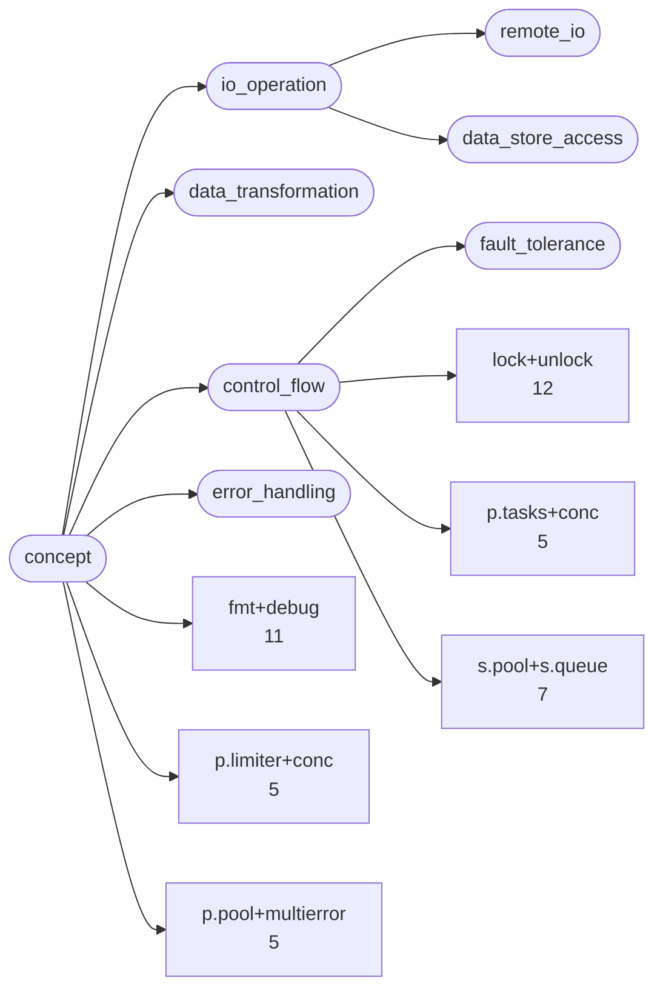
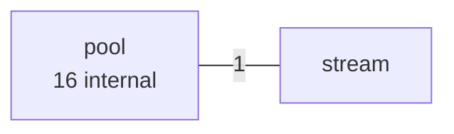
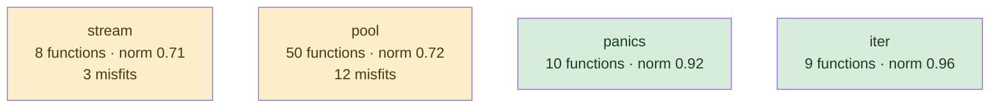
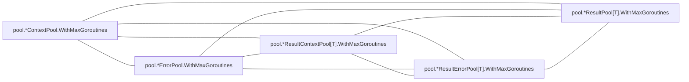

# conc

structured concurrency library; generics-heavy, one idea, written recently and at once

**What this rung shows:** the small-corpus floor: 85 functions, where IC and df caps have almost nothing to work with

| | |
|---|---|
| Corpus | [conc](https://github.com/sourcegraph/conc) |
| Pinned at | `v0.3.0` (`7b8c8f2875cb861bb61844c9bcaa1aed070adbd4`) |
| Project since | 2023 |
| doppel | `cca7108` |
| Command | `doppel analyze . --tests exclude --top 10` |

Run from the corpus root, so every path below is corpus-relative.
Regenerate with `task examples`; CI regenerates on every push to master.

## Run diagnostics

The corpus-level models doppel builds before ranking anything, as printed to stderr:

```
Scanning . ...
Learning concept vocabulary...
Lexicon: 6 concepts (1 seeded, 5 emergent), 171/407 features above 29 df, 43 functions unlabeled
Generating concept documents...
Culture: 6 concepts modeled, 1 associations, 4 unusual realizations
Habitats: 4 modeled, 15 misfits; most uniform iter (norm 0.96), most diverse stream (norm 0.71)
Conventions: strongest p.pool+multierror (0.53), loosest lock+unlock (0.33)
Ecosystems: 40 profiled (39 dominance, 1 coalition, 0 conflict, 0 weak)
Calibration: rate 0.01 declined (only 780 eligible shape null pairs (need 1000)); defaults kept
Found 81 functions. Retrieving candidates...
Retrieval: shape 26, concept 120, call 15 -> 152 unique pairs
  concept-only 75.0%  call-only 7.2%  suppressed-shape functions: 0  large identity buckets: 0  surviving labels: 354
Running structural comparison on 152 pairs...
Families: 1 over 5 components, 5 functions in a family
  6 pairs suppressed by max-per-func=2
```

# Code Similarity Report

**Functions analyzed:** 81 | **Threshold:** 0.38 | **Pairs found:** 10

---

## What doppel sees

**81 functions** across **5 packages** — test functions excluded. Structural roles: 72 leaf, 2 orchestrator, 7 utility.

### Concepts

These concepts were **learned from this corpus**, not read off a fixed list: each one is a group of functions that share a way of being written, named after the evidence that identified it. They hang from an authored interior, so two functions under the same *branch* score partial credit rather than nothing. Counts below are members; membership is graded, and a function can carry several.



**No practice here for** `caching`, `circuit_breaker`, `db_access`, `error_wrapping`, `file_io`, `grpc_call`, `http_call`, `logging`, `mapping`, `retry`, `serialization`, `transaction`, `validation`. Concepts are learned from this corpus, so one can never be absent — it exists because functions carry it. These are the *seeds* the search started from that grew nothing: a direct answer to "does this codebase already do X".

| Concept | Functions | Convention |
|---|---:|---|
| `lock+unlock` | 12 | `0.33` (loose) |
| `fmt+debug` | 11 | `0.36` (loose) |
| `s.pool+s.queue` | 7 | `0.37` (loose) |
| `p.limiter+conc` | 5 | `0.42` (loose) |
| `p.pool+multierror` | 5 | `0.53` (settled) |
| `p.tasks+conc` | 5 | `0.41` (loose) |

Convention is how uniformly this corpus realizes a concept: `1.00` means every function carrying the tag does it the same way, and a low number means the tag covers several unrelated habits. A concept with fewer than five members is not modeled.

### Where the duplication is

Merge-worthy pairs folded up to their packages. An edge means two packages keep solving the same problem separately; a count on a node means the repetition is inside one package.



### How settled each package is

A package with at least five functions gets a habitat model: doppel learns what is normal there and measures how surprising each member is against it. **Norm** is how uniform the package's practice is. A **misfit** is a function alien to its package *and* to the wider subsystem around it — one that fits its neighbours a directory up is normal for this codebase and is not reported.



Most uniform is `iter` (norm `0.96`); most varied is `stream` (norm `0.71`). 15 functions are alien to their package and to the subsystem around it.

### How these candidates were found

Three channels propose candidates independently — shared rare *structure*, shared *concepts*, shared *calls* — and their union is what gets compared. This run: **152 candidate pairs** (shape 26, concept 120, call 15), of which 7% arrived on call evidence alone and 75% on concept evidence alone. A pair sharing none of the three is never compared, however alike it looks.

Each function is also an arena where its candidate concepts compete for its evidence. 40 functions reached an equilibrium: **39** settled on a single concept, **1** on a coalition, **0** hold concepts this corpus says do not go together.

_6 further pairs were held back so no single function fills the report._

### Corpus metrics

**Compression ratio:** `3.64`x — this corpus's canonical function bodies contain **1694 AST nodes** in total, which hash-cons (two nodes count as the same subtree exactly when their kind and every child match, all the way down) to **466 distinct subtree shapes**; the ratio is nodes divided by shapes, always >= 1.0, and it never feeds any score.

**Nearest-neighbour code-shape:** of **81 functions**, **57** had a code-shape neighbour among the pairs retrieval actually scored — their best score's p50/p90/p99 are `0.40` / `0.90` / `1.00`, and 54% of them (31 of 57) already clear this run's threshold of `0.38`. This is **not an exhaustive nearest-neighbour search** (that would be a full pairwise comparison); it is bounded by the same three retrieval channels the pair list itself is bounded by, so the other 24 functions are excluded here as having no *scored* neighbour, not asserted to have none at all.

---

## Local practice

The vocabulary above says what a concept *is*. This says what one looks like when **this** codebase writes it — learned from the corpus, so it describes the house style rather than a rule from anywhere else.

### How this codebase writes each concept

Only what is **distinctive**. A feature earns a row by being carried by this concept's members at least twice as often as by the corpus at large — nearly every Go function has a `return` and an `if`, so prevalence alone would describe the language rather than this codebase. Weights are how much a channel counts toward whether a member looks normal — calls 40, control flow 20, co-occurring tags 15, role 15, package 10.

**`lock+unlock`** — 12 functions

| Channel | Feature | | Members | vs corpus |
|---|---|---|---|---|
| flow ×20 | `funclit` | `████████··` | 9 of 12 | 4.3× |
|  | `if` | `███████···` | 8 of 12 | 3.6× |
| package ×10 | `iter` | `███·······` | 3 of 12 | 2.2× |

**`fmt+debug`** — 11 functions

| Channel | Feature | | Members | vs corpus |
|---|---|---|---|---|
| flow ×20 | `if` | `█████·····` | 5 of 11 | 2.5× |
| role ×15 | `utility` | `███·······` | 3 of 11 | 3.2× |
| package ×10 | `panics` | `██████····` | 7 of 11 | 5.2× |
|  | `iter` | `████······` | 4 of 11 | 3.3× |

**`s.pool+s.queue`** — 7 functions

| Channel | Feature | | Members | vs corpus |
|---|---|---|---|---|
| flow ×20 | `defer` | `████······` | 3 of 7 | 4.3× |
|  | `funclit` | `████······` | 3 of 7 | 2.5× |
| package ×10 | `stream` | `██████████` | 7 of 7 | 10× |

**`p.limiter+conc`** — 5 functions

| Channel | Feature | | Members | vs corpus |
|---|---|---|---|---|
| flow ×20 | `if` | `████······` | 2 of 5 | 2.2× |
| cotags ×15 | `p.tasks+conc` | `████······` | 2 of 5 | 6.5× |

**`p.pool+multierror`** — 5 functions

Nothing distinctive: its members do what the rest of the corpus does. The tag groups them; a shared way of writing them does not.

**`p.tasks+conc`** — 5 functions

| Channel | Feature | | Members | vs corpus |
|---|---|---|---|---|
| flow ×20 | `if` | `████······` | 2 of 5 | 2.2× |
| cotags ×15 | `p.limiter+conc` | `████······` | 2 of 5 | 6.5× |
|  | `lock+unlock` | `████······` | 2 of 5 | 2.7× |

### What travels with what

Co-occurrence measured against chance across every function. Only relationships at least twice — or at most half — as common as chance are reported; near-chance company is not culture. Each kind is listed separately, because there are far more call tokens than concepts and one shared list is all calls. Within a kind, strongest first means lift weighted by how many functions carry it — a 100× relationship holding for three functions is a weaker finding than a 30× one holding for thirty.

**Together more than chance — tag~role**

- 3 of 11 `fmt+debug` functions also `utility` — 3.2× chance

### Functions drifting from their own concept

These carry a tag but look nothing like the other functions carrying it. Typicality is measured against the concept's own median, so a genuinely varied concept lowers its own bar and a tight one can flag nobody.

| Function | Concept | Typicality | Concept median |
|---|---|---:|---:|
| `stream.*Stream.callbacker` <br/>`stream/stream.go:121` | `s.pool+s.queue` | `0.23` | `0.59` |
| `pool.*Pool.worker` <br/>`pool/pool.go:148` | `p.tasks+conc` | `0.29` | `0.59` |
| `stream.*Stream.Go` <br/>`stream/stream.go:62` | `s.pool+s.queue` | `0.29` | `0.59` |
| `iter.Iterator[T].ForEachIdx` <br/>`iter/iter.go:59` | `fmt+debug` | `0.17` | `0.38` |

---

## Match #1 — Code-shape: `0.6118`

| | Location | Function | Signature | Concepts |
|---|---|---|---|---|
| **A** | `pool/result_context_pool.go:22` | `pool.*ResultContextPool[T].Go` | `(func(context.Context) (T, error))` | lock+unlock 0.43 |
| **B** | `pool/result_error_pool.go:25` | `pool.*ResultErrorPool[T].Go` | `(func() (T, error))` | lock+unlock 0.43 |

**Explain:** differs by one extra selector, four extra ident, one extra field

**Profile A:** `lock+unlock` 1.00 (dominance)

**Profile B:** `lock+unlock` 1.00 (dominance)

**Code similarity:** `wl 0.60  flow 1.00  nesting 1.00  sig 0.00  size 0.87`

**Containment:** `0.81`

**Evidence:** `129.93` (shape 126.02, concept 0.61, call 3.30)

**Trophic:** `0.92`

**Shared structure:**

- `3.00` — `depth-3 BIN`
- `3.00` — `depth-3 CALL`
- `3.00` — `depth-3 IF`

**Habitat:** A fits poorly in `pool` (fit 0.11, package norm 0.72)

**Habitat:** B fits poorly in `pool` (fit 0.11, package norm 0.72)

**Structural overlap:** `0.79` (merge-worthy)

- share 3 callees: [Go, add, f]
- overlapping call-graph neighborhoods (1.00): 2 shared
- share patterns: [lock+unlock]
- both are leaf functions
- same package
- callees do related work (1.00): [lock+unlock]
- same visibility
- both are methods, on *ResultContextPool[T] and *ResultErrorPool[T]
- call into same packages: [pool]

---

## Match #2 — Code-shape: `1.0000`

| | Location | Function | Signature | Concepts |
|---|---|---|---|---|
| **A** | `pool/result_error_pool.go:55` | `pool.*ResultErrorPool[T].WithContext` | `(context.Context) (*ResultContextPool[T])` | — |
| **B** | `pool/result_pool.go:63` | `pool.*ResultPool[T].WithContext` | `(context.Context) (*ResultContextPool[T])` | — |

**Kind:** interface implementations — both implement `WithContext(context.Context) (*ResultContextPool[T])` on `*ResultErrorPool[T]` and `*ResultPool[T]`, in package `pool`

**Explain:** identical after rename

**Code similarity:** `wl 1.00  flow 1.00  nesting 1.00  sig 1.00  size 1.00`

**Containment:** `1.00`

**Evidence:** `82.70` (shape 82.70, concept 0.00, call 0.00)

**Trophic:** `1.00`

**Shared structure:**

- `3.00` — `depth-3 COMPOSITE`
- `3.00` — `depth-3 KV`
- `3.00` — `depth-3 CALL`

**Structural overlap:** `0.50` (merge-worthy)

- share 2 callees: [WithContext, p.panicIfInitialized]
- both are leaf functions
- same package
- same visibility
- both are methods, on *ResultErrorPool[T] and *ResultPool[T]

---

## Match #3 — Code-shape: `0.8123`

| | Location | Function | Signature | Concepts |
|---|---|---|---|---|
| **A** | `pool/error_pool.go:45` | `pool.*ErrorPool.WithContext` | `(context.Context) (*ContextPool)` | — |
| **B** | `pool/pool.go:138` | `pool.*Pool.WithContext` | `(context.Context) (*ContextPool)` | — |

**Kind:** interface implementations — both implement `WithContext(context.Context) (*ContextPool)` on `*ErrorPool` and `*Pool`, in package `pool`

**Explain:** differs by one extra call, one extra selector, one extra ident

**Code similarity:** `wl 0.69  flow 1.00  nesting 1.00  sig 1.00  size 0.91`

**Containment:** `0.91`

**Evidence:** `99.48` (shape 95.77, concept 0.00, call 3.70)

**Trophic:** `0.93`

**Shared structure:**

- `5.18` — `depth-3 KV` ×2
- `5.18` — `depth-2 KV` ×2
- `5.18` — `depth-1 KV` ×2

**Habitat:** A fits poorly in `pool` (fit 0.18, package norm 0.72)

**Habitat:** B fits poorly in `pool` (fit 0.18, package norm 0.72)

**Structural overlap:** `0.40` (not merge-worthy)

- share 2 callees: [context.WithCancel, p.panicIfInitialized]
- both are leaf functions
- same package
- same visibility
- both are methods, on *ErrorPool and *Pool

---

## Match #4 — Code-shape: `0.4657`

| | Location | Function | Signature | Concepts |
|---|---|---|---|---|
| **A** | `iter/map.go:27` | `iter.Mapper[T, R].Map` | `([]T, func(*T) R) ([]R)` | lock+unlock 0.39 |
| **B** | `iter/map.go:48` | `iter.Mapper[T, R].MapErr` | `([]T, func(*T) (R, error)) ([]R, error)` | lock+unlock 0.69 |

**Explain:** differs by two extra assign, two extra declaration, one extra if, and 8 more kinds

**Profile A:** `lock+unlock` 1.00 (dominance)

**Profile B:** `lock+unlock` 1.00 (dominance)

**Code similarity:** `wl 0.33  flow 0.82  nesting 0.89  sig 0.40  size 0.50`

**Containment:** `0.73` — most of the smaller body's shape is inside the larger

**Evidence:** `148.27` (shape 144.02, concept 0.55, call 3.70)

**Trophic:** `0.71`

**Shared structure:**

- `3.79` — `depth-3 INDEX` ×2
- `3.79` — `depth-2 INDEX` ×2
- `3.79` — `depth-1 INDEX` ×2

**Structural overlap:** `0.64` (merge-worthy)

- share 4 callees: [ForEachIdx, f, len, make]
- overlapping call-graph neighborhoods (1.00): 1 shared
- share patterns: [lock+unlock]
- both are leaf functions
- same package
- callees do related work (1.00): [fmt+debug]
- same visibility
- same receiver type: Mapper[T, R]
- call into same packages: [iter]

---

## Match #5 — Code-shape: `1.0000`

| | Location | Function | Signature | Concepts |
|---|---|---|---|---|
| **A** | `pool/result_context_pool.go:34` | `pool.*ResultContextPool[T].Wait` | `() ([]T, error)` | — |
| **B** | `pool/result_error_pool.go:37` | `pool.*ResultErrorPool[T].Wait` | `() ([]T, error)` | — |

**Kind:** interface implementations — both implement `Wait() ([]T, error)` on `*ResultContextPool[T]` and `*ResultErrorPool[T]`, in package `pool`

**Explain:** identical after rename

**Code similarity:** `wl 1.00  flow 1.00  nesting 1.00  sig 1.00  size 1.00`

**Containment:** `1.00`

**Evidence:** `39.73` (shape 39.73, concept 0.00, call 0.00)

**Trophic:** `1.00`

**Shared structure:**

- `3.00` — `depth-3 ASSIGN`
- `3.00` — `depth-3 BLOCK`
- `3.00` — `depth-3 RETURN`

**Structural overlap:** `0.50` (merge-worthy)

- share 1 callees: [Wait]
- both are leaf functions
- same package
- same visibility
- both are methods, on *ResultContextPool[T] and *ResultErrorPool[T]

---

## Match #6 — Code-shape: `0.9000`

| | Location | Function | Signature | Concepts |
|---|---|---|---|---|
| **A** | `pool/context_pool.go:86` | `pool.*ContextPool.WithMaxGoroutines` | `(int) (*ContextPool)` | — |
| **B** | `pool/error_pool.go:65` | `pool.*ErrorPool.WithMaxGoroutines` | `(int) (*ErrorPool)` | p.pool+multierror 0.50 |

**Explain:** identical after rename

**Profile B:** `p.pool+multierror` 1.00 (dominance)

**Code similarity:** `wl 1.00  flow 1.00  nesting 1.00  sig 0.33  size 1.00`

**Containment:** `1.00`

**Evidence:** `35.02` (shape 35.02, concept 0.00, call 0.00)

**Trophic:** `1.00`

**Shared structure:**

- `2.08` — `depth-3 CALL`
- `2.08` — `depth-3 EXPRSTMT`
- `2.08` — `depth-3 BLOCK`

**Structural overlap:** `0.50` (merge-worthy)

- share 2 callees: [WithMaxGoroutines, p.panicIfInitialized]
- both are leaf functions
- same package
- same visibility
- both are methods, on *ContextPool and *ErrorPool

---

## Match #7 — Code-shape: `0.9000`

| | Location | Function | Signature | Concepts |
|---|---|---|---|---|
| **A** | `pool/context_pool.go:86` | `pool.*ContextPool.WithMaxGoroutines` | `(int) (*ContextPool)` | — |
| **B** | `pool/result_context_pool.go:67` | `pool.*ResultContextPool[T].WithMaxGoroutines` | `(int) (*ResultContextPool[T])` | — |

**Explain:** identical after rename

**Code similarity:** `wl 1.00  flow 1.00  nesting 1.00  sig 0.33  size 1.00`

**Containment:** `1.00`

**Evidence:** `35.02` (shape 35.02, concept 0.00, call 0.00)

**Trophic:** `1.00`

**Shared structure:**

- `2.08` — `depth-3 CALL`
- `2.08` — `depth-3 EXPRSTMT`
- `2.08` — `depth-3 BLOCK`

**Structural overlap:** `0.50` (merge-worthy)

- share 2 callees: [WithMaxGoroutines, p.panicIfInitialized]
- both are leaf functions
- same package
- same visibility
- both are methods, on *ContextPool and *ResultContextPool[T]

---

## Match #8 — Code-shape: `0.9000`

| | Location | Function | Signature | Concepts |
|---|---|---|---|---|
| **A** | `pool/error_pool.go:65` | `pool.*ErrorPool.WithMaxGoroutines` | `(int) (*ErrorPool)` | p.pool+multierror 0.50 |
| **B** | `pool/result_context_pool.go:67` | `pool.*ResultContextPool[T].WithMaxGoroutines` | `(int) (*ResultContextPool[T])` | — |

**Explain:** identical after rename

**Profile A:** `p.pool+multierror` 1.00 (dominance)

**Code similarity:** `wl 1.00  flow 1.00  nesting 1.00  sig 0.33  size 1.00`

**Containment:** `1.00`

**Evidence:** `35.02` (shape 35.02, concept 0.00, call 0.00)

**Trophic:** `1.00`

**Shared structure:**

- `2.08` — `depth-3 CALL`
- `2.08` — `depth-3 EXPRSTMT`
- `2.08` — `depth-3 BLOCK`

**Structural overlap:** `0.50` (merge-worthy)

- share 2 callees: [WithMaxGoroutines, p.panicIfInitialized]
- both are leaf functions
- same package
- same visibility
- both are methods, on *ErrorPool and *ResultContextPool[T]

---

## Match #9 — Code-shape: `0.9000`

| | Location | Function | Signature | Concepts |
|---|---|---|---|---|
| **A** | `pool/result_error_pool.go:72` | `pool.*ResultErrorPool[T].WithMaxGoroutines` | `(int) (*ResultErrorPool[T])` | — |
| **B** | `pool/result_pool.go:72` | `pool.*ResultPool[T].WithMaxGoroutines` | `(int) (*ResultPool[T])` | — |

**Explain:** identical after rename

**Code similarity:** `wl 1.00  flow 1.00  nesting 1.00  sig 0.33  size 1.00`

**Containment:** `1.00`

**Evidence:** `35.02` (shape 35.02, concept 0.00, call 0.00)

**Trophic:** `1.00`

**Shared structure:**

- `2.08` — `depth-3 CALL`
- `2.08` — `depth-3 EXPRSTMT`
- `2.08` — `depth-3 BLOCK`

**Structural overlap:** `0.50` (merge-worthy)

- share 2 callees: [WithMaxGoroutines, p.panicIfInitialized]
- both are leaf functions
- same package
- same visibility
- both are methods, on *ResultErrorPool[T] and *ResultPool[T]

---

## Match #10 — Code-shape: `0.5045`

| | Location | Function | Signature | Concepts |
|---|---|---|---|---|
| **A** | `pool/error_pool.go:28` | `pool.*ErrorPool.Go` | `(func() error)` | p.pool+multierror 0.50 |
| **B** | `pool/result_pool.go:32` | `pool.*ResultPool[T].Go` | `(func() T)` | — |

**Explain:** differs by two extra call, one extra selector, one extra ident

**Profile A:** `p.pool+multierror` 1.00 (dominance)

**Code similarity:** `wl 0.42  flow 1.00  nesting 1.00  sig 0.00  size 0.90`

**Containment:** `0.60`

**Evidence:** `44.31` (shape 44.31, concept 0.00, call 0.00)

**Trophic:** `0.86`

**Shared structure:**

- `3.00` — `depth-3 CALL`
- `2.59` — `depth-2 FUNCLIT`
- `2.41` — `depth-1 BLOCK` ×2

**Habitat:** A fits poorly in `pool` (fit 0.05, package norm 0.72)

**Habitat:** B fits poorly in `pool` (fit 0.13, package norm 0.72)

**Structural overlap:** `0.50` (merge-worthy)

- share 2 callees: [Go, f]
- both are leaf functions
- same package
- callees do related work (0.94): [lock+unlock]
- same visibility
- both are methods, on *ErrorPool and *ResultPool[T]
- call into same packages: [pool]

---

## Families

1 family, 5 functions in a family, largest 5 members

### Family 1 — 5 members, every pair `>= 0.90` code-shape, evidence `350`



| Location | Function | Signature | Concepts |
|---|---|---|---|
| `pool/context_pool.go:86` | `pool.*ContextPool.WithMaxGoroutines` | `(int) (*ContextPool)` | — |
| `pool/error_pool.go:65` | `pool.*ErrorPool.WithMaxGoroutines` | `(int) (*ErrorPool)` | p.pool+multierror 0.50 |
| `pool/result_context_pool.go:67` | `pool.*ResultContextPool[T].WithMaxGoroutines` | `(int) (*ResultContextPool[T])` | — |
| `pool/result_error_pool.go:72` | `pool.*ResultErrorPool[T].WithMaxGoroutines` | `(int) (*ResultErrorPool[T])` | — |
| `pool/result_pool.go:72` | `pool.*ResultPool[T].WithMaxGoroutines` | `(int) (*ResultPool[T])` | — |

