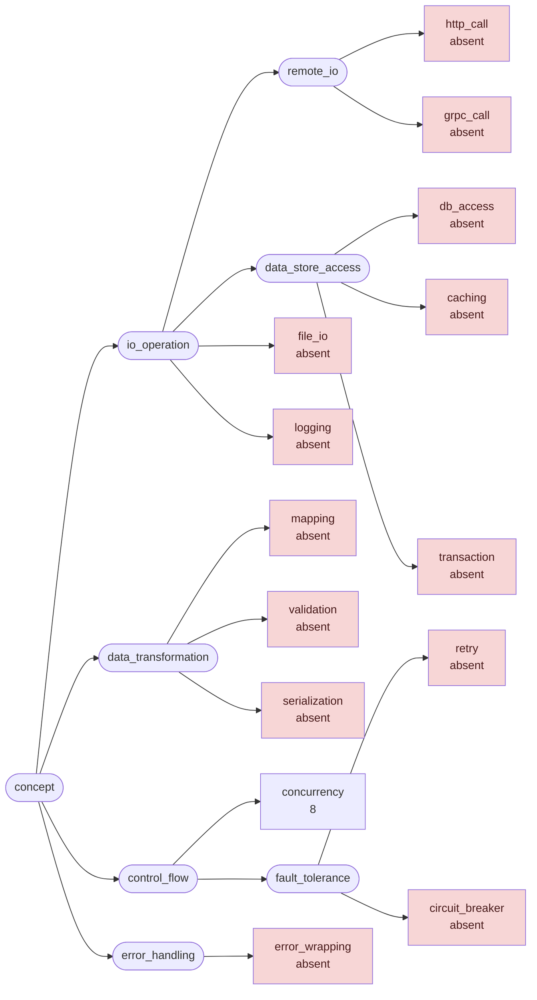
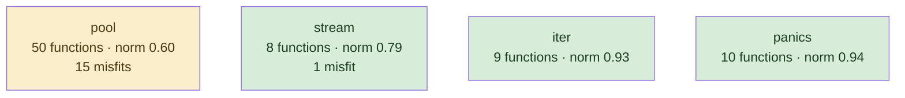
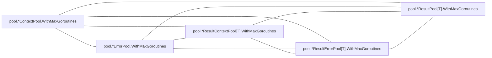
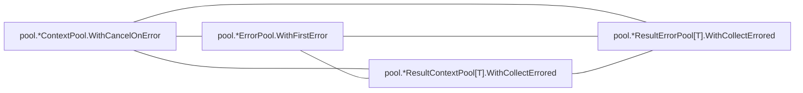
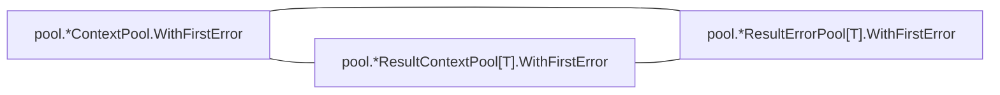

# conc

structured concurrency library; generics-heavy, one idea, written recently and at once

**What this rung shows:** the small-corpus floor: 85 functions, where IC and df caps have almost nothing to work with

| | |
|---|---|
| Corpus | [conc](https://github.com/sourcegraph/conc) |
| Pinned at | `v0.3.0` (`7b8c8f2875cb861bb61844c9bcaa1aed070adbd4`) |
| Project since | 2023 |
| doppel | `bc0615f` |
| Command | `doppel analyze . --tests exclude --top 10` |

Run from the corpus root, so every path below is corpus-relative.
Regenerate with `task examples`.

## Run diagnostics

The corpus-level models doppel builds before ranking anything, as printed to stderr:

```
Scanning . ...
Generating concept documents...
Culture: 1 concepts modeled, 0 associations, 0 unusual realizations
Habitats: 4 modeled, 16 misfits; most uniform panics (norm 0.94), most diverse pool (norm 0.60)
Conventions: strongest concurrency (0.37), loosest concurrency (0.37)
Ecosystems: 8 profiled (8 dominance, 0 coalition, 0 conflict, 0 weak)
Found 81 functions. Retrieving candidates...
Retrieval: shape 23, concept 25, call 15 -> 60 unique pairs
  concept-only 40.0%  call-only 20.0%  suppressed-shape functions: 0  large identity buckets: 0  surviving patterns: 448
Running structural comparison on 60 pairs...
Families: 3 over 7 components, 12 functions in a family
  6 pairs suppressed by max-per-func=2
```

# Code Similarity Report

**Functions analyzed:** 81 | **Threshold:** 0.60 | **Pairs found:** 10

---

## What doppel sees

**81 functions** across **5 packages** — test functions excluded. Structural roles: 72 leaf, 2 orchestrator, 7 utility.

### Concepts

doppel reads intent from the AST into a fixed vocabulary and reasons over the tree, so two functions that share a *branch* score partial credit rather than nothing. Leaf counts below are this corpus.



**Nothing here is tagged** `caching`, `circuit_breaker`, `db_access`, `error_wrapping`, `file_io`, `grpc_call`, `http_call`, `logging`, `mapping`, `retry`, `serialization`, `transaction`, `validation`. That is a direct answer to "does this codebase already do X" — for those concepts, it does not.

| Concept | Functions | Convention |
|---|---:|---|
| `concurrency` | 8 | `0.37` (loose) |

Convention is how uniformly this corpus realizes a concept: `1.00` means every function carrying the tag does it the same way, and a low number means the tag covers several unrelated habits. A concept with fewer than five members is not modeled.

### Where the duplication is

Merge-worthy pairs folded up to their packages. An edge means two packages keep solving the same problem separately; a count on a node means the repetition is inside one package.


### How settled each package is

A package with at least five functions gets a habitat model: doppel learns what is normal there and measures how surprising each member is against it. **Norm** is how uniform the package's practice is. A **misfit** is a function alien to its package *and* to the wider subsystem around it — one that fits its neighbours a directory up is normal for this codebase and is not reported.



Most uniform is `panics` (norm `0.94`); most varied is `pool` (norm `0.60`). 16 functions are alien to their package and to the subsystem around it.

### How these candidates were found

Three channels propose candidates independently — shared rare *structure*, shared *concepts*, shared *calls* — and their union is what gets compared. This run: **60 candidate pairs** (shape 23, concept 25, call 15), of which 20% arrived on call evidence alone and 40% on concept evidence alone. A pair sharing none of the three is never compared, however alike it looks.

Each function is also an arena where its candidate concepts compete for its evidence. 8 functions reached an equilibrium: **8** settled on a single concept, **0** on a coalition, **0** hold concepts this corpus says do not go together.

_6 further pairs were held back so no single function fills the report._

### Corpus metrics

**Compression ratio:** `3.64`x — this corpus's canonical function bodies contain **1694 AST nodes** in total, which hash-cons (two nodes count as the same subtree exactly when their kind and every child match, all the way down) to **466 distinct subtree shapes**; the ratio is nodes divided by shapes, always >= 1.0, and it never feeds any score.

**Nearest-neighbour code-shape:** of **81 functions**, **39** had a code-shape neighbour among the pairs retrieval actually scored — their best score's p50/p90/p99 are `0.61` / `1.00` / `1.00`, and 51% of them (20 of 39) already clear this run's threshold of `0.60`. This is **not an exhaustive nearest-neighbour search** (that would be a full pairwise comparison); it is bounded by the same three retrieval channels the pair list itself is bounded by, so the other 42 functions are excluded here as having no *scored* neighbour, not asserted to have none at all.

---

## Local practice

The vocabulary above says what a concept *is*. This says what one looks like when **this** codebase writes it — learned from the corpus, so it describes the house style rather than a rule from anywhere else.

### How this codebase writes each concept

Only what is **distinctive**. A feature earns a row by being carried by this concept's members at least twice as often as by the corpus at large — nearly every Go function has a `return` and an `if`, so prevalence alone would describe the language rather than this codebase. Weights are how much a channel counts toward whether a member looks normal — calls 40, control flow 20, co-occurring tags 15, role 15, package 10.

**`concurrency`** — 8 functions

| Channel | Feature | | Members | vs corpus |
|---|---|---|---|---|
| calls ×40 | `github.com/sourcegraph/conc/internal/multierror.Join` | `███·······` | 2 of 8 | 10× |
| flow ×20 | `funclit` | `██████····` | 5 of 8 | 3.6× |
|  | `if` | `█████·····` | 4 of 8 | 2.7× |
| role ×15 | `utility` | `███·······` | 2 of 8 | 2.9× |
| package ×10 | `iter` | `███·······` | 2 of 8 | 2.2× |

---

## Match #1 — Code-shape: `0.6118`

| | Location | Function | Signature | Patterns |
|---|---|---|---|---|
| **A** | `pool/result_context_pool.go:22` | `pool.*ResultContextPool[T].Go` | `(func(context.Context) (T, error))` | — |
| **B** | `pool/result_error_pool.go:25` | `pool.*ResultErrorPool[T].Go` | `(func() (T, error))` | — |

**Code similarity:** `wl 0.60  flow 1.00  nesting 1.00  sig 0.00  size 0.87`

**Containment:** `0.81`

**Evidence:** `146.48` (shape 143.19, concept 0.00, call 3.30)

**Trophic:** `0.94`

**Shared structure:**

- `3.42` — `seq[ assign:=(call:f) ; if(bin:\|\|(bin,sel)) ]`
- `3.42` — `seq[ if(bin:\|\|(bin,sel)) ; return(id) ]`
- `3.42` — `if(bin:\|\|(bin,sel))`

**Habitat:** A fits poorly in `pool` (fit 0.01, package norm 0.60)

**Habitat:** B fits poorly in `pool` (fit 0.01, package norm 0.60)

**Structural overlap:** `0.60` (merge-worthy)

- share 3 callees: [Go, add, f]
- overlapping call-graph neighborhoods (1.00): 2 shared
- both are leaf functions
- same package
- callees do related work (1.00): [concurrency]
- same visibility
- both are methods, on *ResultContextPool[T] and *ResultErrorPool[T]
- call into same packages: [pool]

---

## Match #2 — Code-shape: `1.0000`

| | Location | Function | Signature | Patterns |
|---|---|---|---|---|
| **A** | `pool/result_error_pool.go:55` | `pool.*ResultErrorPool[T].WithContext` | `(context.Context) (*ResultContextPool[T])` | — |
| **B** | `pool/result_pool.go:63` | `pool.*ResultPool[T].WithContext` | `(context.Context) (*ResultContextPool[T])` | — |

**Kind:** interface implementations — both implement `WithContext(context.Context) (*ResultContextPool[T])` on `*ResultErrorPool[T]` and `*ResultPool[T]`, in package `pool`

**Code similarity:** `wl 1.00  flow 1.00  nesting 1.00  sig 1.00  size 1.00`

**Containment:** `1.00`

**Evidence:** `94.13` (shape 94.13, concept 0.00, call 0.00)

**Trophic:** `1.00`

**Shared structure:**

- `3.42` — `flow:param→call:WithContext`
- `2.72` — `seq[ do(call:panicIfInitialized) ; return(unary) ]`
- `1.91` — `return(unary)`

**Structural overlap:** `0.50` (merge-worthy)

- share 2 callees: [WithContext, p.panicIfInitialized]
- both are leaf functions
- same package
- same visibility
- both are methods, on *ResultErrorPool[T] and *ResultPool[T]

---

## Match #3 — Code-shape: `0.8123`

| | Location | Function | Signature | Patterns |
|---|---|---|---|---|
| **A** | `pool/error_pool.go:45` | `pool.*ErrorPool.WithContext` | `(context.Context) (*ContextPool)` | — |
| **B** | `pool/pool.go:138` | `pool.*Pool.WithContext` | `(context.Context) (*ContextPool)` | — |

**Kind:** interface implementations — both implement `WithContext(context.Context) (*ContextPool)` on `*ErrorPool` and `*Pool`, in package `pool`

**Code similarity:** `wl 0.69  flow 1.00  nesting 1.00  sig 1.00  size 0.91`

**Containment:** `0.91`

**Evidence:** `145.33` (shape 141.62, concept 0.00, call 3.70)

**Trophic:** `0.92`

**Shared structure:**

- `3.42` — `seq[ assign:=(call:WithCancel) ; return(unary) ]`
- `3.42` — `seq[ do(call:panicIfInitialized) ; assign:=(call:WithCancel) ]`
- `3.42` — `assign:=(call:WithCancel)`

**Habitat:** A fits poorly in `pool` (fit 0.01, package norm 0.60)

**Habitat:** B fits poorly in `pool` (fit 0.01, package norm 0.60)

**Structural overlap:** `0.40` (not merge-worthy)

- share 2 callees: [context.WithCancel, p.panicIfInitialized]
- both are leaf functions
- same package
- same visibility
- both are methods, on *ErrorPool and *Pool

---

## Match #4 — Code-shape: `1.0000`

| | Location | Function | Signature | Patterns |
|---|---|---|---|---|
| **A** | `pool/result_context_pool.go:34` | `pool.*ResultContextPool[T].Wait` | `() ([]T, error)` | — |
| **B** | `pool/result_error_pool.go:37` | `pool.*ResultErrorPool[T].Wait` | `() ([]T, error)` | — |

**Kind:** interface implementations — both implement `Wait() ([]T, error)` on `*ResultContextPool[T]` and `*ResultErrorPool[T]`, in package `pool`

**Code similarity:** `wl 1.00  flow 1.00  nesting 1.00  sig 1.00  size 1.00`

**Containment:** `1.00`

**Evidence:** `56.28` (shape 56.28, concept 0.00, call 0.00)

**Trophic:** `1.00`

**Shared structure:**

- `3.42` — `seq[ assign:=(call:Wait) ; return(sel,id) ]`
- `3.42` — `assign:=(call:Wait)`
- `3.42` — `return(sel,id)`

**Structural overlap:** `0.50` (merge-worthy)

- share 1 callees: [Wait]
- both are leaf functions
- same package
- same visibility
- both are methods, on *ResultContextPool[T] and *ResultErrorPool[T]

---

## Match #5 — Code-shape: `0.9000`

| | Location | Function | Signature | Patterns |
|---|---|---|---|---|
| **A** | `pool/context_pool.go:86` | `pool.*ContextPool.WithMaxGoroutines` | `(int) (*ContextPool)` | — |
| **B** | `pool/error_pool.go:65` | `pool.*ErrorPool.WithMaxGoroutines` | `(int) (*ErrorPool)` | — |

**Code similarity:** `wl 1.00  flow 1.00  nesting 1.00  sig 0.33  size 1.00`

**Containment:** `1.00`

**Evidence:** `48.72` (shape 48.72, concept 0.00, call 0.00)

**Trophic:** `1.00`

**Shared structure:**

- `2.50` — `seq[ do(call:WithMaxGoroutines) ; return(id) ]`
- `2.50` — `seq[ do(call:panicIfInitialized) ; do(call:WithMaxGoroutines) ]`
- `2.50` — `do(call:WithMaxGoroutines)`

**Structural overlap:** `0.50` (merge-worthy)

- share 2 callees: [WithMaxGoroutines, p.panicIfInitialized]
- both are leaf functions
- same package
- same visibility
- both are methods, on *ContextPool and *ErrorPool

---

## Match #6 — Code-shape: `0.9000`

| | Location | Function | Signature | Patterns |
|---|---|---|---|---|
| **A** | `pool/context_pool.go:86` | `pool.*ContextPool.WithMaxGoroutines` | `(int) (*ContextPool)` | — |
| **B** | `pool/result_context_pool.go:67` | `pool.*ResultContextPool[T].WithMaxGoroutines` | `(int) (*ResultContextPool[T])` | — |

**Code similarity:** `wl 1.00  flow 1.00  nesting 1.00  sig 0.33  size 1.00`

**Containment:** `1.00`

**Evidence:** `48.72` (shape 48.72, concept 0.00, call 0.00)

**Trophic:** `1.00`

**Shared structure:**

- `2.50` — `seq[ do(call:WithMaxGoroutines) ; return(id) ]`
- `2.50` — `seq[ do(call:panicIfInitialized) ; do(call:WithMaxGoroutines) ]`
- `2.50` — `do(call:WithMaxGoroutines)`

**Structural overlap:** `0.50` (merge-worthy)

- share 2 callees: [WithMaxGoroutines, p.panicIfInitialized]
- both are leaf functions
- same package
- same visibility
- both are methods, on *ContextPool and *ResultContextPool[T]

---

## Match #7 — Code-shape: `0.9000`

| | Location | Function | Signature | Patterns |
|---|---|---|---|---|
| **A** | `pool/error_pool.go:65` | `pool.*ErrorPool.WithMaxGoroutines` | `(int) (*ErrorPool)` | — |
| **B** | `pool/result_context_pool.go:67` | `pool.*ResultContextPool[T].WithMaxGoroutines` | `(int) (*ResultContextPool[T])` | — |

**Code similarity:** `wl 1.00  flow 1.00  nesting 1.00  sig 0.33  size 1.00`

**Containment:** `1.00`

**Evidence:** `48.72` (shape 48.72, concept 0.00, call 0.00)

**Trophic:** `1.00`

**Shared structure:**

- `2.50` — `seq[ do(call:WithMaxGoroutines) ; return(id) ]`
- `2.50` — `seq[ do(call:panicIfInitialized) ; do(call:WithMaxGoroutines) ]`
- `2.50` — `do(call:WithMaxGoroutines)`

**Structural overlap:** `0.50` (merge-worthy)

- share 2 callees: [WithMaxGoroutines, p.panicIfInitialized]
- both are leaf functions
- same package
- same visibility
- both are methods, on *ErrorPool and *ResultContextPool[T]

---

## Match #8 — Code-shape: `0.9000`

| | Location | Function | Signature | Patterns |
|---|---|---|---|---|
| **A** | `pool/result_error_pool.go:72` | `pool.*ResultErrorPool[T].WithMaxGoroutines` | `(int) (*ResultErrorPool[T])` | — |
| **B** | `pool/result_pool.go:72` | `pool.*ResultPool[T].WithMaxGoroutines` | `(int) (*ResultPool[T])` | — |

**Code similarity:** `wl 1.00  flow 1.00  nesting 1.00  sig 0.33  size 1.00`

**Containment:** `1.00`

**Evidence:** `48.72` (shape 48.72, concept 0.00, call 0.00)

**Trophic:** `1.00`

**Shared structure:**

- `2.50` — `seq[ do(call:WithMaxGoroutines) ; return(id) ]`
- `2.50` — `seq[ do(call:panicIfInitialized) ; do(call:WithMaxGoroutines) ]`
- `2.50` — `do(call:WithMaxGoroutines)`

**Structural overlap:** `0.50` (merge-worthy)

- share 2 callees: [WithMaxGoroutines, p.panicIfInitialized]
- both are leaf functions
- same package
- same visibility
- both are methods, on *ResultErrorPool[T] and *ResultPool[T]

---

## Match #9 — Code-shape: `0.8500`

| | Location | Function | Signature | Patterns |
|---|---|---|---|---|
| **A** | `pool/context_pool.go:64` | `pool.*ContextPool.WithFirstError` | `() (*ContextPool)` | — |
| **B** | `pool/result_context_pool.go:50` | `pool.*ResultContextPool[T].WithFirstError` | `() (*ResultContextPool[T])` | — |

**Code similarity:** `wl 1.00  flow 1.00  nesting 1.00  sig 0.00  size 1.00`

**Containment:** `1.00`

**Evidence:** `50.32` (shape 50.32, concept 0.00, call 0.00)

**Trophic:** `1.00`

**Shared structure:**

- `3.01` — `seq[ do(call:WithFirstError) ; return(id) ]`
- `3.01` — `seq[ do(call:panicIfInitialized) ; do(call:WithFirstError) ]`
- `3.01` — `do(call:WithFirstError)`

**Structural overlap:** `0.50` (merge-worthy)

- share 2 callees: [WithFirstError, p.panicIfInitialized]
- both are leaf functions
- same package
- same visibility
- both are methods, on *ContextPool and *ResultContextPool[T]

---

## Match #10 — Code-shape: `0.8500`

| | Location | Function | Signature | Patterns |
|---|---|---|---|---|
| **A** | `pool/context_pool.go:64` | `pool.*ContextPool.WithFirstError` | `() (*ContextPool)` | — |
| **B** | `pool/result_error_pool.go:64` | `pool.*ResultErrorPool[T].WithFirstError` | `() (*ResultErrorPool[T])` | — |

**Code similarity:** `wl 1.00  flow 1.00  nesting 1.00  sig 0.00  size 1.00`

**Containment:** `1.00`

**Evidence:** `50.32` (shape 50.32, concept 0.00, call 0.00)

**Trophic:** `1.00`

**Shared structure:**

- `3.01` — `seq[ do(call:WithFirstError) ; return(id) ]`
- `3.01` — `seq[ do(call:panicIfInitialized) ; do(call:WithFirstError) ]`
- `3.01` — `do(call:WithFirstError)`

**Structural overlap:** `0.50` (merge-worthy)

- share 2 callees: [WithFirstError, p.panicIfInitialized]
- both are leaf functions
- same package
- same visibility
- both are methods, on *ContextPool and *ResultErrorPool[T]

---

## Families

3 families, 12 functions in a family, largest 5 members

### Family 1 — 5 members, every pair `>= 0.90` code-shape, evidence `487`



| Location | Function | Signature | Patterns |
|---|---|---|---|
| `pool/context_pool.go:86` | `pool.*ContextPool.WithMaxGoroutines` | `(int) (*ContextPool)` | — |
| `pool/error_pool.go:65` | `pool.*ErrorPool.WithMaxGoroutines` | `(int) (*ErrorPool)` | — |
| `pool/result_context_pool.go:67` | `pool.*ResultContextPool[T].WithMaxGoroutines` | `(int) (*ResultContextPool[T])` | — |
| `pool/result_error_pool.go:72` | `pool.*ResultErrorPool[T].WithMaxGoroutines` | `(int) (*ResultErrorPool[T])` | — |
| `pool/result_pool.go:72` | `pool.*ResultPool[T].WithMaxGoroutines` | `(int) (*ResultPool[T])` | — |

### Family 2 — 4 members, every pair `>= 0.85` code-shape, evidence `222`



| Location | Function | Signature | Patterns |
|---|---|---|---|
| `pool/context_pool.go:78` | `pool.*ContextPool.WithCancelOnError` | `() (*ContextPool)` | — |
| `pool/error_pool.go:57` | `pool.*ErrorPool.WithFirstError` | `() (*ErrorPool)` | — |
| `pool/result_context_pool.go:42` | `pool.*ResultContextPool[T].WithCollectErrored` | `() (*ResultContextPool[T])` | — |
| `pool/result_error_pool.go:45` | `pool.*ResultErrorPool[T].WithCollectErrored` | `() (*ResultErrorPool[T])` | — |

### Family 3 — 3 members, every pair `>= 0.85` code-shape, evidence `151`



| Location | Function | Signature | Patterns |
|---|---|---|---|
| `pool/context_pool.go:64` | `pool.*ContextPool.WithFirstError` | `() (*ContextPool)` | — |
| `pool/result_context_pool.go:50` | `pool.*ResultContextPool[T].WithFirstError` | `() (*ResultContextPool[T])` | — |
| `pool/result_error_pool.go:64` | `pool.*ResultErrorPool[T].WithFirstError` | `() (*ResultErrorPool[T])` | — |

