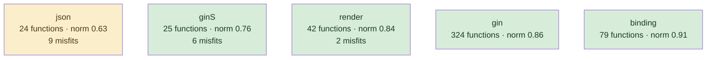
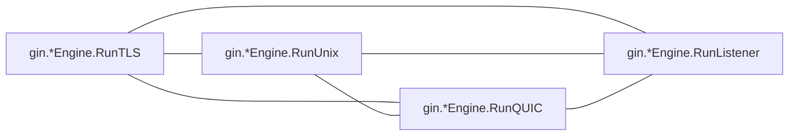
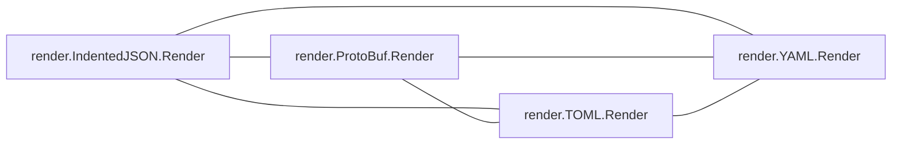
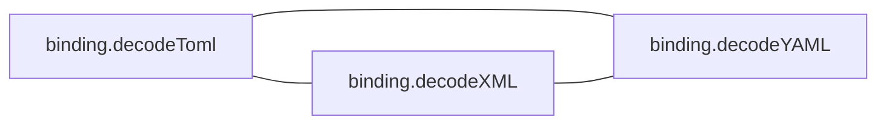
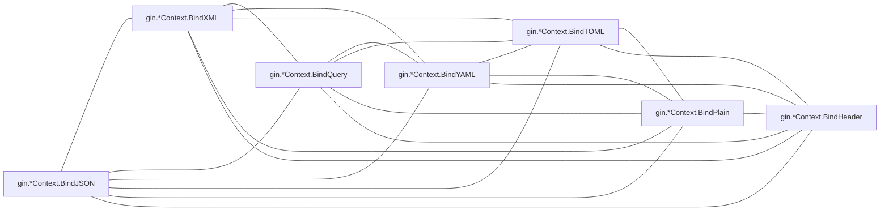

# gin

HTTP framework; a small core surrounded by generated-looking binding and render variants

**What this rung shows:** family clones — the case corroborated ranking was tuned to separate

| | |
|---|---|
| Corpus | [gin](https://github.com/gin-gonic/gin) |
| Pinned at | `v1.12.0` (`73726dc606796a025971fe451f0aa6f1b9b847f6`) |
| Project since | 2014 |
| doppel | `8a7ede0` |
| Command | `doppel analyze . --tests exclude --top 10` |

Run from the corpus root, so every path below is corpus-relative.
Regenerate with `task examples`.

## Run diagnostics

The corpus-level models doppel builds before ranking anything, as printed to stderr:

```
Scanning . ...
Generating concept documents...
Culture: 5 concepts modeled, 11 associations, 2 unusual realizations
Habitats: 5 modeled, 17 misfits (0 excused by subsystem), 1 subsystems; most uniform binding (norm 0.91), most diverse json (norm 0.63)
Conventions: strongest serialization (0.72), loosest caching (0.37)
Ecosystems: 128 profiled (128 dominance, 0 coalition, 0 conflict, 0 weak)
Found 497 functions. Retrieving candidates...
Retrieval: shape 238, concept 317, call 609 -> 1082 unique pairs
  concept-only 27.6%  call-only 49.3%  suppressed-shape functions: 0  large identity buckets: 0  surviving labels: 1934
Running structural comparison on 1082 pairs...
Families: 10 over 27 components, 59 functions in a family, 76 edges completed
```

# Code Similarity Report

**Functions analyzed:** 497 | **Threshold:** 0.38 | **Pairs found:** 10

---

## What doppel sees

**497 functions** across **7 packages** — test functions excluded. Structural roles: 361 leaf, 57 orchestrator, 17 passthrough, 62 utility.

### Concepts

doppel reads intent from the AST into a fixed vocabulary and reasons over the tree, so two functions that share a *branch* score partial credit rather than nothing. Leaf counts below are this corpus.


**Nothing here is tagged** `circuit_breaker`, `db_access`, `error_wrapping`, `grpc_call`, `http_call`, `transaction`. That is a direct answer to "does this codebase already do X" — for those concepts, it does not.

| Concept | Functions | Convention |
|---|---:|---|
| `serialization` | 28 | `0.72` (settled) |
| `validation` | 24 | `0.52` (settled) |
| `file_io` | 9 | `0.52` (settled) |
| `caching` | 7 | `0.37` (loose) |
| `concurrency` | 7 | `0.46` (loose) |
| `logging` | 3 | — |
| `mapping` | 1 | — |
| `retry` | 1 | — |

Convention is how uniformly this corpus realizes a concept: `1.00` means every function carrying the tag does it the same way, and a low number means the tag covers several unrelated habits. A concept with fewer than five members is not modeled.

### Where the duplication is

Merge-worthy pairs folded up to their packages. An edge means two packages keep solving the same problem separately; a count on a node means the repetition is inside one package.

### How settled each package is

A package with at least five functions gets a habitat model: doppel learns what is normal there and measures how surprising each member is against it. **Norm** is how uniform the package's practice is. A **misfit** is a function alien to its package *and* to the wider subsystem around it — one that fits its neighbours a directory up is normal for this codebase and is not reported.



Most uniform is `binding` (norm `0.91`); most varied is `json` (norm `0.63`). 17 functions are alien to their package and to the subsystem around it.

### How these candidates were found

Three channels propose candidates independently — shared rare *structure*, shared *concepts*, shared *calls* — and their union is what gets compared. This run: **1082 candidate pairs** (shape 238, concept 317, call 609), of which 49% arrived on call evidence alone and 28% on concept evidence alone. A pair sharing none of the three is never compared, however alike it looks.

Each function is also an arena where its candidate concepts compete for its evidence. 128 functions reached an equilibrium: **128** settled on a single concept, **0** on a coalition, **0** hold concepts this corpus says do not go together.

### Corpus metrics

**Compression ratio:** `5.28`x — this corpus's canonical function bodies contain **17625 AST nodes** in total, which hash-cons (two nodes count as the same subtree exactly when their kind and every child match, all the way down) to **3336 distinct subtree shapes**; the ratio is nodes divided by shapes, always >= 1.0, and it never feeds any score.

**Nearest-neighbour code-shape:** of **497 functions**, **326** had a code-shape neighbour among the pairs retrieval actually scored — their best score's p50/p90/p99 are `0.48` / `1.00` / `1.00`, and 76% of them (249 of 326) already clear this run's threshold of `0.38`. This is **not an exhaustive nearest-neighbour search** (that would be a full pairwise comparison); it is bounded by the same three retrieval channels the pair list itself is bounded by, so the other 171 functions are excluded here as having no *scored* neighbour, not asserted to have none at all.

---

## Local practice

The vocabulary above says what a concept *is*. This says what one looks like when **this** codebase writes it — learned from the corpus, so it describes the house style rather than a rule from anywhere else.

### How this codebase writes each concept

Only what is **distinctive**. A feature earns a row by being carried by this concept's members at least twice as often as by the corpus at large — nearly every Go function has a `return` and an `if`, so prevalence alone would describe the language rather than this codebase. Weights are how much a channel counts toward whether a member looks normal — calls 40, control flow 20, co-occurring tags 15, role 15, package 10.

**`serialization`** — 28 functions

| Channel | Feature | | Members | vs corpus |
|---|---|---|---|---|
| package ×10 | `json` | `███████···` | 20 of 28 | 15× |

**`validation`** — 24 functions

| Channel | Feature | | Members | vs corpus |
|---|---|---|---|---|
| flow ×20 | `if` | `█████████·` | 21 of 24 | 2.4× |
| role ×15 | `utility` | `███·······` | 6 of 24 | 2.0× |
| package ×10 | `binding` | `████████··` | 18 of 24 | 4.7× |

**`file_io`** — 9 functions

| Channel | Feature | | Members | vs corpus |
|---|---|---|---|---|
| calls ×40 | `io.ReadAll` | `██████····` | 5 of 9 | 55× |
| flow ×20 | `defer` | `███·······` | 3 of 9 | 13× |
|  | `if` | `██████████` | 9 of 9 | 2.7× |
| package ×10 | `binding` | `███·······` | 3 of 9 | 2.1× |

**`caching`** — 7 functions

| Channel | Feature | | Members | vs corpus |
|---|---|---|---|---|
| calls ×40 | `gin.*Context.initFormCache` | `███·······` | 2 of 7 | 71× |
|  | `gin.*Context.initQueryCache` | `███·······` | 2 of 7 | 71× |
|  | `gin.getMapFromFormData` | `███·······` | 2 of 7 | 71× |
| role ×15 | `utility` | `██████····` | 4 of 7 | 4.6× |
|  | `orchestrator` | `███·······` | 2 of 7 | 2.5× |

**`concurrency`** — 7 functions

| Channel | Feature | | Members | vs corpus |
|---|---|---|---|---|
| flow ×20 | `defer` | `███·······` | 2 of 7 | 11× |
| role ×15 | `utility` | `███·······` | 2 of 7 | 2.3× |

### What travels with what

Co-occurrence measured against chance across every function. Only relationships at least twice — or at most half — as common as chance are reported; near-chance company is not culture. Each kind is listed separately, because there are far more call tokens than concepts and one shared list is all calls. Within a kind, strongest first means lift weighted by how many functions carry it — a 100× relationship holding for three functions is a weaker finding than a 30× one holding for thirty.

**Together more than chance — tag~role**

- 4 of 7 `caching` functions also `utility` — 4.6× chance
- 6 of 24 `validation` functions also `utility` — 2.0× chance

**Together more than chance — tag~call**

- 5 of 9 `file_io` functions also `io.ReadAll` — 55× chance
- 4 of 24 `validation` functions also `gin.*Engine.Delims` — 21× chance
- 4 of 24 `validation` functions also `html/template.Must` — 21× chance
- 4 of 24 `validation` functions also `html/template.New` — 21× chance
- 3 of 24 `validation` functions also `binding.mapForm` — 21× chance
- 3 of 24 `validation` functions also `gin.*Engine.SetHTMLTemplate` — 21× chance
- _1 more not listed_

**Apart more than chance — tag~role**

- **no** `serialization` function has `orchestrator` — chance alone would give about 3 of 28
- 1 of 7 `caching` functions also `leaf` — 0.2× chance

### Functions drifting from their own concept

These carry a tag but look nothing like the other functions carrying it. Typicality is measured against the concept's own median, so a genuinely varied concept lowers its own bar and a tight one can flag nobody.

| Function | Concept | Typicality | Concept median |
|---|---|---:|---:|
| `binding.decodeXML` <br/>`binding/xml.go:28` | `serialization` | `0.13` | `0.81` |
| `gin.*Context.ClientIP` <br/>`context.go:975` | `validation` | `0.17` | `0.45` |

---

## Match #1 — Code-shape: `1.0000`

| | Location | Function | Signature | Patterns |
|---|---|---|---|---|
| **A** | `auth.go:48` | `gin.BasicAuthForRealm` | `(Accounts, string) (HandlerFunc)` | — |
| **B** | `auth.go:98` | `gin.BasicAuthForProxy` | `(Accounts, string) (HandlerFunc)` | — |

**Explain:** identical after rename, commutative-reorder

**Code similarity:** `wl 1.00  flow 1.00  nesting 1.00  sig 1.00  size 1.00`

**Containment:** `1.00`

**Evidence:** `422.84` (shape 389.58, concept 0.00, call 33.26)

**Trophic:** `1.00`

**Shared structure:**

- `4.78` — `depth-3 CALL`
- `4.78` — `depth-3 ASSIGN`
- `4.78` — `depth-3 CALL`

**Structural overlap:** `0.63` (merge-worthy)

- share 7 callees: [c.AbortWithStatus, c.Header, c.Set, c.requestHeader, pairs.searchCredential, processAccounts, strconv.Quote]
- overlapping call-graph neighborhoods (0.97): 32 shared
- both are orchestrator functions
- same package
- callees do related work (1.00): [concurrency]
- same visibility
- same receiver type: plain functions
- call into same packages: [gin]

---

## Match #2 — Code-shape: `0.6576`

| | Location | Function | Signature | Patterns |
|---|---|---|---|---|
| **A** | `gin.go:288` | `gin.*Engine.LoadHTMLFiles` | `(...string)` | validation |
| **B** | `gin.go:300` | `gin.*Engine.LoadHTMLFS` | `(http.FileSystem, ...string)` | validation |

**Explain:** differs by two extra call, two extra key-value, one extra composite literal, and 2 more kinds

**Profile A:** `validation` 1.00 (dominance)

**Profile B:** `validation` 1.00 (dominance)

**Code similarity:** `wl 0.55  flow 1.00  nesting 1.00  sig 0.50  size 0.87`

**Containment:** `0.75`

**Evidence:** `231.71` (shape 206.68, concept 1.32, call 23.71)

**Trophic:** `0.84`

**Shared structure:**

- `5.98` — `depth-3 KV` ×2
- `5.98` — `depth-2 KV` ×2
- `5.82` — `depth-1 KV` ×2

**Structural overlap:** `0.78` (merge-worthy)

- share 6 callees: [Delims, Funcs, IsDebugging, engine.SetHTMLTemplate, template.Must, template.New]
- overlapping call-graph neighborhoods (1.00): 11 shared
- share patterns: [validation]
- both are orchestrator functions
- same package
- callees do related work (1.00): [concurrency]
- same visibility
- same receiver type: Engine
- call into same packages: [gin]

---

## Match #3 — Code-shape: `0.6790`

| | Location | Function | Signature | Patterns |
|---|---|---|---|---|
| **A** | `gin.go:540` | `gin.*Engine.Run` | `(...string) (error)` | — |
| **B** | `gin.go:561` | `gin.*Engine.RunTLS` | `(string, string, string) (error)` | — |

**Explain:** differs by one extra assign, four extra call, one extra selector, and 2 more kinds

**Code similarity:** `wl 0.63  flow 1.00  nesting 1.00  sig 0.33  size 0.87`

**Containment:** `0.85`

**Evidence:** `282.80` (shape 270.53, concept 0.00, call 12.27)

**Trophic:** `0.93`

**Shared structure:**

- `5.67` — `depth-1 EXPRSTMT` ×2
- `5.67` — `depth-0 CALL` ×2
- `4.78` — `depth-3 ASSIGN`

**Structural overlap:** `0.48` (merge-worthy)

- share 4 callees: [debugPrint, debugPrintError, engine.Handler, engine.isUnsafeTrustedProxies]
- overlapping call-graph neighborhoods (0.86): 19 shared
- both are orchestrator functions
- same package
- same visibility
- same receiver type: Engine
- call into same packages: [gin]

---

## Match #4 — Code-shape: `1.0000`

| | Location | Function | Signature | Patterns |
|---|---|---|---|---|
| **A** | `binding/toml.go:29` | `binding.decodeToml` | `(io.Reader, any) (error)` | validation |
| **B** | `binding/yaml.go:29` | `binding.decodeYAML` | `(io.Reader, any) (error)` | validation |

**Explain:** identical after rename, commutative-reorder

**Profile A:** `validation` 1.00 (dominance)

**Profile B:** `validation` 1.00 (dominance)

**Code similarity:** `wl 1.00  flow 1.00  nesting 1.00  sig 1.00  size 1.00`

**Containment:** `1.00`

**Evidence:** `101.99` (shape 100.67, concept 1.32, call 0.00)

**Trophic:** `1.00`

**Shared structure:**

- `4.38` — `depth-3 ASSIGN`
- `4.38` — `depth-3 BLOCK`
- `4.38` — `depth-3 CALL`

**Structural overlap:** `0.66` (merge-worthy)

- share 2 callees: [decoder.Decode, validate]
- share patterns: [validation]
- both are utility functions
- same package
- same visibility
- same receiver type: plain functions
- called from same packages: [binding]

---

## Match #5 — Code-shape: `0.6290`

| | Location | Function | Signature | Patterns |
|---|---|---|---|---|
| **A** | `gin.go:581` | `gin.*Engine.RunUnix` | `(string) (error)` | file_io |
| **B** | `gin.go:645` | `gin.*Engine.RunListener` | `(net.Listener) (error)` | — |

**Explain:** differs by two extra defer, one extra assign, one extra if, and 7 more kinds

**Profile A:** `file_io` 1.00 (dominance)

**Code similarity:** `wl 0.57  flow 0.94  nesting 0.99  sig 0.33  size 0.69`

**Containment:** `0.84` — most of the smaller body's shape is inside the larger

**Evidence:** `290.99` (shape 278.72, concept 0.00, call 12.27)

**Trophic:** `0.85`

**Shared structure:**

- `5.67` — `depth-1 EXPRSTMT` ×2
- `5.67` — `depth-0 CALL` ×2
- `4.78` — `depth-3 UNARY`

**Structural overlap:** `0.50` (merge-worthy)

- share 5 callees: [debugPrint, debugPrintError, engine.Handler, engine.isUnsafeTrustedProxies, server.Serve]
- overlapping call-graph neighborhoods (1.00): 19 shared
- both are orchestrator functions
- same package
- same visibility
- same receiver type: Engine
- call into same packages: [gin]

---

## Match #6 — Code-shape: `0.7507`

| | Location | Function | Signature | Patterns |
|---|---|---|---|---|
| **A** | `gin.go:561` | `gin.*Engine.RunTLS` | `(string, string, string) (error)` | — |
| **B** | `gin.go:630` | `gin.*Engine.RunQUIC` | `(string, string, string) (error)` | — |

**Explain:** differs by one extra assign, two extra call, two extra key-value, and 4 more kinds

**Code similarity:** `wl 0.58  flow 1.00  nesting 1.00  sig 1.00  size 0.79`

**Containment:** `0.82`

**Evidence:** `220.70` (shape 208.43, concept 0.00, call 12.27)

**Trophic:** `0.86`

**Shared structure:**

- `5.67` — `depth-1 EXPRSTMT` ×2
- `5.67` — `depth-0 CALL` ×2
- `3.87` — `depth-3 CALL`

**Structural overlap:** `0.54` (merge-worthy)

- share 4 callees: [debugPrint, debugPrintError, engine.Handler, engine.isUnsafeTrustedProxies]
- overlapping call-graph neighborhoods (1.00): 19 shared
- both are orchestrator functions
- same package
- same visibility
- same receiver type: Engine
- call into same packages: [gin]

---

## Match #7 — Code-shape: `1.0000`

| | Location | Function | Signature | Patterns |
|---|---|---|---|---|
| **A** | `binding/toml.go:29` | `binding.decodeToml` | `(io.Reader, any) (error)` | validation |
| **B** | `binding/xml.go:28` | `binding.decodeXML` | `(io.Reader, any) (error)` | validation, serialization |

**Explain:** identical after rename, commutative-reorder

**Profile A:** `validation` 1.00 (dominance)

**Profile B:** `validation` 1.00 (dominance)

**Code similarity:** `wl 1.00  flow 1.00  nesting 1.00  sig 1.00  size 1.00`

**Containment:** `1.00`

**Evidence:** `101.99` (shape 100.67, concept 1.32, call 0.00)

**Trophic:** `1.00`

**Shared structure:**

- `4.38` — `depth-3 ASSIGN`
- `4.38` — `depth-3 BLOCK`
- `4.38` — `depth-3 CALL`

**Structural overlap:** `0.57` (merge-worthy)

- share 2 callees: [decoder.Decode, validate]
- share patterns: [validation]
- both are utility functions
- same package
- same visibility
- same receiver type: plain functions
- called from same packages: [binding]

---

## Match #8 — Code-shape: `1.0000`

| | Location | Function | Signature | Patterns |
|---|---|---|---|---|
| **A** | `binding/xml.go:28` | `binding.decodeXML` | `(io.Reader, any) (error)` | validation, serialization |
| **B** | `binding/yaml.go:29` | `binding.decodeYAML` | `(io.Reader, any) (error)` | validation |

**Explain:** identical after rename, commutative-reorder

**Profile A:** `validation` 1.00 (dominance)

**Profile B:** `validation` 1.00 (dominance)

**Code similarity:** `wl 1.00  flow 1.00  nesting 1.00  sig 1.00  size 1.00`

**Containment:** `1.00`

**Evidence:** `101.99` (shape 100.67, concept 1.32, call 0.00)

**Trophic:** `1.00`

**Shared structure:**

- `4.38` — `depth-3 ASSIGN`
- `4.38` — `depth-3 BLOCK`
- `4.38` — `depth-3 CALL`

**Structural overlap:** `0.57` (merge-worthy)

- share 2 callees: [decoder.Decode, validate]
- share patterns: [validation]
- both are utility functions
- same package
- same visibility
- same receiver type: plain functions
- called from same packages: [binding]

---

## Match #9 — Code-shape: `0.9625`

| | Location | Function | Signature | Patterns |
|---|---|---|---|---|
| **A** | `routergroup.go:147` | `gin.*RouterGroup.Any` | `(string, ...HandlerFunc) (IRoutes)` | — |
| **B** | `routergroup.go:156` | `gin.*RouterGroup.Match` | `([]string, string, ...HandlerFunc) (IRoutes)` | — |

**Explain:** identical after rename

**Code similarity:** `wl 1.00  flow 1.00  nesting 1.00  sig 0.75  size 1.00`

**Containment:** `1.00`

**Evidence:** `102.22` (shape 93.99, concept 0.00, call 8.23)

**Trophic:** `1.00`

**Shared structure:**

- `4.78` — `depth-3 BLOCK`
- `4.78` — `depth-3 EXPRSTMT`
- `4.78` — `depth-3 RANGE`

**Structural overlap:** `0.58` (merge-worthy)

- share 2 callees: [group.handle, group.returnObj]
- overlapping call-graph neighborhoods (1.00): 16 shared
- both are orchestrator functions
- same package
- same visibility
- same receiver type: RouterGroup
- call into same packages: [gin]

---

## Match #10 — Code-shape: `0.7177`

| | Location | Function | Signature | Patterns |
|---|---|---|---|---|
| **A** | `routergroup.go:181` | `gin.*RouterGroup.staticFileHandler` | `(string, HandlerFunc) (IRoutes)` | — |
| **B** | `routergroup.go:203` | `gin.*RouterGroup.StaticFS` | `(string, http.FileSystem) (IRoutes)` | — |

**Explain:** differs by two extra assign, two extra call, two extra selector, and 2 more kinds

**Code similarity:** `wl 0.65  flow 1.00  nesting 1.00  sig 0.50  size 0.71`

**Containment:** `0.93` — most of the smaller body's shape is inside the larger

**Evidence:** `204.29` (shape 184.02, concept 0.00, call 20.27)

**Trophic:** `0.95`

**Shared structure:**

- `8.76` — `depth-3 CALL` ×2
- `8.76` — `depth-2 CALL` ×2
- `8.76` — `depth-1 CALL` ×2

**Structural overlap:** `0.41` (merge-worthy)

- share 5 callees: [group.GET, group.HEAD, group.returnObj, panic, strings.Contains]
- overlapping call-graph neighborhoods (0.50): 7 shared
- related roles: passthrough ≈ orchestrator (both high fan-out, 0.50)
- same package
- same receiver type: RouterGroup
- called from same packages: [gin]
- call into same packages: [gin]

---

## Families

10 families, 59 functions in a family, largest 14 members; 76 edges scored here that retrieval never proposed

### Family 1 — 4 members, every pair `>= 0.60` code-shape, evidence `1420`



| Location | Function | Signature | Patterns |
|---|---|---|---|
| `gin.go:561` | `gin.*Engine.RunTLS` | `(string, string, string) (error)` | — |
| `gin.go:581` | `gin.*Engine.RunUnix` | `(string) (error)` | file_io |
| `gin.go:630` | `gin.*Engine.RunQUIC` | `(string, string, string) (error)` | — |
| `gin.go:645` | `gin.*Engine.RunListener` | `(net.Listener) (error)` | — |

### Family 2 — 4 members, every pair `>= 0.65` code-shape, evidence `391`, interface implementations of `Render(http.ResponseWriter) (error)`, in package `render`



| Location | Function | Signature | Patterns |
|---|---|---|---|
| `render/json.go:78` | `render.IndentedJSON.Render` | `(http.ResponseWriter) (error)` | — |
| `render/protobuf.go:21` | `render.ProtoBuf.Render` | `(http.ResponseWriter) (error)` | serialization |
| `render/toml.go:21` | `render.TOML.Render` | `(http.ResponseWriter) (error)` | — |
| `render/yaml.go:21` | `render.YAML.Render` | `(http.ResponseWriter) (error)` | serialization |

### Family 3 — 3 members, every pair `>= 1.00` code-shape, evidence `306`



| Location | Function | Signature | Patterns |
|---|---|---|---|
| `binding/toml.go:29` | `binding.decodeToml` | `(io.Reader, any) (error)` | validation |
| `binding/xml.go:28` | `binding.decodeXML` | `(io.Reader, any) (error)` | validation, serialization |
| `binding/yaml.go:29` | `binding.decodeYAML` | `(io.Reader, any) (error)` | validation |

### Family 4 — 14 members, every pair `>= 1.00` code-shape, evidence `118`  (55 edges scored here), interface implementations of `WriteContentType(http.ResponseWriter)`, in package `render`

_Not drawn: 14 members is 91 connections. Every one of them holds — that is what makes this a family._

| Location | Function | Signature | Patterns |
|---|---|---|---|
| `render/bson.go:32` | `render.BSON.WriteContentType` | `(http.ResponseWriter)` | — |
| `render/html.go:99` | `render.HTML.WriteContentType` | `(http.ResponseWriter)` | — |
| `render/json.go:62` | `render.JSON.WriteContentType` | `(http.ResponseWriter)` | — |
| `render/json.go:89` | `render.IndentedJSON.WriteContentType` | `(http.ResponseWriter)` | — |
| `render/json.go:112` | `render.SecureJSON.WriteContentType` | `(http.ResponseWriter)` | — |
| `render/json.go:150` | `render.JsonpJSON.WriteContentType` | `(http.ResponseWriter)` | — |
| `render/json.go:179` | `render.AsciiJSON.WriteContentType` | `(http.ResponseWriter)` | — |
| `render/json.go:192` | `render.PureJSON.WriteContentType` | `(http.ResponseWriter)` | — |
| `render/msgpack.go:29` | `render.MsgPack.WriteContentType` | `(http.ResponseWriter)` | — |
| `render/protobuf.go:34` | `render.ProtoBuf.WriteContentType` | `(http.ResponseWriter)` | — |

_4 more members not listed._

### Family 5 — 7 members, every pair `>= 1.00` code-shape, evidence `72`  (3 edges scored here)



| Location | Function | Signature | Patterns |
|---|---|---|---|
| `context.go:763` | `gin.*Context.BindJSON` | `(any) (error)` | — |
| `context.go:768` | `gin.*Context.BindXML` | `(any) (error)` | — |
| `context.go:773` | `gin.*Context.BindQuery` | `(any) (error)` | — |
| `context.go:778` | `gin.*Context.BindYAML` | `(any) (error)` | — |
| `context.go:783` | `gin.*Context.BindTOML` | `(any) (error)` | — |
| `context.go:788` | `gin.*Context.BindPlain` | `(any) (error)` | — |
| `context.go:793` | `gin.*Context.BindHeader` | `(any) (error)` | — |

_5 more families not listed._

