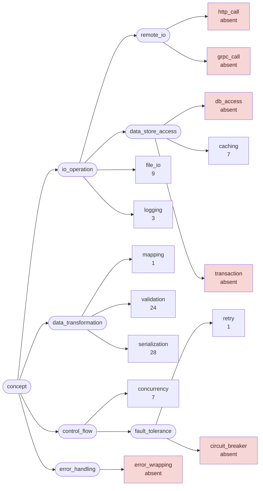
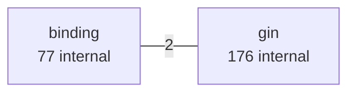
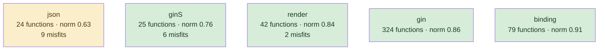
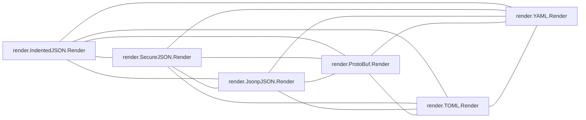
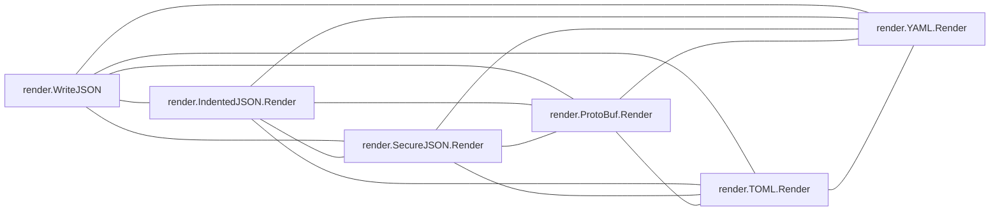
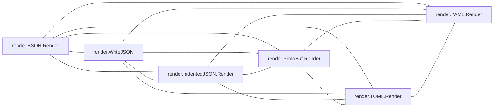
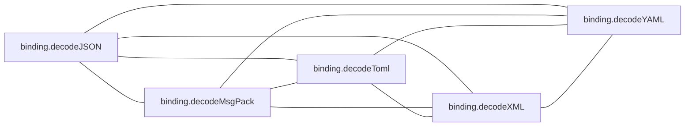

# gin

HTTP framework; a small core surrounded by generated-looking binding and render variants

**What this rung shows:** family clones — the case corroborated ranking was tuned to separate

| | |
|---|---|
| Corpus | [gin](https://github.com/gin-gonic/gin) |
| Pinned at | `v1.12.0` (`73726dc606796a025971fe451f0aa6f1b9b847f6`) |
| Project since | 2014 |
| doppel | `043c993` |
| Command | `doppel analyze . --tests exclude --top 10` |

Run from the corpus root, so every path below is corpus-relative.
Regenerate with `task examples`.

## Run diagnostics

The corpus-level models doppel builds before ranking anything, as printed to stderr:

```
Scanning . ...
Generating concept documents...
Culture: 5 concepts modeled, 11 associations, 2 unusual realizations
Habitats: 5 modeled, 17 misfits (0 excused by subsystem), 1 subsystems; most uniform binding (norm 0.91), most diverse json (norm 0.63)
Conventions: strongest serialization (0.72), loosest caching (0.37)
Ecosystems: 128 profiled (128 dominance, 0 coalition, 0 conflict, 0 weak)
Found 497 functions. Retrieving candidates...
Retrieval: shape 156, concept 317, call 609 -> 1023 unique pairs
  concept-only 29.2%  call-only 54.4%  suppressed-shape functions: 0  large identity buckets: 0  surviving patterns: 3321
Running structural comparison on 1023 pairs...
Families: 25 over 48 components, 109 functions in a family, 119 edges completed
```

# Code Similarity Report

**Functions analyzed:** 497 | **Threshold:** 0.60 | **Pairs found:** 10

---

## What doppel sees

**497 functions** across **7 packages** — test functions excluded. Structural roles: 361 leaf, 57 orchestrator, 17 passthrough, 62 utility.

### Concepts

doppel reads intent from the AST into a fixed vocabulary and reasons over the tree, so two functions that share a *branch* score partial credit rather than nothing. Leaf counts below are this corpus.



**Nothing here is tagged** `circuit_breaker`, `db_access`, `error_wrapping`, `grpc_call`, `http_call`, `transaction`. That is a direct answer to "does this codebase already do X" — for those concepts, it does not.

| Concept | Functions | Convention |
|---|---:|---|
| `serialization` | 28 | `0.72` (settled) |
| `validation` | 24 | `0.52` (settled) |
| `file_io` | 9 | `0.52` (settled) |
| `caching` | 7 | `0.37` (loose) |
| `concurrency` | 7 | `0.46` (loose) |
| `logging` | 3 | — |
| `mapping` | 1 | — |
| `retry` | 1 | — |

Convention is how uniformly this corpus realizes a concept: `1.00` means every function carrying the tag does it the same way, and a low number means the tag covers several unrelated habits. A concept with fewer than five members is not modeled.

### Where the duplication is

Merge-worthy pairs folded up to their packages. An edge means two packages keep solving the same problem separately; a count on a node means the repetition is inside one package.



### How settled each package is

A package with at least five functions gets a habitat model: doppel learns what is normal there and measures how surprising each member is against it. **Norm** is how uniform the package's practice is. A **misfit** is a function alien to its package *and* to the wider subsystem around it — one that fits its neighbours a directory up is normal for this codebase and is not reported.



Most uniform is `binding` (norm `0.91`); most varied is `json` (norm `0.63`). 17 functions are alien to their package and to the subsystem around it.

### How these candidates were found

Three channels propose candidates independently — shared rare *structure*, shared *concepts*, shared *calls* — and their union is what gets compared. This run: **1023 candidate pairs** (shape 156, concept 317, call 609), of which 54% arrived on call evidence alone and 29% on concept evidence alone. A pair sharing none of the three is never compared, however alike it looks.

Each function is also an arena where its candidate concepts compete for its evidence. 128 functions reached an equilibrium: **128** settled on a single concept, **0** on a coalition, **0** hold concepts this corpus says do not go together.

---

## Local practice

The vocabulary above says what a concept *is*. This says what one looks like when **this** codebase writes it — learned from the corpus, so it describes the house style rather than a rule from anywhere else.

### How this codebase writes each concept

Of the functions carrying each tag, how many do each thing. Weights are how much a channel counts toward whether a member looks normal — calls 40, control flow 20, co-occurring tags 15, role 15, package 10.

**`serialization`** — 28 functions

| Channel | Feature | | Members |
|---|---|---|---|
| flow ×20 | `return` | `██████████` | 28 of 28 |
| role ×15 | `leaf` | `█████████·` | 26 of 28 |
| package ×10 | `json` | `███████···` | 20 of 28 |

**`validation`** — 24 functions

| Channel | Feature | | Members |
|---|---|---|---|
| flow ×20 | `return` | `██████████` | 23 of 24 |
|  | `if` | `█████████·` | 21 of 24 |
| role ×15 | `leaf` | `█████·····` | 12 of 24 |
| package ×10 | `binding` | `████████··` | 18 of 24 |

**`file_io`** — 9 functions

| Channel | Feature | | Members |
|---|---|---|---|
| calls ×40 | `io.ReadAll` | `██████····` | 5 of 9 |
| flow ×20 | `if` | `██████████` | 9 of 9 |
|  | `return` | `██████████` | 9 of 9 |
| role ×15 | `leaf` | `████████··` | 7 of 9 |
| package ×10 | `gin` | `██████····` | 5 of 9 |

**`caching`** — 7 functions

| Channel | Feature | | Members |
|---|---|---|---|
| flow ×20 | `return` | `██████····` | 4 of 7 |
| role ×15 | `utility` | `██████····` | 4 of 7 |
| package ×10 | `gin` | `██████████` | 7 of 7 |

**`concurrency`** — 7 functions

| Channel | Feature | | Members |
|---|---|---|---|
| flow ×20 | `if` | `███████···` | 5 of 7 |
|  | `return` | `██████····` | 4 of 7 |
| role ×15 | `leaf` | `██████····` | 4 of 7 |
| package ×10 | `gin` | `██████████` | 7 of 7 |

### What travels with what

Co-occurrence measured against chance across every function. Only relationships at least twice — or at most half — as common as chance are reported; near-chance company is not culture. Each kind is listed separately, because there are far more call tokens than concepts and one shared list is all calls. Within a kind, strongest first means lift weighted by how many functions carry it — a 100× relationship holding for three functions is a weaker finding than a 30× one holding for thirty.

**Together more than chance — tag~role**

- 4 of 7 `caching` functions also `utility` — 4.6× chance
- 6 of 24 `validation` functions also `utility` — 2.0× chance

**Together more than chance — tag~call**

- 5 of 9 `file_io` functions also `io.ReadAll` — 55× chance
- 4 of 24 `validation` functions also `gin.*Engine.Delims` — 21× chance
- 4 of 24 `validation` functions also `html/template.Must` — 21× chance
- 4 of 24 `validation` functions also `html/template.New` — 21× chance
- 3 of 24 `validation` functions also `binding.mapForm` — 21× chance
- 3 of 24 `validation` functions also `gin.*Engine.SetHTMLTemplate` — 21× chance
- _1 more not listed_

**Apart more than chance — tag~role**

- **no** `serialization` function has `orchestrator` — chance alone would give about 3 of 28
- 1 of 7 `caching` functions also `leaf` — 0.2× chance

### Functions drifting from their own concept

These carry a tag but look nothing like the other functions carrying it. Typicality is measured against the concept's own median, so a genuinely varied concept lowers its own bar and a tight one can flag nobody.

| Function | Concept | Typicality | Concept median |
|---|---|---:|---:|
| `binding.decodeXML` <br/>`binding/xml.go:28` | `serialization` | `0.13` | `0.81` |
| `gin.*Context.ClientIP` <br/>`context.go:975` | `validation` | `0.17` | `0.45` |

---

## Match #1 — Code-shape: `1.0000`

| | Location | Function | Signature | Patterns |
|---|---|---|---|---|
| **A** | `auth.go:48` | `gin.BasicAuthForRealm` | `(Accounts, string) (HandlerFunc)` | — |
| **B** | `auth.go:98` | `gin.BasicAuthForProxy` | `(Accounts, string) (HandlerFunc)` | — |

**Code similarity:** `ast 1.00  flow 1.00  nesting 1.00  sig 1.00  size 1.00`

**Evidence:** `595.84` (shape 562.58, concept 0.00, call 33.26)

**Trophic:** `1.00`

**Shared structure:**

- `4.93` — `seq[ assign:=(call:processAccounts) ; return(funclit) ]`
- `4.93` — `seq[ assign:=(call:searchCredential) ; if(unary) ]`
- `4.93` — `seq[ assign=(bin) ; assign:=(call:processAccounts) ]`

**Structural overlap:** `0.63` (merge-worthy)

- share 7 callees: [c.AbortWithStatus, c.Header, c.Set, c.requestHeader, pairs.searchCredential, processAccounts, strconv.Quote]
- overlapping call-graph neighborhoods (0.97): 32 shared
- both are orchestrator functions
- same package
- callees do related work (1.00): [concurrency]
- same visibility
- same receiver type: plain functions
- call into same packages: [gin]

---

## Match #2 — Code-shape: `0.8484`

| | Location | Function | Signature | Patterns |
|---|---|---|---|---|
| **A** | `gin.go:288` | `gin.*Engine.LoadHTMLFiles` | `(...string)` | validation |
| **B** | `gin.go:300` | `gin.*Engine.LoadHTMLFS` | `(http.FileSystem, ...string)` | validation |

**Profile A:** `validation` 1.00 (dominance)

**Profile B:** `validation` 1.00 (dominance)

**Code similarity:** `ast 0.87  flow 1.00  nesting 1.00  sig 0.50  size 0.87`

**Evidence:** `406.87` (shape 381.84, concept 1.32, call 23.71)

**Trophic:** `0.85`

**Shared structure:**

- `4.93` — `seq[ assign:=(call:Must) ; do(call:SetHTMLTemplate) ]`
- `4.93` — `seq[ if(call:IsDebugging) ; assign:=(call:Must) ]`
- `4.53` — `assign:=(call:Must)`

**Structural overlap:** `0.78` (merge-worthy)

- share 6 callees: [Delims, Funcs, IsDebugging, engine.SetHTMLTemplate, template.Must, template.New]
- overlapping call-graph neighborhoods (1.00): 11 shared
- share patterns: [validation]
- both are orchestrator functions
- same package
- callees do related work (1.00): [concurrency]
- same visibility
- same receiver type: Engine
- call into same packages: [gin]

---

## Match #3 — Code-shape: `1.0000`

| | Location | Function | Signature | Patterns |
|---|---|---|---|---|
| **A** | `binding/toml.go:29` | `binding.decodeToml` | `(io.Reader, any) (error)` | validation |
| **B** | `binding/yaml.go:29` | `binding.decodeYAML` | `(io.Reader, any) (error)` | validation |

**Profile A:** `validation` 1.00 (dominance)

**Profile B:** `validation` 1.00 (dominance)

**Code similarity:** `ast 1.00  flow 1.00  nesting 1.00  sig 1.00  size 1.00`

**Evidence:** `172.86` (shape 171.53, concept 1.32, call 0.00)

**Trophic:** `1.00`

**Shared structure:**

- `4.53` — `seq[ assign:=(call:NewDecoder) ; if(bin:!=(id,nil)) ]`
- `4.24` — `assign:=(call:NewDecoder)`
- `4.24` — `flow:call:NewDecoder→call:Decode`

**Structural overlap:** `0.66` (merge-worthy)

- share 2 callees: [decoder.Decode, validate]
- share patterns: [validation]
- both are utility functions
- same package
- same visibility
- same receiver type: plain functions
- called from same packages: [binding]

---

## Match #4 — Code-shape: `1.0000`

| | Location | Function | Signature | Patterns |
|---|---|---|---|---|
| **A** | `binding/toml.go:29` | `binding.decodeToml` | `(io.Reader, any) (error)` | validation |
| **B** | `binding/xml.go:28` | `binding.decodeXML` | `(io.Reader, any) (error)` | validation, serialization |

**Profile A:** `validation` 1.00 (dominance)

**Profile B:** `validation` 1.00 (dominance)

**Code similarity:** `ast 1.00  flow 1.00  nesting 1.00  sig 1.00  size 1.00`

**Evidence:** `172.86` (shape 171.53, concept 1.32, call 0.00)

**Trophic:** `1.00`

**Shared structure:**

- `4.53` — `seq[ assign:=(call:NewDecoder) ; if(bin:!=(id,nil)) ]`
- `4.24` — `assign:=(call:NewDecoder)`
- `4.24` — `flow:call:NewDecoder→call:Decode`

**Structural overlap:** `0.57` (merge-worthy)

- share 2 callees: [decoder.Decode, validate]
- share patterns: [validation]
- both are utility functions
- same package
- same visibility
- same receiver type: plain functions
- called from same packages: [binding]

---

## Match #5 — Code-shape: `1.0000`

| | Location | Function | Signature | Patterns |
|---|---|---|---|---|
| **A** | `binding/xml.go:28` | `binding.decodeXML` | `(io.Reader, any) (error)` | validation, serialization |
| **B** | `binding/yaml.go:29` | `binding.decodeYAML` | `(io.Reader, any) (error)` | validation |

**Profile A:** `validation` 1.00 (dominance)

**Profile B:** `validation` 1.00 (dominance)

**Code similarity:** `ast 1.00  flow 1.00  nesting 1.00  sig 1.00  size 1.00`

**Evidence:** `172.86` (shape 171.53, concept 1.32, call 0.00)

**Trophic:** `1.00`

**Shared structure:**

- `4.53` — `seq[ assign:=(call:NewDecoder) ; if(bin:!=(id,nil)) ]`
- `4.24` — `assign:=(call:NewDecoder)`
- `4.24` — `flow:call:NewDecoder→call:Decode`

**Structural overlap:** `0.57` (merge-worthy)

- share 2 callees: [decoder.Decode, validate]
- share patterns: [validation]
- both are utility functions
- same package
- same visibility
- same receiver type: plain functions
- called from same packages: [binding]

---

## Match #6 — Code-shape: `0.9357`

| | Location | Function | Signature | Patterns |
|---|---|---|---|---|
| **A** | `render/protobuf.go:21` | `render.ProtoBuf.Render` | `(http.ResponseWriter) (error)` | serialization |
| **B** | `render/yaml.go:21` | `render.YAML.Render` | `(http.ResponseWriter) (error)` | serialization |

**Kind:** interface implementations — both implement `Render(http.ResponseWriter) (error)` on `ProtoBuf` and `YAML`, in package `render`

**Profile A:** `serialization` 1.00 (dominance)

**Profile B:** `serialization` 1.00 (dominance)

**Code similarity:** `ast 0.89  flow 1.00  nesting 1.00  sig 1.00  size 0.89`

**Evidence:** `170.55` (shape 165.65, concept 1.18, call 3.72)

**Trophic:** `0.92`

**Shared structure:**

- `7.09` — `flow:call:Marshal→return`
- `4.01` — `seq[ if(bin:!=(id,nil)) ; assign=(call:Write) ]`
- `3.68` — `seq[ assign:=(call:Marshal) ; if(bin:!=(id,nil)) ]`

**Structural overlap:** `0.66` (merge-worthy)

- share 2 callees: [r.WriteContentType, w.Write]
- overlapping call-graph neighborhoods (1.00): 12 shared
- share patterns: [serialization]
- both are leaf functions
- same package
- same visibility
- both are methods, on ProtoBuf and YAML
- call into same packages: [gin]

---

## Match #7 — Code-shape: `1.0000`

| | Location | Function | Signature | Patterns |
|---|---|---|---|---|
| **A** | `render/toml.go:21` | `render.TOML.Render` | `(http.ResponseWriter) (error)` | — |
| **B** | `render/yaml.go:21` | `render.YAML.Render` | `(http.ResponseWriter) (error)` | serialization |

**Kind:** interface implementations — both implement `Render(http.ResponseWriter) (error)` on `TOML` and `YAML`, in package `render`

**Profile B:** `serialization` 1.00 (dominance)

**Code similarity:** `ast 1.00  flow 1.00  nesting 1.00  sig 1.00  size 1.00`

**Evidence:** `174.30` (shape 170.58, concept 0.00, call 3.72)

**Trophic:** `1.00`

**Shared structure:**

- `7.09` — `flow:call:Marshal→return`
- `4.01` — `seq[ if(bin:!=(id,nil)) ; assign=(call:Write) ]`
- `3.68` — `seq[ assign:=(call:Marshal) ; if(bin:!=(id,nil)) ]`

**Structural overlap:** `0.49` (merge-worthy)

- share 2 callees: [r.WriteContentType, w.Write]
- overlapping call-graph neighborhoods (1.00): 12 shared
- both are leaf functions
- same package
- same visibility
- both are methods, on TOML and YAML
- call into same packages: [gin]

---

## Match #8 — Code-shape: `0.7364`

| | Location | Function | Signature | Patterns |
|---|---|---|---|---|
| **A** | `routergroup.go:181` | `gin.*RouterGroup.staticFileHandler` | `(string, HandlerFunc) (IRoutes)` | — |
| **B** | `routergroup.go:203` | `gin.*RouterGroup.StaticFS` | `(string, http.FileSystem) (IRoutes)` | — |

**Code similarity:** `ast 0.69  flow 1.00  nesting 1.00  sig 0.50  size 0.71`

**Evidence:** `313.50` (shape 293.23, concept 0.00, call 20.27)

**Trophic:** `0.88`

**Shared structure:**

- `9.05` — `flow:param→call:Contains`
- `4.93` — `seq[ do(call:GET) ; do(call:HEAD) ]`
- `4.93` — `seq[ do(call:HEAD) ; return(call:returnObj) ]`

**Structural overlap:** `0.41` (merge-worthy)

- share 5 callees: [group.GET, group.HEAD, group.returnObj, panic, strings.Contains]
- overlapping call-graph neighborhoods (0.50): 7 shared
- related roles: passthrough ≈ orchestrator (both high fan-out, 0.50)
- same package
- same receiver type: RouterGroup
- called from same packages: [gin]
- call into same packages: [gin]

---

## Match #9 — Code-shape: `0.6573`

| | Location | Function | Signature | Patterns |
|---|---|---|---|---|
| **A** | `gin.go:581` | `gin.*Engine.RunUnix` | `(string) (error)` | file_io |
| **B** | `gin.go:645` | `gin.*Engine.RunListener` | `(net.Listener) (error)` | — |

**Profile A:** `file_io` 1.00 (dominance)

**Code similarity:** `ast 0.62  flow 0.94  nesting 0.99  sig 0.33  size 0.69`

**Evidence:** `352.68` (shape 340.41, concept 0.00, call 12.27)

**Trophic:** `0.80`

**Shared structure:**

- `5.97` — `do(call:debugPrint)`
- `4.93` — `seq[ assign:=(unary) ; assign=(call:Serve) ]`
- `4.93` — `seq[ assign=(call:Serve) ; return() ]`

**Structural overlap:** `0.50` (merge-worthy)

- share 5 callees: [debugPrint, debugPrintError, engine.Handler, engine.isUnsafeTrustedProxies, server.Serve]
- overlapping call-graph neighborhoods (1.00): 19 shared
- both are orchestrator functions
- same package
- same visibility
- same receiver type: Engine
- call into same packages: [gin]

---

## Match #10 — Code-shape: `1.0000`

| | Location | Function | Signature | Patterns |
|---|---|---|---|---|
| **A** | `binding/binding.go:122` | `binding.validate` | `(any) (error)` | validation |
| **B** | `binding/binding_nomsgpack.go:116` | `binding.validate` | `(any) (error)` | validation |

**Profile A:** `validation` 1.00 (dominance)

**Profile B:** `validation` 1.00 (dominance)

**Code similarity:** `ast 1.00  flow 1.00  nesting 1.00  sig 1.00  size 1.00`

**Evidence:** `87.23` (shape 80.39, concept 1.32, call 5.52)

**Trophic:** `1.00`

**Shared structure:**

- `4.93` — `seq[ if(bin:==(id,nil)) ; return(call:ValidateStruct) ]`
- `4.93` — `flow:param→call:ValidateStruct`
- `4.53` — `return(call:ValidateStruct)`

**Structural overlap:** `0.81` (merge-worthy)

- share 1 callees: [Validator.ValidateStruct]
- overlapping call-graph neighborhoods (1.00): 2 shared
- share patterns: [validation]
- both are leaf functions
- same package
- callees do related work (1.00): [validation]
- same visibility
- same receiver type: plain functions
- call into same packages: [binding]

---

## Families

25 families, 109 functions in a family, largest 14 members; 119 edges scored here that retrieval never proposed

### Family 1 — 13 members, every pair `>= 0.74` code-shape, evidence `2325`  (31 edges scored here)

_Not drawn: 13 members is 78 connections. Every one of them holds — that is what makes this a family._

| Location | Function | Signature | Patterns |
|---|---|---|---|
| `context.go:1180` | `gin.*Context.IndentedJSON` | `(int, any)` | — |
| `context.go:1187` | `gin.*Context.SecureJSON` | `(int, any)` | — |
| `context.go:1205` | `gin.*Context.JSON` | `(int, any)` | — |
| `context.go:1211` | `gin.*Context.AsciiJSON` | `(int, any)` | — |
| `context.go:1217` | `gin.*Context.PureJSON` | `(int, any)` | — |
| `context.go:1223` | `gin.*Context.XML` | `(int, any)` | — |
| `context.go:1228` | `gin.*Context.YAML` | `(int, any)` | — |
| `context.go:1233` | `gin.*Context.TOML` | `(int, any)` | — |
| `context.go:1238` | `gin.*Context.ProtoBuf` | `(int, any)` | — |
| `context.go:1243` | `gin.*Context.BSON` | `(int, any)` | — |

_3 more members not listed._

### Family 2 — 6 members, every pair `>= 0.61` code-shape, evidence `2206`, interface implementations of `Render(http.ResponseWriter) (error)`, in package `render`



| Location | Function | Signature | Patterns |
|---|---|---|---|
| `render/json.go:78` | `render.IndentedJSON.Render` | `(http.ResponseWriter) (error)` | — |
| `render/json.go:94` | `render.SecureJSON.Render` | `(http.ResponseWriter) (error)` | — |
| `render/json.go:117` | `render.JsonpJSON.Render` | `(http.ResponseWriter) (error)` | — |
| `render/protobuf.go:21` | `render.ProtoBuf.Render` | `(http.ResponseWriter) (error)` | serialization |
| `render/toml.go:21` | `render.TOML.Render` | `(http.ResponseWriter) (error)` | — |
| `render/yaml.go:21` | `render.YAML.Render` | `(http.ResponseWriter) (error)` | serialization |

### Family 3 — 6 members, every pair `>= 0.62` code-shape, evidence `1977`



| Location | Function | Signature | Patterns |
|---|---|---|---|
| `render/json.go:67` | `render.WriteJSON` | `(http.ResponseWriter, any) (error)` | — |
| `render/json.go:78` | `render.IndentedJSON.Render` | `(http.ResponseWriter) (error)` | — |
| `render/json.go:94` | `render.SecureJSON.Render` | `(http.ResponseWriter) (error)` | — |
| `render/protobuf.go:21` | `render.ProtoBuf.Render` | `(http.ResponseWriter) (error)` | serialization |
| `render/toml.go:21` | `render.TOML.Render` | `(http.ResponseWriter) (error)` | — |
| `render/yaml.go:21` | `render.YAML.Render` | `(http.ResponseWriter) (error)` | serialization |

### Family 4 — 6 members, every pair `>= 0.62` code-shape, evidence `1808`



| Location | Function | Signature | Patterns |
|---|---|---|---|
| `render/bson.go:21` | `render.BSON.Render` | `(http.ResponseWriter) (error)` | — |
| `render/json.go:67` | `render.WriteJSON` | `(http.ResponseWriter, any) (error)` | — |
| `render/json.go:78` | `render.IndentedJSON.Render` | `(http.ResponseWriter) (error)` | — |
| `render/protobuf.go:21` | `render.ProtoBuf.Render` | `(http.ResponseWriter) (error)` | serialization |
| `render/toml.go:21` | `render.TOML.Render` | `(http.ResponseWriter) (error)` | — |
| `render/yaml.go:21` | `render.YAML.Render` | `(http.ResponseWriter) (error)` | serialization |

### Family 5 — 5 members, every pair `>= 0.64` code-shape, evidence `1390`



| Location | Function | Signature | Patterns |
|---|---|---|---|
| `binding/json.go:44` | `binding.decodeJSON` | `(io.Reader, any) (error)` | validation |
| `binding/msgpack.go:31` | `binding.decodeMsgPack` | `(io.Reader, any) (error)` | validation |
| `binding/toml.go:29` | `binding.decodeToml` | `(io.Reader, any) (error)` | validation |
| `binding/xml.go:28` | `binding.decodeXML` | `(io.Reader, any) (error)` | validation, serialization |
| `binding/yaml.go:29` | `binding.decodeYAML` | `(io.Reader, any) (error)` | validation |

_20 more families not listed._

