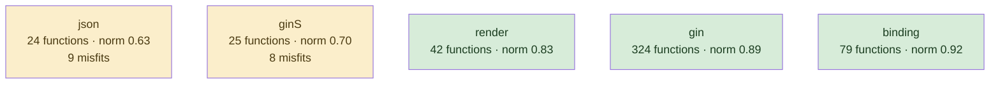
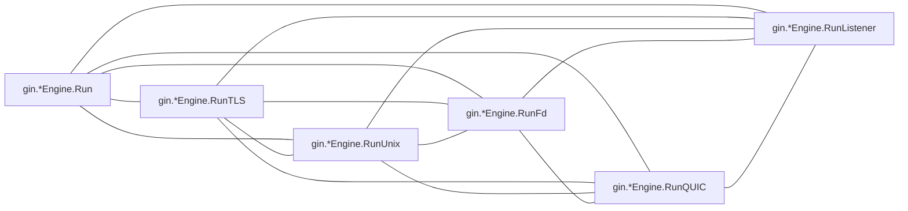
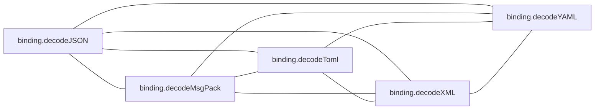
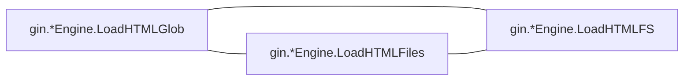
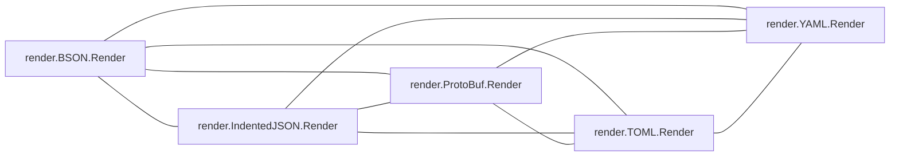
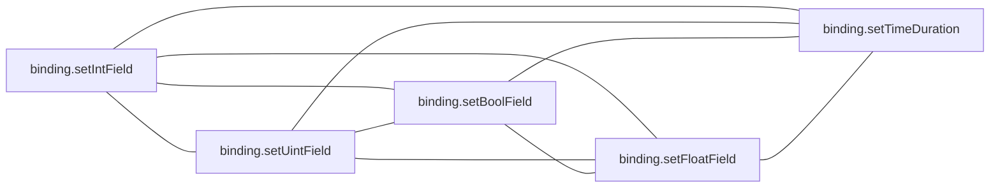

# gin

HTTP framework; a small core surrounded by generated-looking binding and render variants

**What this rung shows:** family clones — the case corroborated ranking was tuned to separate

| | |
|---|---|
| Corpus | [gin](https://github.com/gin-gonic/gin) |
| Pinned at | `v1.12.0` (`73726dc606796a025971fe451f0aa6f1b9b847f6`) |
| Project since | 2014 |
| doppel | `95071c4` |
| Command | `doppel analyze . --tests exclude --top 10` |

Run from the corpus root, so every path below is corpus-relative.
Regenerate with `task examples`.

## Run diagnostics

The corpus-level models doppel builds before ranking anything, as printed to stderr:

```
Scanning . ...
Learning concept vocabulary...
Lexicon: 46 concepts (6 seeded, 40 emergent), 1266/3382 features above 182 df, 108 functions unlabeled
Generating concept documents...
Culture: 36 concepts modeled, 159 associations, 37 unusual realizations
Habitats: 5 modeled, 17 misfits (0 excused by subsystem), 1 subsystems; most uniform binding (norm 0.92), most diverse json (norm 0.63)
Conventions: strongest c.MustBindWith+gin.*Context.MustBindWith (1.00), loosest gin.IsDebugging+gin.debugPrint (0.24)
Ecosystems: 420 profiled (306 dominance, 23 coalition, 0 conflict, 91 weak)
Calibration: rate 0.01 over 20000 null pairs -> threshold 0.41, struct-min 0.50, family-min 0.41
Found 497 functions. Retrieving candidates...
Retrieval: shape 175, concept 1599, call 609 -> 2035 unique pairs
  concept-only 64.0%  call-only 16.8%  suppressed-shape functions: 0  large identity buckets: 0  surviving labels: 1924
Running structural comparison on 2035 pairs...
  427 pairs remain after struct-min=0.50 filter
Families: 29 over 49 components, 133 functions in a family, 113 edges completed
```

# Code Similarity Report

**Functions analyzed:** 497 | **Threshold:** 0.60 | **Pairs found:** 10

---

## What doppel sees

**497 functions** across **7 packages** — test functions excluded. Structural roles: 361 leaf, 57 orchestrator, 17 passthrough, 62 utility.

### Concepts

These concepts were **learned from this corpus**, not read off a fixed list: each one is a group of functions that share a way of being written, named after the evidence that identified it. They hang from an authored interior, so two functions under the same *branch* score partial credit rather than nothing. Counts below are members; membership is graded, and a function can carry several.

```mermaid
flowchart LR
    c0(["concept"])
    c1(["io_operation"])
    c2(["remote_io"])
    c3(["data_store_access"])
    c4(["data_transformation"])
    c5(["control_flow"])
    c6(["fault_tolerance"])
    c7(["error_handling"])
    c8["API.Marshal+bytesconv.StringToBytes<br/>14"]
    c9["Request.URL+req.URL<br/>7"]
    c10["URL.Path+c.Writer<br/>8"]
    c11["binding+nil<br/>247"]
    c12["bytes.NewReader+bytes<br/>5"]
    c13["bytesconv.BytesToString+bytesconv<br/>4"]
    c14["bytesconv.StringToBytes+json.API<br/>6"]
    c15["c.Abort+gin.*Context.Abort<br/>4"]
    c16["c.MustBindWith+gin.*Context.MustBindWith<br/>7"]
    c17["c.Next+c.Request<br/>4"]
    c18["c.ShouldBindBodyWith+gin.*Context.ShouldBindBody…<br/>5"]
    c19["c.ShouldBindWith+gin.*Context.ShouldBindWith<br/>7"]
    c20["c.formCache+c.queryCache<br/>6"]
    c21["c.hasRequestContext+Request.Context<br/>5"]
    c22["c.requestHeader+gin.*Context.requestHeader<br/>6"]
    c23["cmp+httputil<br/>8"]
    c24["delims.Left+delims.Right<br/>22"]
    c25["delims.Left+delims.Right+engine.SetHTMLTemplate<br/>39"]
    c26["engine.MaxMultipartMemory+c.engine<br/>6"]
    c27["field.Tag+Tag.Get<br/>4"]
    c28["flag+atomic<br/>6"]
    c29["fmt.Fprintf+runtime<br/>4"]
    c30["gin+template<br/>19"]
    c31["gin.*Context.Header+gin.*Context.Set<br/>5"]
    c32["gin.IsDebugging+gin.debugPrint<br/>7"]
    c33["gin.debugPrint+atomic<br/>6"]
    c34["group.calculateAbsolutePath+group.engine<br/>19"]
    c35["http.Server+engine.Handler<br/>5"]
    c36["io.ReadAll+req.Body<br/>7"]
    c37["json.Marshal+json.MarshalIndent<br/>28"]
    c38["log<br/>3"]
    c39["n.nType+n.priority<br/>23"]
    c40["reflect.Array+reflect.Slice<br/>4"]
    c41["reflect.Map+reflect.New<br/>11"]
    c42["reflect.New+reflect.Array<br/>5"]
    c43["reflect.New+value.Type<br/>4"]
    c44["render.writeContentType+bytes<br/>6"]
    c45["strings.Split+reflect<br/>4"]
    c46["strings.TrimSpace+bytesconv<br/>4"]
    c47["subtle+base64<br/>5"]
    c48["tree.method+tree.root<br/>5"]
    c49["value.Addr+field.Tag<br/>23"]
    c50["value.Set+value.Type<br/>6"]
    c51["w.WriteHeaderNow+w.ResponseWriter<br/>9"]
    c52["writermem.WriteHeaderNow+c.writermem<br/>5"]
    c53["xml+runtime<br/>13"]
    c0 --> c1
    c1 --> c2
    c1 --> c3
    c0 --> c4
    c0 --> c5
    c5 --> c6
    c0 --> c7
    c4 --> c8
    c4 --> c9
    c1 --> c10
    c5 --> c11
    c4 --> c12
    c1 --> c13
    c4 --> c14
    c3 --> c15
    c3 --> c16
    c1 --> c17
    c3 --> c18
    c3 --> c19
    c3 --> c20
    c3 --> c21
    c3 --> c22
    c4 --> c23
    c4 --> c24
    c4 --> c25
    c4 --> c26
    c4 --> c27
    c3 --> c28
    c1 --> c29
    c4 --> c30
    c4 --> c31
    c4 --> c32
    c4 --> c33
    c1 --> c34
    c1 --> c35
    c1 --> c36
    c4 --> c37
    c1 --> c38
    c1 --> c39
    c4 --> c40
    c4 --> c41
    c4 --> c42
    c4 --> c43
    c4 --> c44
    c1 --> c45
    c4 --> c46
    c4 --> c47
    c4 --> c48
    c4 --> c49
    c4 --> c50
    c4 --> c51
    c4 --> c52
    c3 --> c53
```



**No practice here for** `circuit_breaker`, `db_access`, `error_wrapping`, `grpc_call`, `http_call`, `mapping`, `retry`, `transaction`. Concepts are learned from this corpus, so one can never be absent — it exists because functions carry it. These are the *seeds* the search started from that grew nothing: a direct answer to "does this codebase already do X".

| Concept | Functions | Convention |
|---|---:|---|
| `binding+nil` | 247 | `0.61` (settled) |
| `delims.Left+delims.Right+engine.SetHTMLTemplate` | 39 | `0.48` (loose) |
| `json.Marshal+json.MarshalIndent` | 28 | `0.61` (settled) |
| `n.nType+n.priority` | 23 | `0.50` (settled) |
| `value.Addr+field.Tag` | 23 | `0.48` (loose) |
| `delims.Left+delims.Right` | 22 | `0.35` (loose) |
| `gin+template` | 19 | `0.90` (unanimous) |
| `group.calculateAbsolutePath+group.engine` | 19 | `0.53` (settled) |
| `API.Marshal+bytesconv.StringToBytes` | 14 | `0.41` (loose) |
| `xml+runtime` | 13 | `0.57` (settled) |
| `reflect.Map+reflect.New` | 11 | `0.42` (loose) |
| `w.WriteHeaderNow+w.ResponseWriter` | 9 | `0.29` (loose) |
| `URL.Path+c.Writer` | 8 | `0.29` (loose) |
| `cmp+httputil` | 8 | `0.40` (loose) |
| `Request.URL+req.URL` | 7 | `0.31` (loose) |
| `c.MustBindWith+gin.*Context.MustBindWith` | 7 | `1.00` (unanimous) |
| `c.ShouldBindWith+gin.*Context.ShouldBindWith` | 7 | `1.00` (unanimous) |
| `gin.IsDebugging+gin.debugPrint` | 7 | `0.24` (loose) |
| `io.ReadAll+req.Body` | 7 | `0.50` (settled) |
| `bytesconv.StringToBytes+json.API` | 6 | `0.36` (loose) |
| `c.formCache+c.queryCache` | 6 | `0.34` (loose) |
| `c.requestHeader+gin.*Context.requestHeader` | 6 | `0.41` (loose) |
| `engine.MaxMultipartMemory+c.engine` | 6 | `0.41` (loose) |
| `flag+atomic` | 6 | `0.61` (settled) |
| `gin.debugPrint+atomic` | 6 | `0.44` (loose) |
| `render.writeContentType+bytes` | 6 | `0.64` (settled) |
| `value.Set+value.Type` | 6 | `0.45` (loose) |
| `bytes.NewReader+bytes` | 5 | `0.86` (unanimous) |
| `c.ShouldBindBodyWith+gin.*Context.ShouldBindBody…` | 5 | `1.00` (unanimous) |
| `c.hasRequestContext+Request.Context` | 5 | `0.54` (settled) |
| `gin.*Context.Header+gin.*Context.Set` | 5 | `0.34` (loose) |
| `http.Server+engine.Handler` | 5 | `0.91` (unanimous) |
| `reflect.New+reflect.Array` | 5 | `0.40` (loose) |
| `subtle+base64` | 5 | `0.26` (loose) |
| `tree.method+tree.root` | 5 | `0.29` (loose) |
| `writermem.WriteHeaderNow+c.writermem` | 5 | `0.30` (loose) |
| `bytesconv.BytesToString+bytesconv` | 4 | — |
| `c.Abort+gin.*Context.Abort` | 4 | — |
| `c.Next+c.Request` | 4 | — |
| `field.Tag+Tag.Get` | 4 | — |
| `fmt.Fprintf+runtime` | 4 | — |
| `reflect.Array+reflect.Slice` | 4 | — |
| `reflect.New+value.Type` | 4 | — |
| `strings.Split+reflect` | 4 | — |
| `strings.TrimSpace+bytesconv` | 4 | — |
| `log` | 3 | — |

Convention is how uniformly this corpus realizes a concept: `1.00` means every function carrying the tag does it the same way, and a low number means the tag covers several unrelated habits. A concept with fewer than five members is not modeled.

### Where the duplication is

Merge-worthy pairs folded up to their packages. An edge means two packages keep solving the same problem separately; a count on a node means the repetition is inside one package.

### How settled each package is

A package with at least five functions gets a habitat model: doppel learns what is normal there and measures how surprising each member is against it. **Norm** is how uniform the package's practice is. A **misfit** is a function alien to its package *and* to the wider subsystem around it — one that fits its neighbours a directory up is normal for this codebase and is not reported.



Most uniform is `binding` (norm `0.92`); most varied is `json` (norm `0.63`). 17 functions are alien to their package and to the subsystem around it.

### How these candidates were found

Three channels propose candidates independently — shared rare *structure*, shared *concepts*, shared *calls* — and their union is what gets compared. This run: **2035 candidate pairs** (shape 175, concept 1599, call 609), of which 17% arrived on call evidence alone and 64% on concept evidence alone. A pair sharing none of the three is never compared, however alike it looks.

Each function is also an arena where its candidate concepts compete for its evidence. 420 functions reached an equilibrium: **306** settled on a single concept, **23** on a coalition, **0** hold concepts this corpus says do not go together.

### Corpus metrics

**Compression ratio:** `5.28`x — this corpus's canonical function bodies contain **17625 AST nodes** in total, which hash-cons (two nodes count as the same subtree exactly when their kind and every child match, all the way down) to **3336 distinct subtree shapes**; the ratio is nodes divided by shapes, always >= 1.0, and it never feeds any score.

**Nearest-neighbour code-shape:** of **497 functions**, **436** had a code-shape neighbour among the pairs retrieval actually scored — their best score's p50/p90/p99 are `0.43` / `1.00` / `1.00`, and 56% of them (242 of 436) already clear this run's threshold of `0.41`. This is **not an exhaustive nearest-neighbour search** (that would be a full pairwise comparison); it is bounded by the same three retrieval channels the pair list itself is bounded by, so the other 61 functions are excluded here as having no *scored* neighbour, not asserted to have none at all.

---

## Local practice

The vocabulary above says what a concept *is*. This says what one looks like when **this** codebase writes it — learned from the corpus, so it describes the house style rather than a rule from anywhere else.

### How this codebase writes each concept

Only what is **distinctive**. A feature earns a row by being carried by this concept's members at least twice as often as by the corpus at large — nearly every Go function has a `return` and an `if`, so prevalence alone would describe the language rather than this codebase. Weights are how much a channel counts toward whether a member looks normal — calls 40, control flow 20, co-occurring tags 15, role 15, package 10.

**`binding+nil`** — 247 functions

Nothing distinctive: its members do what the rest of the corpus does. The tag groups them; a shared way of writing them does not.

**`delims.Left+delims.Right+engine.SetHTMLTemplate`** — 39 functions

| Channel | Feature | | Members | vs corpus |
|---|---|---|---|---|
| flow ×20 | `funclit` | `███·······` | 10 of 39 | 5.8× |
| role ×15 | `orchestrator` | `█████·····` | 18 of 39 | 4.0× |

**`json.Marshal+json.MarshalIndent`** — 28 functions

| Channel | Feature | | Members | vs corpus |
|---|---|---|---|---|
| package ×10 | `json` | `███████···` | 20 of 28 | 15× |

**`n.nType+n.priority`** — 23 functions

| Channel | Feature | | Members | vs corpus |
|---|---|---|---|---|
| flow ×20 | `for` | `████······` | 9 of 23 | 11× |
|  | `range` | `█████·····` | 12 of 23 | 6.0× |
|  | `if` | `████████··` | 19 of 23 | 2.3× |

**`value.Addr+field.Tag`** — 23 functions

| Channel | Feature | | Members | vs corpus |
|---|---|---|---|---|
| calls ×40 | `reflect.ValueOf` | `████······` | 9 of 23 | 19× |
|  | `gin.*Context.Set` | `███·······` | 7 of 23 | 10× |
| flow ×20 | `switch` | `███·······` | 8 of 23 | 6.9× |
|  | `range` | `███·······` | 6 of 23 | 3.0× |
|  | `if` | `█████████·` | 21 of 23 | 2.5× |
| cotags ×15 | `reflect.Map+reflect.New` | `█████·····` | 11 of 23 | 22× |
|  | `value.Set+value.Type` | `███·······` | 6 of 23 | 22× |
| package ×10 | `binding` | `█████████·` | 21 of 23 | 5.7× |

**`delims.Left+delims.Right`** — 22 functions

| Channel | Feature | | Members | vs corpus |
|---|---|---|---|---|
| flow ×20 | `if` | `████████··` | 17 of 22 | 2.1× |
| cotags ×15 | `delims.Left+delims.Right+engine.SetHTMLTemplate` | `███·······` | 7 of 22 | 4.1× |
| role ×15 | `utility` | `████······` | 8 of 22 | 2.9× |
| package ×10 | `binding` | `███████···` | 15 of 22 | 4.3× |

_30 further concepts are modeled and not described._

### Which concepts share a function

`++` at least four times chance, `+` at least twice, `−` at most half, `never` not once. A blank cell is ordinary company — near chance, which is not culture.

| | `API.Marshal+bytesconv.StringToBytes` | `Request.URL+req.URL` | `URL.Path+c.Writer` | `binding+nil` | `bytes.NewReader+bytes` | `bytesconv.BytesToString+bytesconv` | `bytesconv.StringToBytes+json.API` | `c.Abort+gin.*Context.Abort` | `c.MustBindWith+gin.*Context.MustBindWith` | `c.Next+c.Request` | `c.ShouldBindBodyWith+gin.*Context.ShouldBindBody…` | `c.ShouldBindWith+gin.*Context.ShouldBindWith` | `c.formCache+c.queryCache` | `c.hasRequestContext+Request.Context` | `c.requestHeader+gin.*Context.requestHeader` | `cmp+httputil` | `delims.Left+delims.Right` | `delims.Left+delims.Right+engine.SetHTMLTemplate` | `engine.MaxMultipartMemory+c.engine` | `field.Tag+Tag.Get` | `flag+atomic` | `fmt.Fprintf+runtime` | `gin+template` | `gin.*Context.Header+gin.*Context.Set` | `gin.IsDebugging+gin.debugPrint` | `gin.debugPrint+atomic` | `group.calculateAbsolutePath+group.engine` | `http.Server+engine.Handler` | `io.ReadAll+req.Body` | `json.Marshal+json.MarshalIndent` | `log` | `n.nType+n.priority` | `reflect.Array+reflect.Slice` | `reflect.Map+reflect.New` | `reflect.New+reflect.Array` | `reflect.New+value.Type` | `render.writeContentType+bytes` | `strings.Split+reflect` | `strings.TrimSpace+bytesconv` | `subtle+base64` | `tree.method+tree.root` | `value.Addr+field.Tag` | `value.Set+value.Type` | `w.WriteHeaderNow+w.ResponseWriter` | `writermem.WriteHeaderNow+c.writermem` |
|---|---|---|---|---|---|---|---|---|---|---|---|---|---|---|---|---|---|---|---|---|---|---|---|---|---|---|---|---|---|---|---|---|---|---|---|---|---|---|---|---|---|---|---|---|---|
| **`Request.URL+req.URL`** |  | | | | | | | | | | | | | | | | | | | | | | | | | | | | | | | | | | | | | | | | | | | | |
| **`URL.Path+c.Writer`** |  | ++ | | | | | | | | | | | | | | | | | | | | | | | | | | | | | | | | | | | | | | | | | | | |
| **`binding+nil`** |  |  |  | | | | | | | | | | | | | | | | | | | | | | | | | | | | | | | | | | | | | | | | | | |
| **`bytes.NewReader+bytes`** |  |  |  |  | | | | | | | | | | | | | | | | | | | | | | | | | | | | | | | | | | | | | | | | | |
| **`bytesconv.BytesToString+bytesconv`** |  |  |  |  |  | | | | | | | | | | | | | | | | | | | | | | | | | | | | | | | | | | | | | | | | |
| **`bytesconv.StringToBytes+json.API`** | ++ |  |  |  |  |  | | | | | | | | | | | | | | | | | | | | | | | | | | | | | | | | | | | | | | | |
| **`c.Abort+gin.*Context.Abort`** |  |  |  | + |  |  |  | | | | | | | | | | | | | | | | | | | | | | | | | | | | | | | | | | | | | | |
| **`c.MustBindWith+gin.*Context.MustBindWith`** |  |  |  | + |  |  |  |  | | | | | | | | | | | | | | | | | | | | | | | | | | | | | | | | | | | | | |
| **`c.Next+c.Request`** |  |  |  |  |  |  |  |  |  | | | | | | | | | | | | | | | | | | | | | | | | | | | | | | | | | | | | |
| **`c.ShouldBindBodyWith+gin.*Context.ShouldBindBody…`** |  |  |  | + |  |  |  |  |  |  | | | | | | | | | | | | | | | | | | | | | | | | | | | | | | | | | | | |
| **`c.ShouldBindWith+gin.*Context.ShouldBindWith`** |  |  |  | + |  |  |  |  |  |  |  | | | | | | | | | | | | | | | | | | | | | | | | | | | | | | | | | | |
| **`c.formCache+c.queryCache`** |  |  |  | + |  |  |  |  |  |  |  |  | | | | | | | | | | | | | | | | | | | | | | | | | | | | | | | | | |
| **`c.hasRequestContext+Request.Context`** |  |  |  | + |  |  |  |  |  |  |  |  |  | | | | | | | | | | | | | | | | | | | | | | | | | | | | | | | | |
| **`c.requestHeader+gin.*Context.requestHeader`** |  |  |  |  |  |  |  |  |  |  |  |  |  |  | | | | | | | | | | | | | | | | | | | | | | | | | | | | | | | |
| **`cmp+httputil`** |  |  |  |  |  |  |  |  |  |  |  |  |  |  |  | | | | | | | | | | | | | | | | | | | | | | | | | | | | | | |
| **`delims.Left+delims.Right`** |  |  |  |  |  |  |  |  |  |  |  |  |  |  |  |  | | | | | | | | | | | | | | | | | | | | | | | | | | | | | |
| **`delims.Left+delims.Right+engine.SetHTMLTemplate`** |  | ++ | ++ |  |  |  |  |  |  | ++ |  |  |  |  |  |  | ++ | | | | | | | | | | | | | | | | | | | | | | | | | | | | |
| **`engine.MaxMultipartMemory+c.engine`** |  |  |  | + |  |  |  |  |  |  |  |  |  |  |  |  |  |  | | | | | | | | | | | | | | | | | | | | | | | | | | | |
| **`field.Tag+Tag.Get`** |  |  |  | + |  |  |  |  |  |  |  |  |  |  |  |  |  |  |  | | | | | | | | | | | | | | | | | | | | | | | | | | |
| **`flag+atomic`** |  |  |  | + |  |  |  |  |  |  |  |  |  |  |  |  |  |  |  |  | | | | | | | | | | | | | | | | | | | | | | | | | |
| **`fmt.Fprintf+runtime`** |  |  |  | + |  |  |  |  |  |  |  |  |  |  |  |  |  |  |  |  |  | | | | | | | | | | | | | | | | | | | | | | | | |
| **`gin+template`** |  |  |  | never |  |  |  |  |  |  |  |  |  |  |  |  |  |  |  |  |  |  | | | | | | | | | | | | | | | | | | | | | | | |
| **`gin.*Context.Header+gin.*Context.Set`** |  |  |  |  |  |  |  |  |  |  |  |  |  |  |  |  |  |  |  |  |  |  |  | | | | | | | | | | | | | | | | | | | | | | |
| **`gin.IsDebugging+gin.debugPrint`** |  |  |  |  |  |  |  |  |  |  |  |  |  |  |  |  |  |  |  |  |  |  |  |  | | | | | | | | | | | | | | | | | | | | | |
| **`gin.debugPrint+atomic`** |  |  |  |  |  |  |  |  |  |  |  |  |  |  |  |  |  |  |  |  |  |  |  |  | ++ | | | | | | | | | | | | | | | | | | | | |
| **`group.calculateAbsolutePath+group.engine`** |  |  |  | − |  |  |  |  |  |  |  |  |  |  |  |  |  |  |  |  |  |  |  |  |  |  | | | | | | | | | | | | | | | | | | | |
| **`http.Server+engine.Handler`** |  |  |  |  |  |  |  |  |  |  |  |  |  |  |  |  |  | ++ |  |  |  |  |  |  |  |  |  | | | | | | | | | | | | | | | | | | |
| **`io.ReadAll+req.Body`** |  |  |  | + |  |  |  |  |  |  |  |  |  |  |  |  |  |  |  |  |  |  |  |  |  |  |  |  | | | | | | | | | | | | | | | | | |
| **`json.Marshal+json.MarshalIndent`** | ++ |  |  | − |  |  | ++ |  |  |  |  |  |  |  |  |  |  |  |  |  |  |  |  |  |  |  |  |  |  | | | | | | | | | | | | | | | | |
| **`log`** |  |  |  | + |  |  |  |  |  |  |  |  |  |  |  |  |  |  |  |  |  |  |  |  |  |  |  |  |  |  | | | | | | | | | | | | | | | |
| **`n.nType+n.priority`** |  |  |  |  |  |  |  |  |  |  |  |  |  |  |  |  |  | + |  |  |  |  |  |  |  |  |  |  |  |  |  | | | | | | | | | | | | | | |
| **`reflect.Array+reflect.Slice`** |  |  |  | + |  |  |  |  |  |  |  |  |  |  |  |  |  |  |  |  |  |  |  |  |  |  |  |  |  |  |  |  | | | | | | | | | | | | | |
| **`reflect.Map+reflect.New`** |  |  |  | + |  |  |  |  |  |  |  |  |  |  |  |  |  |  |  |  |  |  |  |  |  |  |  |  |  |  |  |  | ++ | | | | | | | | | | | | |
| **`reflect.New+reflect.Array`** |  |  |  | + |  |  |  |  |  |  |  |  |  |  |  |  |  |  |  |  |  |  |  |  |  |  |  |  |  |  |  |  | ++ | ++ | | | | | | | | | | | |
| **`reflect.New+value.Type`** |  |  |  | + |  |  |  |  |  |  |  |  |  |  |  |  |  |  |  |  |  |  |  |  |  |  |  |  |  |  |  |  |  | ++ | ++ | | | | | | | | | | |
| **`render.writeContentType+bytes`** |  |  |  |  |  |  |  |  |  |  |  |  |  |  |  |  |  |  |  |  |  |  |  |  |  |  |  |  |  |  |  |  |  |  |  |  | | | | | | | | | |
| **`strings.Split+reflect`** |  |  |  |  |  |  |  |  |  |  |  |  |  |  |  |  |  |  |  |  |  |  |  |  |  |  |  |  |  |  |  |  |  |  |  |  |  | | | | | | | | |
| **`strings.TrimSpace+bytesconv`** |  |  |  |  |  |  |  |  |  |  |  |  |  |  |  |  |  |  |  |  |  |  |  |  |  |  |  |  |  |  |  |  |  |  |  |  |  |  | | | | | | | |
| **`subtle+base64`** |  |  |  |  |  |  |  |  |  |  |  |  |  |  |  |  |  |  |  |  |  |  |  |  |  |  |  |  |  |  |  |  |  |  |  |  |  |  |  | | | | | | |
| **`tree.method+tree.root`** |  |  |  |  |  |  |  |  |  |  |  |  |  |  |  |  |  | ++ |  |  |  |  |  |  |  |  |  |  |  |  |  | ++ |  |  |  |  |  |  |  |  | | | | | |
| **`value.Addr+field.Tag`** |  |  |  |  |  |  |  |  |  |  |  |  |  |  |  |  |  |  |  | ++ |  |  |  |  |  |  |  |  |  |  |  |  | ++ | ++ | ++ | ++ |  |  |  |  |  | | | | |
| **`value.Set+value.Type`** |  |  |  | + |  |  |  |  |  |  |  |  |  |  |  |  |  |  |  |  |  |  |  |  |  |  |  |  |  |  |  |  |  | ++ | ++ | ++ |  |  |  |  |  | ++ | | | |
| **`w.WriteHeaderNow+w.ResponseWriter`** |  |  |  |  |  |  |  |  |  |  |  |  |  |  |  |  |  |  |  |  |  |  |  |  |  |  |  |  |  |  |  |  |  |  |  |  |  |  |  |  |  |  |  | | |
| **`writermem.WriteHeaderNow+c.writermem`** |  |  |  |  |  |  |  |  |  |  |  |  |  |  |  |  |  | ++ |  |  |  |  |  |  |  |  |  |  |  |  |  |  |  |  |  |  |  |  |  |  |  |  |  |  | |
| **`xml+runtime`** |  |  |  | − |  |  |  |  |  |  |  |  |  |  |  |  |  |  |  |  |  |  |  |  |  |  |  |  |  |  |  |  |  |  |  |  |  |  |  |  |  |  |  |  |  |

### What travels with what

Co-occurrence measured against chance across every function. Only relationships at least twice — or at most half — as common as chance are reported; near-chance company is not culture. Each kind is listed separately, because there are far more call tokens than concepts and one shared list is all calls. Within a kind, strongest first means lift weighted by how many functions carry it — a 100× relationship holding for three functions is a weaker finding than a 30× one holding for thirty.

**Together more than chance — tag~tag**

- 11 of 11 `reflect.Map+reflect.New` functions also `value.Addr+field.Tag` — 22× chance
- 6 of 6 `value.Set+value.Type` functions also `reflect.Map+reflect.New` — 45× chance
- 5 of 6 `gin.debugPrint+atomic` functions also `gin.IsDebugging+gin.debugPrint` — 59× chance
- 5 of 5 `reflect.New+reflect.Array` functions also `reflect.Map+reflect.New` — 45× chance
- 4 of 5 `reflect.New+reflect.Array` functions also `value.Set+value.Type` — 66× chance
- 4 of 4 `reflect.New+value.Type` functions also `reflect.Map+reflect.New` — 45× chance
- _39 more not listed_

**Together more than chance — tag~role**

- 4 of 7 `Request.URL+req.URL` functions also `passthrough` — 17× chance
- 18 of 39 `delims.Left+delims.Right+engine.SetHTMLTemplate` functions also `orchestrator` — 4.0× chance
- 3 of 5 `reflect.New+reflect.Array` functions also `passthrough` — 18× chance
- 3 of 5 `writermem.WriteHeaderNow+c.writermem` functions also `passthrough` — 18× chance
- 5 of 5 `http.Server+engine.Handler` functions also `orchestrator` — 8.7× chance
- 4 of 11 `reflect.Map+reflect.New` functions also `passthrough` — 11× chance
- _13 more not listed_

**Together more than chance — tag~call**

- 11 of 14 `API.Marshal+bytesconv.StringToBytes` functions also `gin.*responseWriter.Write` — 33× chance
- 7 of 7 `c.MustBindWith+gin.*Context.MustBindWith` functions also `gin.*Context.MustBindWith` — 55× chance
- 7 of 7 `c.ShouldBindWith+gin.*Context.ShouldBindWith` functions also `gin.*Context.ShouldBindWith` — 55× chance
- 6 of 6 `c.requestHeader+gin.*Context.requestHeader` functions also `gin.*Context.requestHeader` — 71× chance
- 5 of 5 `bytes.NewReader+bytes` functions also `bytes.NewReader` — 99× chance
- 5 of 5 `c.ShouldBindBodyWith+gin.*Context.ShouldBindBody…` functions also `gin.*Context.ShouldBindBodyWith` — 99× chance
- _70 more not listed_

**Apart more than chance — tag~tag**

- **no** `binding+nil` function has `gin+template` — chance alone would give about 9 of 247
- 5 of 28 `json.Marshal+json.MarshalIndent` functions also `binding+nil` — 0.4× chance
- 1 of 19 `group.calculateAbsolutePath+group.engine` functions also `binding+nil` — 0.1× chance
- 2 of 13 `xml+runtime` functions also `binding+nil` — 0.3× chance

**Apart more than chance — tag~role**

- **no** `bytesconv.StringToBytes+json.API` function has `leaf` — chance alone would give about 4 of 6
- **no** `gin.*Context.Header+gin.*Context.Set` function has `leaf` — chance alone would give about 4 of 5
- **no** `http.Server+engine.Handler` function has `leaf` — chance alone would give about 4 of 5
- **no** `writermem.WriteHeaderNow+c.writermem` function has `leaf` — chance alone would give about 4 of 5
- **no** `json.Marshal+json.MarshalIndent` function has `utility` — chance alone would give about 3 of 28
- 11 of 39 `delims.Left+delims.Right+engine.SetHTMLTemplate` functions also `leaf` — 0.4× chance
- _7 more not listed_

**Apart more than chance — tag~call**

- 1 of 247 `binding+nil` functions also `render.writeContentType` — 0.1× chance
- 1 of 247 `binding+nil` functions also `gin.*RouterGroup.handle` — 0.2× chance

### Functions drifting from their own concept

These carry a tag but look nothing like the other functions carrying it. Typicality is measured against the concept's own median, so a genuinely varied concept lowers its own bar and a tight one can flag nobody.

| Function | Concept | Typicality | Concept median | |
|---|---|---:|---:|---|
| `gin.*Context.ClientIP` <br/>`context.go:975` | `c.hasRequestContext+Request.Context` | `0.26` | `0.86` | no near-duplicate |
| `binding.protobufBinding.BindBody` <br/>`binding/protobuf.go:29` | `json.Marshal+json.MarshalIndent` | `0.27` | `0.74` | no near-duplicate |
| `gin.*Context.ClientIP` <br/>`context.go:975` | `engine.MaxMultipartMemory+c.engine` | `0.21` | `0.53` | no near-duplicate |
| `gin.*RouterGroup.createStaticHandler` <br/>`routergroup.go:216` | `group.calculateAbsolutePath+group.engine` | `0.24` | `0.55` | no near-duplicate |
| `gin.*Engine.handleHTTPRequest` <br/>`gin.go:690` | `gin.*Context.Header+gin.*Context.Set` | `0.23` | `0.52` | no near-duplicate |
| `gin.*Context.initFormCache` <br/>`context.go:638` | `c.formCache+c.queryCache` | `0.23` | `0.48` | no near-duplicate |
| `binding.decodePlain` <br/>`binding/plain.go:31` | `binding+nil` | `0.14` | `0.35` | no near-duplicate |
| `gin.New` <br/>`gin.go:202` | `delims.Left+delims.Right` | `0.16` | `0.37` | no near-duplicate |
| `gin.LoggerWithConfig` <br/>`logger.go:245` | `binding+nil` | `0.16` | `0.35` | no near-duplicate |
| `gin.*Engine.handleHTTPRequest` <br/>`gin.go:690` | `binding+nil` | `0.16` | `0.35` | no near-duplicate |

_27 more unusual realizations not listed._

A row marked _no near-duplicate_ appears in no reported pair: nothing else in this report explains it, which makes it drift rather than duplication.

---

## Match #1 — Code-shape: `1.0000`

| | Location | Function | Signature | Concepts |
|---|---|---|---|---|
| **A** | `auth.go:48` | `gin.BasicAuthForRealm` | `(Accounts, string) (HandlerFunc)` | subtle+base64 0.65, gin.*Context.Header+gin.*Context.Set 0.60, c.requestHeader+gin.*Context.requestHeader 0.51 |
| **B** | `auth.go:98` | `gin.BasicAuthForProxy` | `(Accounts, string) (HandlerFunc)` | subtle+base64 0.65, gin.*Context.Header+gin.*Context.Set 0.60, c.requestHeader+gin.*Context.requestHeader 0.51 |

**Explain:** identical after rename, commutative-reorder

**Profile A:** `gin.*Context.Header+gin.*Context.Set` 1.00 (dominance)

**Profile B:** `gin.*Context.Header+gin.*Context.Set` 1.00 (dominance)

**Code similarity:** `wl 1.00  flow 1.00  nesting 1.00  sig 1.00  size 1.00`

**Containment:** `1.00`

**Evidence:** `425.05` (shape 383.87, concept 7.91, call 33.26)

**Trophic:** `1.00`

**Shared structure:**

- `4.73` — `depth-3 CALL`
- `4.73` — `depth-3 ASSIGN`
- `4.73` — `depth-3 CALL`

**Structural overlap:** `0.81` (merge-worthy)

- share 7 callees: [c.AbortWithStatus, c.Header, c.Set, c.requestHeader, pairs.searchCredential, processAccounts, strconv.Quote]
- overlapping call-graph neighborhoods (0.97): 32 shared
- share patterns: [c.requestHeader+gin.*Context.requestHeader, gin.*Context.Header+gin.*Context.Set, subtle+base64]
- both are orchestrator functions
- same package
- callees do related work (1.00): [c.Abort+gin.*Context.Abort, writermem.WriteHeaderNow+c.writermem, subtle+base64, bytesconv.StringToBytes+json.API, binding+nil]
- same visibility
- same receiver type: plain functions
- call into same packages: [gin]

---

## Match #2 — Code-shape: `0.6790`

| | Location | Function | Signature | Concepts |
|---|---|---|---|---|
| **A** | `gin.go:540` | `gin.*Engine.Run` | `(...string) (error)` | delims.Left+delims.Right+engine.SetHTMLTemplate 0.80, http.Server+engine.Handler 0.51 |
| **B** | `gin.go:561` | `gin.*Engine.RunTLS` | `(string, string, string) (error)` | delims.Left+delims.Right+engine.SetHTMLTemplate 0.78, http.Server+engine.Handler 0.51 |

**Explain:** differs by one extra assign, four extra call, one extra selector, and 2 more kinds

**Profile A:** `http.Server+engine.Handler` 1.00 (dominance)

**Profile B:** `http.Server+engine.Handler` 1.00 (dominance)

**Code similarity:** `wl 0.63  flow 1.00  nesting 1.00  sig 0.33  size 0.87`

**Containment:** `0.85`

**Evidence:** `283.74` (shape 267.03, concept 4.43, call 12.27)

**Trophic:** `0.93`

**Shared structure:**

- `5.56` — `depth-1 EXPRSTMT` ×2
- `5.56` — `depth-0 CALL` ×2
- `4.73` — `depth-3 ASSIGN`

**Structural overlap:** `0.69` (merge-worthy)

- share 4 callees: [debugPrint, debugPrintError, engine.Handler, engine.isUnsafeTrustedProxies]
- overlapping call-graph neighborhoods (0.86): 19 shared
- share patterns: [delims.Left+delims.Right+engine.SetHTMLTemplate, http.Server+engine.Handler]
- both are orchestrator functions
- same package
- callees do related work (0.52): [fmt.Fprintf+runtime, gin.IsDebugging+gin.debugPrint, delims.Left+delims.Right+engine.SetHTMLTemplate, binding+nil]
- same visibility
- same receiver type: Engine
- call into same packages: [gin]

---

## Match #3 — Code-shape: `0.6290`

| | Location | Function | Signature | Concepts |
|---|---|---|---|---|
| **A** | `gin.go:581` | `gin.*Engine.RunUnix` | `(string) (error)` | delims.Left+delims.Right+engine.SetHTMLTemplate 0.79, http.Server+engine.Handler 0.51, binding+nil 0.35 |
| **B** | `gin.go:645` | `gin.*Engine.RunListener` | `(net.Listener) (error)` | delims.Left+delims.Right+engine.SetHTMLTemplate 0.77, http.Server+engine.Handler 0.49 |

**Explain:** differs by two extra defer, one extra assign, one extra if, and 7 more kinds

**Profile A:** `http.Server+engine.Handler` 1.00 (dominance)

**Profile B:** `http.Server+engine.Handler` 1.00 (dominance)

**Code similarity:** `wl 0.57  flow 0.94  nesting 0.99  sig 0.33  size 0.69`

**Containment:** `0.84` — most of the smaller body's shape is inside the larger

**Evidence:** `291.05` (shape 274.45, concept 4.32, call 12.27)

**Trophic:** `0.85`

**Shared structure:**

- `5.56` — `depth-1 EXPRSTMT` ×2
- `5.56` — `depth-0 CALL` ×2
- `4.73` — `depth-3 UNARY`

**Structural overlap:** `0.71` (merge-worthy)

- share 5 callees: [debugPrint, debugPrintError, engine.Handler, engine.isUnsafeTrustedProxies, server.Serve]
- overlapping call-graph neighborhoods (1.00): 19 shared
- share patterns: [delims.Left+delims.Right+engine.SetHTMLTemplate, http.Server+engine.Handler]
- both are orchestrator functions
- same package
- callees do related work (1.00): [fmt.Fprintf+runtime, gin.IsDebugging+gin.debugPrint, delims.Left+delims.Right+engine.SetHTMLTemplate, binding+nil]
- same visibility
- same receiver type: Engine
- call into same packages: [gin]

---

## Match #4 — Code-shape: `0.7507`

| | Location | Function | Signature | Concepts |
|---|---|---|---|---|
| **A** | `gin.go:561` | `gin.*Engine.RunTLS` | `(string, string, string) (error)` | delims.Left+delims.Right+engine.SetHTMLTemplate 0.78, http.Server+engine.Handler 0.51 |
| **B** | `gin.go:630` | `gin.*Engine.RunQUIC` | `(string, string, string) (error)` | delims.Left+delims.Right+engine.SetHTMLTemplate 0.77, http.Server+engine.Handler 0.49 |

**Explain:** differs by one extra assign, two extra call, two extra key-value, and 4 more kinds

**Profile A:** `http.Server+engine.Handler` 1.00 (dominance)

**Profile B:** `http.Server+engine.Handler` 1.00 (dominance)

**Code similarity:** `wl 0.58  flow 1.00  nesting 1.00  sig 1.00  size 0.79`

**Containment:** `0.82`

**Evidence:** `221.47` (shape 204.90, concept 4.30, call 12.27)

**Trophic:** `0.86`

**Shared structure:**

- `5.56` — `depth-1 EXPRSTMT` ×2
- `5.56` — `depth-0 CALL` ×2
- `3.81` — `depth-3 CALL`

**Structural overlap:** `0.76` (merge-worthy)

- share 4 callees: [debugPrint, debugPrintError, engine.Handler, engine.isUnsafeTrustedProxies]
- overlapping call-graph neighborhoods (1.00): 19 shared
- share patterns: [delims.Left+delims.Right+engine.SetHTMLTemplate, http.Server+engine.Handler]
- both are orchestrator functions
- same package
- callees do related work (1.00): [fmt.Fprintf+runtime, gin.IsDebugging+gin.debugPrint, delims.Left+delims.Right+engine.SetHTMLTemplate, binding+nil]
- same visibility
- same receiver type: Engine
- call into same packages: [gin]

---

## Match #5 — Code-shape: `0.6576`

| | Location | Function | Signature | Concepts |
|---|---|---|---|---|
| **A** | `gin.go:288` | `gin.*Engine.LoadHTMLFiles` | `(...string)` | delims.Left+delims.Right 0.84, delims.Left+delims.Right+engine.SetHTMLTemplate 0.78 |
| **B** | `gin.go:300` | `gin.*Engine.LoadHTMLFS` | `(http.FileSystem, ...string)` | delims.Left+delims.Right 0.84, delims.Left+delims.Right+engine.SetHTMLTemplate 0.78 |

**Explain:** differs by two extra call, two extra key-value, one extra composite literal, and 2 more kinds

**Profile A:** `delims.Left+delims.Right` 1.00 (dominance)

**Profile B:** `delims.Left+delims.Right` 1.00 (dominance)

**Code similarity:** `wl 0.55  flow 1.00  nesting 1.00  sig 0.50  size 0.87`

**Containment:** `0.75`

**Evidence:** `233.78` (shape 205.30, concept 4.78, call 23.71)

**Trophic:** `0.84`

**Shared structure:**

- `5.87` — `depth-3 KV` ×2
- `5.87` — `depth-2 KV` ×2
- `5.86` — `depth-0 KV` ×3

**Structural overlap:** `0.78` (merge-worthy)

- share 6 callees: [Delims, Funcs, IsDebugging, engine.SetHTMLTemplate, template.Must, template.New]
- overlapping call-graph neighborhoods (1.00): 11 shared
- share patterns: [delims.Left+delims.Right, delims.Left+delims.Right+engine.SetHTMLTemplate]
- both are orchestrator functions
- same package
- callees do related work (1.00): [delims.Left+delims.Right, delims.Left+delims.Right+engine.SetHTMLTemplate]
- same visibility
- same receiver type: Engine
- call into same packages: [gin]

---

## Match #6 — Code-shape: `0.9625`

| | Location | Function | Signature | Concepts |
|---|---|---|---|---|
| **A** | `routergroup.go:147` | `gin.*RouterGroup.Any` | `(string, ...HandlerFunc) (IRoutes)` | group.calculateAbsolutePath+group.engine 0.60 |
| **B** | `routergroup.go:156` | `gin.*RouterGroup.Match` | `([]string, string, ...HandlerFunc) (IRoutes)` | group.calculateAbsolutePath+group.engine 0.60 |

**Explain:** identical after rename

**Profile A:** `group.calculateAbsolutePath+group.engine` 1.00 (dominance)

**Profile B:** `group.calculateAbsolutePath+group.engine` 1.00 (dominance)

**Code similarity:** `wl 1.00  flow 1.00  nesting 1.00  sig 0.75  size 1.00`

**Containment:** `1.00`

**Evidence:** `104.29` (shape 93.98, concept 2.08, call 8.23)

**Trophic:** `1.00`

**Shared structure:**

- `4.73` — `depth-3 BLOCK`
- `4.73` — `depth-3 EXPRSTMT`
- `4.73` — `depth-3 RANGE`

**Structural overlap:** `0.81` (merge-worthy)

- share 2 callees: [group.handle, group.returnObj]
- overlapping call-graph neighborhoods (1.00): 16 shared
- share patterns: [group.calculateAbsolutePath+group.engine]
- both are orchestrator functions
- same package
- callees do related work (1.00): [group.calculateAbsolutePath+group.engine]
- same visibility
- same receiver type: RouterGroup
- call into same packages: [gin]

---

## Match #7 — Code-shape: `0.7177`

| | Location | Function | Signature | Concepts |
|---|---|---|---|---|
| **A** | `routergroup.go:181` | `gin.*RouterGroup.staticFileHandler` | `(string, HandlerFunc) (IRoutes)` | group.calculateAbsolutePath+group.engine 0.56 |
| **B** | `routergroup.go:203` | `gin.*RouterGroup.StaticFS` | `(string, http.FileSystem) (IRoutes)` | group.calculateAbsolutePath+group.engine 0.56 |

**Explain:** differs by two extra assign, two extra call, two extra selector, and 2 more kinds

**Profile A:** `group.calculateAbsolutePath+group.engine` 1.00 (dominance)

**Profile B:** `group.calculateAbsolutePath+group.engine` 1.00 (dominance)

**Code similarity:** `wl 0.65  flow 1.00  nesting 1.00  sig 0.50  size 0.71`

**Containment:** `0.93` — most of the smaller body's shape is inside the larger

**Evidence:** `204.97` (shape 182.78, concept 1.92, call 20.27)

**Trophic:** `0.95`

**Shared structure:**

- `8.64` — `depth-3 CALL` ×2
- `8.64` — `depth-2 CALL` ×2
- `8.64` — `depth-1 CALL` ×2

**Structural overlap:** `0.61` (merge-worthy)

- share 5 callees: [group.GET, group.HEAD, group.returnObj, panic, strings.Contains]
- overlapping call-graph neighborhoods (0.50): 7 shared
- share patterns: [group.calculateAbsolutePath+group.engine]
- related roles: passthrough ≈ orchestrator (both high fan-out, 0.50)
- same package
- callees do related work (0.36): [group.calculateAbsolutePath+group.engine]
- same receiver type: RouterGroup
- called from same packages: [gin]
- call into same packages: [gin]

---

## Match #8 — Code-shape: `1.0000`

| | Location | Function | Signature | Concepts |
|---|---|---|---|---|
| **A** | `binding/toml.go:29` | `binding.decodeToml` | `(io.Reader, any) (error)` | delims.Left+delims.Right 0.66, binding+nil 0.35 |
| **B** | `binding/xml.go:28` | `binding.decodeXML` | `(io.Reader, any) (error)` | delims.Left+delims.Right 0.66, binding+nil 0.35 |

**Explain:** identical after rename, commutative-reorder

**Profile A:** `delims.Left+delims.Right` 1.00 (dominance)

**Profile B:** `delims.Left+delims.Right` 1.00 (dominance)

**Code similarity:** `wl 1.00  flow 1.00  nesting 1.00  sig 1.00  size 1.00`

**Containment:** `1.00`

**Evidence:** `101.76` (shape 99.16, concept 2.60, call 0.00)

**Trophic:** `1.00`

**Shared structure:**

- `4.32` — `depth-3 ASSIGN`
- `4.32` — `depth-3 BLOCK`
- `4.32` — `depth-3 CALL`

**Culture:** B realizes `binding+nil` atypically (typicality 0.17, concept median 0.35, convention 0.61)

**Structural overlap:** `0.71` (merge-worthy)

- share 2 callees: [decoder.Decode, validate]
- share patterns: [binding+nil, delims.Left+delims.Right]
- both are utility functions
- same package
- callers do related work (1.00): [bytes.NewReader+bytes]
- same visibility
- same receiver type: plain functions
- called from same packages: [binding]

---

## Match #9 — Code-shape: `1.0000`

| | Location | Function | Signature | Concepts |
|---|---|---|---|---|
| **A** | `binding/toml.go:29` | `binding.decodeToml` | `(io.Reader, any) (error)` | delims.Left+delims.Right 0.66, binding+nil 0.35 |
| **B** | `binding/yaml.go:29` | `binding.decodeYAML` | `(io.Reader, any) (error)` | delims.Left+delims.Right 0.66, binding+nil 0.35 |

**Explain:** identical after rename, commutative-reorder

**Profile A:** `delims.Left+delims.Right` 1.00 (dominance)

**Profile B:** `delims.Left+delims.Right` 1.00 (dominance)

**Code similarity:** `wl 1.00  flow 1.00  nesting 1.00  sig 1.00  size 1.00`

**Containment:** `1.00`

**Evidence:** `101.76` (shape 99.16, concept 2.60, call 0.00)

**Trophic:** `1.00`

**Shared structure:**

- `4.32` — `depth-3 ASSIGN`
- `4.32` — `depth-3 BLOCK`
- `4.32` — `depth-3 CALL`

**Structural overlap:** `0.71` (merge-worthy)

- share 2 callees: [decoder.Decode, validate]
- share patterns: [binding+nil, delims.Left+delims.Right]
- both are utility functions
- same package
- callers do related work (1.00): [bytes.NewReader+bytes]
- same visibility
- same receiver type: plain functions
- called from same packages: [binding]

---

## Match #10 — Code-shape: `1.0000`

| | Location | Function | Signature | Concepts |
|---|---|---|---|---|
| **A** | `binding/xml.go:28` | `binding.decodeXML` | `(io.Reader, any) (error)` | delims.Left+delims.Right 0.66, binding+nil 0.35 |
| **B** | `binding/yaml.go:29` | `binding.decodeYAML` | `(io.Reader, any) (error)` | delims.Left+delims.Right 0.66, binding+nil 0.35 |

**Explain:** identical after rename, commutative-reorder

**Profile A:** `delims.Left+delims.Right` 1.00 (dominance)

**Profile B:** `delims.Left+delims.Right` 1.00 (dominance)

**Code similarity:** `wl 1.00  flow 1.00  nesting 1.00  sig 1.00  size 1.00`

**Containment:** `1.00`

**Evidence:** `101.76` (shape 99.16, concept 2.60, call 0.00)

**Trophic:** `1.00`

**Shared structure:**

- `4.32` — `depth-3 ASSIGN`
- `4.32` — `depth-3 BLOCK`
- `4.32` — `depth-3 CALL`

**Culture:** A realizes `binding+nil` atypically (typicality 0.17, concept median 0.35, convention 0.61)

**Structural overlap:** `0.71` (merge-worthy)

- share 2 callees: [decoder.Decode, validate]
- share patterns: [binding+nil, delims.Left+delims.Right]
- both are utility functions
- same package
- callers do related work (1.00): [bytes.NewReader+bytes]
- same visibility
- same receiver type: plain functions
- called from same packages: [binding]

---

## Families

29 families, 133 functions in a family, largest 16 members; 113 edges scored here that retrieval never proposed

### Family 1 — 6 members, every pair `>= 0.48` code-shape, evidence `3469`



| Location | Function | Signature | Concepts |
|---|---|---|---|
| `gin.go:540` | `gin.*Engine.Run` | `(...string) (error)` | delims.Left+delims.Right+engine.SetHTMLTemplate 0.80, http.Server+engine.Handler 0.51 |
| `gin.go:561` | `gin.*Engine.RunTLS` | `(string, string, string) (error)` | delims.Left+delims.Right+engine.SetHTMLTemplate 0.78, http.Server+engine.Handler 0.51 |
| `gin.go:581` | `gin.*Engine.RunUnix` | `(string) (error)` | delims.Left+delims.Right+engine.SetHTMLTemplate 0.79, http.Server+engine.Handler 0.51, binding+nil 0.35 |
| `gin.go:607` | `gin.*Engine.RunFd` | `(int) (error)` | delims.Left+delims.Right+engine.SetHTMLTemplate 0.74, binding+nil 0.35 |
| `gin.go:630` | `gin.*Engine.RunQUIC` | `(string, string, string) (error)` | delims.Left+delims.Right+engine.SetHTMLTemplate 0.77, http.Server+engine.Handler 0.49 |
| `gin.go:645` | `gin.*Engine.RunListener` | `(net.Listener) (error)` | delims.Left+delims.Right+engine.SetHTMLTemplate 0.77, http.Server+engine.Handler 0.49 |

### Family 2 — 5 members, every pair `>= 0.47` code-shape, evidence `708`



| Location | Function | Signature | Concepts |
|---|---|---|---|
| `binding/json.go:44` | `binding.decodeJSON` | `(io.Reader, any) (error)` | delims.Left+delims.Right 0.64, binding+nil 0.35 |
| `binding/msgpack.go:31` | `binding.decodeMsgPack` | `(io.Reader, any) (error)` | delims.Left+delims.Right 0.51, binding+nil 0.35 |
| `binding/toml.go:29` | `binding.decodeToml` | `(io.Reader, any) (error)` | delims.Left+delims.Right 0.66, binding+nil 0.35 |
| `binding/xml.go:28` | `binding.decodeXML` | `(io.Reader, any) (error)` | delims.Left+delims.Right 0.66, binding+nil 0.35 |
| `binding/yaml.go:29` | `binding.decodeYAML` | `(io.Reader, any) (error)` | delims.Left+delims.Right 0.66, binding+nil 0.35 |

### Family 3 — 3 members, every pair `>= 0.45` code-shape, evidence `620`



| Location | Function | Signature | Concepts |
|---|---|---|---|
| `gin.go:272` | `gin.*Engine.LoadHTMLGlob` | `(string)` | delims.Left+delims.Right 0.83, delims.Left+delims.Right+engine.SetHTMLTemplate 0.79 |
| `gin.go:288` | `gin.*Engine.LoadHTMLFiles` | `(...string)` | delims.Left+delims.Right 0.84, delims.Left+delims.Right+engine.SetHTMLTemplate 0.78 |
| `gin.go:300` | `gin.*Engine.LoadHTMLFS` | `(http.FileSystem, ...string)` | delims.Left+delims.Right 0.84, delims.Left+delims.Right+engine.SetHTMLTemplate 0.78 |

### Family 4 — 5 members, every pair `>= 0.53` code-shape, evidence `608`, interface implementations of `Render(http.ResponseWriter) (error)`, in package `render`



| Location | Function | Signature | Concepts |
|---|---|---|---|
| `render/bson.go:21` | `render.BSON.Render` | `(http.ResponseWriter) (error)` | API.Marshal+bytesconv.StringToBytes 0.50, binding+nil 0.35 |
| `render/json.go:78` | `render.IndentedJSON.Render` | `(http.ResponseWriter) (error)` | API.Marshal+bytesconv.StringToBytes 0.57, json.Marshal+json.MarshalIndent 0.38, binding+nil 0.35 |
| `render/protobuf.go:21` | `render.ProtoBuf.Render` | `(http.ResponseWriter) (error)` | API.Marshal+bytesconv.StringToBytes 0.51, binding+nil 0.35 |
| `render/toml.go:21` | `render.TOML.Render` | `(http.ResponseWriter) (error)` | API.Marshal+bytesconv.StringToBytes 0.54, binding+nil 0.35 |
| `render/yaml.go:21` | `render.YAML.Render` | `(http.ResponseWriter) (error)` | API.Marshal+bytesconv.StringToBytes 0.54, binding+nil 0.35 |

### Family 5 — 5 members, every pair `>= 0.46` code-shape, evidence `399`



| Location | Function | Signature | Concepts |
|---|---|---|---|
| `binding/form_mapping.go:390` | `binding.setIntField` | `(string, int, reflect.Value) (error)` | value.Addr+field.Tag 0.50, binding+nil 0.35 |
| `binding/form_mapping.go:401` | `binding.setUintField` | `(string, int, reflect.Value) (error)` | value.Addr+field.Tag 0.49, binding+nil 0.35 |
| `binding/form_mapping.go:412` | `binding.setBoolField` | `(string, reflect.Value) (error)` | value.Addr+field.Tag 0.47, binding+nil 0.35 |
| `binding/form_mapping.go:423` | `binding.setFloatField` | `(string, int, reflect.Value) (error)` | value.Addr+field.Tag 0.49, binding+nil 0.35 |
| `binding/form_mapping.go:510` | `binding.setTimeDuration` | `(string, reflect.Value) (error)` | value.Addr+field.Tag 0.52, binding+nil 0.35 |

_24 more families not listed._

