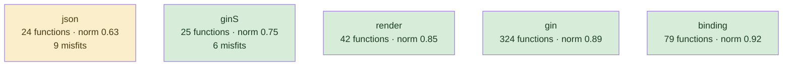
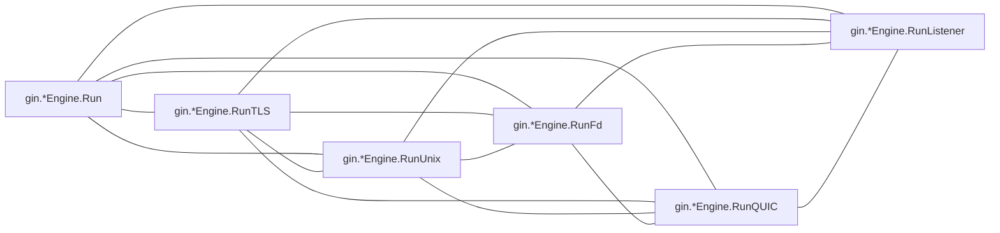
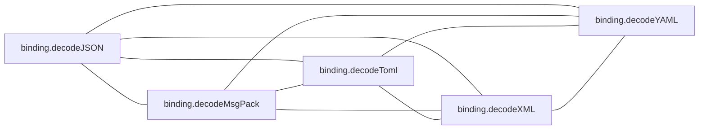
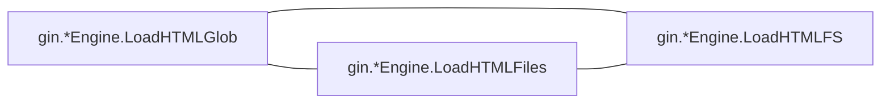
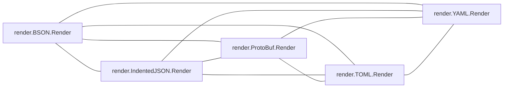
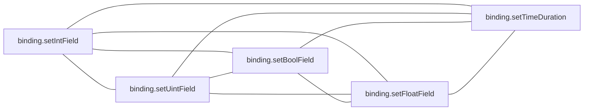

# gin

HTTP framework; a small core surrounded by generated-looking binding and render variants

**What this rung shows:** family clones — the case corroborated ranking was tuned to separate

| | |
|---|---|
| Corpus | [gin](https://github.com/gin-gonic/gin) |
| Pinned at | `v1.12.0` (`73726dc606796a025971fe451f0aa6f1b9b847f6`) |
| Project since | 2014 |
| doppel | `c4861da` |
| Command | `doppel analyze . --tests exclude --top 10` |

Run from the corpus root, so every path below is corpus-relative.
Regenerate with `task examples`; CI regenerates on every push to master.

## Run diagnostics

The corpus-level models doppel builds before ranking anything, as printed to stderr:

```
Scanning . ...
Learning concept vocabulary...
Lexicon: 46 concepts (6 seeded, 40 emergent), 1266/3382 features above 182 df, 76 functions unlabeled
Generating concept documents...
Culture: 37 concepts modeled, 153 associations, 31 unusual realizations
Habitats: 5 modeled, 15 misfits (0 excused by subsystem), 1 subsystems; most uniform binding (norm 0.92), most diverse json (norm 0.63)
Conventions: strongest c.MustBindWith+gin.*Context.MustBindWith (1.00), loosest gin.*Context.Header+gin.*Context.Set (0.22)
Ecosystems: 443 profiled (351 dominance, 74 coalition, 0 conflict, 18 weak)
Calibration: rate 0.01 over 20000 null pairs -> threshold 0.41, struct-min 0.49, family-min 0.41
Found 497 functions. Retrieving candidates...
Retrieval: shape 187, concept 1637, call 609 -> 2116 unique pairs
  concept-only 64.9%  call-only 17.4%  suppressed-shape functions: 0  large identity buckets: 0  surviving labels: 1934
Running structural comparison on 2116 pairs...
  Concept views: 70 of 2116 compared pairs disagree with the taxonomy (4 vocabulary the tree misses, 66 kinship the vocabularies lack)
  570 pairs remain after struct-min=0.49 filter
Families: 35 over 58 components, 169 functions in a family, 211 edges completed
```

# Code Similarity Report

**Functions analyzed:** 497 | **Threshold:** 0.38 | **Pairs found:** 10

---

## What doppel sees

**497 functions** across **7 packages** — test functions excluded. Structural roles: 361 leaf, 57 orchestrator, 17 passthrough, 62 utility.

### Concepts

These concepts were **learned from this corpus**, not read off a fixed list: each one is a group of functions that share a way of being written, named after the evidence that identified it. They hang from an authored interior, so two functions under the same *branch* score partial credit rather than nothing. Counts below are members; membership is graded, and a function can carry several.


**No practice here for** `circuit_breaker`, `db_access`, `error_wrapping`, `grpc_call`, `http_call`, `mapping`, `retry`, `transaction`. Concepts are learned from this corpus, so one can never be absent — it exists because functions carry it. These are the *seeds* the search started from that grew nothing: a direct answer to "does this codebase already do X".

| Concept | Functions | Convention |
|---|---:|---|
| `binding+nil` | 150 | `0.56` (settled) |
| `engine.MaxMultipartMemory+c.engine` | 82 | `0.56` (settled) |
| `c.requestHeader+gin.*Context.requestHeader` | 53 | `0.64` (settled) |
| `delims.Left+delims.Right+engine.SetHTMLTemplate` | 43 | `0.41` (loose) |
| `c.formCache+c.queryCache` | 39 | `0.47` (loose) |
| `json.Marshal+json.MarshalIndent` | 33 | `0.64` (settled) |
| `writermem.WriteHeaderNow+c.writermem` | 28 | `0.42` (loose) |
| `API.Marshal+bytesconv.StringToBytes` | 24 | `0.31` (loose) |
| `Request.URL+req.URL` | 22 | `0.44` (loose) |
| `delims.Left+delims.Right` | 22 | `0.32` (loose) |
| `group.calculateAbsolutePath+group.engine` | 22 | `0.44` (loose) |
| `value.Set+value.Type` | 20 | `0.44` (loose) |
| `gin+template` | 19 | `0.78` (unanimous) |
| `value.Addr+field.Tag` | 18 | `0.51` (settled) |
| `n.nType+n.priority` | 13 | `0.51` (settled) |
| `reflect.New+reflect.Array` | 12 | `0.32` (loose) |
| `xml+runtime` | 12 | `0.45` (loose) |
| `URL.Path+c.Writer` | 11 | `0.30` (loose) |
| `io.ReadAll+req.Body` | 11 | `0.40` (loose) |
| `tree.method+tree.root` | 11 | `0.33` (loose) |
| `reflect.Map+reflect.New` | 10 | `0.33` (loose) |
| `c.Next+c.Request` | 9 | `0.42` (loose) |
| `w.WriteHeaderNow+w.ResponseWriter` | 9 | `0.24` (loose) |
| `bytesconv.StringToBytes+json.API` | 8 | `0.23` (loose) |
| `cmp+httputil` | 8 | `0.44` (loose) |
| `field.Tag+Tag.Get` | 8 | `0.41` (loose) |
| `gin.*Context.Header+gin.*Context.Set` | 8 | `0.22` (loose) |
| `render.writeContentType+bytes` | 8 | `0.65` (settled) |
| `c.MustBindWith+gin.*Context.MustBindWith` | 7 | `1.00` (unanimous) |
| `c.ShouldBindWith+gin.*Context.ShouldBindWith` | 7 | `1.00` (unanimous) |
| `gin.IsDebugging+gin.debugPrint` | 7 | `0.28` (loose) |
| `gin.debugPrint+atomic` | 7 | `0.30` (loose) |
| `c.hasRequestContext+Request.Context` | 5 | `0.48` (loose) |
| `flag+atomic` | 5 | `0.57` (settled) |
| `http.Server+engine.Handler` | 5 | `0.93` (unanimous) |
| `strings.Split+reflect` | 5 | `0.45` (loose) |
| `subtle+base64` | 5 | `0.36` (loose) |
| `bytes.NewReader+bytes` | 4 | — |
| `bytesconv.BytesToString+bytesconv` | 4 | — |
| `c.Abort+gin.*Context.Abort` | 4 | — |
| `c.ShouldBindBodyWith+gin.*Context.ShouldBindBody…` | 4 | — |
| `fmt.Fprintf+runtime` | 4 | — |
| `reflect.Array+reflect.Slice` | 4 | — |
| `strings.TrimSpace+bytesconv` | 4 | — |
| `log` | 3 | — |
| `reflect.New+value.Type` | 2 | — |

Convention is how uniformly this corpus realizes a concept: `1.00` means every function carrying the tag does it the same way, and a low number means the tag covers several unrelated habits. A concept with fewer than five members is not modeled.

### Where the duplication is

Merge-worthy pairs folded up to their packages. An edge means two packages keep solving the same problem separately; a count on a node means the repetition is inside one package.

### How settled each package is

A package with at least five functions gets a habitat model: doppel learns what is normal there and measures how surprising each member is against it. **Norm** is how uniform the package's practice is. A **misfit** is a function alien to its package *and* to the wider subsystem around it — one that fits its neighbours a directory up is normal for this codebase and is not reported.



Most uniform is `binding` (norm `0.92`); most varied is `json` (norm `0.63`). 15 functions are alien to their package and to the subsystem around it.

### How these candidates were found

Three channels propose candidates independently — shared rare *structure*, shared *concepts*, shared *calls* — and their union is what gets compared. This run: **2116 candidate pairs** (shape 187, concept 1637, call 609), of which 17% arrived on call evidence alone and 65% on concept evidence alone. A pair sharing none of the three is never compared, however alike it looks.

The concept signal on each compared pair is read three ways — what the taxonomy asserts, what this corpus's frequencies say, and what the two sides' learned vocabularies share with no tree in between. On **70 of 2116** pairs the taxonomy and the vocabularies differ by at least 0.50: 4 where the vocabularies agree and the tree cannot see it, 66 where the tree asserts a kinship the vocabularies lack. Each such pair carries a `concept views` line saying which.

Each function is also an arena where its candidate concepts compete for its evidence. 443 functions reached an equilibrium: **351** settled on a single concept, **74** on a coalition, **0** hold concepts this corpus says do not go together.

### Corpus metrics

**Compression ratio:** `5.28`x — this corpus's canonical function bodies contain **17625 AST nodes** in total, which hash-cons (two nodes count as the same subtree exactly when their kind and every child match, all the way down) to **3336 distinct subtree shapes**; the ratio is nodes divided by shapes, always >= 1.0, and it never feeds any score.

**Nearest-neighbour code-shape:** of **497 functions**, **463** had a code-shape neighbour among the pairs retrieval actually scored — their best score's p50/p90/p99 are `0.48` / `1.00` / `1.00`, and 65% of them (303 of 463) already clear this run's threshold of `0.41`. This is **not an exhaustive nearest-neighbour search** (that would be a full pairwise comparison); it is bounded by the same three retrieval channels the pair list itself is bounded by, so the other 34 functions are excluded here as having no *scored* neighbour, not asserted to have none at all.

---

## Local practice

The vocabulary above says what a concept *is*. This says what one looks like when **this** codebase writes it — learned from the corpus, so it describes the house style rather than a rule from anywhere else.

### How this codebase writes each concept

Only what is **distinctive**. A feature earns a row by being carried by this concept's members at least twice as often as by the corpus at large — nearly every Go function has a `return` and an `if`, so prevalence alone would describe the language rather than this codebase. Weights are how much a channel counts toward whether a member looks normal — calls 40, control flow 20, co-occurring tags 15, role 15, package 10.

**`binding+nil`** — 150 functions

| Channel | Feature | | Members | vs corpus |
|---|---|---|---|---|
| cotags ×15 | `engine.MaxMultipartMemory+c.engine` | `███·······` | 51 of 150 | 2.1× |

**`engine.MaxMultipartMemory+c.engine`** — 82 functions

| Channel | Feature | | Members | vs corpus |
|---|---|---|---|---|
| cotags ×15 | `c.requestHeader+gin.*Context.requestHeader` | `██████····` | 48 of 82 | 5.5× |
|  | `c.formCache+c.queryCache` | `███·······` | 26 of 82 | 4.0× |
|  | `binding+nil` | `██████····` | 51 of 82 | 2.1× |

**`c.requestHeader+gin.*Context.requestHeader`** — 53 functions

| Channel | Feature | | Members | vs corpus |
|---|---|---|---|---|
| cotags ×15 | `engine.MaxMultipartMemory+c.engine` | `█████████·` | 48 of 53 | 5.5× |
|  | `c.formCache+c.queryCache` | `████······` | 20 of 53 | 4.8× |

**`delims.Left+delims.Right+engine.SetHTMLTemplate`** — 43 functions

| Channel | Feature | | Members | vs corpus |
|---|---|---|---|---|
| cotags ×15 | `Request.URL+req.URL` | `███·······` | 11 of 43 | 5.8× |
| role ×15 | `orchestrator` | `███·······` | 13 of 43 | 2.6× |

**`c.formCache+c.queryCache`** — 39 functions

| Channel | Feature | | Members | vs corpus |
|---|---|---|---|---|
| cotags ×15 | `c.requestHeader+gin.*Context.requestHeader` | `█████·····` | 20 of 39 | 4.8× |
|  | `engine.MaxMultipartMemory+c.engine` | `███████···` | 26 of 39 | 4.0× |

**`json.Marshal+json.MarshalIndent`** — 33 functions

| Channel | Feature | | Members | vs corpus |
|---|---|---|---|---|
| package ×10 | `json` | `███████···` | 24 of 33 | 15× |

_31 further concepts are modeled and not described._

### Which concepts share a function

`++` at least four times chance, `+` at least twice, `−` at most half, `never` not once. A blank cell is ordinary company — near chance, which is not culture.

| | `API.Marshal+bytesconv.StringToBytes` | `Request.URL+req.URL` | `URL.Path+c.Writer` | `binding+nil` | `bytes.NewReader+bytes` | `bytesconv.BytesToString+bytesconv` | `bytesconv.StringToBytes+json.API` | `c.Abort+gin.*Context.Abort` | `c.MustBindWith+gin.*Context.MustBindWith` | `c.Next+c.Request` | `c.ShouldBindBodyWith+gin.*Context.ShouldBindBody…` | `c.ShouldBindWith+gin.*Context.ShouldBindWith` | `c.formCache+c.queryCache` | `c.hasRequestContext+Request.Context` | `c.requestHeader+gin.*Context.requestHeader` | `cmp+httputil` | `delims.Left+delims.Right` | `delims.Left+delims.Right+engine.SetHTMLTemplate` | `engine.MaxMultipartMemory+c.engine` | `field.Tag+Tag.Get` | `flag+atomic` | `fmt.Fprintf+runtime` | `gin+template` | `gin.*Context.Header+gin.*Context.Set` | `gin.IsDebugging+gin.debugPrint` | `gin.debugPrint+atomic` | `group.calculateAbsolutePath+group.engine` | `http.Server+engine.Handler` | `io.ReadAll+req.Body` | `json.Marshal+json.MarshalIndent` | `log` | `n.nType+n.priority` | `reflect.Array+reflect.Slice` | `reflect.Map+reflect.New` | `reflect.New+reflect.Array` | `reflect.New+value.Type` | `render.writeContentType+bytes` | `strings.Split+reflect` | `strings.TrimSpace+bytesconv` | `subtle+base64` | `tree.method+tree.root` | `value.Addr+field.Tag` | `value.Set+value.Type` | `w.WriteHeaderNow+w.ResponseWriter` | `writermem.WriteHeaderNow+c.writermem` |
|---|---|---|---|---|---|---|---|---|---|---|---|---|---|---|---|---|---|---|---|---|---|---|---|---|---|---|---|---|---|---|---|---|---|---|---|---|---|---|---|---|---|---|---|---|---|
| **`Request.URL+req.URL`** |  | | | | | | | | | | | | | | | | | | | | | | | | | | | | | | | | | | | | | | | | | | | | |
| **`URL.Path+c.Writer`** |  | ++ | | | | | | | | | | | | | | | | | | | | | | | | | | | | | | | | | | | | | | | | | | | |
| **`binding+nil`** |  | − | never | | | | | | | | | | | | | | | | | | | | | | | | | | | | | | | | | | | | | | | | | | |
| **`bytes.NewReader+bytes`** |  |  |  |  | | | | | | | | | | | | | | | | | | | | | | | | | | | | | | | | | | | | | | | | | |
| **`bytesconv.BytesToString+bytesconv`** |  |  |  |  |  | | | | | | | | | | | | | | | | | | | | | | | | | | | | | | | | | | | | | | | | |
| **`bytesconv.StringToBytes+json.API`** | ++ |  |  |  |  |  | | | | | | | | | | | | | | | | | | | | | | | | | | | | | | | | | | | | | | | |
| **`c.Abort+gin.*Context.Abort`** |  |  |  | + |  |  |  | | | | | | | | | | | | | | | | | | | | | | | | | | | | | | | | | | | | | | |
| **`c.MustBindWith+gin.*Context.MustBindWith`** |  |  |  | + |  |  |  |  | | | | | | | | | | | | | | | | | | | | | | | | | | | | | | | | | | | | | |
| **`c.Next+c.Request`** |  |  |  |  |  |  |  |  |  | | | | | | | | | | | | | | | | | | | | | | | | | | | | | | | | | | | | |
| **`c.ShouldBindBodyWith+gin.*Context.ShouldBindBody…`** |  |  |  | + |  |  |  |  |  |  | | | | | | | | | | | | | | | | | | | | | | | | | | | | | | | | | | | |
| **`c.ShouldBindWith+gin.*Context.ShouldBindWith`** |  |  |  | + |  |  |  |  |  |  |  | | | | | | | | | | | | | | | | | | | | | | | | | | | | | | | | | | |
| **`c.formCache+c.queryCache`** |  |  |  |  |  |  |  |  |  |  |  |  | | | | | | | | | | | | | | | | | | | | | | | | | | | | | | | | | |
| **`c.hasRequestContext+Request.Context`** |  |  |  |  |  |  |  |  |  |  |  |  |  | | | | | | | | | | | | | | | | | | | | | | | | | | | | | | | | |
| **`c.requestHeader+gin.*Context.requestHeader`** |  |  |  |  |  |  |  |  |  |  |  |  | ++ | ++ | | | | | | | | | | | | | | | | | | | | | | | | | | | | | | | |
| **`cmp+httputil`** |  |  |  |  |  |  |  |  |  |  |  |  |  |  |  | | | | | | | | | | | | | | | | | | | | | | | | | | | | | | |
| **`delims.Left+delims.Right`** |  |  |  |  |  |  |  |  |  |  |  |  |  |  |  |  | | | | | | | | | | | | | | | | | | | | | | | | | | | | | |
| **`delims.Left+delims.Right+engine.SetHTMLTemplate`** |  | ++ |  | − |  |  |  |  |  |  |  |  | never |  | never |  | + | | | | | | | | | | | | | | | | | | | | | | | | | | | | |
| **`engine.MaxMultipartMemory+c.engine`** | never |  |  | + |  |  |  |  |  |  |  |  | ++ | ++ | ++ |  | − | never | | | | | | | | | | | | | | | | | | | | | | | | | | | |
| **`field.Tag+Tag.Get`** |  |  |  |  |  |  |  |  |  |  |  |  |  |  |  |  |  |  |  | | | | | | | | | | | | | | | | | | | | | | | | | | |
| **`flag+atomic`** |  |  |  | + |  |  |  |  |  |  |  |  |  |  |  |  |  |  |  |  | | | | | | | | | | | | | | | | | | | | | | | | | |
| **`fmt.Fprintf+runtime`** |  |  |  |  |  |  |  |  |  |  |  |  |  |  |  |  |  |  |  |  |  | | | | | | | | | | | | | | | | | | | | | | | | |
| **`gin+template`** |  |  |  | never |  |  |  |  |  |  |  |  |  |  |  |  |  | + | never |  |  |  | | | | | | | | | | | | | | | | | | | | | | | |
| **`gin.*Context.Header+gin.*Context.Set`** |  |  |  |  |  |  |  |  |  |  |  |  |  |  |  |  |  |  |  |  |  |  |  | | | | | | | | | | | | | | | | | | | | | | |
| **`gin.IsDebugging+gin.debugPrint`** |  |  |  |  |  |  |  |  |  |  |  |  |  |  |  |  |  |  |  |  |  |  |  |  | | | | | | | | | | | | | | | | | | | | | |
| **`gin.debugPrint+atomic`** |  |  |  |  |  |  |  |  |  |  |  |  |  |  |  |  |  |  |  |  |  |  |  |  | ++ | | | | | | | | | | | | | | | | | | | | |
| **`group.calculateAbsolutePath+group.engine`** |  |  |  | never |  |  |  |  |  |  |  |  |  |  |  |  |  |  | never |  |  |  | + |  |  |  | | | | | | | | | | | | | | | | | | | |
| **`http.Server+engine.Handler`** |  |  |  |  |  |  |  |  |  |  |  |  |  |  |  |  |  | ++ |  |  |  |  |  |  |  |  |  | | | | | | | | | | | | | | | | | | |
| **`io.ReadAll+req.Body`** |  |  |  |  |  |  |  |  |  |  |  |  |  |  |  |  |  |  |  |  |  |  |  |  |  |  |  |  | | | | | | | | | | | | | | | | | |
| **`json.Marshal+json.MarshalIndent`** | ++ |  |  | − |  |  |  |  |  |  |  |  |  |  | never |  |  |  | never |  |  |  |  |  |  |  |  |  |  | | | | | | | | | | | | | | | | |
| **`log`** |  |  |  |  |  |  |  |  |  |  |  |  |  |  |  |  |  |  |  |  |  |  |  |  |  |  |  |  |  |  | | | | | | | | | | | | | | | |
| **`n.nType+n.priority`** |  |  |  | − |  |  |  |  |  |  |  |  |  |  |  |  |  |  |  |  |  |  |  |  |  |  |  |  |  |  |  | | | | | | | | | | | | | | |
| **`reflect.Array+reflect.Slice`** |  |  |  |  |  |  |  |  |  |  |  |  |  |  |  |  |  |  |  |  |  |  |  |  |  |  |  |  |  |  |  |  | | | | | | | | | | | | | |
| **`reflect.Map+reflect.New`** |  |  |  | never |  |  |  |  |  |  |  |  |  |  |  |  |  |  |  |  |  |  |  |  |  |  |  |  |  |  |  |  |  | | | | | | | | | | | | |
| **`reflect.New+reflect.Array`** |  |  |  | never |  |  |  |  |  |  |  |  |  |  |  |  |  |  |  |  |  |  |  |  |  |  |  |  |  |  |  |  |  | ++ | | | | | | | | | | | |
| **`reflect.New+value.Type`** |  |  |  |  |  |  |  |  |  |  |  |  |  |  |  |  |  |  |  |  |  |  |  |  |  |  |  |  |  |  |  |  |  |  |  | | | | | | | | | | |
| **`render.writeContentType+bytes`** | ++ |  |  |  |  |  |  |  |  |  |  |  |  |  |  |  |  |  |  |  |  |  |  |  |  |  |  |  |  |  |  |  |  |  |  |  | | | | | | | | | |
| **`strings.Split+reflect`** |  |  |  |  |  |  |  |  |  |  |  |  |  |  |  |  |  |  |  |  |  |  |  |  |  |  |  |  |  |  |  |  |  |  |  |  |  | | | | | | | | |
| **`strings.TrimSpace+bytesconv`** |  |  |  |  |  |  |  |  |  |  |  |  |  |  |  |  |  |  |  |  |  |  |  |  |  |  |  |  |  |  |  |  |  |  |  |  |  |  | | | | | | | |
| **`subtle+base64`** |  |  |  |  |  |  |  |  |  |  |  |  |  |  |  |  |  |  |  |  |  |  |  |  |  |  |  |  |  |  |  |  |  |  |  |  |  |  |  | | | | | | |
| **`tree.method+tree.root`** |  | ++ |  | − |  |  |  |  |  |  |  |  |  |  |  |  |  | ++ |  |  |  |  |  |  |  |  |  |  |  |  |  |  |  |  |  |  |  |  |  |  | | | | | |
| **`value.Addr+field.Tag`** |  |  |  |  |  |  |  |  |  |  |  |  |  |  |  |  |  |  |  | ++ |  |  |  |  |  |  |  |  |  |  |  |  |  | ++ | ++ |  |  |  |  |  |  | | | | |
| **`value.Set+value.Type`** |  |  |  | − |  |  |  |  |  |  |  |  |  |  |  |  |  |  | − | ++ |  |  |  |  |  |  |  |  |  |  |  |  |  | ++ | ++ |  |  |  |  |  |  | ++ | | | |
| **`w.WriteHeaderNow+w.ResponseWriter`** |  |  |  |  |  |  |  |  |  |  |  |  |  |  |  |  |  |  |  |  |  |  |  |  |  |  |  |  |  |  |  |  |  |  |  |  |  |  |  |  |  |  |  | | |
| **`writermem.WriteHeaderNow+c.writermem`** |  | ++ |  | − |  |  |  |  |  |  |  |  |  |  |  |  |  | + | never |  |  |  |  |  |  |  |  |  |  |  |  |  |  |  |  |  |  |  |  |  |  |  |  | ++ | |
| **`xml+runtime`** |  |  |  | − |  |  |  |  |  |  |  |  |  |  |  |  |  |  |  |  |  |  |  |  |  |  |  |  |  |  |  |  |  |  |  |  |  |  |  |  |  |  |  |  |  |

### What travels with what

Co-occurrence measured against chance across every function. Only relationships at least twice — or at most half — as common as chance are reported; near-chance company is not culture. Each kind is listed separately, because there are far more call tokens than concepts and one shared list is all calls. Within a kind, strongest first means lift weighted by how many functions carry it — a 100× relationship holding for three functions is a weaker finding than a 30× one holding for thirty.

**Together more than chance — tag~tag**

- 6 of 7 `gin.IsDebugging+gin.debugPrint` functions also `gin.debugPrint+atomic` — 61× chance
- 13 of 18 `value.Addr+field.Tag` functions also `value.Set+value.Type` — 18× chance
- 7 of 10 `reflect.Map+reflect.New` functions also `reflect.New+reflect.Array` — 29× chance
- 48 of 53 `c.requestHeader+gin.*Context.requestHeader` functions also `engine.MaxMultipartMemory+c.engine` — 5.5× chance
- 7 of 8 `bytesconv.StringToBytes+json.API` functions also `API.Marshal+bytesconv.StringToBytes` — 18× chance
- 7 of 10 `reflect.Map+reflect.New` functions also `value.Set+value.Type` — 17× chance
- _28 more not listed_

**Together more than chance — tag~role**

- 5 of 5 `http.Server+engine.Handler` functions also `orchestrator` — 8.7× chance
- 6 of 28 `writermem.WriteHeaderNow+c.writermem` functions also `passthrough` — 6.3× chance
- 5 of 8 `gin.*Context.Header+gin.*Context.Set` functions also `orchestrator` — 5.4× chance
- 13 of 43 `delims.Left+delims.Right+engine.SetHTMLTemplate` functions also `orchestrator` — 2.6× chance
- 4 of 8 `bytesconv.StringToBytes+json.API` functions also `orchestrator` — 4.4× chance
- 8 of 22 `delims.Left+delims.Right` functions also `utility` — 2.9× chance
- _8 more not listed_

**Together more than chance — tag~call**

- 7 of 7 `c.MustBindWith+gin.*Context.MustBindWith` functions also `gin.*Context.MustBindWith` — 55× chance
- 7 of 7 `c.ShouldBindWith+gin.*Context.ShouldBindWith` functions also `gin.*Context.ShouldBindWith` — 55× chance
- 8 of 10 `reflect.Map+reflect.New` functions also `reflect.ValueOf` — 40× chance
- 5 of 5 `http.Server+engine.Handler` functions also `gin.*Engine.isUnsafeTrustedProxies` — 83× chance
- 5 of 5 `http.Server+engine.Handler` functions also `gin.debugPrintError` — 83× chance
- 6 of 8 `gin.*Context.Header+gin.*Context.Set` functions also `gin.*Context.Header` — 47× chance
- _58 more not listed_

**Apart more than chance — tag~tag**

- **no** `delims.Left+delims.Right+engine.SetHTMLTemplate` function has `engine.MaxMultipartMemory+c.engine` — chance alone would give about 7 of 43
- **no** `binding+nil` function has `group.calculateAbsolutePath+group.engine` — chance alone would give about 7 of 150
- **no** `binding+nil` function has `gin+template` — chance alone would give about 6 of 150
- **no** `engine.MaxMultipartMemory+c.engine` function has `json.Marshal+json.MarshalIndent` — chance alone would give about 5 of 82
- **no** `engine.MaxMultipartMemory+c.engine` function has `writermem.WriteHeaderNow+c.writermem` — chance alone would give about 5 of 82
- **no** `c.requestHeader+gin.*Context.requestHeader` function has `delims.Left+delims.Right+engine.SetHTMLTemplate` — chance alone would give about 5 of 53
- _18 more not listed_

**Apart more than chance — tag~role**

- **no** `json.Marshal+json.MarshalIndent` function has `utility` — chance alone would give about 4 of 33
- **no** `json.Marshal+json.MarshalIndent` function has `orchestrator` — chance alone would give about 4 of 33
- **no** `http.Server+engine.Handler` function has `leaf` — chance alone would give about 4 of 5
- 8 of 150 `binding+nil` functions also `orchestrator` — 0.5× chance
- 1 of 82 `engine.MaxMultipartMemory+c.engine` functions also `orchestrator` — 0.1× chance
- 1 of 8 `gin.*Context.Header+gin.*Context.Set` functions also `leaf` — 0.2× chance
- _5 more not listed_

**Apart more than chance — tag~call**

- **no** `binding+nil` function has `gin.*RouterGroup.handle` — chance alone would give about 3 of 150
- **no** `engine.MaxMultipartMemory+c.engine` function has `render.writeContentType` — chance alone would give about 3 of 82
- **no** `binding+nil` function has `reflect.ValueOf` — chance alone would give about 3 of 150
- 1 of 150 `binding+nil` functions also `render.writeContentType` — 0.2× chance
- 1 of 150 `binding+nil` functions also `gin.*Context.Set` — 0.2× chance
- 2 of 150 `binding+nil` functions also `gin.debugPrint` — 0.4× chance

### Functions drifting from their own concept

These carry a tag but look nothing like the other functions carrying it. Typicality is measured against the concept's own median, so a genuinely varied concept lowers its own bar and a tight one can flag nobody.

| Function | Concept | Typicality | Concept median | |
|---|---|---:|---:|---|
| `gin.*Context.ClientIP` <br/>`context.go:975` | `c.requestHeader+gin.*Context.requestHeader` | `0.18` | `0.80` | no near-duplicate |
| `gin.*Context.Header` <br/>`context.go:1080` | `c.requestHeader+gin.*Context.requestHeader` | `0.23` | `0.80` | no near-duplicate |
| `binding.*multipartRequest.TrySet` <br/>`binding/multipart_form_mapping.go:27` | `engine.MaxMultipartMemory+c.engine` | `0.09` | `0.66` | no near-duplicate |
| `gin.*Context.NegotiateFormat` <br/>`context.go:1394` | `c.requestHeader+gin.*Context.requestHeader` | `0.24` | `0.80` | no near-duplicate |
| `gin.WrapH` <br/>`utils.go:54` | `xml+runtime` | `0.31` | `0.66` | no near-duplicate |
| `render.Redirect.WriteContentType` <br/>`render/redirect.go:29` | `bytesconv.StringToBytes+json.API` | `0.18` | `0.52` | no near-duplicate |
| `binding.setArray` <br/>`binding/form_mapping.go:490` | `binding+nil` | `0.12` | `0.38` | no near-duplicate |
| `gin.*responseWriter.Status` <br/>`response_writer.go:98` | `gin.*Context.Header+gin.*Context.Set` | `0.19` | `0.45` | no near-duplicate |
| `gin.*Engine.addRoute` <br/>`gin.go:364` | `tree.method+tree.root` | `0.12` | `0.36` | no near-duplicate |
| `binding.queryBinding.Bind` <br/>`binding/query.go:15` | `binding+nil` | `0.15` | `0.38` | no near-duplicate |

_21 more unusual realizations not listed._

A row marked _no near-duplicate_ appears in no reported pair: nothing else in this report explains it, which makes it drift rather than duplication.

---

## Match #1 — Code-shape: `1.0000`

| | Location | Function | Signature | Concepts |
|---|---|---|---|---|
| **A** | `auth.go:48` | `gin.BasicAuthForRealm` | `(Accounts, string) (HandlerFunc)` | gin.*Context.Header+gin.*Context.Set 0.50, subtle+base64 0.47, c.requestHeader+gin.*Context.requestHeader 0.35 |
| **B** | `auth.go:98` | `gin.BasicAuthForProxy` | `(Accounts, string) (HandlerFunc)` | gin.*Context.Header+gin.*Context.Set 0.50 |

**Explain:** identical after rename, commutative-reorder

**Profile A:** `gin.*Context.Header+gin.*Context.Set` 1.00 (dominance)

**Profile B:** `gin.*Context.Header+gin.*Context.Set` 1.00 (dominance)

**Code similarity:** `wl 1.00  flow 1.00  nesting 1.00  sig 1.00  size 1.00`

**Containment:** `1.00`

**Evidence:** `425.00` (shape 389.58, concept 2.16, call 33.26)

**Trophic:** `1.00`

**Shared structure:**

- `4.78` — `depth-3 CALL`
- `4.78` — `depth-3 ASSIGN`
- `4.78` — `depth-3 CALL`

**Concept views:** shape `0.33`, corpus `0.40`, feature `0.28`, a-in-b `0.28`, b-in-a `1.00`

**Shared vocabulary:** `id:found`, `call:gin.*Context.Header`, `call:gin.*Context.Set`

**Structural overlap:** `0.70` (merge-worthy)

- share 7 callees: [c.AbortWithStatus, c.Header, c.Set, c.requestHeader, pairs.searchCredential, processAccounts, strconv.Quote]
- overlapping call-graph neighborhoods (0.97): 32 shared
- share patterns: [gin.*Context.Header+gin.*Context.Set]
- both are orchestrator functions
- same package
- callees do related work (1.00): [c.Abort+gin.*Context.Abort, subtle+base64, bytesconv.StringToBytes+json.API, gin.*Context.Header+gin.*Context.Set, writermem.WriteHeaderNow+c.writermem, c.requestHeader+gin.*Context.requestHeader, engine.MaxMultipartMemory+c.engine, binding+nil]
- same visibility
- same receiver type: plain functions
- call into same packages: [gin]

---

## Match #2 — Code-shape: `0.6790`

| | Location | Function | Signature | Concepts |
|---|---|---|---|---|
| **A** | `gin.go:540` | `gin.*Engine.Run` | `(...string) (error)` | delims.Left+delims.Right+engine.SetHTMLTemplate 0.61, http.Server+engine.Handler 0.49 |
| **B** | `gin.go:561` | `gin.*Engine.RunTLS` | `(string, string, string) (error)` | delims.Left+delims.Right+engine.SetHTMLTemplate 0.62, http.Server+engine.Handler 0.53 |

**Explain:** differs by one extra assign, four extra call, one extra selector, and 2 more kinds

**Profile A:** `http.Server+engine.Handler` 1.00 (dominance)

**Profile B:** `http.Server+engine.Handler` 1.00 (dominance)

**Code similarity:** `wl 0.63  flow 1.00  nesting 1.00  sig 0.33  size 0.87`

**Containment:** `0.85`

**Evidence:** `286.89` (shape 270.53, concept 4.09, call 12.27)

**Trophic:** `0.93`

**Shared structure:**

- `5.67` — `depth-1 EXPRSTMT` ×2
- `5.67` — `depth-0 CALL` ×2
- `4.78` — `depth-3 ASSIGN`

**Concept views:** shape `1.00`, corpus `0.95`, feature `0.96`, a-in-b `1.00`, b-in-a `0.96`

**Shared vocabulary:** `id:and`, `id:listener`, `id:listen`

**Structural overlap:** `0.69` (merge-worthy)

- share 4 callees: [debugPrint, debugPrintError, engine.Handler, engine.isUnsafeTrustedProxies]
- overlapping call-graph neighborhoods (0.86): 19 shared
- share patterns: [delims.Left+delims.Right+engine.SetHTMLTemplate, http.Server+engine.Handler]
- both are orchestrator functions
- same package
- callees do related work (0.69): [fmt.Fprintf+runtime, gin.debugPrint+atomic, gin.IsDebugging+gin.debugPrint, delims.Left+delims.Right+engine.SetHTMLTemplate]
- same visibility
- same receiver type: Engine
- call into same packages: [gin]

---

## Match #3 — Code-shape: `0.6290`

| | Location | Function | Signature | Concepts |
|---|---|---|---|---|
| **A** | `gin.go:581` | `gin.*Engine.RunUnix` | `(string) (error)` | delims.Left+delims.Right+engine.SetHTMLTemplate 0.58, http.Server+engine.Handler 0.47 |
| **B** | `gin.go:645` | `gin.*Engine.RunListener` | `(net.Listener) (error)` | delims.Left+delims.Right+engine.SetHTMLTemplate 0.61, http.Server+engine.Handler 0.51 |

**Explain:** differs by two extra defer, one extra assign, one extra if, and 7 more kinds

**Profile A:** `http.Server+engine.Handler` 1.00 (dominance)

**Profile B:** `http.Server+engine.Handler` 1.00 (dominance)

**Code similarity:** `wl 0.57  flow 0.94  nesting 0.99  sig 0.33  size 0.69`

**Containment:** `0.84` — most of the smaller body's shape is inside the larger

**Evidence:** `294.88` (shape 278.72, concept 3.89, call 12.27)

**Trophic:** `0.85`

**Shared structure:**

- `5.67` — `depth-1 EXPRSTMT` ×2
- `5.67` — `depth-0 CALL` ×2
- `4.78` — `depth-3 UNARY`

**Concept views:** shape `1.00`, corpus `0.93`, feature `0.94`, a-in-b `1.00`, b-in-a `0.94`

**Shared vocabulary:** `id:and`, `id:listener`, `id:listen`

**Structural overlap:** `0.72` (merge-worthy)

- share 5 callees: [debugPrint, debugPrintError, engine.Handler, engine.isUnsafeTrustedProxies, server.Serve]
- overlapping call-graph neighborhoods (1.00): 19 shared
- share patterns: [delims.Left+delims.Right+engine.SetHTMLTemplate, http.Server+engine.Handler]
- both are orchestrator functions
- same package
- callees do related work (1.00): [fmt.Fprintf+runtime, gin.debugPrint+atomic, gin.IsDebugging+gin.debugPrint, delims.Left+delims.Right+engine.SetHTMLTemplate]
- same visibility
- same receiver type: Engine
- call into same packages: [gin]

---

## Match #4 — Code-shape: `0.7507`

| | Location | Function | Signature | Concepts |
|---|---|---|---|---|
| **A** | `gin.go:561` | `gin.*Engine.RunTLS` | `(string, string, string) (error)` | delims.Left+delims.Right+engine.SetHTMLTemplate 0.62, http.Server+engine.Handler 0.53 |
| **B** | `gin.go:630` | `gin.*Engine.RunQUIC` | `(string, string, string) (error)` | delims.Left+delims.Right+engine.SetHTMLTemplate 0.63, http.Server+engine.Handler 0.53 |

**Explain:** differs by one extra assign, two extra call, two extra key-value, and 4 more kinds

**Profile A:** `http.Server+engine.Handler` 1.00 (dominance)

**Profile B:** `http.Server+engine.Handler` 1.00 (dominance)

**Code similarity:** `wl 0.58  flow 1.00  nesting 1.00  sig 1.00  size 0.79`

**Containment:** `0.82`

**Evidence:** `225.00` (shape 208.43, concept 4.30, call 12.27)

**Trophic:** `0.86`

**Shared structure:**

- `5.67` — `depth-1 EXPRSTMT` ×2
- `5.67` — `depth-0 CALL` ×2
- `3.87` — `depth-3 CALL`

**Concept views:** shape `1.00`, corpus `0.99`, feature `0.98`, a-in-b `1.00`, b-in-a `0.98`

**Shared vocabulary:** `id:and`, `id:listener`, `id:listen`

**Structural overlap:** `0.76` (merge-worthy)

- share 4 callees: [debugPrint, debugPrintError, engine.Handler, engine.isUnsafeTrustedProxies]
- overlapping call-graph neighborhoods (1.00): 19 shared
- share patterns: [delims.Left+delims.Right+engine.SetHTMLTemplate, http.Server+engine.Handler]
- both are orchestrator functions
- same package
- callees do related work (1.00): [fmt.Fprintf+runtime, gin.debugPrint+atomic, gin.IsDebugging+gin.debugPrint, delims.Left+delims.Right+engine.SetHTMLTemplate]
- same visibility
- same receiver type: Engine
- call into same packages: [gin]

---

## Match #5 — Code-shape: `0.6576`

| | Location | Function | Signature | Concepts |
|---|---|---|---|---|
| **A** | `gin.go:288` | `gin.*Engine.LoadHTMLFiles` | `(...string)` | delims.Left+delims.Right 0.61, delims.Left+delims.Right+engine.SetHTMLTemplate 0.60 |
| **B** | `gin.go:300` | `gin.*Engine.LoadHTMLFS` | `(http.FileSystem, ...string)` | delims.Left+delims.Right 0.60, delims.Left+delims.Right+engine.SetHTMLTemplate 0.59 |

**Explain:** differs by two extra call, two extra key-value, one extra composite literal, and 2 more kinds

**Profile A:** `delims.Left+delims.Right` 1.00 (dominance)

**Profile B:** `delims.Left+delims.Right` 1.00 (dominance)

**Code similarity:** `wl 0.55  flow 1.00  nesting 1.00  sig 0.50  size 0.87`

**Containment:** `0.75`

**Evidence:** `234.18` (shape 206.68, concept 3.79, call 23.71)

**Trophic:** `0.84`

**Shared structure:**

- `5.98` — `depth-3 KV` ×2
- `5.98` — `depth-2 KV` ×2
- `5.82` — `depth-1 KV` ×2

**Concept views:** shape `1.00`, corpus `0.98`, feature `0.98`, a-in-b `0.98`, b-in-a `1.00`

**Shared vocabulary:** `call:binding.mapForm`, `call:gin.*Engine.SetHTMLTemplate`, `id:lazyinit`

**Structural overlap:** `0.77` (merge-worthy)

- share 6 callees: [Delims, Funcs, IsDebugging, engine.SetHTMLTemplate, template.Must, template.New]
- overlapping call-graph neighborhoods (1.00): 11 shared
- share patterns: [delims.Left+delims.Right, delims.Left+delims.Right+engine.SetHTMLTemplate]
- both are orchestrator functions
- same package
- callees do related work (1.00): [gin.debugPrint+atomic, gin.IsDebugging+gin.debugPrint, tree.method+tree.root, writermem.WriteHeaderNow+c.writermem, delims.Left+delims.Right, delims.Left+delims.Right+engine.SetHTMLTemplate]
- same visibility
- same receiver type: Engine
- call into same packages: [gin]

---

## Match #6 — Code-shape: `0.9625`

| | Location | Function | Signature | Concepts |
|---|---|---|---|---|
| **A** | `routergroup.go:147` | `gin.*RouterGroup.Any` | `(string, ...HandlerFunc) (IRoutes)` | group.calculateAbsolutePath+group.engine 0.53 |
| **B** | `routergroup.go:156` | `gin.*RouterGroup.Match` | `([]string, string, ...HandlerFunc) (IRoutes)` | group.calculateAbsolutePath+group.engine 0.53 |

**Explain:** identical after rename

**Profile A:** `group.calculateAbsolutePath+group.engine` 1.00 (dominance)

**Profile B:** `group.calculateAbsolutePath+group.engine` 1.00 (dominance)

**Code similarity:** `wl 1.00  flow 1.00  nesting 1.00  sig 0.75  size 1.00`

**Containment:** `1.00`

**Evidence:** `104.12` (shape 93.99, concept 1.90, call 8.23)

**Trophic:** `1.00`

**Shared structure:**

- `4.78` — `depth-3 BLOCK`
- `4.78` — `depth-3 EXPRSTMT`
- `4.78` — `depth-3 RANGE`

**Concept views:** shape `1.00`, corpus `0.99`, feature `0.99`, a-in-b `0.99`, b-in-a `1.00`

**Shared vocabulary:** `call:gin.*RouterGroup.calculateAbsolutePath`, `sel:group.calculateAbsolutePath`, `id:calculate`

**Structural overlap:** `0.81` (merge-worthy)

- share 2 callees: [group.handle, group.returnObj]
- overlapping call-graph neighborhoods (1.00): 16 shared
- share patterns: [group.calculateAbsolutePath+group.engine]
- both are orchestrator functions
- same package
- callees do related work (1.00): [group.calculateAbsolutePath+group.engine]
- same visibility
- same receiver type: RouterGroup
- call into same packages: [gin]

---

## Match #7 — Code-shape: `1.0000`

| | Location | Function | Signature | Concepts |
|---|---|---|---|---|
| **A** | `binding/toml.go:29` | `binding.decodeToml` | `(io.Reader, any) (error)` | delims.Left+delims.Right 0.62, binding+nil 0.44 |
| **B** | `binding/yaml.go:29` | `binding.decodeYAML` | `(io.Reader, any) (error)` | delims.Left+delims.Right 0.62, binding+nil 0.44 |

**Explain:** identical after rename, commutative-reorder

**Profile A:** `delims.Left+delims.Right` 1.00 (dominance)

**Profile B:** `delims.Left+delims.Right` 1.00 (dominance)

**Code similarity:** `wl 1.00  flow 1.00  nesting 1.00  sig 1.00  size 1.00`

**Containment:** `1.00`

**Evidence:** `103.59` (shape 100.67, concept 2.93, call 0.00)

**Trophic:** `1.00`

**Shared structure:**

- `4.38` — `depth-3 ASSIGN`
- `4.38` — `depth-3 BLOCK`
- `4.38` — `depth-3 CALL`

**Concept views:** shape `1.00`, corpus `1.00`, feature `1.00`, a-in-b `1.00`, b-in-a `1.00`

**Shared vocabulary:** `call:binding.mapForm`, `call:gin.*Engine.SetHTMLTemplate`, `id:lazyinit`

**Structural overlap:** `0.71` (merge-worthy)

- share 2 callees: [decoder.Decode, validate]
- share patterns: [binding+nil, delims.Left+delims.Right]
- both are utility functions
- same package
- callers do related work (1.00): [bytes.NewReader+bytes, io.ReadAll+req.Body]
- same visibility
- same receiver type: plain functions
- called from same packages: [binding]

---

## Match #8 — Code-shape: `1.0000`

| | Location | Function | Signature | Concepts |
|---|---|---|---|---|
| **A** | `binding/toml.go:29` | `binding.decodeToml` | `(io.Reader, any) (error)` | delims.Left+delims.Right 0.62, binding+nil 0.44 |
| **B** | `binding/xml.go:28` | `binding.decodeXML` | `(io.Reader, any) (error)` | delims.Left+delims.Right 0.63, binding+nil 0.45 |

**Explain:** identical after rename, commutative-reorder

**Profile A:** `delims.Left+delims.Right` 1.00 (dominance)

**Profile B:** `delims.Left+delims.Right` 1.00 (dominance)

**Code similarity:** `wl 1.00  flow 1.00  nesting 1.00  sig 1.00  size 1.00`

**Containment:** `1.00`

**Evidence:** `103.59` (shape 100.67, concept 2.93, call 0.00)

**Trophic:** `1.00`

**Shared structure:**

- `4.38` — `depth-3 ASSIGN`
- `4.38` — `depth-3 BLOCK`
- `4.38` — `depth-3 CALL`

**Culture:** B realizes `binding+nil` atypically (typicality 0.17, concept median 0.38, convention 0.56)

**Concept views:** shape `1.00`, corpus `0.99`, feature `0.99`, a-in-b `1.00`, b-in-a `0.99`

**Shared vocabulary:** `call:binding.mapForm`, `call:gin.*Engine.SetHTMLTemplate`, `id:lazyinit`

**Structural overlap:** `0.71` (merge-worthy)

- share 2 callees: [decoder.Decode, validate]
- share patterns: [binding+nil, delims.Left+delims.Right]
- both are utility functions
- same package
- callers do related work (0.98): [bytes.NewReader+bytes, io.ReadAll+req.Body]
- same visibility
- same receiver type: plain functions
- called from same packages: [binding]

---

## Match #9 — Code-shape: `1.0000`

| | Location | Function | Signature | Concepts |
|---|---|---|---|---|
| **A** | `binding/xml.go:28` | `binding.decodeXML` | `(io.Reader, any) (error)` | delims.Left+delims.Right 0.63, binding+nil 0.45 |
| **B** | `binding/yaml.go:29` | `binding.decodeYAML` | `(io.Reader, any) (error)` | delims.Left+delims.Right 0.62, binding+nil 0.44 |

**Explain:** identical after rename, commutative-reorder

**Profile A:** `delims.Left+delims.Right` 1.00 (dominance)

**Profile B:** `delims.Left+delims.Right` 1.00 (dominance)

**Code similarity:** `wl 1.00  flow 1.00  nesting 1.00  sig 1.00  size 1.00`

**Containment:** `1.00`

**Evidence:** `103.59` (shape 100.67, concept 2.93, call 0.00)

**Trophic:** `1.00`

**Shared structure:**

- `4.38` — `depth-3 ASSIGN`
- `4.38` — `depth-3 BLOCK`
- `4.38` — `depth-3 CALL`

**Culture:** A realizes `binding+nil` atypically (typicality 0.17, concept median 0.38, convention 0.56)

**Concept views:** shape `1.00`, corpus `0.99`, feature `0.99`, a-in-b `0.99`, b-in-a `1.00`

**Shared vocabulary:** `call:binding.mapForm`, `call:gin.*Engine.SetHTMLTemplate`, `id:lazyinit`

**Structural overlap:** `0.71` (merge-worthy)

- share 2 callees: [decoder.Decode, validate]
- share patterns: [binding+nil, delims.Left+delims.Right]
- both are utility functions
- same package
- callers do related work (0.98): [bytes.NewReader+bytes, io.ReadAll+req.Body]
- same visibility
- same receiver type: plain functions
- called from same packages: [binding]

---

## Match #10 — Code-shape: `1.0000`

| | Location | Function | Signature | Concepts |
|---|---|---|---|---|
| **A** | `render/toml.go:21` | `render.TOML.Render` | `(http.ResponseWriter) (error)` | API.Marshal+bytesconv.StringToBytes 0.59, binding+nil 0.43 |
| **B** | `render/yaml.go:21` | `render.YAML.Render` | `(http.ResponseWriter) (error)` | API.Marshal+bytesconv.StringToBytes 0.59, binding+nil 0.43 |

**Kind:** interface implementations — both implement `Render(http.ResponseWriter) (error)` on `TOML` and `YAML`, in package `render`

**Explain:** identical after rename, commutative-reorder

**Profile A:** `API.Marshal+bytesconv.StringToBytes` 0.74, `bytesconv.StringToBytes+json.API` 0.26 (dominance)

**Profile B:** `API.Marshal+bytesconv.StringToBytes` 0.74, `bytesconv.StringToBytes+json.API` 0.26 (dominance)

**Code similarity:** `wl 1.00  flow 1.00  nesting 1.00  sig 1.00  size 1.00`

**Containment:** `1.00`

**Evidence:** `95.66` (shape 89.18, concept 2.76, call 3.72)

**Trophic:** `1.00`

**Shared structure:**

- `4.78` — `depth-3 BLOCK`
- `4.78` — `depth-3 CALL`
- `4.78` — `depth-3 ASSIGN`

**Concept views:** shape `1.00`, corpus `1.00`, feature `1.00`, a-in-b `1.00`, b-in-a `1.00`

**Shared vocabulary:** `call:bytesconv.StringToBytes`, `sel:API.Marshal`, `sel:bytesconv.StringToBytes`

**Structural overlap:** `0.71` (merge-worthy)

- share 2 callees: [r.WriteContentType, w.Write]
- overlapping call-graph neighborhoods (1.00): 12 shared
- share patterns: [API.Marshal+bytesconv.StringToBytes, binding+nil]
- both are leaf functions
- same package
- callees do related work (1.00): [w.WriteHeaderNow+w.ResponseWriter, writermem.WriteHeaderNow+c.writermem]
- same visibility
- both are methods, on TOML and YAML
- call into same packages: [gin]

---

## Families

35 families, 169 functions in a family, largest 16 members; 211 edges scored here that retrieval never proposed

### Family 1 — 6 members, every pair `>= 0.48` code-shape, evidence `3517`



| Location | Function | Signature | Concepts |
|---|---|---|---|
| `gin.go:540` | `gin.*Engine.Run` | `(...string) (error)` | delims.Left+delims.Right+engine.SetHTMLTemplate 0.61, http.Server+engine.Handler 0.49 |
| `gin.go:561` | `gin.*Engine.RunTLS` | `(string, string, string) (error)` | delims.Left+delims.Right+engine.SetHTMLTemplate 0.62, http.Server+engine.Handler 0.53 |
| `gin.go:581` | `gin.*Engine.RunUnix` | `(string) (error)` | delims.Left+delims.Right+engine.SetHTMLTemplate 0.58, http.Server+engine.Handler 0.47 |
| `gin.go:607` | `gin.*Engine.RunFd` | `(int) (error)` | delims.Left+delims.Right+engine.SetHTMLTemplate 0.56 |
| `gin.go:630` | `gin.*Engine.RunQUIC` | `(string, string, string) (error)` | delims.Left+delims.Right+engine.SetHTMLTemplate 0.63, http.Server+engine.Handler 0.53 |
| `gin.go:645` | `gin.*Engine.RunListener` | `(net.Listener) (error)` | delims.Left+delims.Right+engine.SetHTMLTemplate 0.61, http.Server+engine.Handler 0.51 |

### Family 2 — 5 members, every pair `>= 0.47` code-shape, evidence `717`



| Location | Function | Signature | Concepts |
|---|---|---|---|
| `binding/json.go:44` | `binding.decodeJSON` | `(io.Reader, any) (error)` | delims.Left+delims.Right 0.51 |
| `binding/msgpack.go:31` | `binding.decodeMsgPack` | `(io.Reader, any) (error)` | delims.Left+delims.Right 0.43, binding+nil 0.40 |
| `binding/toml.go:29` | `binding.decodeToml` | `(io.Reader, any) (error)` | delims.Left+delims.Right 0.62, binding+nil 0.44 |
| `binding/xml.go:28` | `binding.decodeXML` | `(io.Reader, any) (error)` | delims.Left+delims.Right 0.63, binding+nil 0.45 |
| `binding/yaml.go:29` | `binding.decodeYAML` | `(io.Reader, any) (error)` | delims.Left+delims.Right 0.62, binding+nil 0.44 |

### Family 3 — 3 members, every pair `>= 0.45` code-shape, evidence `621`



| Location | Function | Signature | Concepts |
|---|---|---|---|
| `gin.go:272` | `gin.*Engine.LoadHTMLGlob` | `(string)` | delims.Left+delims.Right+engine.SetHTMLTemplate 0.60, delims.Left+delims.Right 0.59 |
| `gin.go:288` | `gin.*Engine.LoadHTMLFiles` | `(...string)` | delims.Left+delims.Right 0.61, delims.Left+delims.Right+engine.SetHTMLTemplate 0.60 |
| `gin.go:300` | `gin.*Engine.LoadHTMLFS` | `(http.FileSystem, ...string)` | delims.Left+delims.Right 0.60, delims.Left+delims.Right+engine.SetHTMLTemplate 0.59 |

### Family 4 — 5 members, every pair `>= 0.53` code-shape, evidence `619`, interface implementations of `Render(http.ResponseWriter) (error)`, in package `render`



| Location | Function | Signature | Concepts |
|---|---|---|---|
| `render/bson.go:21` | `render.BSON.Render` | `(http.ResponseWriter) (error)` | API.Marshal+bytesconv.StringToBytes 0.58, binding+nil 0.45, json.Marshal+json.MarshalIndent 0.14 |
| `render/json.go:78` | `render.IndentedJSON.Render` | `(http.ResponseWriter) (error)` | API.Marshal+bytesconv.StringToBytes 0.61, bytesconv.StringToBytes+json.API 0.47, json.Marshal+json.MarshalIndent 0.18 |
| `render/protobuf.go:21` | `render.ProtoBuf.Render` | `(http.ResponseWriter) (error)` | API.Marshal+bytesconv.StringToBytes 0.56, binding+nil 0.42 |
| `render/toml.go:21` | `render.TOML.Render` | `(http.ResponseWriter) (error)` | API.Marshal+bytesconv.StringToBytes 0.59, binding+nil 0.43 |
| `render/yaml.go:21` | `render.YAML.Render` | `(http.ResponseWriter) (error)` | API.Marshal+bytesconv.StringToBytes 0.59, binding+nil 0.43 |

### Family 5 — 5 members, every pair `>= 0.46` code-shape, evidence `415`



| Location | Function | Signature | Concepts |
|---|---|---|---|
| `binding/form_mapping.go:390` | `binding.setIntField` | `(string, int, reflect.Value) (error)` | value.Addr+field.Tag 0.55, binding+nil 0.43 |
| `binding/form_mapping.go:401` | `binding.setUintField` | `(string, int, reflect.Value) (error)` | value.Addr+field.Tag 0.54, binding+nil 0.42 |
| `binding/form_mapping.go:412` | `binding.setBoolField` | `(string, reflect.Value) (error)` | value.Addr+field.Tag 0.55, binding+nil 0.46, value.Set+value.Type 0.43 |
| `binding/form_mapping.go:423` | `binding.setFloatField` | `(string, int, reflect.Value) (error)` | value.Addr+field.Tag 0.57, binding+nil 0.46, value.Set+value.Type 0.39 |
| `binding/form_mapping.go:510` | `binding.setTimeDuration` | `(string, reflect.Value) (error)` | value.Addr+field.Tag 0.55, reflect.Map+reflect.New 0.55, value.Set+value.Type 0.54 |

_30 more families not listed._

