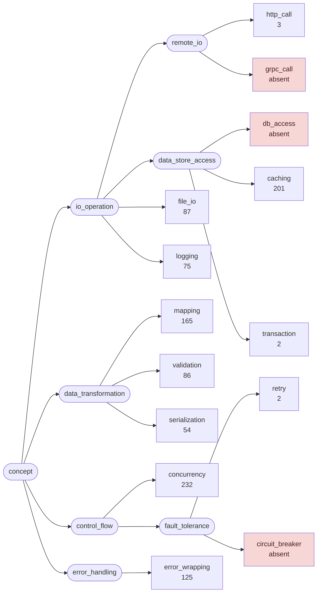
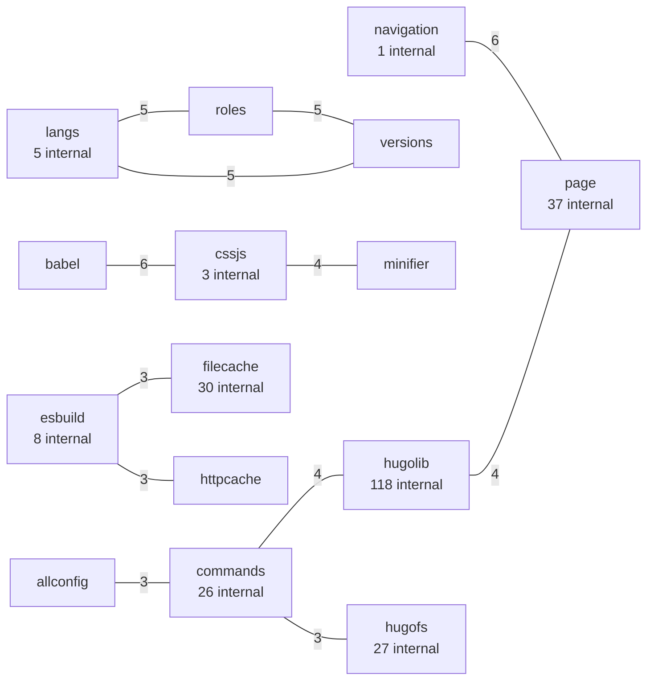

# hugo

static site generator; a large monolith with heavy template and resource subsystems

**What this rung shows:** habitats — many packages large enough to have a temperature of their own

| | |
|---|---|
| Corpus | [hugo](https://github.com/gohugoio/hugo) |
| Pinned at | `v0.165.0` (`76a5e1880ab46688155b02e99bab9be2a6134492`) |
| Project since | 2013 |
| doppel | `2e3a4cc` |
| Command | `doppel analyze . --tests exclude --top 10` |

Run from the corpus root, so every path below is corpus-relative.
Regenerate with `task examples`.

## Run diagnostics

The corpus-level models doppel builds before ranking anything, as printed to stderr:

```
Scanning . ...
Generating concept documents...
Culture: 8 concepts modeled, 350 associations, 57 unusual realizations
Habitats: 126 modeled, 538 misfits (121 excused by subsystem), 31 subsystems; most uniform partials (norm 0.98), most diverse page (norm 0.61)
Conventions: strongest error_wrapping (0.64), loosest serialization (0.52)
Ecosystems: 1997 profiled (1408 dominance, 589 coalition, 0 conflict, 0 weak)
Found 5438 functions. Retrieving candidates...
Retrieval: shape 1004, concept 4057, call 8265 -> 12833 unique pairs
  concept-only 30.3%  call-only 60.7%  suppressed-shape functions: 70  large identity buckets: 0  surviving patterns: 31542
Running structural comparison on 12833 pairs...
Families: 134 over 341 components, 436 functions in a family, 188 edges completed
```

# Code Similarity Report

**Functions analyzed:** 5438 | **Threshold:** 0.60 | **Pairs found:** 10

---

## What doppel sees

**5438 functions** across **161 packages** — test functions excluded. Structural roles: 3526 leaf, 860 orchestrator, 253 passthrough, 799 utility.

### Concepts

doppel reads intent from the AST into a fixed vocabulary and reasons over the tree, so two functions that share a *branch* score partial credit rather than nothing. Leaf counts below are this corpus.



**Nothing here is tagged** `circuit_breaker`, `db_access`, `grpc_call`. That is a direct answer to "does this codebase already do X" — for those concepts, it does not.

| Concept | Functions | Convention |
|---|---:|---|
| `concurrency` | 232 | `0.60` (settled) |
| `caching` | 201 | `0.61` (settled) |
| `mapping` | 165 | `0.63` (settled) |
| `error_wrapping` | 125 | `0.64` (settled) |
| `file_io` | 87 | `0.54` (settled) |
| `validation` | 86 | `0.59` (settled) |
| `logging` | 75 | `0.52` (settled) |
| `serialization` | 54 | `0.52` (settled) |
| `http_call` | 3 | — |
| `retry` | 2 | — |
| `transaction` | 2 | — |

Convention is how uniformly this corpus realizes a concept: `1.00` means every function carrying the tag does it the same way, and a low number means the tag covers several unrelated habits. A concept with fewer than five members is not modeled.

### Where the duplication is

Merge-worthy pairs folded up to their packages. An edge means two packages keep solving the same problem separately; a count on a node means the repetition is inside one package.



_198 further package pairs are connected by merge-worthy duplication and are not drawn._

### How settled each package is

A package with at least five functions gets a habitat model: doppel learns what is normal there and measures how surprising each member is against it. **Norm** is how uniform the package's practice is. A **misfit** is a function alien to its package *and* to the wider subsystem around it — one that fits its neighbours a directory up is normal for this codebase and is not reported.

```mermaid
flowchart TD
    h0["page<br/>468 functions · norm 0.61<br/>140 misfits"]
    h1["sitesmatrix<br/>107 functions · norm 0.61<br/>39 misfits"]
    h2["parse<br/>208 functions · norm 0.62<br/>92 misfits"]
    h3["hugofs<br/>195 functions · norm 0.63<br/>81 misfits"]
    h4["versions<br/>12 functions · norm 0.63<br/>5 misfits"]
    h5["warpc<br/>54 functions · norm 0.65<br/>19 misfits"]
    h6["blockquotes<br/>12 functions · norm 0.65"]
    h7["identity<br/>55 functions · norm 0.65<br/>20 misfits"]
    h8["allconfig<br/>93 functions · norm 0.66<br/>29 misfits"]
    h9["langs<br/>31 functions · norm 0.66<br/>11 misfits"]
    h10["roles<br/>12 functions · norm 0.67<br/>4 misfits"]
    h11["navigation<br/>32 functions · norm 0.69<br/>10 misfits"]
    classDef good fill:#d7ecd9,color:#1b3d20
    classDef warn fill:#fbeecb,color:#4a3a12
    classDef hot fill:#f7d6d6,color:#4a1c1c
    class h0,h1,h2,h3,h4,h5,h6,h7,h8,h9,h10,h11 warn
```



_114 further packages are modeled and not drawn._ Most uniform is `partials` (norm `0.98`); most varied is `page` (norm `0.61`). 538 functions are alien to their package and to the subsystem around it. A further 121 fit poorly in their package but match the wider subsystem, so they are not reported.

### How these candidates were found

Three channels propose candidates independently — shared rare *structure*, shared *concepts*, shared *calls* — and their union is what gets compared. This run: **12833 candidate pairs** (shape 1004, concept 4057, call 8265), of which 61% arrived on call evidence alone and 30% on concept evidence alone. A pair sharing none of the three is never compared, however alike it looks.

Each function is also an arena where its candidate concepts compete for its evidence. 1997 functions reached an equilibrium: **1408** settled on a single concept, **589** on a coalition, **0** hold concepts this corpus says do not go together.

---

## Local practice

The vocabulary above says what a concept *is*. This says what one looks like when **this** codebase writes it — learned from the corpus, so it describes the house style rather than a rule from anywhere else.

### How this codebase writes each concept

Only what is **distinctive**. A feature earns a row by being carried by this concept's members at least twice as often as by the corpus at large — nearly every Go function has a `return` and an `if`, so prevalence alone would describe the language rather than this codebase. Weights are how much a channel counts toward whether a member looks normal — calls 40, control flow 20, co-occurring tags 15, role 15, package 10.

**`concurrency`** — 232 functions

| Channel | Feature | | Members | vs corpus |
|---|---|---|---|---|
| flow ×20 | `defer` | `██████····` | 142 of 232 | 12× |

**`caching`** — 201 functions

| Channel | Feature | | Members | vs corpus |
|---|---|---|---|---|
| flow ×20 | `funclit` | `████······` | 89 of 201 | 3.6× |
| role ×15 | `orchestrator` | `████······` | 74 of 201 | 2.3× |

**`mapping`** — 165 functions

| Channel | Feature | | Members | vs corpus |
|---|---|---|---|---|
| flow ×20 | `funclit` | `███·······` | 46 of 165 | 2.3× |
| role ×15 | `orchestrator` | `███·······` | 57 of 165 | 2.2× |

**`error_wrapping`** — 125 functions

| Channel | Feature | | Members | vs corpus |
|---|---|---|---|---|
| calls ×40 | `fmt.Errorf` | `██████████` | 124 of 125 | 16× |
| flow ×20 | `funclit` | `████······` | 52 of 125 | 3.4× |
|  | `range` | `█████·····` | 57 of 125 | 2.7× |
|  | `if` | `██████████` | 125 of 125 | 2.0× |
| role ×15 | `orchestrator` | `█████·····` | 66 of 125 | 3.3× |

**`file_io`** — 87 functions

| Channel | Feature | | Members | vs corpus |
|---|---|---|---|---|
| calls ×40 | `io.Copy` | `███·······` | 27 of 87 | 63× |
|  | `io.ReadAll` | `███·······` | 25 of 87 | 63× |
|  | `path/filepath.Join` | `███·······` | 24 of 87 | 15× |
| flow ×20 | `defer` | `█████·····` | 47 of 87 | 10× |
|  | `funclit` | `████······` | 37 of 87 | 3.5× |
| role ×15 | `orchestrator` | `█████·····` | 44 of 87 | 3.2× |

**`validation`** — 86 functions

| Channel | Feature | | Members | vs corpus |
|---|---|---|---|---|
| calls ×40 | `reflect.ValueOf` | `███·······` | 24 of 86 | 18× |
|  | `fmt.Errorf` | `███·······` | 26 of 86 | 4.8× |
| flow ×20 | `switch` | `███·······` | 25 of 86 | 5.5× |

_2 further concepts are modeled and not described._

### Which concepts share a function

`++` at least four times chance, `+` at least twice, `−` at most half, `never` not once. A blank cell is ordinary company — near chance, which is not culture.

| | `caching` | `concurrency` | `error_wrapping` | `file_io` | `http_call` | `logging` | `mapping` | `retry` | `serialization` | `transaction` |
|---|---|---|---|---|---|---|---|---|---|---|
| **`concurrency`** |  | | | | | | | | | |
| **`error_wrapping`** | ++ |  | | | | | | | | |
| **`file_io`** | ++ | + | ++ | | | | | | | |
| **`http_call`** |  |  |  |  | | | | | | |
| **`logging`** | + | + | ++ | ++ |  | | | | | |
| **`mapping`** | + |  | + | + |  |  | | | | |
| **`retry`** |  |  |  |  |  |  |  | | | |
| **`serialization`** | ++ |  | ++ | ++ |  |  | + |  | | |
| **`transaction`** |  |  |  |  |  |  |  |  |  | |
| **`validation`** |  | + | + |  |  | + | + |  |  |  |

### What travels with what

Co-occurrence measured against chance across every function. Only relationships at least twice — or at most half — as common as chance are reported; near-chance company is not culture. Each kind is listed separately, because there are far more call tokens than concepts and one shared list is all calls. Within a kind, strongest first means lift weighted by how many functions carry it — a 100× relationship holding for three functions is a weaker finding than a 30× one holding for thirty.

**Together more than chance — tag~tag**

- 15 of 87 `file_io` functions also `error_wrapping` — 7.5× chance
- 11 of 75 `logging` functions also `file_io` — 9.2× chance
- 18 of 87 `file_io` functions also `caching` — 5.6× chance
- 19 of 125 `error_wrapping` functions also `caching` — 4.1× chance
- 8 of 54 `serialization` functions also `error_wrapping` — 6.4× chance
- 10 of 54 `serialization` functions also `caching` — 5.0× chance
- _13 more not listed_

**Together more than chance — tag~role**

- 66 of 125 `error_wrapping` functions also `orchestrator` — 3.3× chance
- 44 of 87 `file_io` functions also `orchestrator` — 3.2× chance
- 36 of 75 `logging` functions also `orchestrator` — 3.0× chance
- 74 of 201 `caching` functions also `orchestrator` — 2.3× chance
- 57 of 165 `mapping` functions also `orchestrator` — 2.2× chance
- 21 of 165 `mapping` functions also `passthrough` — 2.7× chance
- _6 more not listed_

**Together more than chance — tag~call**

- 23 of 54 `serialization` functions also `encoding/json.Marshal` — 101× chance
- 19 of 54 `serialization` functions also `encoding/json.Unmarshal` — 101× chance
- 27 of 87 `file_io` functions also `io.Copy` — 63× chance
- 25 of 87 `file_io` functions also `io.ReadAll` — 63× chance
- 11 of 75 `logging` functions also `log.Fatal` — 73× chance
- 9 of 54 `serialization` functions also `encoding/json.NewEncoder` — 101× chance
- _308 more not listed_

**Apart more than chance — tag~role**

- 37 of 125 `error_wrapping` functions also `leaf` — 0.5× chance
- 27 of 87 `file_io` functions also `leaf` — 0.5× chance
- 6 of 125 `error_wrapping` functions also `utility` — 0.3× chance
- 2 of 54 `serialization` functions also `utility` — 0.3× chance
- 5 of 75 `logging` functions also `utility` — 0.5× chance

### Functions drifting from their own concept

These carry a tag but look nothing like the other functions carrying it. Typicality is measured against the concept's own median, so a genuinely varied concept lowers its own bar and a tight one can flag nobody.

| Function | Concept | Typicality | Concept median |
|---|---|---:|---:|
| `commands.*hugoBuilder.newWatcher` <br/>`commands/hugobuilder.go:314` | `concurrency` | `0.08` | `0.35` |
| `hugolib.NewHugoSites` <br/>`hugolib/site.go:199` | `concurrency` | `0.09` | `0.35` |
| `hugolib.*Site.renderPages` <br/>`hugolib/site_render.go:71` | `concurrency` | `0.10` | `0.35` |
| `hugolib.*IntegrationTestBuilder.initBuilder` <br/>`hugolib/integrationtest_builder.go:874` | `concurrency` | `0.10` | `0.35` |
| `hugolib.*pageContentOutput.initRenderHooks` <br/>`hugolib/page__per_output.go:227` | `concurrency` | `0.11` | `0.35` |
| `deploy.*Deployer.Deploy` <br/>`deploy/deploy.go:120` | `concurrency` | `0.11` | `0.35` |
| `collections.*Namespace.Sort` <br/>`tpl/collections/sort.go:31` | `concurrency` | `0.12` | `0.35` |
| `warpc.newDispatcher` <br/>`internal/warpc/warpc.go:585` | `concurrency` | `0.12` | `0.35` |
| `loggers.New` <br/>`common/loggers/logger.go:51` | `concurrency` | `0.12` | `0.35` |
| `commands.*serverCommand.serve` <br/>`commands/server.go:868` | `concurrency` | `0.12` | `0.35` |

_47 more unusual realizations not listed._

---

## Match #1 — Code-shape: `0.7661`

| | Location | Function | Signature | Patterns |
|---|---|---|---|---|
| **A** | `tpl/internal/go_templates/texttemplate/exec.go:772` | `template.*state.evalCallOld` | `(reflect.Value, reflect.Value, bool, parse.Node, string, []parse.Node, reflect.Value) (reflect.Value)` | validation, error_wrapping |
| **B** | `tpl/internal/go_templates/texttemplate/hugo_template.go:294` | `template.*state.evalCall` | `(reflect.Value, reflect.Value, bool, parse.Node, string, []parse.Node, reflect.Value, ...reflect.Value) (reflect.Value)` | validation, error_wrapping |

**Kind:** diverged copy — `*state.evalCallOld` and `*state.evalCall` share the stem `evalCall` in package `template`

**Profile A:** `validation` 1.00 (dominance)

**Profile B:** `validation` 1.00 (dominance)

**Code similarity:** `wl 0.65  flow 1.00  nesting 1.00  sig 0.86  size 0.75`

**Containment:** `0.92` — most of the smaller body's shape is inside the larger

**Evidence:** `3741.11` (shape 3686.51, concept 4.60, call 50.00)

**Trophic:** `0.88`

**Shared structure:**

- `41.32` — `flow:call:Type→call:NumIn`
- `34.44` — `flow:call:Type→call:In`
- `22.74` — `flow:call:Interface→return`

**Culture:** B realizes `error_wrapping` atypically (typicality 0.16, concept median 0.36, convention 0.64)

**Culture:** B realizes `validation` atypically (typicality 0.16, concept median 0.34, convention 0.59)

**Structural overlap:** `0.68` (merge-worthy)

- share 25 callees: [Elem, Interface, String, append, final.Equal, final.String, fun.Type, goodFunc, isMissing, len, make, reflect.ValueOf, s.at, s.errorf, s.evalArg, s.validateType, safeCall, t.Elem, truth, typ.In, typ.IsVariadic, typ.NumIn, unwrap, v.Interface, v.Type]
- overlapping call-graph neighborhoods (0.65): 36 shared
- share patterns: [error_wrapping, validation]
- related roles: orchestrator ≈ passthrough (both high fan-out, 0.50)
- same package
- callees do related work (1.00): [validation, mapping]
- same visibility
- same receiver type: state
- call into same packages: [template]

---

## Match #2 — Code-shape: `0.8293`

| | Location | Function | Signature | Patterns |
|---|---|---|---|---|
| **A** | `tpl/internal/go_templates/texttemplate/exec.go:682` | `template.*state.evalFieldOld` | `(reflect.Value, string, parse.Node, []parse.Node, reflect.Value, reflect.Value) (reflect.Value)` | validation |
| **B** | `tpl/internal/go_templates/texttemplate/hugo_template.go:156` | `template.*state.evalField` | `(reflect.Value, string, parse.Node, []parse.Node, reflect.Value, reflect.Value) (reflect.Value)` | validation |

**Kind:** diverged copy — `*state.evalFieldOld` and `*state.evalField` share the stem `evalField` in package `template`

**Profile A:** `validation` 1.00 (dominance)

**Profile B:** `validation` 1.00 (dominance)

**Code similarity:** `wl 0.72  flow 1.00  nesting 1.00  sig 1.00  size 0.75`

**Containment:** `0.93`

**Evidence:** `2230.52` (shape 2214.61, concept 2.49, call 13.42)

**Trophic:** `0.89`

**Shared structure:**

- `40.40` — `do(call:errorf)`
- `35.22` — `flow:param→call:errorf`
- `34.44` — `flow:param→call:evalCall`

**Structural overlap:** `0.77` (merge-worthy)

- share 26 callees: [AssignableTo, Elem, FieldByName, Key, etyp.FieldByName, etyp.Kind, indirect, len, method.IsValid, nameVal.Type, panic, ptr.Addr, ptr.CanAddr, ptr.Kind, ptr.MethodByName, receiver.FieldByIndexErr, receiver.IsValid, receiver.Kind, receiver.MapIndex, receiver.Type, reflect.ValueOf, reflect.Zero, result.IsValid, s.errorf, s.evalCall, tField.IsExported]
- overlapping call-graph neighborhoods (0.59): 13 shared
- share patterns: [validation]
- both are orchestrator functions
- same package
- callees do related work (1.00): [validation, error_wrapping]
- same visibility
- same receiver type: state
- call into same packages: [template]

---

## Match #3 — Code-shape: `0.7494`

| | Location | Function | Signature | Patterns |
|---|---|---|---|---|
| **A** | `tpl/math/init.go:26` | `math.init` | `()` | — |
| **B** | `tpl/strings/init.go:25` | `strings.init` | `()` | — |

**Code similarity:** `wl 0.61  flow 0.94  nesting 0.95  sig 1.00  size 0.92`

**Containment:** `0.80`

**Evidence:** `3172.59` (shape 3162.31, concept 0.00, call 10.28)

**Trophic:** `0.81`

**Shared structure:**

- `149.32` — `do(call:AddMethodMapping)`
- `146.58` — `seq[ do(call:AddMethodMapping) ; do(call:AddMethodMapping) ]`
- `5.05` — `seq[ assign:=(call:New) ; assign:=(unary) ]`

**Structural overlap:** `0.48` (merge-worthy)

- share 3 callees: [New, internal.AddTemplateFuncsNamespace, ns.AddMethodMapping]
- overlapping call-graph neighborhoods (0.97): 32 shared
- both are orchestrator functions
- same visibility
- same receiver type: plain functions
- call into same packages: [internal]

---

## Match #4 — Code-shape: `0.7006`

| | Location | Function | Signature | Patterns |
|---|---|---|---|---|
| **A** | `resources/image.go:82` | `resources.*imageResource.newExifInfoFn` | `() (func() (*meta.ExifInfo, error))` | caching, serialization, file_io |
| **B** | `resources/image.go:125` | `resources.*imageResource.newMetaInfoFn` | `() (func() (*meta.MetaInfo, error))` | caching, serialization, file_io |

**Profile A:** `file_io` 0.94, `caching` 0.06 (dominance)

**Profile B:** `file_io` 0.94, `caching` 0.06 (dominance)

**Code similarity:** `wl 0.75  flow 1.00  nesting 1.00  sig 0.00  size 0.96`

**Containment:** `0.87`

**Evidence:** `1230.71` (shape 1169.95, concept 7.07, call 53.69)

**Trophic:** `0.97`

**Shared structure:**

- `17.63` — `flow:call:ReadAll→cond`
- `17.63` — `flow:call:ReadAll→return`
- `7.58` — `seq[ assign:=(call:NewEncoder) ; return(call:Encode) ]`

**Habitat:** A fits poorly in `resources` (fit 0.27, package norm 0.75)

**Habitat:** B fits poorly in `resources` (fit 0.29, package norm 0.75)

**Structural overlap:** `0.89` (merge-worthy)

- share 14 callees: [InternalResourceSourcePathBestEffort, ReadOrCreate, ToImageMetaImageFormatFormat, Warnf, enc.Encode, f.Close, i.Key, i.ReadSeekCloser, i.getSpec, io.ReadAll, json.NewEncoder, json.Unmarshal, sync.OnceValues, w.Close]
- share 1 callers: [resources.newImageResource]
- overlapping call-graph neighborhoods (0.55): 24 shared
- share patterns: [caching, file_io, serialization]
- both are orchestrator functions
- same package
- callees do related work (1.00): [caching, concurrency]
- same visibility
- same receiver type: imageResource
- called from same packages: [resources]
- call into same packages: [filecache, images, resources]

---

## Match #5 — Code-shape: `0.7619`

| | Location | Function | Signature | Patterns |
|---|---|---|---|---|
| **A** | `tpl/collections/init.go:25` | `collections.init` | `()` | — |
| **B** | `tpl/strings/init.go:25` | `strings.init` | `()` | — |

**Code similarity:** `wl 0.60  flow 1.00  nesting 1.00  sig 1.00  size 0.86`

**Containment:** `0.82`

**Evidence:** `2848.97` (shape 2838.69, concept 0.00, call 10.28)

**Trophic:** `0.75`

**Shared structure:**

- `134.39` — `do(call:AddMethodMapping)`
- `131.42` — `seq[ do(call:AddMethodMapping) ; do(call:AddMethodMapping) ]`
- `5.05` — `seq[ assign:=(call:New) ; assign:=(unary) ]`

**Structural overlap:** `0.52` (merge-worthy)

- share 3 callees: [New, internal.AddTemplateFuncsNamespace, ns.AddMethodMapping]
- overlapping call-graph neighborhoods (0.91): 32 shared
- both are orchestrator functions
- callees do related work (1.00): [caching]
- same visibility
- same receiver type: plain functions
- call into same packages: [internal]

---

## Match #6 — Code-shape: `0.9282`

| | Location | Function | Signature | Patterns |
|---|---|---|---|---|
| **A** | `tpl/internal/go_templates/texttemplate/exec.go:892` | `template.*state._validateType` | `(reflect.Value, reflect.Type) (reflect.Value)` | validation |
| **B** | `tpl/internal/go_templates/texttemplate/hugo_template.go:435` | `template.*state.validateType` | `(reflect.Value, reflect.Type) (reflect.Value)` | validation, mapping |

**Kind:** diverged copy — `*state._validateType` and `*state.validateType` share the stem `validateType` in package `template`

**Profile A:** `validation` 1.00 (dominance)

**Profile B:** `validation` 1.00 (dominance)

**Code similarity:** `wl 0.88  flow 1.00  nesting 0.99  sig 1.00  size 0.92`

**Containment:** `0.97`

**Evidence:** `1457.44` (shape 1434.32, concept 2.49, call 20.63)

**Trophic:** `0.96`

**Shared structure:**

- `27.07` — `flow:param→call:Type`
- `25.93` — `flow:param→call:AssignableTo`
- `13.47` — `do(call:errorf)`

**Structural overlap:** `0.49` (merge-worthy)

- share 14 callees: [AssignableTo, Elem, canBeNil, reflect.PointerTo, reflect.ValueOf, reflect.Zero, s.errorf, value.Addr, value.CanAddr, value.Elem, value.IsNil, value.IsValid, value.Kind, value.Type]
- overlapping call-graph neighborhoods (0.07): 3 shared
- share patterns: [validation]
- same package
- same visibility
- same receiver type: state
- call into same packages: [template]

---

## Match #7 — Code-shape: `1.0000`

| | Location | Function | Signature | Patterns |
|---|---|---|---|---|
| **A** | `resources/image.go:198` | `resources.*imageResource.getImageMetaInfoCacheTargetPath` | `() (string)` | caching |
| **B** | `resources/image.go:501` | `resources.*imageResource.getImageMetaCacheTargetPath` | `() (string)` | caching |

**Profile A:** `caching` 1.00 (dominance)

**Profile B:** `caching` 1.00 (dominance)

**Code similarity:** `wl 1.00  flow 1.00  nesting 1.00  sig 1.00  size 0.99`

**Containment:** `1.00`

**Evidence:** `633.62` (shape 596.69, concept 1.64, call 35.29)

**Trophic:** `1.00`

**Shared structure:**

- `7.58` — `seq[ assign:=(call:FileAndExt) ; assign:=(call:hash) ]`
- `7.58` — `seq[ assign:=(call:HashStringHex) ; assign=(call:Sprintf) ]`
- `7.58` — `seq[ assign:=(call:getResourcePaths) ; assign:=(call:FileAndExt) ]`

**Structural overlap:** `0.83` (merge-worthy)

- share 8 callees: [df.TargetPath, fmt.Sprintf, hashing.HashStringHex, i.getResourcePaths, i.getSpec, i.hash, i.size, paths.FileAndExt]
- overlapping call-graph neighborhoods (0.92): 23 shared
- share patterns: [caching]
- both are orchestrator functions
- same package
- callers do related work (1.00): [serialization, file_io, caching]
- same visibility
- same receiver type: imageResource
- called from same packages: [resources]
- call into same packages: [hashing, paths, resources]

---

## Match #8 — Code-shape: `0.7426`

| | Location | Function | Signature | Patterns |
|---|---|---|---|---|
| **A** | `resources/resource_transformers/babel/babel.go:115` | `babel.*babelTransformation.Transform` | `(*resources.ResourceTransformationCtx) (error)` | mapping, concurrency, error_wrapping, file_io |
| **B** | `resources/resource_transformers/cssjs/postcss.go:146` | `cssjs.*postcssTransformation.Transform` | `(*resources.ResourceTransformationCtx) (error)` | mapping, concurrency, file_io |

**Kind:** interface implementations — both implement `Transform(*resources.ResourceTransformationCtx) (error)` on `*babelTransformation` and `*postcssTransformation`, sibling packages `babel` and `cssjs`

**Profile A:** `file_io` 1.00 (dominance)

**Profile B:** `file_io` 1.00 (dominance)

**Code similarity:** `wl 0.57  flow 1.00  nesting 1.00  sig 1.00  size 0.91`

**Containment:** `0.79`

**Evidence:** `2165.06` (shape 2052.31, concept 5.82, call 106.93)

**Trophic:** `0.77`

**Shared structure:**

- `30.32` — `flow:call:ResolveJSConfigFile→cond`
- `14.72` — `seq[ assign=(call:append) ; assign=(call:append) ]`
- `14.35` — `assign=(call:ResolveJSConfigFile)`

**Culture:** A realizes `concurrency` atypically (typicality 0.13, concept median 0.35, convention 0.60)

**Culture:** B realizes `concurrency` atypically (typicality 0.13, concept median 0.35, convention 0.60)

**Culture:** A realizes `mapping` atypically (typicality 0.14, concept median 0.31, convention 0.63)

**Culture:** B realizes `mapping` atypically (typicality 0.14, concept median 0.31, convention 0.63)

**Structural overlap:** `0.53` (merge-worthy)

- share 23 callees: [BaseConfig, InfoCommand, ResolveJSConfigFile, append, cmd.Run, cmd.StdinPipe, errBuf.String, ex.Npx, filepath.Clean, filepath.IsAbs, fmt.Errorf, hexec.IsNotFound, hexec.WithDir, hexec.WithEnviron, hexec.WithStderr, hexec.WithStdout, hugo.GetExecEnviron, infol.Logf, io.Copy, io.MultiWriter, len, loggers.LevelLoggerToWriter, stdin.Close]
- overlapping call-graph neighborhoods (0.39): 34 shared
- share patterns: [concurrency, file_io, mapping]
- both are orchestrator functions
- callees do related work (0.40): [caching]
- same visibility
- both are methods, on *babelTransformation and *postcssTransformation
- call into same packages: [allconfig, filesystems, hexec, hugo, loggers]

---

## Match #9 — Code-shape: `1.0000`

| | Location | Function | Signature | Patterns |
|---|---|---|---|---|
| **A** | `internal/js/esbuild/batch.go:1021` | `esbuild.*scriptGroup.Runner` | `(string) (js.OptionsSetter)` | validation, concurrency |
| **B** | `internal/js/esbuild/batch.go:1050` | `esbuild.*scriptGroup.Script` | `(string) (js.OptionsSetter)` | validation, concurrency |

**Profile A:** `validation` 1.00 (dominance)

**Profile B:** `validation` 1.00 (dominance)

**Code similarity:** `wl 1.00  flow 1.00  nesting 1.00  sig 1.00  size 1.00`

**Containment:** `1.00`

**Evidence:** `562.20` (shape 551.22, concept 3.99, call 6.99)

**Trophic:** `1.00`

**Shared structure:**

- `13.33` — `return(call:Get)`
- `7.58` — `seq[ assign:=(call:scriptID) ; if(id) ]`
- `7.58` — `seq[ defer(call:Unlock) ; assign:=(call:scriptID) ]`

**Structural overlap:** `0.81` (merge-worthy)

- share 8 callees: [Get, Lock, Unlock, ValidateBatchID, panic, s.key, scriptID, v.Get]
- overlapping call-graph neighborhoods (1.00): 4 shared
- share patterns: [concurrency, validation]
- both are leaf functions
- same package
- callees do related work (1.00): [validation]
- same visibility
- same receiver type: scriptGroup
- call into same packages: [esbuild]

---

## Match #10 — Code-shape: `0.6643`

| | Location | Function | Signature | Patterns |
|---|---|---|---|---|
| **A** | `resources/resource_transformers/cssjs/postcss.go:146` | `cssjs.*postcssTransformation.Transform` | `(*resources.ResourceTransformationCtx) (error)` | mapping, concurrency, file_io |
| **B** | `resources/resource_transformers/cssjs/tailwindcss.go:80` | `cssjs.*tailwindcssTransformation.Transform` | `(*resources.ResourceTransformationCtx) (error)` | mapping, concurrency, file_io |

**Kind:** interface implementations — both implement `Transform(*resources.ResourceTransformationCtx) (error)` on `*postcssTransformation` and `*tailwindcssTransformation`, in package `cssjs`

**Profile A:** `file_io` 1.00 (dominance)

**Profile B:** `file_io` 1.00 (dominance)

**Code similarity:** `wl 0.45  flow 0.98  nesting 0.99  sig 1.00  size 0.75`

**Containment:** `0.73` — most of the smaller body's shape is inside the larger

**Evidence:** `1661.62` (shape 1544.81, concept 5.82, call 110.99)

**Trophic:** `0.73`

**Shared structure:**

- `14.72` — `seq[ assign=(call:append) ; assign=(call:append) ]`
- `14.35` — `if(call:IsNotFound)`
- `7.58` — `seq[ assign:=(call:LevelLoggerToWriter) ; assign:=(sel) ]`

**Culture:** A realizes `concurrency` atypically (typicality 0.13, concept median 0.35, convention 0.60)

**Culture:** B realizes `concurrency` atypically (typicality 0.13, concept median 0.35, convention 0.60)

**Culture:** A realizes `mapping` atypically (typicality 0.14, concept median 0.31, convention 0.63)

**Culture:** B realizes `mapping` atypically (typicality 0.15, concept median 0.31, convention 0.63)

**Structural overlap:** `0.72` (merge-worthy)

- share 21 callees: [BaseConfig, InfoCommand, append, cmd.Run, cmd.StdinPipe, errBuf.String, ex.Npx, hexec.IsNotFound, hexec.WithDir, hexec.WithEnviron, hexec.WithStderr, hexec.WithStdout, hugo.GetExecEnviron, imp.resolve, imp.toFileError, io.Copy, io.MultiWriter, loggers.LevelLoggerToWriter, newImportResolver, options.toArgs, stdin.Close]
- overlapping call-graph neighborhoods (0.90): 44 shared
- share patterns: [concurrency, file_io, mapping]
- both are orchestrator functions
- same package
- callees do related work (1.00): [file_io, caching]
- same visibility
- both are methods, on *postcssTransformation and *tailwindcssTransformation
- call into same packages: [allconfig, cssjs, hexec, hugo, loggers]

---

## Families

134 families, 436 functions in a family, largest 14 members; 188 edges scored here that retrieval never proposed

### Family 1 — 12 members, every pair `>= 0.60` code-shape, evidence `32550`  (24 edges scored here)

_Not drawn: 12 members is 66 connections. Every one of them holds — that is what makes this a family._

| Location | Function | Signature | Patterns |
|---|---|---|---|
| `tpl/compare/init.go:26` | `compare.init` | `()` | — |
| `tpl/css/css.go:229` | `css.init` | `()` | mapping, caching |
| `tpl/debug/init.go:25` | `debug.init` | `()` | — |
| `tpl/fmt/init.go:25` | `fmt.init` | `()` | — |
| `tpl/lang/init.go:26` | `lang.init` | `()` | — |
| `tpl/os/init.go:25` | `os.init` | `()` | — |
| `tpl/path/init.go:27` | `path.init` | `()` | — |
| `tpl/resources/init.go:25` | `resources.init` | `()` | — |
| `tpl/safe/init.go:25` | `safe.init` | `()` | — |
| `tpl/templates/init.go:26` | `templates.init` | `()` | — |

_2 more members not listed._

### Family 2 — 12 members, every pair `>= 0.61` code-shape, evidence `32115`  (25 edges scored here)

_Not drawn: 12 members is 66 connections. Every one of them holds — that is what makes this a family._

| Location | Function | Signature | Patterns |
|---|---|---|---|
| `tpl/compare/init.go:26` | `compare.init` | `()` | — |
| `tpl/crypto/init.go:25` | `crypto.init` | `()` | — |
| `tpl/debug/init.go:25` | `debug.init` | `()` | — |
| `tpl/encoding/init.go:25` | `encoding.init` | `()` | — |
| `tpl/fmt/init.go:25` | `fmt.init` | `()` | — |
| `tpl/lang/init.go:26` | `lang.init` | `()` | — |
| `tpl/os/init.go:25` | `os.init` | `()` | — |
| `tpl/path/init.go:27` | `path.init` | `()` | — |
| `tpl/safe/init.go:25` | `safe.init` | `()` | — |
| `tpl/templates/init.go:26` | `templates.init` | `()` | — |

_2 more members not listed._

### Family 3 — 11 members, every pair `>= 0.62` code-shape, evidence `28757`  (18 edges scored here)

_Not drawn: 11 members is 55 connections. Every one of them holds — that is what makes this a family._

| Location | Function | Signature | Patterns |
|---|---|---|---|
| `tpl/compare/init.go:26` | `compare.init` | `()` | — |
| `tpl/crypto/init.go:25` | `crypto.init` | `()` | — |
| `tpl/debug/init.go:25` | `debug.init` | `()` | — |
| `tpl/encoding/init.go:25` | `encoding.init` | `()` | — |
| `tpl/fmt/init.go:25` | `fmt.init` | `()` | — |
| `tpl/inflect/init.go:25` | `inflect.init` | `()` | — |
| `tpl/lang/init.go:26` | `lang.init` | `()` | — |
| `tpl/os/init.go:25` | `os.init` | `()` | — |
| `tpl/safe/init.go:25` | `safe.init` | `()` | — |
| `tpl/transform/init.go:25` | `transform.init` | `()` | — |

_1 more members not listed._

### Family 4 — 12 members, every pair `>= 0.61` code-shape, evidence `26855`  (23 edges scored here)

_Not drawn: 12 members is 66 connections. Every one of them holds — that is what makes this a family._

| Location | Function | Signature | Patterns |
|---|---|---|---|
| `tpl/cast/init.go:25` | `cast.init` | `()` | — |
| `tpl/compare/init.go:26` | `compare.init` | `()` | — |
| `tpl/crypto/init.go:25` | `crypto.init` | `()` | — |
| `tpl/debug/init.go:25` | `debug.init` | `()` | — |
| `tpl/encoding/init.go:25` | `encoding.init` | `()` | — |
| `tpl/fmt/init.go:25` | `fmt.init` | `()` | — |
| `tpl/inflect/init.go:25` | `inflect.init` | `()` | — |
| `tpl/lang/init.go:26` | `lang.init` | `()` | — |
| `tpl/os/init.go:25` | `os.init` | `()` | — |
| `tpl/partials/init.go:25` | `partials.init` | `()` | caching |

_2 more members not listed._

### Family 5 — 12 members, every pair `>= 0.60` code-shape, evidence `24259`  (31 edges scored here)

_Not drawn: 12 members is 66 connections. Every one of them holds — that is what makes this a family._

| Location | Function | Signature | Patterns |
|---|---|---|---|
| `tpl/compare/init.go:26` | `compare.init` | `()` | — |
| `tpl/crypto/init.go:25` | `crypto.init` | `()` | — |
| `tpl/debug/init.go:25` | `debug.init` | `()` | — |
| `tpl/encoding/init.go:25` | `encoding.init` | `()` | — |
| `tpl/fmt/init.go:25` | `fmt.init` | `()` | — |
| `tpl/lang/init.go:26` | `lang.init` | `()` | — |
| `tpl/os/init.go:25` | `os.init` | `()` | — |
| `tpl/partials/init.go:25` | `partials.init` | `()` | caching |
| `tpl/path/init.go:27` | `path.init` | `()` | — |
| `tpl/safe/init.go:25` | `safe.init` | `()` | — |

_2 more members not listed._

_129 more families not listed._

