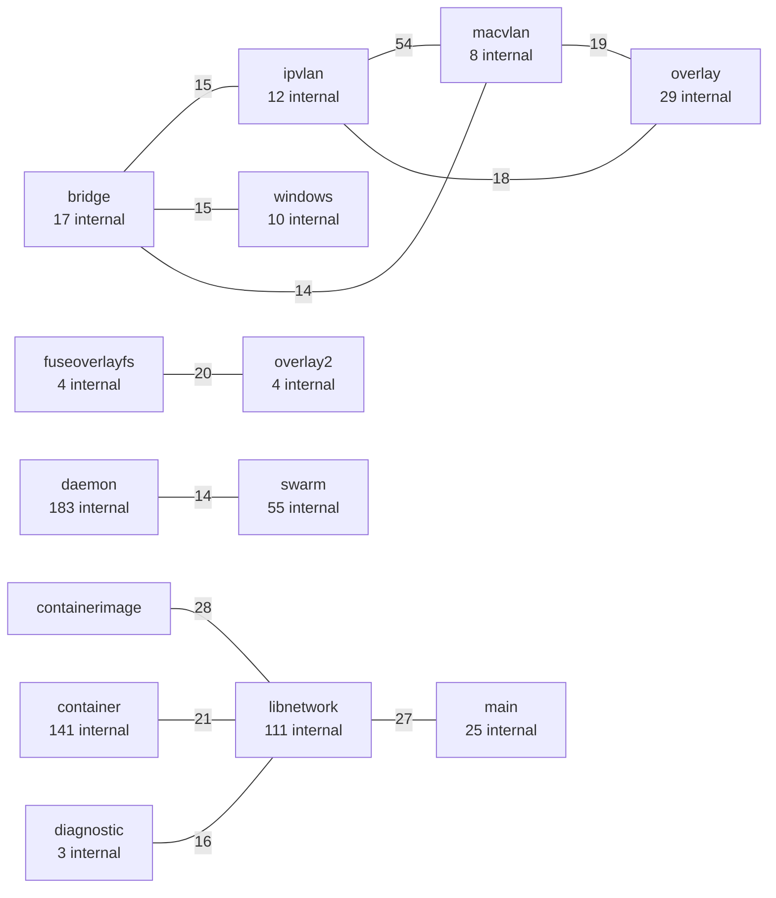
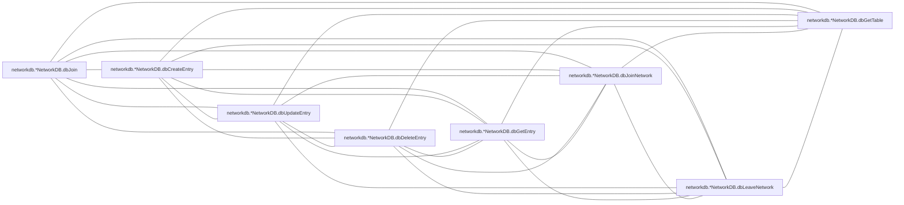
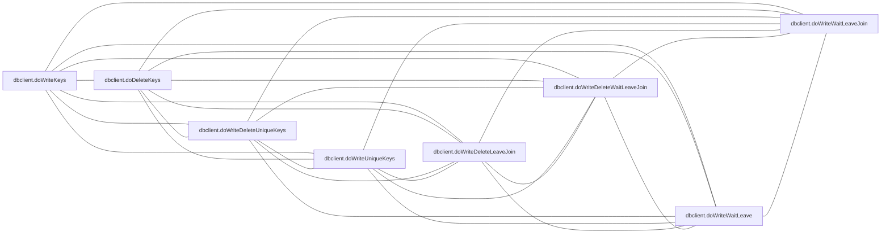
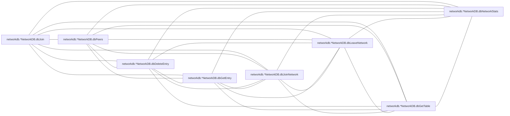
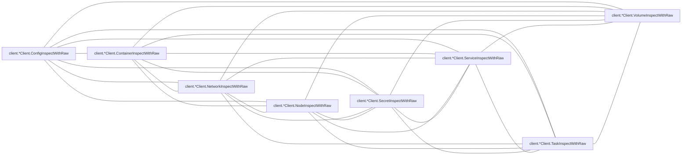

# moby

container engine; a decade of accretion across daemon, API, and plugin layers

**What this rung shows:** scale, df caps, and the common-idiom suppression the retrieval channels exist for

| | |
|---|---|
| Corpus | [moby](https://github.com/moby/moby) |
| Pinned at | `v28.5.2` (`89c5e8fd66634b6128fc4c0e6f1236e2540e46e0`) |
| Project since | 2013 |
| doppel | `bc0615f` |
| Command | `doppel analyze . --tests exclude --top 10` |

Run from the corpus root, so every path below is corpus-relative.
Regenerate with `task examples`.

## Run diagnostics

The corpus-level models doppel builds before ranking anything, as printed to stderr:

```
Scanning . ...
Generating concept documents...
Culture: 12 concepts modeled, 790 associations, 113 unusual realizations
Habitats: 166 modeled, 101 misfits (152 excused by subsystem), 58 subsystems; most uniform checker (norm 0.98), most diverse vfs (norm 0.56)
Conventions: strongest error_wrapping (0.62), loosest db_access (0.37)
Ecosystems: 3997 profiled (3689 dominance, 308 coalition, 0 conflict, 0 weak)
Found 7644 functions. Retrieving candidates...
Retrieval: shape 1870, concept 2410, call 12442 -> 16037 unique pairs
  concept-only 14.3%  call-only 73.5%  suppressed-shape functions: 179  large identity buckets: 3  surviving patterns: 46104
Running structural comparison on 16037 pairs...
Families: 182 over 514 components, 698 functions in a family, 939 edges completed
  1 pairs suppressed by max-per-func=2
```

# Code Similarity Report

**Functions analyzed:** 7644 | **Threshold:** 0.60 | **Pairs found:** 10

---

## What doppel sees

**7644 functions** across **232 packages** — test functions excluded. Structural roles: 4296 leaf, 1840 orchestrator, 410 passthrough, 1098 utility.

### Concepts

doppel reads intent from the AST into a fixed vocabulary and reasons over the tree, so two functions that share a *branch* score partial credit rather than nothing. Leaf counts below are this corpus.


**Nothing here is tagged** `circuit_breaker`, `grpc_call`. That is a direct answer to "does this codebase already do X" — for those concepts, it does not.

| Concept | Functions | Convention |
|---|---:|---|
| `concurrency` | 932 | `0.55` (settled) |
| `error_wrapping` | 533 | `0.62` (settled) |
| `validation` | 410 | `0.59` (settled) |
| `file_io` | 352 | `0.55` (settled) |
| `serialization` | 312 | `0.57` (settled) |
| `logging` | 146 | `0.52` (settled) |
| `caching` | 145 | `0.57` (settled) |
| `mapping` | 103 | `0.57` (settled) |
| `retry` | 74 | `0.50` (settled) |
| `transaction` | 48 | `0.47` (loose) |
| `db_access` | 23 | `0.37` (loose) |
| `http_call` | 20 | `0.41` (loose) |

Convention is how uniformly this corpus realizes a concept: `1.00` means every function carrying the tag does it the same way, and a low number means the tag covers several unrelated habits. A concept with fewer than five members is not modeled.

### Where the duplication is

Merge-worthy pairs folded up to their packages. An edge means two packages keep solving the same problem separately; a count on a node means the repetition is inside one package.



_185 further package pairs are connected by merge-worthy duplication and are not drawn._

### How settled each package is

A package with at least five functions gets a habitat model: doppel learns what is normal there and measures how surprising each member is against it. **Norm** is how uniform the package's practice is. A **misfit** is a function alien to its package *and* to the wider subsystem around it — one that fits its neighbours a directory up is normal for this codebase and is not reported.

```mermaid
flowchart TD
    h0["vfs<br/>27 functions · norm 0.56"]
    h1["null<br/>23 functions · norm 0.58"]
    h2["suite<br/>7 functions · norm 0.59<br/>3 misfits"]
    h3["archive<br/>45 functions · norm 0.60"]
    h4["termtest<br/>10 functions · norm 0.61<br/>1 misfit"]
    h5["filters<br/>27 functions · norm 0.63<br/>3 misfits"]
    h6["boltdb<br/>8 functions · norm 0.64<br/>3 misfits"]
    h7["opts<br/>87 functions · norm 0.64<br/>26 misfits"]
    h8["reference<br/>23 functions · norm 0.65<br/>8 misfits"]
    h9["testutils<br/>33 functions · norm 0.65<br/>2 misfits"]
    h10["oci<br/>11 functions · norm 0.67<br/>4 misfits"]
    h11["ovmanager<br/>18 functions · norm 0.67<br/>3 misfits"]
    classDef good fill:#d7ecd9,color:#1b3d20
    classDef warn fill:#fbeecb,color:#4a3a12
    classDef hot fill:#f7d6d6,color:#4a1c1c
    class h0,h1,h2,h3,h4,h5,h6,h7,h8,h9,h10,h11 warn
```



_154 further packages are modeled and not drawn._ Most uniform is `checker` (norm `0.98`); most varied is `vfs` (norm `0.56`). 101 functions are alien to their package and to the subsystem around it. A further 152 fit poorly in their package but match the wider subsystem, so they are not reported.

### How these candidates were found

Three channels propose candidates independently — shared rare *structure*, shared *concepts*, shared *calls* — and their union is what gets compared. This run: **16037 candidate pairs** (shape 1870, concept 2410, call 12442), of which 74% arrived on call evidence alone and 14% on concept evidence alone. A pair sharing none of the three is never compared, however alike it looks.

Each function is also an arena where its candidate concepts compete for its evidence. 3997 functions reached an equilibrium: **3689** settled on a single concept, **308** on a coalition, **0** hold concepts this corpus says do not go together.

_1 further pairs were held back so no single function fills the report._

### Corpus metrics

**Compression ratio:** `8.60`x — this corpus's canonical function bodies contain **568915 AST nodes** in total, which hash-cons (two nodes count as the same subtree exactly when their kind and every child match, all the way down) to **66158 distinct subtree shapes**; the ratio is nodes divided by shapes, always >= 1.0, and it never feeds any score.

**Nearest-neighbour code-shape:** of **7644 functions**, **4764** had a code-shape neighbour among the pairs retrieval actually scored — their best score's p50/p90/p99 are `0.43` / `1.00` / `1.00`, and 32% of them (1529 of 4764) already clear this run's threshold of `0.60`. This is **not an exhaustive nearest-neighbour search** (that would be a full pairwise comparison); it is bounded by the same three retrieval channels the pair list itself is bounded by, so the other 2880 functions are excluded here as having no *scored* neighbour, not asserted to have none at all.

---

## Local practice

The vocabulary above says what a concept *is*. This says what one looks like when **this** codebase writes it — learned from the corpus, so it describes the house style rather than a rule from anywhere else.

### How this codebase writes each concept

Only what is **distinctive**. A feature earns a row by being carried by this concept's members at least twice as often as by the corpus at large — nearly every Go function has a `return` and an `if`, so prevalence alone would describe the language rather than this codebase. Weights are how much a channel counts toward whether a member looks normal — calls 40, control flow 20, co-occurring tags 15, role 15, package 10.

**`concurrency`** — 932 functions

| Channel | Feature | | Members | vs corpus |
|---|---|---|---|---|
| calls ×40 | `sdjournal.noCopy.Unlock` | `███████···` | 635 of 932 | 7.9× |
|  | `github.com/containerd/log.G` | `███·······` | 242 of 932 | 2.3× |
| flow ×20 | `defer` | `██████····` | 530 of 932 | 4.2× |

**`error_wrapping`** — 533 functions

| Channel | Feature | | Members | vs corpus |
|---|---|---|---|---|
| calls ×40 | `github.com/pkg/errors.Wrap` | `████······` | 203 of 533 | 14× |
|  | `github.com/pkg/errors.Wrapf` | `███·······` | 174 of 533 | 14× |
|  | `fmt.Errorf` | `████······` | 207 of 533 | 3.7× |
| flow ×20 | `funclit` | `███·······` | 137 of 533 | 2.0× |
| role ×15 | `orchestrator` | `█████·····` | 260 of 533 | 2.0× |

**`validation`** — 410 functions

Nothing distinctive: its members do what the rest of the corpus does. The tag groups them; a shared way of writing them does not.

**`file_io`** — 352 functions

| Channel | Feature | | Members | vs corpus |
|---|---|---|---|---|
| calls ×40 | `path/filepath.Join` | `███·······` | 112 of 352 | 10× |
| flow ×20 | `defer` | `████······` | 151 of 352 | 3.2× |
|  | `funclit` | `███·······` | 99 of 352 | 2.2× |

**`serialization`** — 312 functions

| Channel | Feature | | Members | vs corpus |
|---|---|---|---|---|
| calls ×40 | `encoding/json.Marshal` | `████······` | 110 of 312 | 25× |
|  | `encoding/json.Unmarshal` | `███·······` | 97 of 312 | 25× |
|  | `encoding/json.NewDecoder` | `███·······` | 84 of 312 | 24× |
| flow ×20 | `defer` | `███·······` | 107 of 312 | 2.5× |

**`logging`** — 146 functions

| Channel | Feature | | Members | vs corpus |
|---|---|---|---|---|
| calls ×40 | `github.com/containerd/log.G` | `███·······` | 38 of 146 | 2.3× |
| flow ×20 | `defer` | `███·······` | 47 of 146 | 2.4× |
|  | `funclit` | `███·······` | 39 of 146 | 2.1× |
| cotags ×15 | `concurrency` | `███·······` | 45 of 146 | 2.5× |
| role ×15 | `orchestrator` | `██████····` | 90 of 146 | 2.6× |

_6 further concepts are modeled and not described._

### Which concepts share a function

`++` at least four times chance, `+` at least twice, `−` at most half, `never` not once. A blank cell is ordinary company — near chance, which is not culture.

| | `caching` | `concurrency` | `db_access` | `error_wrapping` | `file_io` | `http_call` | `logging` | `mapping` | `retry` | `serialization` | `transaction` |
|---|---|---|---|---|---|---|---|---|---|---|---|
| **`concurrency`** |  | | | | | | | | | | |
| **`db_access`** |  |  | | | | | | | | | |
| **`error_wrapping`** | + |  | + | | | | | | | | |
| **`file_io`** | + |  |  | + | | | | | | | |
| **`http_call`** |  |  |  | + | ++ | | | | | | |
| **`logging`** | + | + |  | + | + |  | | | | | |
| **`mapping`** |  |  |  |  | − |  |  | | | | |
| **`retry`** |  | + |  |  |  |  | + |  | | | |
| **`serialization`** |  |  |  | + | + | ++ |  | + |  | | |
| **`transaction`** | ++ | + | ++ | + | + |  |  |  |  | ++ | |
| **`validation`** |  |  |  |  |  |  | + | + |  |  |  |

### What travels with what

Co-occurrence measured against chance across every function. Only relationships at least twice — or at most half — as common as chance are reported; near-chance company is not culture. Each kind is listed separately, because there are far more call tokens than concepts and one shared list is all calls. Within a kind, strongest first means lift weighted by how many functions carry it — a 100× relationship holding for three functions is a weaker finding than a 30× one holding for thirty.

**Together more than chance — tag~tag**

- 11 of 23 `db_access` functions also `transaction` — 76× chance
- 79 of 352 `file_io` functions also `error_wrapping` — 3.2× chance
- 41 of 312 `serialization` functions also `file_io` — 2.9× chance
- 6 of 20 `http_call` functions also `serialization` — 7.3× chance
- 6 of 20 `http_call` functions also `file_io` — 6.5× chance
- 45 of 146 `logging` functions also `concurrency` — 2.5× chance
- _18 more not listed_

**Together more than chance — tag~role**

- 90 of 146 `logging` functions also `orchestrator` — 2.6× chance
- 260 of 533 `error_wrapping` functions also `orchestrator` — 2.0× chance
- 66 of 533 `error_wrapping` functions also `passthrough` — 2.3× chance
- 13 of 74 `retry` functions also `passthrough` — 3.3× chance
- 6 of 23 `db_access` functions also `passthrough` — 4.9× chance
- 19 of 145 `caching` functions also `passthrough` — 2.4× chance
- _2 more not listed_

**Together more than chance — tag~call**

- 7 of 20 `http_call` functions also `net/http.Get` — 382× chance
- 7 of 20 `http_call` functions also `net/http.NewRequest` — 382× chance
- 12 of 74 `retry` functions also `nlwrap.retryOnIntr` — 103× chance
- 19 of 103 `mapping` functions also `cluster.*Cluster.lockedManagerAction` — 50× chance
- 11 of 74 `retry` functions also `nlwrap.discardErrDumpInterrupted` — 103× chance
- 33 of 352 `file_io` functions also `os.Remove` — 22× chance
- _740 more not listed_

**Apart more than chance — tag~tag**

- 2 of 103 `mapping` functions also `file_io` — 0.4× chance

**Apart more than chance — tag~role**

- 41 of 146 `logging` functions also `leaf` — 0.5× chance
- 9 of 146 `logging` functions also `utility` — 0.4× chance

**Apart more than chance — tag~call**

- **no** `concurrency` function has `daemon.*Daemon.NewClientT` — chance alone would give about 5 of 932
- **no** `error_wrapping` function has `types.InvalidParameterErrorf` — chance alone would give about 3 of 533
- **no** `concurrency` function has `cluster.*Cluster.lockedManagerAction` — chance alone would give about 3 of 932
- **no** `concurrency` function has `client.*Client.NewVersionError` — chance alone would give about 3 of 932
- 2 of 932 `concurrency` functions also `client.*Client.post` — 0.3× chance
- 2 of 932 `concurrency` functions also `versions.LessThan` — 0.4× chance
- _3 more not listed_

### Functions drifting from their own concept

These carry a tag but look nothing like the other functions carrying it. Typicality is measured against the concept's own median, so a genuinely varied concept lowers its own bar and a tight one can flag nobody.

| Function | Concept | Typicality | Concept median | |
|---|---|---:|---:|---|
| `client.*Client.Events` <br/>`client/events.go:18` | `concurrency` | `0.14` | `0.34` | no near-duplicate |
| `sdjournal.noCopy.Unlock` <br/>`daemon/logger/journald/internal/sdjournal/sdjournal.go:264` | `concurrency` | `0.15` | `0.34` | no near-duplicate |
| `events.*Events.Evict` <br/>`daemon/events/events.go:77` | `concurrency` | `0.15` | `0.34` | no near-duplicate |
| `ioutils.NewCancelReadCloser` <br/>`pkg/ioutils/readers.go:51` | `concurrency` | `0.10` | `0.34` |  |
| `ioutils.CopyCtx` <br/>`internal/ioutils/copy.go:13` | `concurrency` | `0.10` | `0.34` |  |
| `network.collectPackets` <br/>`integration/internal/network/l2disco_linux.go:77` | `concurrency` | `0.11` | `0.34` |  |
| `remote.*container.createIO` <br/>`libcontainerd/remote/client.go:496` | `concurrency` | `0.11` | `0.34` |  |
| `distribution.*puller.pullSchema2Layers` <br/>`distribution/pull_v2.go:482` | `concurrency` | `0.12` | `0.34` |  |
| `tarexport.*tarexporter.Load` <br/>`image/tarexport/load.go:33` | `concurrency` | `0.12` | `0.34` |  |
| `service.*VolumesService.volumesToAPI` <br/>`volume/service/convert.go:34` | `concurrency` | `0.12` | `0.34` |  |

_103 more unusual realizations not listed._

A row marked _no near-duplicate_ appears in no reported pair: nothing else in this report explains it, which makes it drift rather than duplication.

---

## Match #1 — Code-shape: `0.9131`

| | Location | Function | Signature | Patterns |
|---|---|---|---|---|
| **A** | `libnetwork/networkdb/networkdbdiagnostic.go:128` | `networkdb.*NetworkDB.dbCreateEntry` | `(http.ResponseWriter, *http.Request)` | logging |
| **B** | `libnetwork/networkdb/networkdbdiagnostic.go:177` | `networkdb.*NetworkDB.dbUpdateEntry` | `(http.ResponseWriter, *http.Request)` | logging |

**Profile A:** `logging` 1.00 (dominance)

**Profile B:** `logging` 1.00 (dominance)

**Code similarity:** `wl 0.86  flow 1.00  nesting 1.00  sig 1.00  size 0.99`

**Containment:** `0.93`

**Evidence:** `1966.98` (shape 1919.55, concept 3.05, call 44.38)

**Trophic:** `0.94`

**Shared structure:**

- `24.45` — `do(call:HTTPReply)`
- `23.88` — `flow:call:ParseHTTPFormOptions→call:HTTPReply`
- `23.62` — `flow:param→call:HTTPReply`

**Structural overlap:** `0.79` (merge-worthy)

- share 19 callees: [DecodeString, Error, String, WithFields, caller.Name, context.TODO, diagnostic.CommandSucceed, diagnostic.DebugHTTPForm, diagnostic.FailCommand, diagnostic.HTTPReply, diagnostic.ParseHTTPFormOptions, diagnostic.WrongCommand, fmt.Sprintf, len, log.G, logger.Error, logger.Info, logger.WithError, r.ParseForm]
- overlapping call-graph neighborhoods (0.91): 29 shared
- share patterns: [logging]
- both are orchestrator functions
- same package
- callees do related work (1.00): [serialization, concurrency]
- same visibility
- same receiver type: NetworkDB
- call into same packages: [caller, diagnostic, networkdb]

---

## Match #2 — Code-shape: `0.8121`

| | Location | Function | Signature | Patterns |
|---|---|---|---|---|
| **A** | `libnetwork/cmd/networkdb-test/dbclient/ndbClient.go:631` | `dbclient.doWriteDeleteWaitLeaveJoin` | `([]string, []string)` | concurrency |
| **B** | `libnetwork/cmd/networkdb-test/dbclient/ndbClient.go:713` | `dbclient.doWriteWaitLeaveJoin` | `([]string, []string)` | concurrency |

**Profile A:** `concurrency` 1.00 (dominance)

**Profile B:** `concurrency` 1.00 (dominance)

**Code similarity:** `wl 0.69  flow 1.00  nesting 1.00  sig 1.00  size 0.92`

**Containment:** `0.85`

**Evidence:** `1633.01` (shape 1581.67, concept 1.20, call 50.14)

**Trophic:** `0.89`

**Shared structure:**

- `25.50` — `flow:call:WithTimeout→call:G`
- `19.79` — `flow:call:Atoi→call:waitWriters`
- `19.79` — `flow:call:make→call:waitWriters`

**Structural overlap:** `0.94` (merge-worthy)

- share 16 callees: [Infof, cancel, checkTable, close, context.Background, context.WithTimeout, fmt.Fprintf, joinNetwork, leaveNetwork, log.G, make, strconv.Atoi, strconv.Itoa, time.Duration, time.Sleep, waitWriters]
- share 1 callers: [dbclient.Client]
- overlapping call-graph neighborhoods (0.97): 76 shared
- share patterns: [concurrency]
- both are orchestrator functions
- same package
- callees do related work (1.00): [concurrency]
- same visibility
- same receiver type: plain functions
- called from same packages: [dbclient]
- call into same packages: [container, dbclient]

---

## Match #3 — Code-shape: `0.9134`

| | Location | Function | Signature | Patterns |
|---|---|---|---|---|
| **A** | `libnetwork/networkdb/networkdbdiagnostic.go:308` | `networkdb.*NetworkDB.dbJoinNetwork` | `(http.ResponseWriter, *http.Request)` | logging |
| **B** | `libnetwork/networkdb/networkdbdiagnostic.go:340` | `networkdb.*NetworkDB.dbLeaveNetwork` | `(http.ResponseWriter, *http.Request)` | logging |

**Profile A:** `logging` 1.00 (dominance)

**Profile B:** `logging` 1.00 (dominance)

**Code similarity:** `wl 0.86  flow 1.00  nesting 1.00  sig 1.00  size 1.00`

**Containment:** `0.92`

**Evidence:** `1134.27` (shape 1086.84, concept 3.05, call 44.38)

**Trophic:** `0.99`

**Shared structure:**

- `18.34` — `do(call:HTTPReply)`
- `17.91` — `flow:call:ParseHTTPFormOptions→call:HTTPReply`
- `17.71` — `flow:param→call:HTTPReply`

**Structural overlap:** `0.79` (merge-worthy)

- share 18 callees: [Error, String, WithFields, caller.Name, context.TODO, diagnostic.CommandSucceed, diagnostic.DebugHTTPForm, diagnostic.FailCommand, diagnostic.HTTPReply, diagnostic.ParseHTTPFormOptions, diagnostic.WrongCommand, fmt.Sprintf, len, log.G, logger.Error, logger.Info, logger.WithError, r.ParseForm]
- overlapping call-graph neighborhoods (0.84): 27 shared
- share patterns: [logging]
- both are orchestrator functions
- same package
- callees do related work (1.00): [serialization, concurrency]
- same visibility
- same receiver type: NetworkDB
- call into same packages: [caller, diagnostic, networkdb]

---

## Match #4 — Code-shape: `0.8769`

| | Location | Function | Signature | Patterns |
|---|---|---|---|---|
| **A** | `libnetwork/cmd/networkdb-test/dbclient/ndbClient.go:464` | `dbclient.doWriteKeys` | `([]string, []string)` | concurrency |
| **B** | `libnetwork/cmd/networkdb-test/dbclient/ndbClient.go:497` | `dbclient.doDeleteKeys` | `([]string, []string)` | concurrency |

**Profile A:** `concurrency` 1.00 (dominance)

**Profile B:** `concurrency` 1.00 (dominance)

**Code similarity:** `wl 0.79  flow 1.00  nesting 1.00  sig 1.00  size 0.99`

**Containment:** `0.89`

**Evidence:** `1010.80` (shape 978.00, concept 1.20, call 31.60)

**Trophic:** `0.97`

**Shared structure:**

- `13.20` — `flow:call:Atoi→call:waitWriters`
- `13.20` — `flow:call:make→call:waitWriters`
- `9.93` — `flow:call:Atoi→cond`

**Structural overlap:** `0.94` (merge-worthy)

- share 14 callees: [Infof, cancel, checkTable, clientWatchTable, close, context.Background, context.TODO, context.WithTimeout, fmt.Fprintf, log.G, make, strconv.Atoi, strconv.Itoa, waitWriters]
- share 1 callers: [dbclient.Client]
- overlapping call-graph neighborhoods (0.97): 73 shared
- share patterns: [concurrency]
- both are orchestrator functions
- same package
- callees do related work (1.00): [concurrency]
- same visibility
- same receiver type: plain functions
- called from same packages: [dbclient]
- call into same packages: [container, dbclient]

---

## Match #5 — Code-shape: `0.7543`

| | Location | Function | Signature | Patterns |
|---|---|---|---|---|
| **A** | `libnetwork/cmd/networkdb-test/dbclient/ndbClient.go:677` | `dbclient.doWriteWaitLeave` | `([]string, []string)` | concurrency |
| **B** | `libnetwork/cmd/networkdb-test/dbclient/ndbClient.go:713` | `dbclient.doWriteWaitLeaveJoin` | `([]string, []string)` | concurrency |

**Profile A:** `concurrency` 1.00 (dominance)

**Profile B:** `concurrency` 1.00 (dominance)

**Code similarity:** `wl 0.59  flow 0.99  nesting 1.00  sig 1.00  size 0.75`

**Containment:** `0.88` — most of the smaller body's shape is inside the larger

**Evidence:** `1381.36` (shape 1335.18, concept 1.20, call 44.98)

**Trophic:** `0.84`

**Shared structure:**

- `19.12` — `flow:call:WithTimeout→call:G`
- `13.20` — `flow:call:Atoi→call:waitWriters`
- `13.20` — `flow:call:make→call:waitWriters`

**Structural overlap:** `0.92` (merge-worthy)

- share 15 callees: [Infof, cancel, checkTable, close, context.Background, context.WithTimeout, fmt.Fprintf, leaveNetwork, log.G, make, strconv.Atoi, strconv.Itoa, time.Duration, waitWriters, writeUniqueKeys]
- share 1 callers: [dbclient.Client]
- overlapping call-graph neighborhoods (0.99): 76 shared
- share patterns: [concurrency]
- both are orchestrator functions
- same package
- callees do related work (1.00): [concurrency]
- same visibility
- same receiver type: plain functions
- called from same packages: [dbclient]
- call into same packages: [container, dbclient]

---

## Match #6 — Code-shape: `0.8209`

| | Location | Function | Signature | Patterns |
|---|---|---|---|---|
| **A** | `libnetwork/cmd/networkdb-test/dbclient/ndbClient.go:631` | `dbclient.doWriteDeleteWaitLeaveJoin` | `([]string, []string)` | concurrency |
| **B** | `libnetwork/cmd/networkdb-test/dbclient/ndbClient.go:677` | `dbclient.doWriteWaitLeave` | `([]string, []string)` | concurrency |

**Profile A:** `concurrency` 1.00 (dominance)

**Profile B:** `concurrency` 1.00 (dominance)

**Code similarity:** `wl 0.70  flow 0.99  nesting 1.00  sig 1.00  size 0.81`

**Containment:** `0.93`

**Evidence:** `1305.21` (shape 1266.87, concept 1.20, call 37.14)

**Trophic:** `0.81`

**Shared structure:**

- `19.12` — `flow:call:WithTimeout→call:G`
- `13.20` — `flow:call:Atoi→call:waitWriters`
- `13.20` — `flow:call:make→call:waitWriters`

**Structural overlap:** `0.91` (merge-worthy)

- share 14 callees: [Infof, cancel, checkTable, close, context.Background, context.WithTimeout, fmt.Fprintf, leaveNetwork, log.G, make, strconv.Atoi, strconv.Itoa, time.Duration, waitWriters]
- share 1 callers: [dbclient.Client]
- overlapping call-graph neighborhoods (0.96): 75 shared
- share patterns: [concurrency]
- both are orchestrator functions
- same package
- callees do related work (1.00): [concurrency]
- same visibility
- same receiver type: plain functions
- called from same packages: [dbclient]
- call into same packages: [container, dbclient]

---

## Match #7 — Code-shape: `0.8284`

| | Location | Function | Signature | Patterns |
|---|---|---|---|---|
| **A** | `libnetwork/networkdb/networkdbdiagnostic.go:225` | `networkdb.*NetworkDB.dbDeleteEntry` | `(http.ResponseWriter, *http.Request)` | logging |
| **B** | `libnetwork/networkdb/networkdbdiagnostic.go:262` | `networkdb.*NetworkDB.dbGetEntry` | `(http.ResponseWriter, *http.Request)` | logging |

**Profile A:** `logging` 1.00 (dominance)

**Profile B:** `logging` 1.00 (dominance)

**Code similarity:** `wl 0.72  flow 0.98  nesting 0.98  sig 1.00  size 0.82`

**Containment:** `0.93`

**Evidence:** `1381.44` (shape 1334.02, concept 3.05, call 44.38)

**Trophic:** `0.87`

**Shared structure:**

- `18.34` — `do(call:HTTPReply)`
- `17.91` — `flow:call:ParseHTTPFormOptions→call:HTTPReply`
- `17.71` — `flow:param→call:HTTPReply`

**Structural overlap:** `0.74` (merge-worthy)

- share 18 callees: [Error, String, WithFields, caller.Name, context.TODO, diagnostic.CommandSucceed, diagnostic.DebugHTTPForm, diagnostic.FailCommand, diagnostic.HTTPReply, diagnostic.ParseHTTPFormOptions, diagnostic.WrongCommand, fmt.Sprintf, len, log.G, logger.Error, logger.Info, logger.WithError, r.ParseForm]
- overlapping call-graph neighborhoods (0.78): 25 shared
- share patterns: [logging]
- both are orchestrator functions
- same package
- callees do related work (0.66): [serialization]
- same visibility
- same receiver type: NetworkDB
- call into same packages: [caller, diagnostic, networkdb]

---

## Match #8 — Code-shape: `0.7909`

| | Location | Function | Signature | Patterns |
|---|---|---|---|---|
| **A** | `libnetwork/drivers/ipvlan/ipvlan_joinleave.go:33` | `ipvlan.*driver.Join` | `(context.Context, string, string, string, driverapi.JoinInfo, map[string]interface{}, map[string]interface{}) (error)` | — |
| **B** | `libnetwork/drivers/macvlan/macvlan_joinleave.go:21` | `macvlan.*driver.Join` | `(context.Context, string, string, string, driverapi.JoinInfo, map[string]interface{}, map[string]interface{}) (error)` | — |

**Kind:** interface implementations — both implement `Join(context.Context, string, string, string, driverapi.JoinInfo, map[string]interface{}, map[string]interface{}) (error)` on `*driver` and `*driver`, sibling packages `ipvlan` and `macvlan`

**Code similarity:** `wl 0.66  flow 1.00  nesting 0.85  sig 1.00  size 0.76`

**Containment:** `0.92` — most of the smaller body's shape is inside the larger

**Evidence:** `1977.00` (shape 1919.05, concept 0.00, call 57.94)

**Trophic:** `0.88`

**Shared structure:**

- `48.11` — `flow:call:getNetwork→cond`
- `29.52` — `flow:call:getNetwork→return`
- `28.27` — `flow:call:getNetwork→call:Errorf`

**Structural overlap:** `0.51` (merge-worthy)

- share 26 callees: [Debugf, Start, String, attribute.String, d.getNetwork, d.storeUpdate, fmt.Errorf, iNames.SetNames, jinfo.DisableGatewayService, jinfo.InterfaceName, jinfo.SetGateway, jinfo.SetGatewayIPv6, len, log.G, n.endpoint, n.getSubnetforIPv4, n.getSubnetforIPv6, net.ParseCIDR, netlabel.GetIfname, netutils.GenerateIfaceName, ns.NlHandle, otel.Tracer, span.End, trace.WithAttributes, v4gw.String, v6gw.String]
- overlapping call-graph neighborhoods (0.98): 134 shared
- both are orchestrator functions
- callees do related work (1.00): [concurrency]
- same visibility
- same receiver type: driver
- call into same packages: [libnetwork, netlabel, netutils, ns, tailfile]

---

## Match #9 — Code-shape: `0.8474`

| | Location | Function | Signature | Patterns |
|---|---|---|---|---|
| **A** | `daemon/graphdriver/fuse-overlayfs/fuseoverlayfs.go:172` | `fuseoverlayfs.*Driver.create` | `(string, string, *graphdriver.CreateOpts) (error)` | file_io |
| **B** | `daemon/graphdriver/overlay2/overlay.go:345` | `overlay2.*Driver.create` | `(string, string, *graphdriver.CreateOpts) (error)` | file_io |

**Kind:** interface implementations — both implement `create(string, string, *graphdriver.CreateOpts) (error)` on `*Driver` and `*Driver`, sibling packages `fuseoverlayfs` and `overlay2`

**Profile A:** `file_io` 1.00 (dominance)

**Profile B:** `file_io` 1.00 (dominance)

**Code similarity:** `wl 0.75  flow 1.00  nesting 0.99  sig 1.00  size 0.84`

**Containment:** `0.95`

**Evidence:** `1441.84` (shape 1399.43, concept 2.18, call 40.23)

**Trophic:** `0.89`

**Shared structure:**

- `60.58` — `flow:call:MkdirAllAndChown→cond`
- `60.58` — `flow:call:MkdirAllAndChown→return`
- `34.43` — `flow:call:RootPair→call:MkdirAndChown`

**Structural overlap:** `0.65` (merge-worthy)

- share 11 callees: [RootPair, d.dir, d.getLower, len, os.RemoveAll, os.Symlink, overlayutils.GenerateID, path.Dir, path.Join, user.MkdirAllAndChown, user.MkdirAndChown]
- overlapping call-graph neighborhoods (0.76): 34 shared
- share patterns: [file_io]
- both are orchestrator functions
- callees do related work (1.00): [retry, logging]
- same visibility
- same receiver type: Driver
- call into same packages: [idtools, overlayutils]

---

## Match #10 — Code-shape: `1.0000`

| | Location | Function | Signature | Patterns |
|---|---|---|---|---|
| **A** | `libnetwork/drivers/ipvlan/ipvlan_store.go:254` | `ipvlan.*endpoint.UnmarshalJSON` | `([]byte) (error)` | serialization |
| **B** | `libnetwork/drivers/macvlan/macvlan_store.go:248` | `macvlan.*endpoint.UnmarshalJSON` | `([]byte) (error)` | serialization |

**Kind:** interface implementations — both implement `UnmarshalJSON([]byte) (error)` on `*endpoint` and `*endpoint`, sibling packages `ipvlan` and `macvlan`

**Profile A:** `serialization` 1.00 (dominance)

**Profile B:** `serialization` 1.00 (dominance)

**Code similarity:** `wl 1.00  flow 1.00  nesting 1.00  sig 1.00  size 1.00`

**Containment:** `1.00`

**Evidence:** `915.71` (shape 895.00, concept 2.30, call 18.41)

**Trophic:** `1.00`

**Shared structure:**

- `21.20` — `flow:call:Unmarshal→call:InternalErrorf`
- `18.11` — `return(call:InternalErrorf)`
- `16.76` — `assign=(assert)`

**Structural overlap:** `0.67` (merge-worthy)

- share 5 callees: [fmt.Errorf, json.Unmarshal, net.ParseMAC, types.InternalErrorf, types.ParseCIDR]
- overlapping call-graph neighborhoods (1.00): 26 shared
- share patterns: [serialization]
- both are orchestrator functions
- same visibility
- same receiver type: endpoint
- call into same packages: [types]

---

## Families

182 families, 698 functions in a family, largest 34 members; 939 edges scored here that retrieval never proposed

### Family 1 — 8 members, every pair `>= 0.61` code-shape, evidence `29396`  (2 edges scored here)



| Location | Function | Signature | Patterns |
|---|---|---|---|
| `libnetwork/networkdb/networkdbdiagnostic.go:38` | `networkdb.*NetworkDB.dbJoin` | `(http.ResponseWriter, *http.Request)` | logging |
| `libnetwork/networkdb/networkdbdiagnostic.go:128` | `networkdb.*NetworkDB.dbCreateEntry` | `(http.ResponseWriter, *http.Request)` | logging |
| `libnetwork/networkdb/networkdbdiagnostic.go:177` | `networkdb.*NetworkDB.dbUpdateEntry` | `(http.ResponseWriter, *http.Request)` | logging |
| `libnetwork/networkdb/networkdbdiagnostic.go:225` | `networkdb.*NetworkDB.dbDeleteEntry` | `(http.ResponseWriter, *http.Request)` | logging |
| `libnetwork/networkdb/networkdbdiagnostic.go:262` | `networkdb.*NetworkDB.dbGetEntry` | `(http.ResponseWriter, *http.Request)` | logging |
| `libnetwork/networkdb/networkdbdiagnostic.go:308` | `networkdb.*NetworkDB.dbJoinNetwork` | `(http.ResponseWriter, *http.Request)` | logging |
| `libnetwork/networkdb/networkdbdiagnostic.go:340` | `networkdb.*NetworkDB.dbLeaveNetwork` | `(http.ResponseWriter, *http.Request)` | logging |
| `libnetwork/networkdb/networkdbdiagnostic.go:372` | `networkdb.*NetworkDB.dbGetTable` | `(http.ResponseWriter, *http.Request)` | logging |

### Family 2 — 8 members, every pair `>= 0.62` code-shape, evidence `26374`  (2 edges scored here)



| Location | Function | Signature | Patterns |
|---|---|---|---|
| `libnetwork/cmd/networkdb-test/dbclient/ndbClient.go:464` | `dbclient.doWriteKeys` | `([]string, []string)` | concurrency |
| `libnetwork/cmd/networkdb-test/dbclient/ndbClient.go:497` | `dbclient.doDeleteKeys` | `([]string, []string)` | concurrency |
| `libnetwork/cmd/networkdb-test/dbclient/ndbClient.go:530` | `dbclient.doWriteDeleteUniqueKeys` | `([]string, []string)` | concurrency |
| `libnetwork/cmd/networkdb-test/dbclient/ndbClient.go:567` | `dbclient.doWriteUniqueKeys` | `([]string, []string)` | concurrency |
| `libnetwork/cmd/networkdb-test/dbclient/ndbClient.go:602` | `dbclient.doWriteDeleteLeaveJoin` | `([]string, []string)` | concurrency |
| `libnetwork/cmd/networkdb-test/dbclient/ndbClient.go:631` | `dbclient.doWriteDeleteWaitLeaveJoin` | `([]string, []string)` | concurrency |
| `libnetwork/cmd/networkdb-test/dbclient/ndbClient.go:677` | `dbclient.doWriteWaitLeave` | `([]string, []string)` | concurrency |
| `libnetwork/cmd/networkdb-test/dbclient/ndbClient.go:713` | `dbclient.doWriteWaitLeaveJoin` | `([]string, []string)` | concurrency |

### Family 3 — 8 members, every pair `>= 0.61` code-shape, evidence `23009`  (4 edges scored here)



| Location | Function | Signature | Patterns |
|---|---|---|---|
| `libnetwork/networkdb/networkdbdiagnostic.go:38` | `networkdb.*NetworkDB.dbJoin` | `(http.ResponseWriter, *http.Request)` | logging |
| `libnetwork/networkdb/networkdbdiagnostic.go:71` | `networkdb.*NetworkDB.dbPeers` | `(http.ResponseWriter, *http.Request)` | logging |
| `libnetwork/networkdb/networkdbdiagnostic.go:225` | `networkdb.*NetworkDB.dbDeleteEntry` | `(http.ResponseWriter, *http.Request)` | logging |
| `libnetwork/networkdb/networkdbdiagnostic.go:262` | `networkdb.*NetworkDB.dbGetEntry` | `(http.ResponseWriter, *http.Request)` | logging |
| `libnetwork/networkdb/networkdbdiagnostic.go:308` | `networkdb.*NetworkDB.dbJoinNetwork` | `(http.ResponseWriter, *http.Request)` | logging |
| `libnetwork/networkdb/networkdbdiagnostic.go:340` | `networkdb.*NetworkDB.dbLeaveNetwork` | `(http.ResponseWriter, *http.Request)` | logging |
| `libnetwork/networkdb/networkdbdiagnostic.go:372` | `networkdb.*NetworkDB.dbGetTable` | `(http.ResponseWriter, *http.Request)` | logging |
| `libnetwork/networkdb/networkdbdiagnostic.go:420` | `networkdb.*NetworkDB.dbNetworkStats` | `(http.ResponseWriter, *http.Request)` | logging |

### Family 4 — 10 members, every pair `>= 0.66` code-shape, evidence `8699`  (10 edges scored here)

_Not drawn: 10 members is 45 connections. Every one of them holds — that is what makes this a family._

| Location | Function | Signature | Patterns |
|---|---|---|---|
| `daemon/logger/awslogs/cloudwatchlogs.go:116` | `awslogs.init` | `()` | validation, logging |
| `daemon/logger/etwlogs/etwlogs_windows.go:52` | `etwlogs.init` | `()` | logging |
| `daemon/logger/fluentd/fluentd.go:68` | `fluentd.init` | `()` | validation, logging |
| `daemon/logger/gcplogs/gcplogging.go:46` | `gcplogs.init` | `()` | validation, logging |
| `daemon/logger/gelf/gelf.go:28` | `gelf.init` | `()` | validation, logging |
| `daemon/logger/journald/journald.go:69` | `journald.init` | `()` | validation, logging |
| `daemon/logger/jsonfilelog/jsonfilelog.go:37` | `jsonfilelog.init` | `()` | validation, logging |
| `daemon/logger/local/local.go:55` | `local.init` | `()` | validation, logging |
| `daemon/logger/splunk/splunk.go:143` | `splunk.init` | `()` | validation, logging |
| `daemon/logger/syslog/syslog.go:54` | `syslog.init` | `()` | validation, logging |

### Family 5 — 8 members, every pair `>= 0.65` code-shape, evidence `7685`



| Location | Function | Signature | Patterns |
|---|---|---|---|
| `client/config_inspect.go:13` | `client.*Client.ConfigInspectWithRaw` | `(context.Context, string) (swarm.Config, []byte, error)` | serialization, file_io |
| `client/container_inspect.go:32` | `client.*Client.ContainerInspectWithRaw` | `(context.Context, string, bool) (container.InspectResponse, []byte, error)` | serialization, file_io |
| `client/network_inspect.go:20` | `client.*Client.NetworkInspectWithRaw` | `(context.Context, string, network.InspectOptions) (network.Inspect, []byte, error)` | serialization, file_io |
| `client/node_inspect.go:13` | `client.*Client.NodeInspectWithRaw` | `(context.Context, string) (swarm.Node, []byte, error)` | serialization, file_io |
| `client/secret_inspect.go:13` | `client.*Client.SecretInspectWithRaw` | `(context.Context, string) (swarm.Secret, []byte, error)` | serialization, file_io |
| `client/service_inspect.go:15` | `client.*Client.ServiceInspectWithRaw` | `(context.Context, string, swarm.ServiceInspectOptions) (swarm.Service, []byte, error)` | serialization, file_io |
| `client/task_inspect.go:13` | `client.*Client.TaskInspectWithRaw` | `(context.Context, string) (swarm.Task, []byte, error)` | serialization, file_io |
| `client/volume_inspect.go:19` | `client.*Client.VolumeInspectWithRaw` | `(context.Context, string) (volume.Volume, []byte, error)` | serialization, file_io |

_177 more families not listed._

