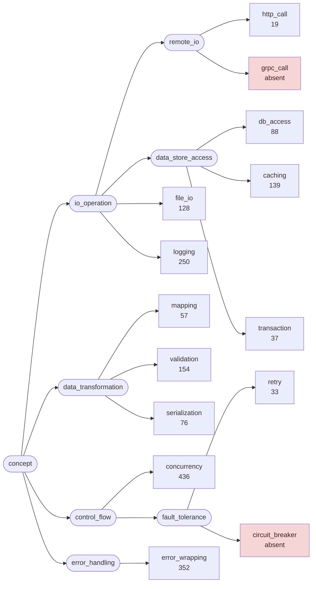
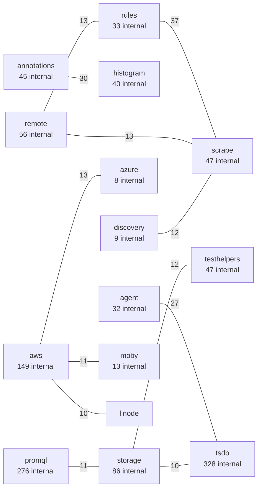
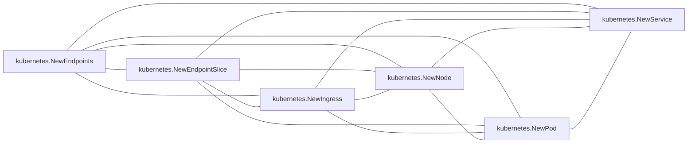
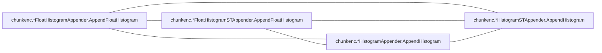

# prometheus

monitoring system; storage engine, query language, and scrape pipeline in one tree

**What this rung shows:** deep call graphs and role classification on a genuinely layered corpus

| | |
|---|---|
| Corpus | [prometheus](https://github.com/prometheus/prometheus) |
| Pinned at | `v3.14.0` (`d7598b7141418fa35be2b5ec5d0fefb634199610`) |
| Project since | 2012 |
| doppel | `bb0f86a` |
| Command | `doppel analyze . --tests exclude --top 10` |

Run from the corpus root, so every path below is corpus-relative.
Regenerate with `task examples`.

## Run diagnostics

The corpus-level models doppel builds before ranking anything, as printed to stderr:

```
Scanning . ...
Generating concept documents...
Culture: 12 concepts modeled, 649 associations, 29 unusual realizations
Habitats: 90 modeled, 195 misfits (145 excused by subsystem), 16 subsystems; most uniform tracing (norm 0.97), most diverse testhelpers (norm 0.55)
Conventions: strongest error_wrapping (0.63), loosest retry (0.34)
Ecosystems: 2400 profiled (1707 dominance, 693 coalition, 0 conflict, 0 weak)
Calibration: rate 0.01 over 20000 null pairs -> threshold 0.42, struct-min 0.32, family-min 0.42
Found 5469 functions. Retrieving candidates...
Retrieval: shape 7902, concept 3669, call 8141 -> 17363 unique pairs
  concept-only 19.6%  call-only 34.3%  suppressed-shape functions: 67  large identity buckets: 0  surviving patterns: 37732
Running structural comparison on 17363 pairs...
  7202 pairs remain after struct-min=0.32 filter
Families: 426 over 504 components, 1341 functions in a family, 2098 edges completed
  2 component(s) skipped as too large or too dense: sizes [147 667]
```

# Code Similarity Report

**Functions analyzed:** 5469 | **Threshold:** 0.60 | **Pairs found:** 10

---

## What doppel sees

**5469 functions** across **107 packages** — test functions excluded. Structural roles: 3303 leaf, 1126 orchestrator, 301 passthrough, 739 utility.

### Concepts

doppel reads intent from the AST into a fixed vocabulary and reasons over the tree, so two functions that share a *branch* score partial credit rather than nothing. Leaf counts below are this corpus.



**Nothing here is tagged** `circuit_breaker`, `grpc_call`. That is a direct answer to "does this codebase already do X" — for those concepts, it does not.

| Concept | Functions | Convention |
|---|---:|---|
| `concurrency` | 436 | `0.48` (loose) |
| `error_wrapping` | 352 | `0.63` (settled) |
| `logging` | 250 | `0.51` (settled) |
| `validation` | 154 | `0.60` (settled) |
| `caching` | 139 | `0.48` (loose) |
| `file_io` | 128 | `0.50` (settled) |
| `db_access` | 88 | `0.40` (loose) |
| `serialization` | 76 | `0.46` (loose) |
| `mapping` | 57 | `0.50` (settled) |
| `transaction` | 37 | `0.45` (loose) |
| `retry` | 33 | `0.34` (loose) |
| `http_call` | 19 | `0.35` (loose) |

Convention is how uniformly this corpus realizes a concept: `1.00` means every function carrying the tag does it the same way, and a low number means the tag covers several unrelated habits. A concept with fewer than five members is not modeled.

### Where the duplication is

Merge-worthy pairs folded up to their packages. An edge means two packages keep solving the same problem separately; a count on a node means the repetition is inside one package.



_328 further package pairs are connected by merge-worthy duplication and are not drawn._

### How settled each package is

A package with at least five functions gets a habitat model: doppel learns what is normal there and measures how surprising each member is against it. **Norm** is how uniform the package's practice is. A **misfit** is a function alien to its package *and* to the wider subsystem around it — one that fits its neighbours a directory up is normal for this codebase and is not reported.

```mermaid
flowchart TD
    h0["testhelpers<br/>109 functions · norm 0.55<br/>7 misfits"]
    h1["storage<br/>355 functions · norm 0.59<br/>147 misfits"]
    h2["uyuni<br/>17 functions · norm 0.69"]
    h3["features<br/>9 functions · norm 0.70"]
    h4["testutil<br/>22 functions · norm 0.74"]
    h5["chunkenc<br/>254 functions · norm 0.74"]
    h6["textparse<br/>92 functions · norm 0.74<br/>6 misfits"]
    h7["ovhcloud<br/>23 functions · norm 0.75"]
    h8["notifications<br/>6 functions · norm 0.76"]
    h9["compression<br/>23 functions · norm 0.77"]
    h10["gce<br/>10 functions · norm 0.77"]
    h11["vultr<br/>11 functions · norm 0.78"]
    classDef good fill:#d7ecd9,color:#1b3d20
    classDef warn fill:#fbeecb,color:#4a3a12
    classDef hot fill:#f7d6d6,color:#4a1c1c
    class h8,h9,h10,h11 good
    class h0,h1,h2,h3,h4,h5,h6,h7 warn
```



_78 further packages are modeled and not drawn._ Most uniform is `tracing` (norm `0.97`); most varied is `testhelpers` (norm `0.55`). 195 functions are alien to their package and to the subsystem around it. A further 145 fit poorly in their package but match the wider subsystem, so they are not reported.

### How these candidates were found

Three channels propose candidates independently — shared rare *structure*, shared *concepts*, shared *calls* — and their union is what gets compared. This run: **17363 candidate pairs** (shape 7902, concept 3669, call 8141), of which 34% arrived on call evidence alone and 20% on concept evidence alone. A pair sharing none of the three is never compared, however alike it looks.

Each function is also an arena where its candidate concepts compete for its evidence. 2400 functions reached an equilibrium: **1707** settled on a single concept, **693** on a coalition, **0** hold concepts this corpus says do not go together.

---

## Local practice

The vocabulary above says what a concept *is*. This says what one looks like when **this** codebase writes it — learned from the corpus, so it describes the house style rather than a rule from anywhere else.

### How this codebase writes each concept

Only what is **distinctive**. A feature earns a row by being carried by this concept's members at least twice as often as by the corpus at large — nearly every Go function has a `return` and an `if`, so prevalence alone would describe the language rather than this codebase. Weights are how much a channel counts toward whether a member looks normal — calls 40, control flow 20, co-occurring tags 15, role 15, package 10.

**`concurrency`** — 436 functions

| Channel | Feature | | Members | vs corpus |
|---|---|---|---|---|
| calls ×40 | `tsdbutil.*DirLocker.Lock` | `██████····` | 279 of 436 | 12× |
| flow ×20 | `defer` | `██████····` | 262 of 436 | 7.2× |
|  | `range` | `████······` | 165 of 436 | 2.0× |
| role ×15 | `orchestrator` | `█████·····` | 218 of 436 | 2.4× |

**`error_wrapping`** — 352 functions

| Channel | Feature | | Members | vs corpus |
|---|---|---|---|---|
| calls ×40 | `fmt.Errorf` | `██████████` | 352 of 352 | 9.5× |
| flow ×20 | `funclit` | `███·······` | 103 of 352 | 3.2× |
|  | `range` | `█████·····` | 160 of 352 | 2.4× |
| role ×15 | `orchestrator` | `████······` | 157 of 352 | 2.2× |

**`logging`** — 250 functions

| Channel | Feature | | Members | vs corpus |
|---|---|---|---|---|
| calls ×40 | `fmt.Errorf` | `███·······` | 79 of 250 | 3.0× |
| flow ×20 | `defer` | `████······` | 99 of 250 | 4.8× |
|  | `funclit` | `████······` | 95 of 250 | 4.2× |
|  | `range` | `█████·····` | 123 of 250 | 2.6× |
| cotags ×15 | `concurrency` | `████······` | 98 of 250 | 4.9× |
|  | `error_wrapping` | `███·······` | 69 of 250 | 4.3× |
| role ×15 | `orchestrator` | `██████····` | 141 of 250 | 2.7× |

**`validation`** — 154 functions

| Channel | Feature | | Members | vs corpus |
|---|---|---|---|---|
| calls ×40 | `errors.New` | `███·······` | 51 of 154 | 7.7× |
|  | `fmt.Errorf` | `████······` | 69 of 154 | 4.3× |
|  | `tsdb.*memChunk.len` | `████······` | 65 of 154 | 2.1× |
| flow ×20 | `if` | `██████████` | 150 of 154 | 2.0× |

**`caching`** — 139 functions

| Channel | Feature | | Members | vs corpus |
|---|---|---|---|---|
| flow ×20 | `funclit` | `████······` | 49 of 139 | 3.9× |
| cotags ×15 | `concurrency` | `███·······` | 39 of 139 | 3.5× |
| package ×10 | `kubernetes` | `███·······` | 42 of 139 | 14× |

**`file_io`** — 128 functions

| Channel | Feature | | Members | vs corpus |
|---|---|---|---|---|
| calls ×40 | `path/filepath.Join` | `███·······` | 39 of 128 | 29× |
|  | `fmt.Errorf` | `██████····` | 73 of 128 | 5.4× |
| flow ×20 | `defer` | `████······` | 46 of 128 | 4.3× |
|  | `funclit` | `████······` | 45 of 128 | 3.9× |
|  | `range` | `████······` | 57 of 128 | 2.4× |
|  | `if` | `██████████` | 125 of 128 | 2.0× |
| cotags ×15 | `error_wrapping` | `████······` | 54 of 128 | 6.6× |

_6 further concepts are modeled and not described._

### Which concepts share a function

`++` at least four times chance, `+` at least twice, `−` at most half, `never` not once. A blank cell is ordinary company — near chance, which is not culture.

| | `caching` | `concurrency` | `db_access` | `error_wrapping` | `file_io` | `http_call` | `logging` | `mapping` | `retry` | `serialization` | `transaction` |
|---|---|---|---|---|---|---|---|---|---|---|---|
| **`concurrency`** | + | | | | | | | | | | |
| **`db_access`** |  | + | | | | | | | | | |
| **`error_wrapping`** | + |  | ++ | | | | | | | | |
| **`file_io`** |  |  | ++ | ++ | | | | | | | |
| **`http_call`** |  |  |  | ++ | ++ | | | | | | |
| **`logging`** | ++ | ++ | ++ | ++ | ++ | + | | | | | |
| **`mapping`** | ++ |  |  |  |  |  | + | | | | |
| **`retry`** |  | ++ |  |  |  |  | ++ |  | | | |
| **`serialization`** |  |  |  | + | ++ | ++ | + |  |  | | |
| **`transaction`** |  | + | ++ |  |  |  | ++ |  |  |  | |
| **`validation`** |  |  |  | + |  |  |  | ++ |  |  |  |

### What travels with what

Co-occurrence measured against chance across every function. Only relationships at least twice — or at most half — as common as chance are reported; near-chance company is not culture. Each kind is listed separately, because there are far more call tokens than concepts and one shared list is all calls. Within a kind, strongest first means lift weighted by how many functions carry it — a 100× relationship holding for three functions is a weaker finding than a 30× one holding for thirty.

**Together more than chance — tag~tag**

- 13 of 19 `http_call` functions also `file_io` — 29× chance
- 26 of 76 `serialization` functions also `file_io` — 15× chance
- 9 of 19 `http_call` functions also `serialization` — 34× chance
- 54 of 128 `file_io` functions also `error_wrapping` — 6.6× chance
- 98 of 250 `logging` functions also `concurrency` — 4.9× chance
- 69 of 250 `logging` functions also `error_wrapping` — 4.3× chance
- _21 more not listed_

**Together more than chance — tag~role**

- 141 of 250 `logging` functions also `orchestrator` — 2.7× chance
- 218 of 436 `concurrency` functions also `orchestrator` — 2.4× chance
- 157 of 352 `error_wrapping` functions also `orchestrator` — 2.2× chance
- 49 of 352 `error_wrapping` functions also `passthrough` — 2.5× chance
- 31 of 57 `mapping` functions also `orchestrator` — 2.6× chance
- 20 of 33 `retry` functions also `orchestrator` — 2.9× chance
- _3 more not listed_

**Together more than chance — tag~call**

- 13 of 19 `http_call` functions also `net/http.NewRequest` — 288× chance
- 20 of 76 `serialization` functions also `encoding/json.Unmarshal` — 72× chance
- 11 of 19 `http_call` functions also `io.Copy` — 186× chance
- 18 of 76 `serialization` functions also `encoding/json.Marshal` — 72× chance
- 27 of 128 `file_io` functions also `io.ReadAll` — 43× chance
- 26 of 128 `file_io` functions also `os.RemoveAll` — 43× chance
- _596 more not listed_

**Apart more than chance — tag~role**

- **no** `transaction` function has `utility` — chance alone would give about 5 of 37
- 105 of 352 `error_wrapping` functions also `leaf` — 0.5× chance
- 9 of 250 `logging` functions also `utility` — 0.3× chance
- 16 of 57 `mapping` functions also `leaf` — 0.5× chance
- 2 of 88 `db_access` functions also `utility` — 0.2× chance
- 9 of 139 `caching` functions also `utility` — 0.5× chance
- _2 more not listed_

**Apart more than chance — tag~call**

- **no** `concurrency` function has `chunkenc.*bstream.bytes` — chance alone would give about 3 of 436
- **no** `concurrency` function has `math.IsNaN` — chance alone would give about 3 of 436
- **no** `concurrency` function has `v1.stringSchema` — chance alone would give about 3 of 436

### Functions drifting from their own concept

These carry a tag but look nothing like the other functions carrying it. Typicality is measured against the concept's own median, so a genuinely varied concept lowers its own bar and a tight one can flag nobody.

| Function | Concept | Typicality | Concept median | |
|---|---|---:|---:|---|
| `testutil.temporaryDirectory.Close` <br/>`util/testutil/directory.go:86` | `retry` | `0.10` | `0.32` | no near-duplicate |
| `testutil.temporaryDirectory.Close` <br/>`util/testutil/directory.go:86` | `file_io` | `0.12` | `0.29` | no near-duplicate |
| `treecache.ZookeeperLogger.Printf` <br/>`util/treecache/treecache.go:60` | `logging` | `0.12` | `0.27` | no near-duplicate |
| `rules.*Manager.Run` <br/>`rules/manager.go:210` | `logging` | `0.12` | `0.27` | no near-duplicate |
| `promql.*evaluator.eval` <br/>`promql/engine.go:2051` | `error_wrapping` | `0.13` | `0.35` |  |
| `promql.*evaluator.eval` <br/>`promql/engine.go:2051` | `validation` | `0.14` | `0.35` |  |
| `wlog.*Watcher.Start` <br/>`tsdb/wlog/watcher.go:257` | `concurrency` | `0.11` | `0.31` |  |
| `scrape.*MetadataMetricsCollector.Describe` <br/>`scrape/metrics.go:353` | `concurrency` | `0.11` | `0.31` |  |
| `main.main` <br/>`cmd/prometheus/main.go:368` | `validation` | `0.16` | `0.35` |  |
| `main.*testGroup.test` <br/>`cmd/promtool/unittest.go:228` | `validation` | `0.16` | `0.35` |  |

_19 more unusual realizations not listed._

A row marked _no near-duplicate_ appears in no reported pair: nothing else in this report explains it, which makes it drift rather than duplication.

---

## Match #1 — Code-shape: `0.8253`

| | Location | Function | Signature | Patterns |
|---|---|---|---|---|
| **A** | `scrape/scrape.go:1589` | `scrape.*scrapeLoopAppender.append` | `([]byte, string, time.Time) (int, int, int, error)` | validation, mapping, caching |
| **B** | `scrape/scrape_append_v2.go:90` | `scrape.*scrapeLoopAppenderV2.append` | `([]byte, string, time.Time) (int, int, int, error)` | validation, mapping, caching |

**Kind:** diverged copy — `*scrapeLoopAppender.append` and `*scrapeLoopAppenderV2.append` share the stem `scrapeLoopAppender` in package `scrape`

**Profile A:** `mapping` 0.51, `caching` 0.49 (coalition)

**Profile B:** `mapping` 0.51, `caching` 0.49 (coalition)

**Code similarity:** `ast 0.71  flow 1.00  nesting 0.99  sig 1.00  size 0.91`

**Evidence:** `4720.28` (shape 4601.59, concept 8.41, call 110.28)

**Trophic:** `0.81`

**Shared structure:**

- `43.32` — `flow:call:get→cond`
- `38.06` — `flow:call:Histogram→cond`
- `20.76` — `seq[ if(bin:>(sel,lit:INT)) ; if(bin:>(sel,lit:INT)) ]`

**Culture:** A realizes `validation` atypically (typicality 0.17, concept median 0.35, convention 0.60)

**Culture:** B realizes `validation` atypically (typicality 0.17, concept median 0.35, convention 0.60)

**Structural overlap:** `0.74` (merge-worthy)

- share 42 callees: [Debug, Error, Inc, Warn, addDropped, addRef, app.Append, append, errors.Is, fmt.Errorf, get, getDropped, isSeriesPartOfFamily, iterDone, len, lset.Get, lset.Has, lset.Hash, lset.IsEmpty, lset.IsValid, lset.String, make, p.Exemplar, p.Help, p.Histogram, p.Labels, p.Next, p.Series, p.StartTimestamp, p.Type, p.Unit, setHelp, setType, setUnit, sl.checkAddError, sl.sampleMutator, slices.SortFunc, string, textparse.New, timestamp.FromTime, trackStaleness, verifyLabelLimits]
- overlapping call-graph neighborhoods (1.00): 1148 shared
- share patterns: [caching, mapping, validation]
- both are orchestrator functions
- same package
- callees do related work (1.00): [mapping, caching, validation, concurrency]
- same visibility
- both are methods, on *scrapeLoopAppender and *scrapeLoopAppenderV2
- call into same packages: [discovery, labels, scrape, textparse, timestamp, tsdb]

---

## Match #2 — Code-shape: `0.8224`

| | Location | Function | Signature | Patterns |
|---|---|---|---|---|
| **A** | `discovery/kubernetes/endpoints.go:63` | `kubernetes.NewEndpoints` | `(*slog.Logger, cache.SharedIndexInformer, cache.SharedInformer, cache.SharedInformer, cache.SharedInformer, cache.SharedInformer, cache.SharedInformer, cache.SharedInformer, bool, bool, bool, *prometheus.CounterVec) (*Endpoints)` | mapping, caching, logging |
| **B** | `discovery/kubernetes/endpointslice.go:62` | `kubernetes.NewEndpointSlice` | `(*slog.Logger, cache.SharedIndexInformer, cache.SharedInformer, cache.SharedInformer, cache.SharedInformer, cache.SharedInformer, cache.SharedInformer, cache.SharedInformer, bool, bool, bool, *prometheus.CounterVec) (*EndpointSlice)` | mapping, caching, logging |

**Profile A:** `caching` 1.00 (dominance)

**Profile B:** `caching` 1.00 (dominance)

**Code similarity:** `ast 0.78  flow 0.99  nesting 1.00  sig 0.71  size 0.84`

**Evidence:** `3018.39` (shape 2982.95, concept 7.93, call 27.51)

**Trophic:** `0.90`

**Shared structure:**

- `45.60` — `flow:call:AddEventHandler→call:Error`
- `45.60` — `flow:call:AddEventHandler→cond`
- `39.08` — `assign:=(call:WithLabelValues)`

**Structural overlap:** `0.93` (merge-worthy)

- share 20 callees: [AddEventHandler, Error, RoleService.String, convertToService, e.enqueue, e.enqueueNamespace, e.enqueueNode, eps.GetStore, eventCount.WithLabelValues, l.Error, namespacedName, nodeName, pod.GetStore, promslog.NewNopLogger, serviceUpdate, svc.GetStore, svcAddCount.Inc, svcDeleteCount.Inc, svcUpdateCount.Inc, workqueue.NewTypedWithConfig]
- share 1 callers: [kubernetes.*Discovery.Run]
- overlapping call-graph neighborhoods (0.99): 141 shared
- share patterns: [caching, logging, mapping]
- both are orchestrator functions
- same package
- callers do related work (1.00): [caching, logging, concurrency]
- callees do related work (0.75): [mapping, caching]
- same visibility
- same receiver type: plain functions
- called from same packages: [kubernetes]
- call into same packages: [discovery, kubernetes]

---

## Match #3 — Code-shape: `0.9000`

| | Location | Function | Signature | Patterns |
|---|---|---|---|---|
| **A** | `util/strutil/jarowinkler.go:57` | `strutil.jaroWinklerString` | `(string, string) (float64)` | — |
| **B** | `util/strutil/jarowinkler.go:125` | `strutil.jaroWinklerRunes` | `([]rune, []rune) (float64)` | — |

**Code similarity:** `ast 1.00  flow 1.00  nesting 1.00  sig 0.33  size 1.00`

**Evidence:** `2024.14` (shape 2024.14, concept 0.00, call 0.00)

**Trophic:** `1.00`

**Shared structure:**

- `22.84` — `flow:call:len→call:min`
- `11.20` — `assign:=(call:max)`
- `11.07` — `flow:call:len→call:float64`

**Structural overlap:** `0.72` (merge-worthy)

- share 5 callees: [float64, len, make, max, min]
- share 1 callers: [strutil.*JaroWinklerMatcher.Score]
- overlapping call-graph neighborhoods (1.00): 1040 shared
- both are leaf functions
- same package
- same visibility
- same receiver type: plain functions
- called from same packages: [strutil]
- call into same packages: [tsdb]

---

## Match #4 — Code-shape: `0.7407`

| | Location | Function | Signature | Patterns |
|---|---|---|---|---|
| **A** | `tsdb/head_wal.go:81` | `tsdb.*Head.loadWAL` | `(*wlog.Reader, *labels.SymbolTable, map[chunks.HeadSeriesRef]chunks.HeadSeriesRef, map[chunks.HeadSeriesRef][]*mmappedChunk, map[chunks.HeadSeriesRef][]*mmappedChunk) (error)` | concurrency, error_wrapping, logging |
| **B** | `tsdb/head_wal.go:871` | `tsdb.*Head.loadWBL` | `(*wlog.Reader, *labels.SymbolTable, map[chunks.HeadSeriesRef]chunks.HeadSeriesRef, chunks.ChunkDiskMapperRef) (error)` | concurrency, error_wrapping, logging |

**Profile A:** `logging` 1.00 (dominance)

**Profile B:** `logging` 1.00 (dominance)

**Code similarity:** `ast 0.66  flow 0.99  nesting 0.99  sig 0.67  size 0.54`

**Evidence:** `6107.70` (shape 6059.51, concept 4.99, call 43.21)

**Trophic:** `0.65`

**Shared structure:**

- `40.18` — `flow:call:Get→call:len`
- `30.45` — `seq[ assign=(unary) ; return() ]`
- `30.45` — `do(call:counterAddNonZero)`

**Structural overlap:** `0.68` (merge-worthy)

- share 38 callees: [Get, Put, Warn, append, clear, close, closeAndDrain, counterAddNonZero, dec.FloatHistogramSamples, dec.HistogramSamples, dec.Samples, dec.Type, float64, fmt.Errorf, getByID, len, make, min, panic, r.Err, r.Next, r.Offset, r.Record, r.Segment, record.NewDecoder, reuseBuf, reuseHistogramBuf, setup, uint64, unknownHistogramRefs.Add, unknownHistogramRefs.Load, unknownSampleRefs.Add, unknownSampleRefs.Load, unknownSeriesRefs.count, unknownSeriesRefs.merge, wg.Add, wg.Done, wg.Wait]
- overlapping call-graph neighborhoods (0.98): 1180 shared
- share patterns: [concurrency, error_wrapping, logging]
- both are orchestrator functions
- same package
- callees do related work (0.37): [concurrency]
- same visibility
- same receiver type: Head
- call into same packages: [discovery, record, rules, tsdb, wlog]

---

## Match #5 — Code-shape: `0.9090`

| | Location | Function | Signature | Patterns |
|---|---|---|---|---|
| **A** | `prompb/io/prometheus/client/decoder.go:314` | `io_prometheus_client.*Metric.unmarshalWithoutLabels` | `(*MetricStreamingDecoder, []byte) (error)` | validation |
| **B** | `prompb/io/prometheus/client/decoder.go:596` | `io_prometheus_client.*MetricFamily.unmarshalWithoutMetrics` | `(*MetricStreamingDecoder, []byte) (error)` | validation |

**Profile A:** `validation` 1.00 (dominance)

**Profile B:** `validation` 1.00 (dominance)

**Code similarity:** `ast 0.85  flow 1.00  nesting 1.00  sig 1.00  size 0.69`

**Evidence:** `4344.70` (shape 4342.26, concept 2.44, call 0.00)

**Trophic:** `0.75`

**Shared structure:**

- `64.29` — `if(bin:<(id,lit:INT))`
- `47.22` — `flow:call:int→cond`
- `43.24` — `seq[ assign\|=(bin) ; if(bin:<(id,lit:INT)) ]`

**Structural overlap:** `0.57` (merge-worthy)

- share 9 callees: [append, errors.New, fmt.Errorf, int, int32, len, skipMetrics, uint, uint64]
- overlapping call-graph neighborhoods (1.00): 1039 shared
- share patterns: [validation]
- same package
- same visibility
- both are methods, on *Metric and *MetricFamily
- called from same packages: [io_prometheus_client]
- call into same packages: [tsdb]

---

## Match #6 — Code-shape: `0.7631`

| | Location | Function | Signature | Patterns |
|---|---|---|---|---|
| **A** | `discovery/kubernetes/endpoints.go:347` | `kubernetes.*Endpoints.buildEndpoints` | `(*apiv1.Endpoints) (*targetgroup.Group)` | logging |
| **B** | `discovery/kubernetes/endpointslice.go:308` | `kubernetes.*EndpointSlice.buildEndpointSlice` | `(v1.EndpointSlice) (*targetgroup.Group)` | — |

**Profile A:** `logging` 1.00 (dominance)

**Code similarity:** `ast 0.78  flow 0.98  nesting 0.92  sig 0.33  size 0.84`

**Evidence:** `3719.38` (shape 3657.39, concept 0.00, call 61.98)

**Trophic:** `0.81`

**Shared structure:**

- `58.21` — `assign=(call:lv)`
- `43.24` — `seq[ assign=(call:lv) ; assign=(call:lv) ]`
- `19.54` — `range{ call:add }`

**Structural overlap:** `0.62` (merge-worthy)

- share 19 callees: [add, addNamespaceLabels, addNodeLabels, addObjectMetaLabels, append, e.addServiceLabels, e.resolvePodRef, hasSeenPort, len, lv, model.LabelName, namespacedName, net.JoinHostPort, podLabels, strconv.FormatBool, strconv.FormatUint, string, target.Merge, uint64]
- overlapping call-graph neighborhoods (0.99): 1066 shared
- both are orchestrator functions
- same package
- callers do related work (0.63): [caching, logging, concurrency]
- callees do related work (1.00): [logging]
- same visibility
- both are methods, on *Endpoints and *EndpointSlice
- called from same packages: [kubernetes]
- call into same packages: [kubernetes, tsdb]

---

## Match #7 — Code-shape: `0.9459`

| | Location | Function | Signature | Patterns |
|---|---|---|---|---|
| **A** | `model/histogram/float_histogram.go:1420` | `histogram.addBuckets` | `(int32, float64, bool, []Span, []float64, []Span, []float64) ([]Span, []float64)` | — |
| **B** | `model/histogram/float_histogram.go:1545` | `histogram.kahanAddBuckets` | `(int32, float64, bool, []Span, []float64, []Span, []float64, []float64, []float64) ([]Span, []float64, []float64)` | — |

**Code similarity:** `ast 0.91  flow 1.00  nesting 0.99  sig 1.00  size 0.78`

**Evidence:** `3138.58` (shape 3124.84, concept 0.00, call 13.75)

**Trophic:** `0.86`

**Shared structure:**

- `20.76` — `seq[ assign=(call:append) ; do(call:copy) ]`
- `11.48` — `assign-=(bin)`
- `11.48` — `if(bin:<(id,call:len))`

**Structural overlap:** `0.50` (merge-worthy)

- share 7 callees: [IsExponentialSchema, append, copy, getBoundExponential, int, int32, len]
- overlapping call-graph neighborhoods (0.99): 1044 shared
- related roles: passthrough ≈ orchestrator (both high fan-out, 0.50)
- same package
- same visibility
- same receiver type: plain functions
- called from same packages: [histogram]
- call into same packages: [histogram, tsdb]

---

## Match #8 — Code-shape: `0.9000`

| | Location | Function | Signature | Patterns |
|---|---|---|---|---|
| **A** | `storage/remote/queue_manager.go:844` | `remote.*QueueManager.AppendHistograms` | `([]record.RefHistogramSample) (bool)` | retry, concurrency, logging |
| **B** | `storage/remote/queue_manager.go:906` | `remote.*QueueManager.AppendFloatHistograms` | `([]record.RefFloatHistogramSample) (bool)` | retry, concurrency, logging |

**Profile A:** `retry` 1.00 (dominance)

**Profile B:** `retry` 1.00 (dominance)

**Code similarity:** `ast 1.00  flow 1.00  nesting 1.00  sig 0.33  size 1.00`

**Evidence:** `1211.21` (shape 1178.45, concept 7.33, call 25.43)

**Trophic:** `1.00`

**Shared structure:**

- `7.61` — `range{ call:isSampleOld call:Duration call:Inc call:WithLabelValues call:Warn call:Lock call:incr call:Info ... }`
- `7.61` — `seq[ if(call:isSampleOld) ; if(bin:&&(bin,bin)) ]`
- `7.21` — `seq[ do(call:Unlock) ; assign:=(call:Duration) ]`

**Structural overlap:** `1.00` (merge-worthy)

- share 13 callees: [Inc, Info, Lock, Unlock, Warn, WithLabelValues, enqueue, incr, isSampleOld, model.Duration, time.Duration, time.Now, time.Sleep]
- share 1 callers: [wlog.*Watcher.readSegment]
- overlapping call-graph neighborhoods (1.00): 380 shared
- share patterns: [concurrency, logging, retry]
- both are orchestrator functions
- same package
- callers do related work (1.00): [logging]
- callees do related work (1.00): [logging, error_wrapping, concurrency]
- same visibility
- same receiver type: QueueManager
- called from same packages: [wlog]
- call into same packages: [discovery, remote, tsdbutil]

---

## Match #9 — Code-shape: `1.0000`

| | Location | Function | Signature | Patterns |
|---|---|---|---|---|
| **A** | `util/runtime/statfs_linux_386.go:24` | `runtime.FsType` | `(string) (string)` | — |
| **B** | `util/runtime/statfs_uint32.go:23` | `runtime.FsType` | `(string) (string)` | — |

**Code similarity:** `ast 1.00  flow 1.00  nesting 1.00  sig 1.00  size 1.00`

**Evidence:** `2054.36` (shape 2042.77, concept 0.00, call 11.59)

**Trophic:** `1.00`

**Shared structure:**

- `15.23` — `return(call:Itoa)`
- `7.61` — `seq[ if(id) ; return(call:Itoa) ]`
- `6.70` — `seq[ assign:=(call:Statfs) ; if(bin:!=(id,nil)) ]`

**Structural overlap:** `0.52` (merge-worthy)

- share 3 callees: [int, strconv.Itoa, syscall.Statfs]
- both are leaf functions
- same package
- same visibility
- same receiver type: plain functions

---

## Match #10 — Code-shape: `0.8934`

| | Location | Function | Signature | Patterns |
|---|---|---|---|---|
| **A** | `tsdb/chunkenc/float_histogram.go:335` | `chunkenc.expandFloatSpansAndBuckets` | `([]histogram.Span, []histogram.Span, []xorValue, []float64) ([]Insert, []Insert, bool)` | — |
| **B** | `tsdb/chunkenc/histogram.go:371` | `chunkenc.expandIntSpansAndBuckets` | `([]histogram.Span, []histogram.Span, []int64, []int64) ([]Insert, []Insert, bool)` | — |

**Code similarity:** `ast 0.95  flow 1.00  nesting 1.00  sig 0.50  size 0.99`

**Evidence:** `2179.52` (shape 2172.30, concept 0.00, call 7.22)

**Trophic:** `0.96`

**Shared structure:**

- `30.45` — `assign=(call:addInsert)`
- `30.45` — `flow:call:Next→call:addInsert`
- `30.45` — `flow:call:append→call:addInsert`

**Structural overlap:** `0.59` (merge-worthy)

- share 7 callees: [addInsert, advanceA, advanceB, ai.Next, append, bi.Next, newBucketIterator]
- overlapping call-graph neighborhoods (0.78): 7 shared
- both are utility functions
- same package
- same visibility
- same receiver type: plain functions
- called from same packages: [chunkenc]
- call into same packages: [chunkenc]

---

## Families

426 families, 1341 functions in a family, largest 34 members; 2098 edges scored here that retrieval never proposed

### Family 1 — 9 members, every pair `>= 0.45` code-shape, evidence `21083`  (2 edges scored here)

_Not drawn: 9 members is 36 connections. Every one of them holds — that is what makes this a family._

| Location | Function | Signature | Patterns |
|---|---|---|---|
| `promql/parser/lex.go:418` | `parser.lexStatements` | `(*Lexer) (stateFn)` | — |
| `promql/parser/lex.go:558` | `parser.lexHistogram` | `(*Lexer) (stateFn)` | — |
| `promql/parser/lex.go:627` | `parser.lexHistogramDescriptor` | `(*Lexer) (stateFn)` | — |
| `promql/parser/lex.go:664` | `parser.lexBuckets` | `(*Lexer) (stateFn)` | — |
| `promql/parser/lex.go:696` | `parser.lexInsideBraces` | `(*Lexer) (stateFn)` | — |
| `promql/parser/lex.go:750` | `parser.lexValueSequence` | `(*Lexer) (stateFn)` | — |
| `promql/parser/lex.go:932` | `parser.lexNumber` | `(*Lexer) (stateFn)` | — |
| `promql/parser/lex.go:984` | `parser.lexNumberOrDuration` | `(*Lexer) (stateFn)` | — |
| `promql/parser/lex.go:1204` | `parser.lexDurationExpr` | `(*Lexer) (stateFn)` | — |

### Family 2 — 15 members, every pair `>= 0.42` code-shape, evidence `19829`  (52 edges scored here)

_Not drawn: 15 members is 105 connections. Every one of them holds — that is what makes this a family._

| Location | Function | Signature | Patterns |
|---|---|---|---|
| `promql/functions.go:374` | `promql.extendedHistogramRate` | `(Matrix, parser.Expressions, *EvalNodeHelper, bool, bool) (Vector, annotations.Annotations)` | validation |
| `promql/functions.go:452` | `promql.extrapolatedRate` | `(Matrix, parser.Expressions, *EvalNodeHelper, bool, bool) (Vector, annotations.Annotations)` | — |
| `promql/functions.go:981` | `promql.funcDoubleExponentialSmoothing` | `([]Vector, Matrix, parser.Expressions, *EvalNodeHelper) (Vector, annotations.Annotations)` | — |
| `promql/functions.go:1218` | `promql.funcAvgOverTime` | `([]Vector, Matrix, parser.Expressions, *EvalNodeHelper) (Vector, annotations.Annotations)` | — |
| `promql/functions.go:1438` | `promql.funcMadOverTime` | `([]Vector, Matrix, parser.Expressions, *EvalNodeHelper) (Vector, annotations.Annotations)` | — |
| `promql/functions.go:1529` | `promql.compareOverTime` | `(Matrix, parser.Expressions, *EvalNodeHelper, func(float64, float64) bool, bool) (Vector, annotations.Annotations)` | — |
| `promql/functions.go:1572` | `promql.funcSumOverTime` | `([]Vector, Matrix, parser.Expressions, *EvalNodeHelper) (Vector, annotations.Annotations)` | — |
| `promql/functions.go:1652` | `promql.funcQuantileOverTime` | `([]Vector, Matrix, parser.Expressions, *EvalNodeHelper) (Vector, annotations.Annotations)` | — |
| `promql/functions.go:1676` | `promql.varianceOverTime` | `(Matrix, parser.Expressions, *EvalNodeHelper, func(float64) float64) (Vector, annotations.Annotations)` | — |
| `promql/functions.go:1993` | `promql.funcDeriv` | `([]Vector, Matrix, parser.Expressions, *EvalNodeHelper) (Vector, annotations.Annotations)` | — |

_5 more members not listed._

### Family 3 — 6 members, every pair `>= 0.62` code-shape, evidence `19109`



| Location | Function | Signature | Patterns |
|---|---|---|---|
| `discovery/kubernetes/endpoints.go:63` | `kubernetes.NewEndpoints` | `(*slog.Logger, cache.SharedIndexInformer, cache.SharedInformer, cache.SharedInformer, cache.SharedInformer, cache.SharedInformer, cache.SharedInformer, cache.SharedInformer, bool, bool, bool, *prometheus.CounterVec) (*Endpoints)` | mapping, caching, logging |
| `discovery/kubernetes/endpointslice.go:62` | `kubernetes.NewEndpointSlice` | `(*slog.Logger, cache.SharedIndexInformer, cache.SharedInformer, cache.SharedInformer, cache.SharedInformer, cache.SharedInformer, cache.SharedInformer, cache.SharedInformer, bool, bool, bool, *prometheus.CounterVec) (*EndpointSlice)` | mapping, caching, logging |
| `discovery/kubernetes/ingress.go:44` | `kubernetes.NewIngress` | `(*slog.Logger, cache.SharedIndexInformer, cache.SharedInformer, *prometheus.CounterVec) (*Ingress)` | caching |
| `discovery/kubernetes/node.go:49` | `kubernetes.NewNode` | `(*slog.Logger, cache.SharedInformer, *prometheus.CounterVec) (*Node)` | caching |
| `discovery/kubernetes/pod.go:63` | `kubernetes.NewPod` | `(*slog.Logger, cache.SharedIndexInformer, cache.SharedInformer, cache.SharedInformer, cache.SharedInformer, cache.SharedInformer, bool, bool, bool, *prometheus.CounterVec) (*Pod)` | caching |
| `discovery/kubernetes/service.go:45` | `kubernetes.NewService` | `(*slog.Logger, cache.SharedIndexInformer, cache.SharedInformer, *prometheus.CounterVec) (*Service)` | caching |

### Family 4 — 14 members, every pair `>= 0.42` code-shape, evidence `18949`  (44 edges scored here)

_Not drawn: 14 members is 91 connections. Every one of them holds — that is what makes this a family._

| Location | Function | Signature | Patterns |
|---|---|---|---|
| `promql/functions.go:374` | `promql.extendedHistogramRate` | `(Matrix, parser.Expressions, *EvalNodeHelper, bool, bool) (Vector, annotations.Annotations)` | validation |
| `promql/functions.go:452` | `promql.extrapolatedRate` | `(Matrix, parser.Expressions, *EvalNodeHelper, bool, bool) (Vector, annotations.Annotations)` | — |
| `promql/functions.go:981` | `promql.funcDoubleExponentialSmoothing` | `([]Vector, Matrix, parser.Expressions, *EvalNodeHelper) (Vector, annotations.Annotations)` | — |
| `promql/functions.go:1218` | `promql.funcAvgOverTime` | `([]Vector, Matrix, parser.Expressions, *EvalNodeHelper) (Vector, annotations.Annotations)` | — |
| `promql/functions.go:1438` | `promql.funcMadOverTime` | `([]Vector, Matrix, parser.Expressions, *EvalNodeHelper) (Vector, annotations.Annotations)` | — |
| `promql/functions.go:1572` | `promql.funcSumOverTime` | `([]Vector, Matrix, parser.Expressions, *EvalNodeHelper) (Vector, annotations.Annotations)` | — |
| `promql/functions.go:1652` | `promql.funcQuantileOverTime` | `([]Vector, Matrix, parser.Expressions, *EvalNodeHelper) (Vector, annotations.Annotations)` | — |
| `promql/functions.go:1993` | `promql.funcDeriv` | `([]Vector, Matrix, parser.Expressions, *EvalNodeHelper) (Vector, annotations.Annotations)` | — |
| `promql/functions.go:2020` | `promql.funcPredictLinear` | `([]Vector, Matrix, parser.Expressions, *EvalNodeHelper) (Vector, annotations.Annotations)` | — |
| `promql/functions.go:2129` | `promql.funcHistogramFraction` | `([]Vector, Matrix, parser.Expressions, *EvalNodeHelper) (Vector, annotations.Annotations)` | — |

_4 more members not listed._

### Family 5 — 4 members, every pair `>= 0.87` code-shape, evidence `18772`



| Location | Function | Signature | Patterns |
|---|---|---|---|
| `tsdb/chunkenc/float_histogram.go:699` | `chunkenc.*FloatHistogramAppender.AppendFloatHistogram` | `(Appender, int64, int64, *histogram.FloatHistogram, bool) (Chunk, bool, Appender, error)` | — |
| `tsdb/chunkenc/float_histogram_st.go:325` | `chunkenc.*FloatHistogramSTAppender.AppendFloatHistogram` | `(Appender, int64, int64, *histogram.FloatHistogram, bool) (Chunk, bool, Appender, error)` | — |
| `tsdb/chunkenc/histogram.go:751` | `chunkenc.*HistogramAppender.AppendHistogram` | `(Appender, int64, int64, *histogram.Histogram, bool) (Chunk, bool, Appender, error)` | — |
| `tsdb/chunkenc/histogram_st.go:312` | `chunkenc.*HistogramSTAppender.AppendHistogram` | `(Appender, int64, int64, *histogram.Histogram, bool) (Chunk, bool, Appender, error)` | — |

_421 more families not listed._

_2 component(s) too large or too dense to enumerate (sizes 147, 667); their families are not reported._

